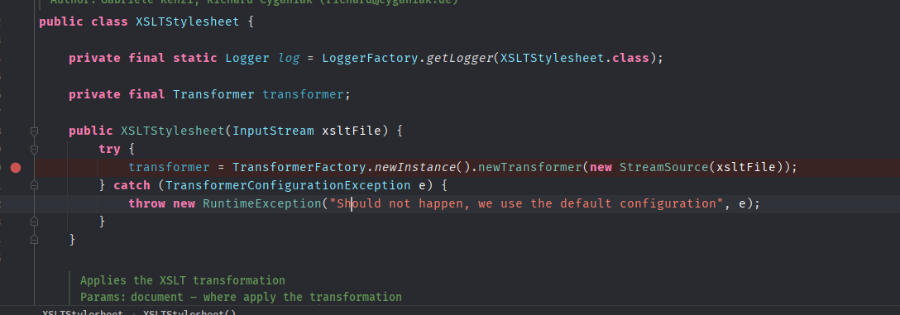
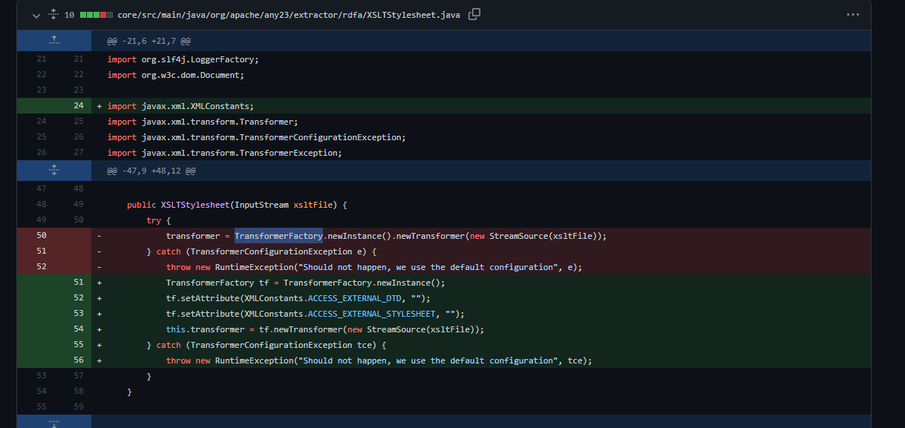

- [CVE-2022-25312 ApacheAny23 XXE](#cve-2022-25312-apacheany23-xxe)
  - [影响版本](#影响版本)
  - [环境搭建](#环境搭建)
  - [原理分析](#原理分析)
    - [XSLTStylesheet](#xsltstylesheet)
  - [漏洞复现](#漏洞复现)
  - [补丁分析](#补丁分析)
# CVE-2022-25312 ApacheAny23 XXE
## 影响版本
Version < 2.7
## 环境搭建
```xml
        <dependency>
            <groupId>org.apache.any23</groupId>
            <artifactId>apache-any23-core</artifactId>
            <version>2.6</version>
        </dependency>
```
## 原理分析
### XSLTStylesheet
漏洞在于rdfa的XSLTStylesheet解析器在解析用户输入的XSLT样式表时未设置相关安全配置,导致XXE。

使用的是`TransformerFactory`的默认配置进行解析。
## 漏洞复现

## 补丁分析

设置相关实体访问属性，禁止外部实体加载。

