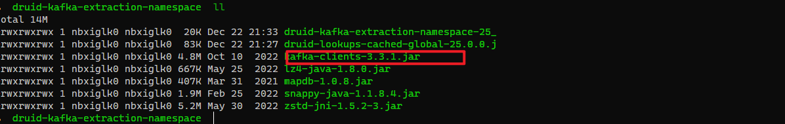

- [ApacheDruid Kafka-Connect rce](#apachedruid-kafka-connect-rce)
  - [影响版本](#影响版本)
  - [环境搭建](#环境搭建)
  - [原理分析](#原理分析)
  - [漏洞复现](#漏洞复现)
  - [参考](#参考)

# ApacheDruid Kafka-Connect rce
## 影响版本
全版本
## 环境搭建
https://www.apache.org/dyn/closer.cgi?path=/druid/25.0.0/apache-druid-25.0.0-bin.tar.gz  
`./bin/start-druid`  
## 原理分析
ApacheDruid支持连接到Kafka,而之前Apache Kafka Connect存在一个JNDI注入漏洞(CVE-2023-25194),导致同样影响到了ApacheDruid,最新的ApcheDruid使用的Kafka clients版本为3.3.1.  
  

直接用CVE-2023-25194的POC即可.  
## 漏洞复现
  
## 参考  
https://mp.weixin.qq.com/s/cBnyUKQKPzGz0ZQwQgRjSw