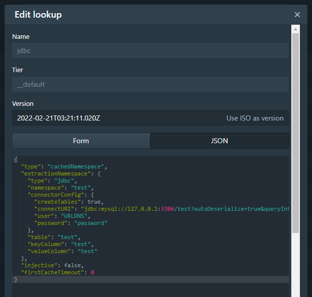
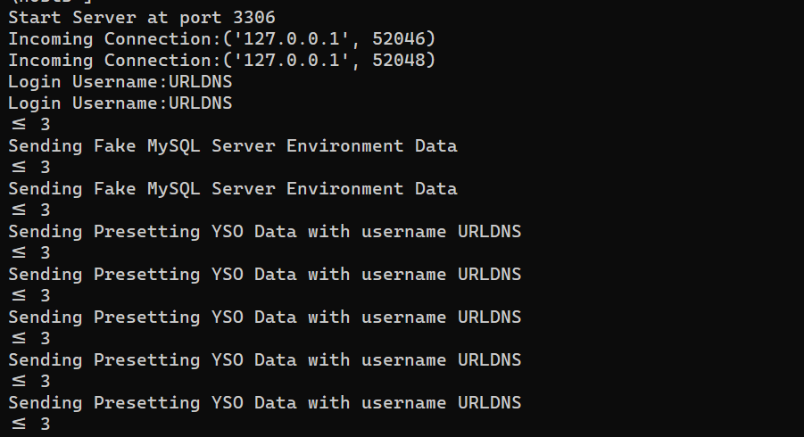
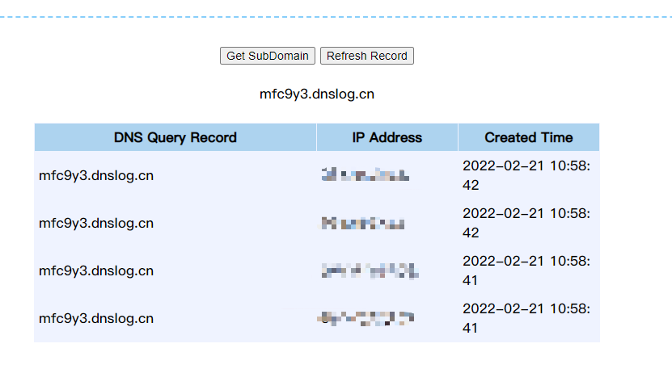
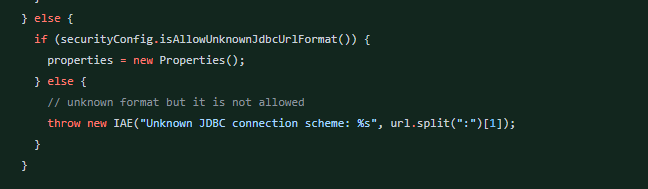
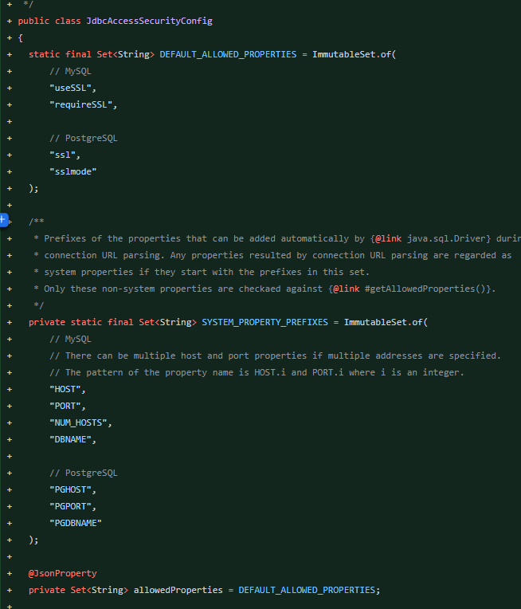

- [CVE-2021-26919 Apache Druid 远程代码执行](#cve-2021-26919-apache-druid-远程代码执行)
  - [影响版本](#影响版本)
  - [环境搭建](#环境搭建)
  - [原理分析](#原理分析)
    - [lookups-cached-global](#lookups-cached-global)
    - [复现](#复现)
  - [补丁](#补丁)
# CVE-2021-26919 Apache Druid 远程代码执行
## 影响版本
version < 0.20.2
## 环境搭建

1. https://archive.apache.org/dist/druid/0.20.0/apache-druid-0.20.0-bin.tar.gz

2. /apache-druid-0.20.0-bin/apache-druid-0.20.0/conf/druid/single-server/nano-quickstart/_common目录下修改common.runtime.properties配置文件  
添加druid-lookups-cached-global扩展.
3. 下载数据库连接依赖包:https://repo1.maven.org/maven2/mysql/mysql-connector-java/8.0.14/mysql-connector-java-8.0.14.jar  
下载后将其移到对应扩展目录apache-druid-0.20.0-bin/apache-druid-0.20.0/extensions/druid-lookups-cached-global/
## 原理分析
### lookups-cached-global
lookups-cached-global是Druid的一项扩展,用于全局查询缓存数据,其中缓存的数据来源支持URI方法或者JDBC方式获取,当使用JDBC方式时可以由用户配置JDBC URI,导致可以通过JDBC反序列化攻击Druid服务器。  

官方说明文档:https://druid.apache.org/docs/latest/development/extensions-core/lookups-cached-global.html#configuration

在JDBC连接中指定自动反序列化参数`autoDeserialize`,`queryInterceptors`. 

`jdbc:mysql://127.0.0.1:3306/test?autoDeserialize=true&queryInterceptors=com.mysql.cj.jdbc.interceptors.ServerStatusDiffInterceptor&maxAllowedPacket=65535`

### 复现
恶意mysql服务器：https://github.com/fnmsd/MySQL_Fake_Server

## 补丁
增加了jdbc连接时允许使用的参数白名单。
https://github.com/apache/druid/pull/11047

