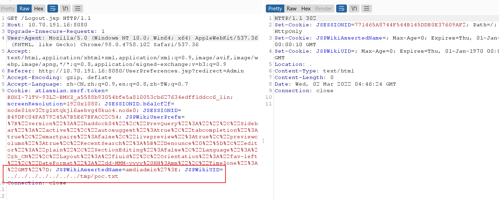
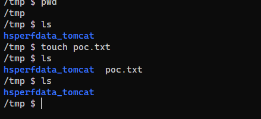
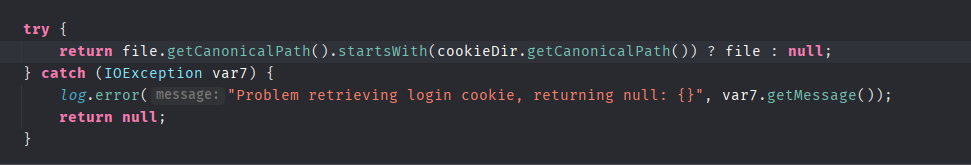

- [CVE-2021-44140 ApacheJspWiki 任意文件删除](#cve-2021-44140-apachejspwiki-任意文件删除)
  - [影响版本](#影响版本)
  - [环境搭建](#环境搭建)
  - [原理分析](#原理分析)
    - [clearLoginCookie](#clearlogincookie)
    - [JSPWikiUID](#jspwikiuid)
  - [复现](#复现)
  - [补丁](#补丁)
# CVE-2021-44140 ApacheJspWiki 任意文件删除
## 影响版本
Version < 2.11.0.M8
## 环境搭建
docker run -d -p 8080:8080 --name jspwiki2  vulfocus/jspwiki-cve_2021_44140
## 原理分析
### clearLoginCookie
在Logout.jsp中退出登录时,调用`clearLoginCookie`来清除Cookie.
```java
CookieAuthenticationLoginModule.clearLoginCookie( wiki, request, response );
```
在`clearLoginCookie`中调用`getCookieFile`获取到Cookie文件然后调用`cf.delete()`删除文件。
```java
    public static void clearLoginCookie( final Engine engine, final HttpServletRequest request, final HttpServletResponse response ) {
        final Cookie userId = getLoginCookie( "" );
        userId.setMaxAge( 0 );
        response.addCookie( userId );

        final String uid = getLoginCookie( request );

        if( uid != null ) {
            final File cf = getCookieFile( engine, uid );

            if( cf != null ) {
                if( !cf.delete() ) {
                    log.debug( "Error deleting cookie login " + uid );
                }
            }
        }
    }
```
而在获取cookie文件时，是利用传入的uid参数与工作目录做拼接得到的.
```java
    private static File getCookieFile( final Engine engine, final String uid ) {
        final File cookieDir = new File( engine.getWorkDir(), COOKIE_DIR );
        ...
        ...
        ...
        return new File( cookieDir, uid );
```
### JSPWikiUID
而uid是从`getLoginCookie`获取得到,其值为Cookie中的`JSPWikiUID`参数。
```java
   final String uid = getLoginCookie( request );
```
```java
    private static final String LOGIN_COOKIE_NAME = "JSPWikiUID";
    ...
    private static String getLoginCookie( final HttpServletRequest request ) {
        return HttpUtil.retrieveCookieValue( request, LOGIN_COOKIE_NAME );
    }
```
整个流程中JSPWikiUID参数无过滤,导致可以利用`../../../../`路径穿越删除任意文件。
## 复现
poc：`JSPWikiUID=../../../../../../../tmp/poc.txt`


## 补丁
在`getCookieFile`中取得了文件的绝对路径并判断是否该路径是否处于Cookie文件目录下。
