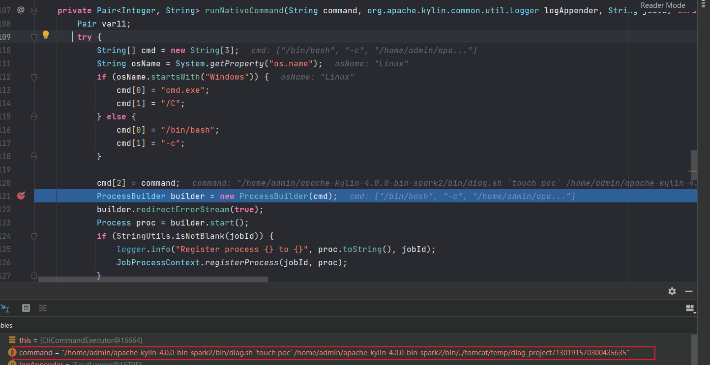
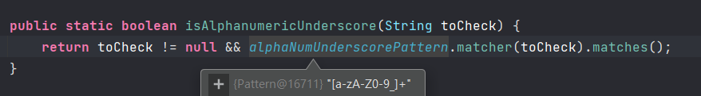
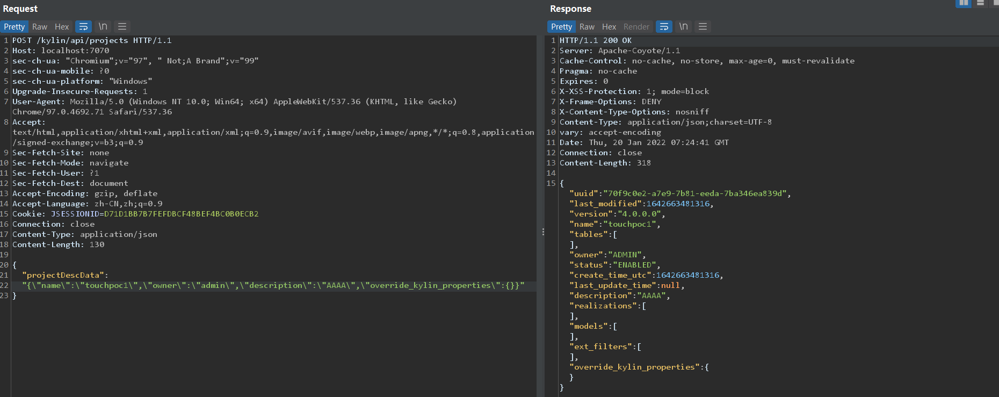
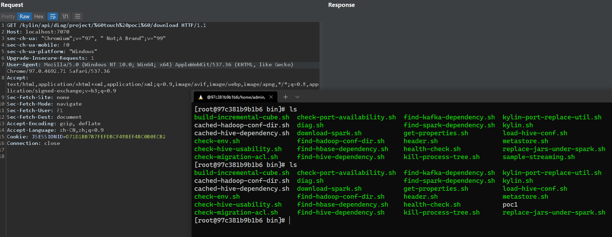
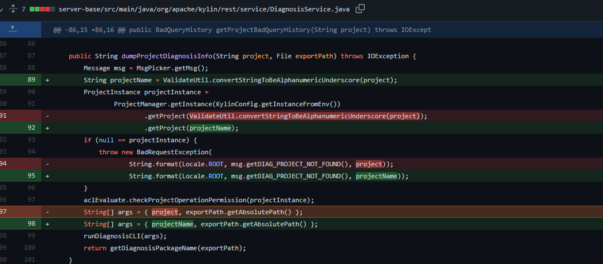

- [CVE-2021-45456 Apache Kylin 命令注入](#cve-2021-45456-apache-kylin-命令注入)
  - [影响版本](#影响版本)
  - [原理分析](#原理分析)
    - [dumpProjectDiagnosisInfo](#dumpprojectdiagnosisinfo)
    - [saveProject](#saveproject)
  - [复现](#复现)
  - [补丁](#补丁)
  - [参考](#参考)
# CVE-2021-45456 Apache Kylin 命令注入
## 影响版本
Apache Kylin 4.0.0
## 原理分析
在Apache Kylin的导出项目诊断信息功能接口中,可控的项目名称参数未经过滤拼接到了后续调用脚本执行的系统命令中造成系统命令注入.
### dumpProjectDiagnosisInfo
`dumpProjectDiagnosisInfo`方法用于根据用户输入的项目名称来导出相关诊断信息。
```java
 @RequestMapping(
        value = {"/project/{project}/download"},
        method = {RequestMethod.GET},
        produces = {"application/json"}
    )
    @ResponseBody
    public void dumpProjectDiagnosisInfo(@PathVariable String project, HttpServletRequest request, HttpServletResponse response) {
        try {
            AutoDeleteDirectory diagDir = new AutoDeleteDirectory("diag_project", "");
            Throwable var5 = null;
            try {
                String filePath = this.dgService.dumpProjectDiagnosisInfo(project, diagDir.getFile());
                this.setDownloadResponse(filePath, response);
```
从PathVariable中获取到project后传入`dgService.dumpProjectDiagnosisInfo`.
```java
    public String dumpProjectDiagnosisInfo(String project, File exportPath) throws IOException {
        Message msg = MsgPicker.getMsg();
        ProjectInstance projectInstance = ProjectManager.getInstance(KylinConfig.getInstanceFromEnv()).getProject(ValidateUtil.convertStringToBeAlphanumericUnderscore(project));
        if (null == projectInstance) {
            throw new BadRequestException(String.format(Locale.ROOT, msg.getDIAG_PROJECT_NOT_FOUND(), project));
        } else {
            this.aclEvaluate.checkProjectOperationPermission(projectInstance);
            String[] args = new String[]{project, exportPath.getAbsolutePath()};
            this.runDiagnosisCLI(args);
            return this.getDiagnosisPackageName(exportPath);
        }
    }
```
首先传入的project会进入`ValidateUtil.convertStringToBeAlphanumericUnderscore`做一次校验过滤.
```java
    public static String convertStringToBeAlphanumericUnderscore(String toBeConverted) {
        return toBeConverted.replaceAll("[^a-zA-Z0-9_]", "");
    }
```
其会把字母数字和下划线以外的字符替换为空。  
校验完成后再根据项目名称获取到一个项目实例`projectInstance`,在后面会调用`runDiagnosisCLI`方法来执行系统命令,而其中的参数`args`是直接从传入的project参数获取到,而该参数并没有被过滤。
```java
String[] args = new String[]{project, exportPath.getAbsolutePath()};
            this.runDiagnosisCLI(args);
```
在后面的`runDiagnosisCLI`,项目名称被拼接到了系统命令中,造成了系统命令注入。

### saveProject
`saveProject`用于创建项目,在上面导出项目诊断信息之前需要先获取到存在项目实例,不然会抛异常.
```java
  @RequestMapping(
        value = {""},
        method = {RequestMethod.POST},
        produces = {"application/json"}
    )
    @ResponseBody
    public ProjectInstance saveProject(@RequestBody ProjectRequest projectRequest) {
        ProjectInstance projectDesc = this.deserializeProjectDesc(projectRequest);
        if (StringUtils.isEmpty(projectDesc.getName())) {
            throw new InternalErrorException("A project name must be given to create a project");
        } else if (!ValidateUtil.isAlphanumericUnderscore(projectDesc.getName())) {
            throw new BadRequestException(String.format(Locale.ROOT, "Invalid Project name %s, only letters, numbers and underscore supported.", projectDesc.getName()));
        } else {
            ProjectInstance createdProj = null;

            try {
                createdProj = this.projectService.createProject(projectDesc);
                return createdProj;
```
而在创建项目时通过调用`ValidateUtil.isAlphanumericUnderscore(projectDesc.getName()`对项目名称也有一个校验,只能为数字,字母和下划线。和导出项目时一致。


利用思路:  

如执行`touch poc`，则创建一个名为`touchpoc`的项目,在导出时,传入项目名称为`touch poc`,利用其自身的过滤机制转换为`touchpoc`与之前创建的项目吻合成功获取到项目实例,但后面执行命令时的参数仍然是传入的`touch poc`.
## 复现
创建项目`touchpoc1`。


导出项目,利用反引号触发命令执行。


## 补丁
传入的args参数不再是从可控的project中获取,而是从projectname中获的，而projectname只能由字母数字下划线组成。

## 参考
