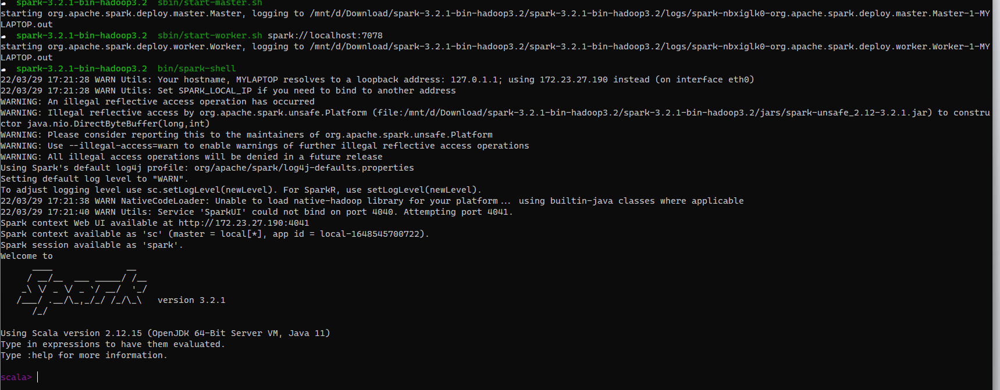
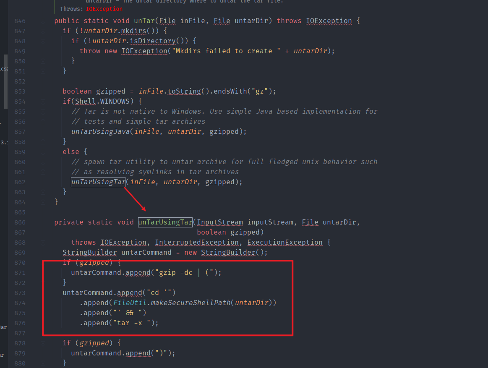
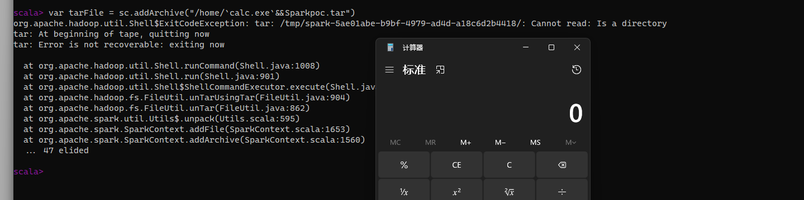
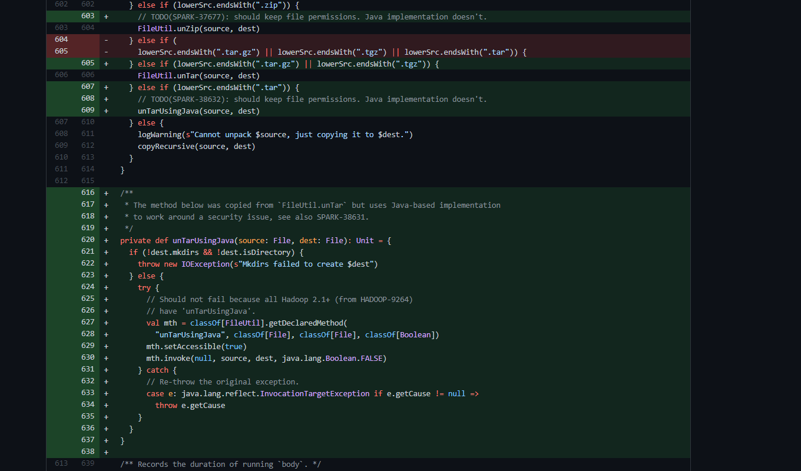

- [SparkShell 命令注入漏洞](#sparkshell-命令注入漏洞)
  - [影响版本](#影响版本)
  - [环境搭建](#环境搭建)
  - [原理分析](#原理分析)
    - [hadoop#untar](#hadoopuntar)
  - [漏洞复现](#漏洞复现)
  - [补丁](#补丁)
# SparkShell 命令注入漏洞
## 影响版本
3.1.2，3.2.1，3.3.0
## 环境搭建
https://www.apache.org/dyn/closer.lua/spark/spark-3.2.1/spark-3.2.1-bin-hadoop3.2.tgz
1.解压后执行目录下sbin/./start-master.sh启动master节点.
2.执行目录下sbin/start-worker.sh spark://localhost:7078启动工作节点.
3.执行目录下bin/spark-shell进入SparkShell.

## 原理分析
### hadoop#untar
当Spark解压任务文件时,其调用的是`org.apache.hadoop.fs.FileUtil#untar`方法进行解压,而在hadoop的`unTar`中进行解压时直接将文件名拼接到了解压命令中.
  
导致当文件名可控时造成命令注入.
## 漏洞复现

## 补丁
替换使用`FileUtil.unTarUsingJava`进行解压.  
  

https://github.com/apache/spark/commit/057c051285ec32c665fb458d0670c1c16ba536b2