- [CVE-2022-43781 Atlassian Bitbucket 命令注入](#cve-2022-43781-atlassian-bitbucket-命令注入)
  - [影响版本](#影响版本)
  - [环境搭建](#环境搭建)
  - [原理分析](#原理分析)
    - [NULL截断](#null截断)
    - [GIT\_EXTERNAL\_DIFF](#git_external_diff)
  - [漏洞复现](#漏洞复现)
  - [补丁](#补丁)
  - [参考](#参考)

# CVE-2022-43781 Atlassian Bitbucket 命令注入
## 影响版本
Bitbucket  Server和Bitbucket Data Center-Atlassian  
7.0.0 ≤ version < 7.6.19  
7.7.0 ≤ version < 7.17.12   
7.18.0 ≤ version < 7.21.6  
7.22.0 ≤ version < 8.0.5  
8.1.0 ≤ version < 8.1.5  
8.2.0 ≤ version < 8.2.4  
8.3.0 ≤ version < 8.3.3  
8.4.0 ≤ version < 8.4.2  
## 环境搭建
`docker run --name="bitbucket" -d -p 7990:7990 -p 7999:7999 -p 5050:5050 -e JVM_SUPPORT_RECOMMENDED_ARGS="-Xdebug -Xrunjdwp:transport=dt_socket,server=y,suspend=n,address=*:5050" atlassian/bitbucket-server:7.6.17-ubuntu-jdk11`
## 原理分析
这个CVE与之前的CVE-2022-36804使用了相似的原理,在NuProcessBuilder中利用在创建进程执行命令时拷贝环境变量和命令都是用的数组的方式进行拷贝,而其中的分隔符即为NULL,在CVE-2022-36804中通过注入NULL字符截断来命令行参数注入一个新的git参数利用Git上的攻击面进行RCE,而这次同样的也是利用NULL字符截断不过是截断的环境变量,同样注入了一个Git相关的环境变量进行RCE.
### NULL截断
在执行repos相关的操作时,在系统层面会调用Git命令,比如创建一个repos,而在创建相关的git命令前会先配置一系列相关的变量,这部分操作主要是从`com.atlassian.bitbucket.internal.process.nu.NuNioProcessHelper`类的run方法开始的,其会调用同类的applyConfigurers方法来应用配置创建进程所需要的一系列参数.    
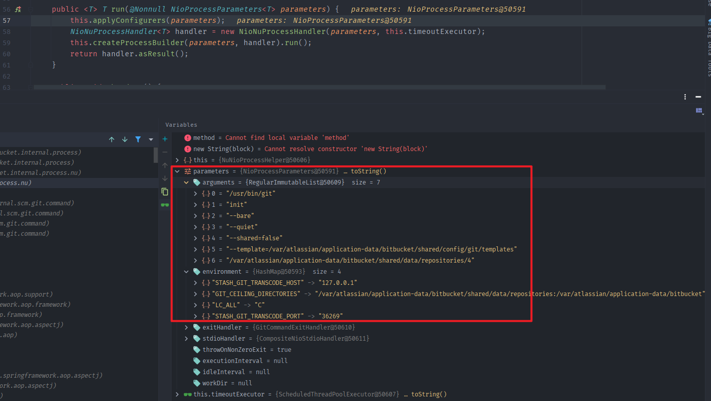  
进入applyConfigurers方法后会依次调用所有配置器,其实一共也就两个配置器,DefaultNioProcessConfigurer配置器和RemoteUserNioProcessConfigurer配置器.
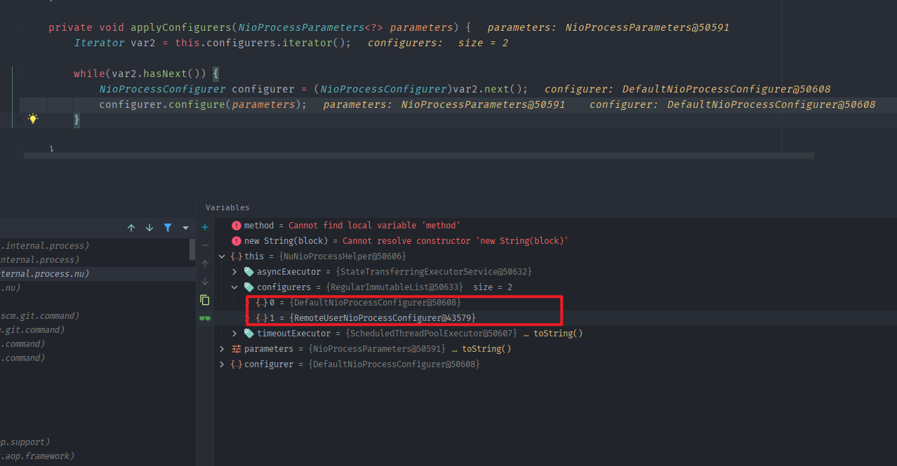  
主要重点关注第二个RemoteUserNioProcessConfigurer配置器,其configure方法如下   
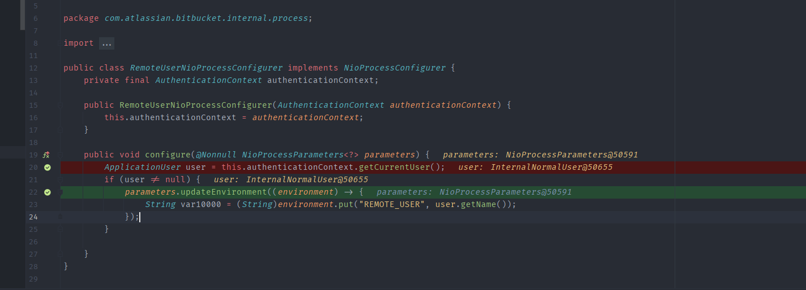  
其主要调用updateEnvironment更新了环境变量,更新的内容就是当前的用户名然后将其用`REMOTE_USER`变量存储在环境变量中.  
当开始创建执行Git命令的进程时可以看到当前的用户名已经存在了相关的environment map中.  
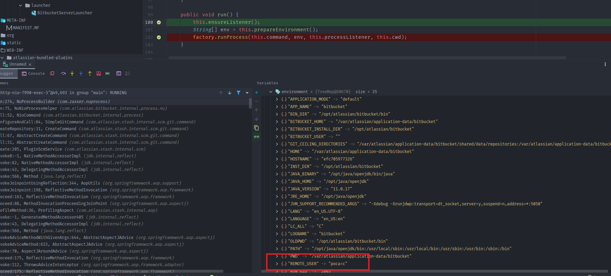  
然后调用prepareEnvironment()将其转化为一个String数组后.
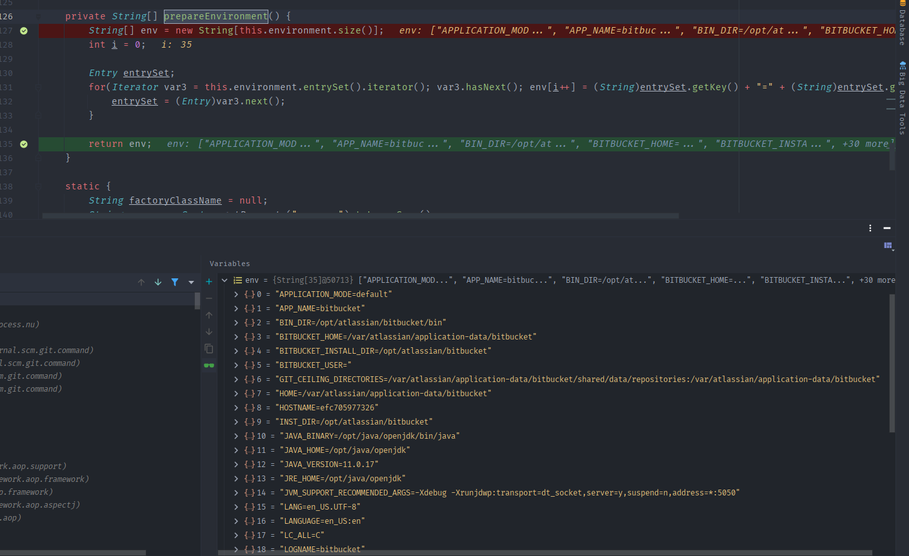  
根据操作系统差异,我这里会创建一个LinuxProcess对象,然后调用其run方法.可以看到在开始call之前还有一步prepareProcess的操作来设置进程的相关属性,其中也传入了environment数组.  
在其中最经典的一幕就是调用toEnvironmentBlock()将String数组转化为byte[]数组了.   
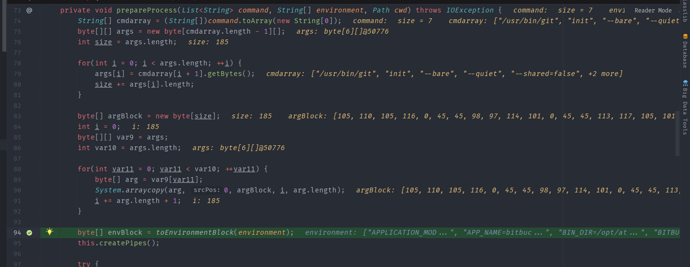  
在其中在进行数组拷贝时调用的System.arraycopy方法是以NULL字符作为分隔符拷贝,这也是CVE-2022-36804在注入参数利用的地方,同样的整个环境变量中我们能控制的就是用户名了,如果在用户名中注入NULL字符,那么在数组拷贝后得到得环境数组就会多一个我们注入的变量,以`poc%00a=c`用户名测试,可以看到拷贝后的byte数组中REMOTE_USER变量后面会多一个a=c键值对.  
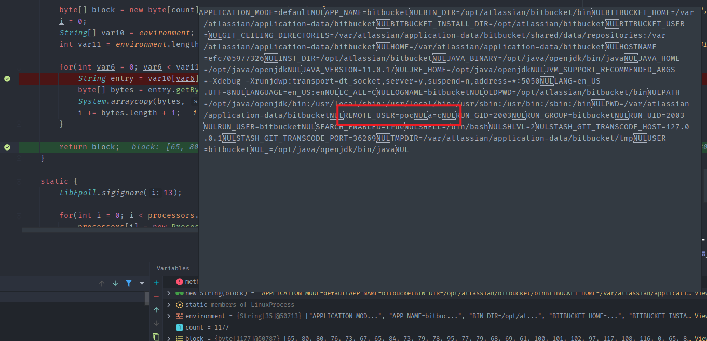  
### GIT_EXTERNAL_DIFF
现在能注入执行Git命令的环境变量之后则还需要找到一个可以利用的git环境变量,从Git的文档中对各个环境变量有说明文档,其中`GIT_EXTERNAL_DIFF`环境变量的说明如下   
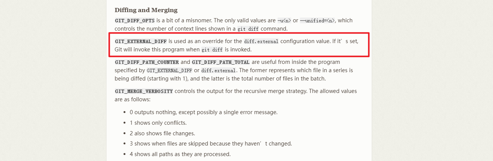  
当该环境变量被设置时,只要执行git diff命令则Git还会去调用该环境变量指定的程序.
所以最后的利用思路就很简单了,注入GIT_EXTERNAL_DIFF环境变量,执行diff操作,触发cmd.exe或者bash等执行命令即可.
## 漏洞复现
1. 创建恶意用户登录  
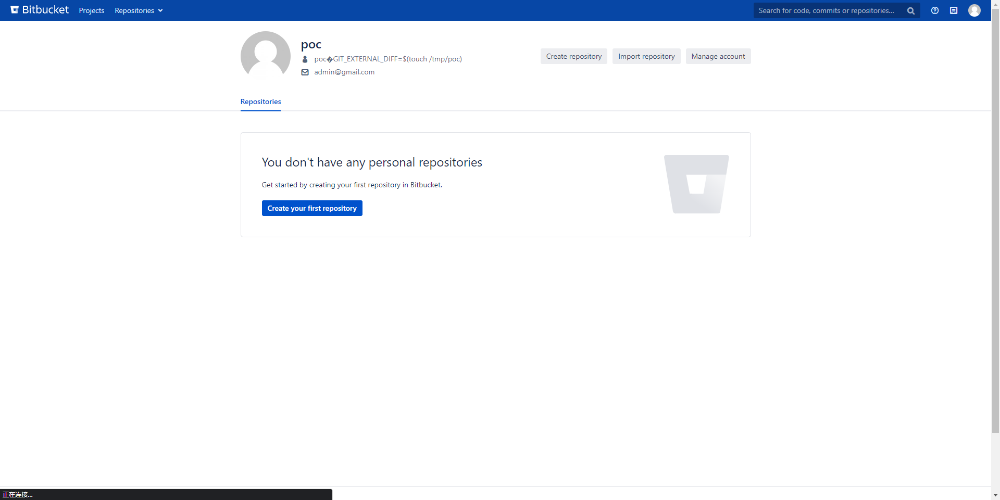
2. 查看commit触发Diff命令 
可以看到GIT_EXTERNAL_DIFF环境变量被成功注入.

3. 触发RCE
页面会报错同时命令已经被执行.
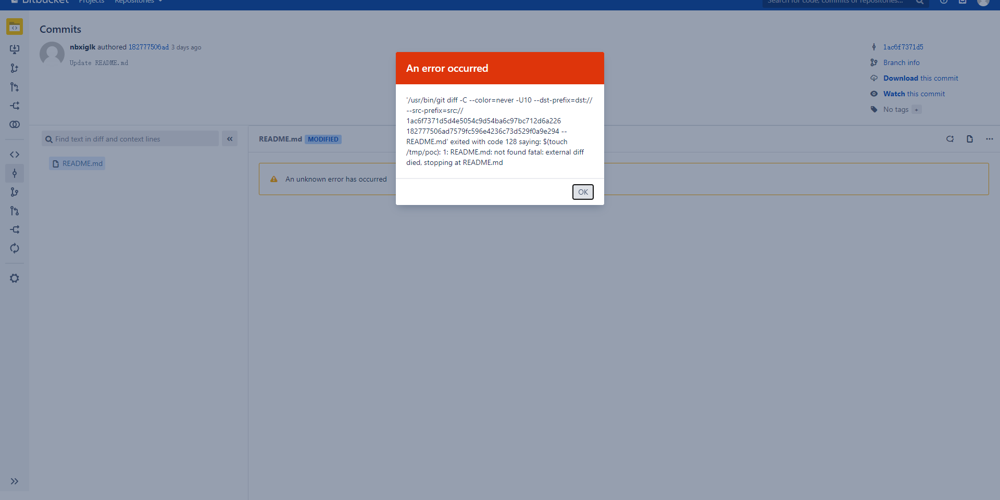   
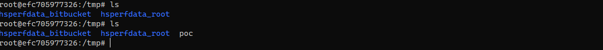
## 补丁
检验了用户名中是否含有NULL字符.
## 参考
https://git-scm.com/book/en/v2/Git-Internals-Environment-Variables
https://petrusviet.medium.com/cve-2022-43781-32bc29de8960