- [CVE-2021-26084 未授权 OGNL 表达式注入](#cve-2021-26084-未授权-ognl-表达式注入)
  - [影响版本](#影响版本)
  - [环境搭建](#环境搭建)
  - [原理分析](#原理分析)
    - [请求处理流程](#请求处理流程)
    - [VelocityResult](#velocityresult)
    - [HTMLEncode](#htmlencode)
    - [ByPass SafeExpressionUtil](#bypass-safeexpressionutil)
  - [漏洞复现](#漏洞复现)
  - [补丁](#补丁)

# CVE-2021-26084 未授权 OGNL 表达式注入

## 影响版本

version < 6.13.23
6.14.0 ≤ version < 7.4.11
7.5.0 ≤ version < 7.11.6
7.12.0 ≤ version < 7.12.5

## 环境搭建

`docker run -e JVM_SUPPORT_RECOMMENDED_ARGS="-agentlib:jdwp=transport=dt_socket,server=y,suspend=n,address=*:5005"  --name="confluence" -d -p 8090:8090 -p 8091:8091 -p 5005:5005 atlassian/confluence-server:7.12.4-ubuntu-18.04-adoptopenjdk11`

## 原理分析

官方公告如下

未授权的OGNL注入
对比7.12.4和7.12.5文件,对三个vm模板文件做了修改.
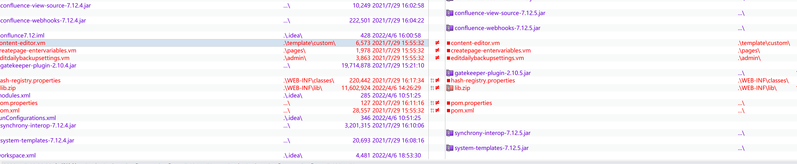
Confulence是基于Xwork为框架开发,其路由信息在Xwork.xml中,其中只有`createpage-entervariables.vm`模板的路由可以未授权访问,其路由如下.
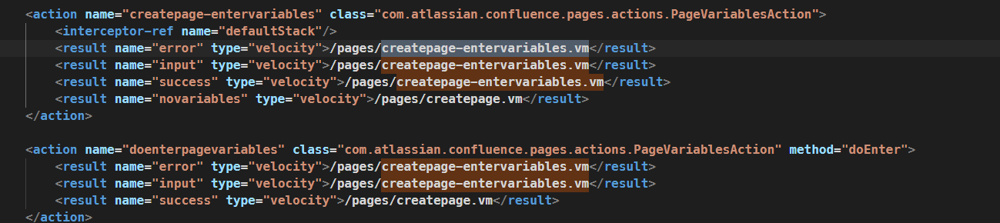
查看差异,其中将`queryString`和`linkCreation`标签修改为普通变量
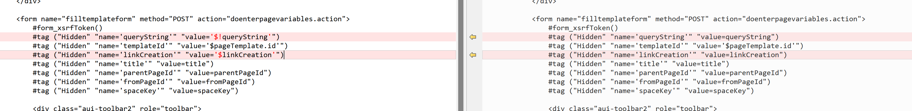

### 请求处理流程

在WebWorkResultSupport前是Xwork框架的拦截器处理,拦截器处理完成后在`DefaultActionInvocation`中根据请求action参数生成一个Result,然后调用其execute方法完成后续逻辑处理.
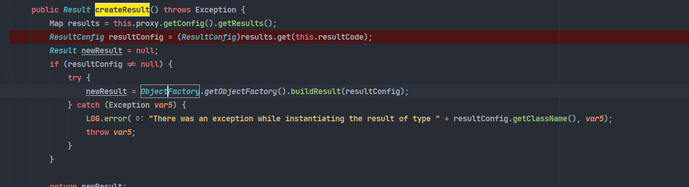

此处生成的Result是`EncodingVelocityResult`类,其继承于`WebWorkResultSupport`类
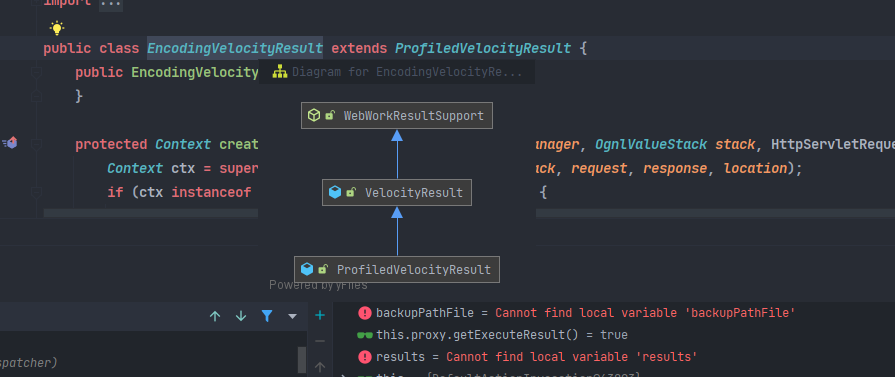
所以会进入`WebWorkResultSupport#execute`中.最后会来到`VelocityResult#doExecute`中,调用栈如下
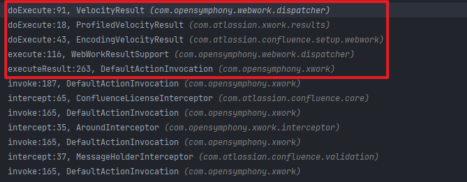

### VelocityResult

在`VelocityResult#doexecute`中,获取到Velocity模板引擎和/pages/createpage-entervariables.vm的模板内容,最后调用`Template.merge`进行渲染.
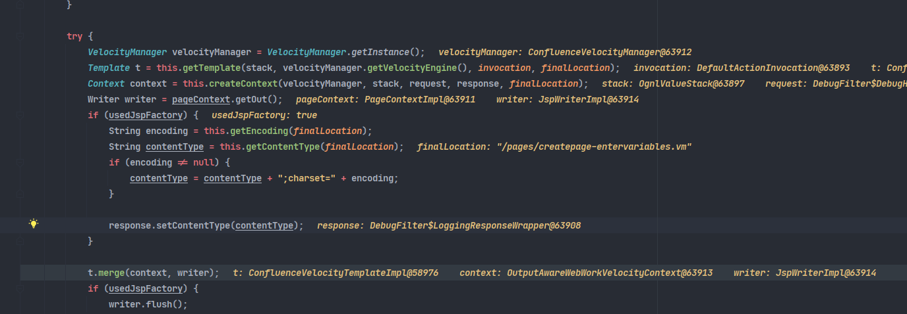
在Velocity模板引擎渲染时在`AbstractUITag#doEndTag`中调用`evaluateParams`对每一个标签的值进行计算.
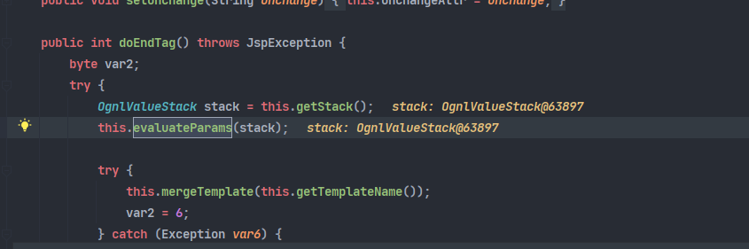
在计算时使用`findString`得到标签名,其将其添加到name属性中.
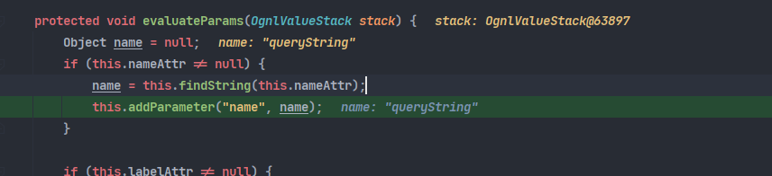
然后后面同样调用`findValue`来得到对应的值.
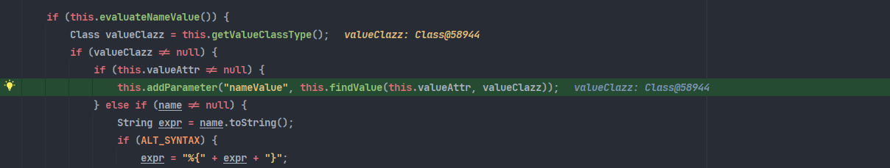
最后会执行到`OgnlValueFinder#findValue`中调用`stack.findvalue`进入`OgnlVlauewStack#findValue`进行OGNL表达式.
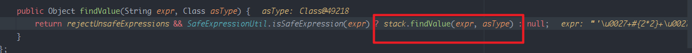
### HTMLEncode
在模板中变量被单引号包裹,所以首先要先闭合前后两个单引号.
`#tag ("Hidden" "name='queryString'" "value='$!queryString'")`

直接使用`#{2*2}`在ONGL表达式中的值为`'#{2*2}'`,被单引号包裹的字符串会直接原样输出.

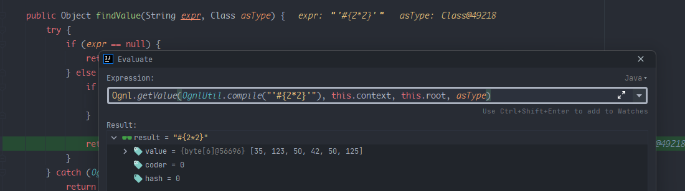

当传入payload为`'#{2*2}'`闭合标签时,在OGNL表达式中获取的值为`&#39;#{2*2}&#39;`
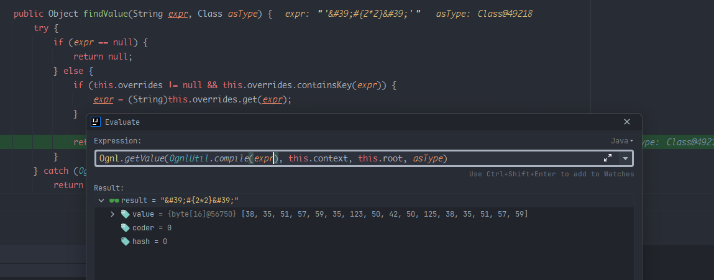

这是因为其中因为Velocity模板在获取标签的值时为了防止XSS会对相应的字符做HTML实体编码解码处理.

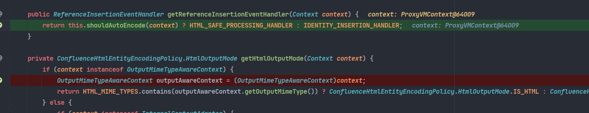
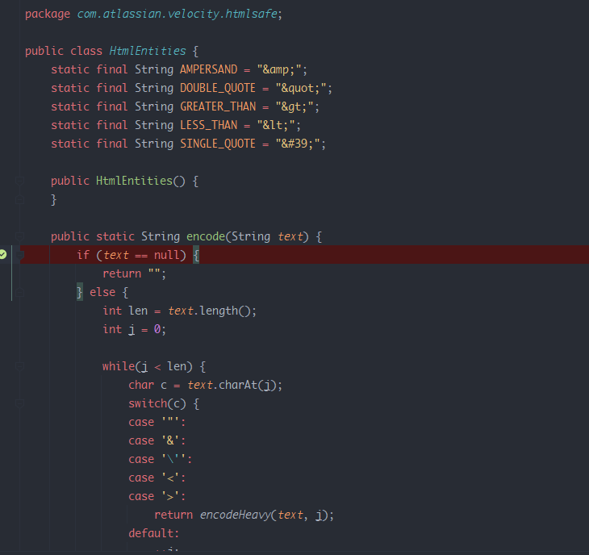

导致单引号被编码后进入OGNL表达式计算时闭合失败payload原样输出.

但是OGNL是支持Unicode编码的,所以我们可以对单引号进行Unicode编码,即可绕过HTML编码并且正常执行OGNL表达式.

发送payload如下`\u0027%2b#{2*2}%2b\u0027`,此时进入OGNL表达式时值如下,成功执行.
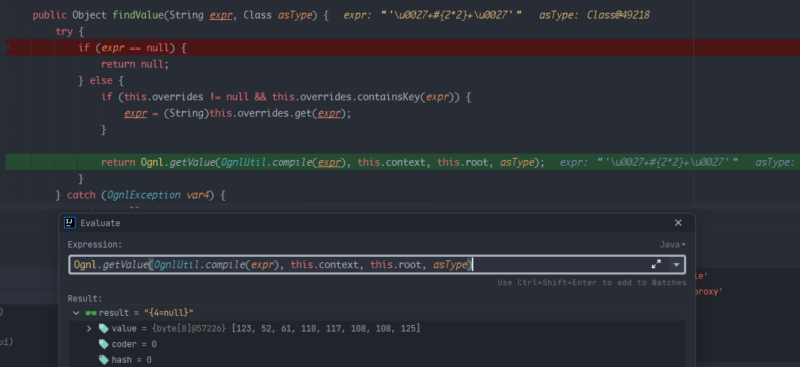
### ByPass SafeExpressionUtil
在执行到`OgnlValueFinder#findValue`进入`OgnlVlauewStack#findValue`进行OGNL表达式计算之前可以看到还有一个检验的判断.
`rejectUnsafeExpressions && SafeExpressionUtil.isSafeExpression(expr)`,代码如下  
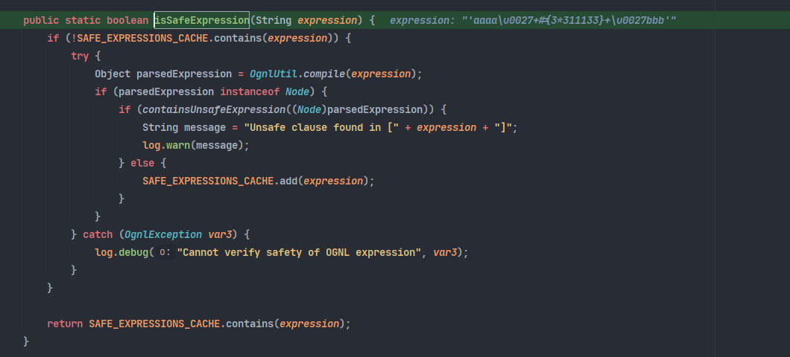  
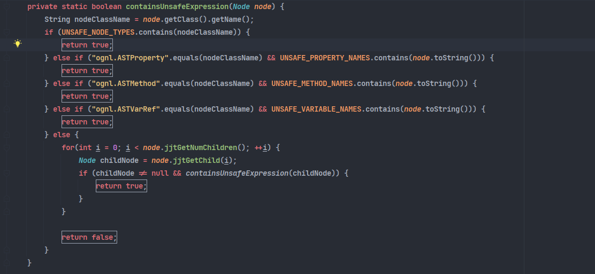  
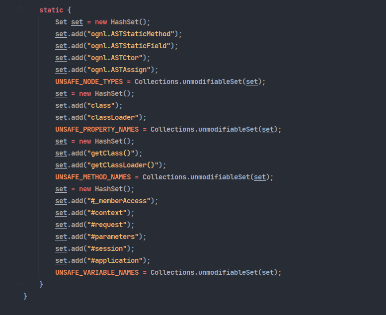  
其中其对一些常见的利用代码进行了黑名单限制,但可以使用数组的方式绕过对class的访问限制,[参考](https://blog.orange.tw/2018/08/how-i-chained-4-bugs-features-into-rce-on-amazon.html)  
`"".getClass().forName("java.lang.Runtime")` --->`""["class"].forName("java.lang.Runtime")`

调用栈如下:  
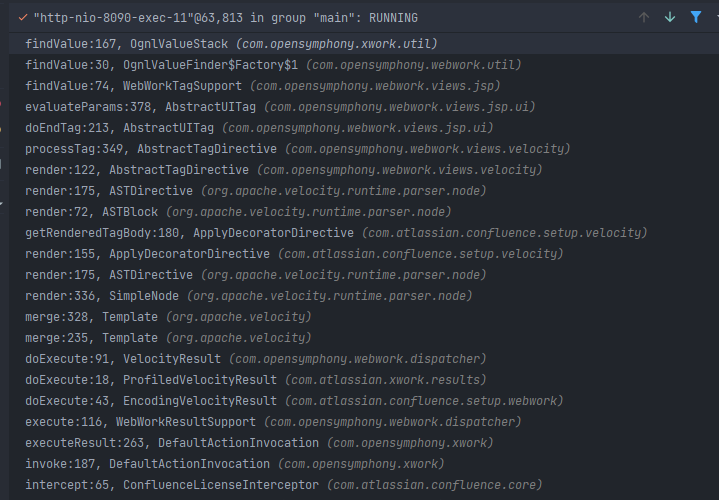

## 漏洞复现

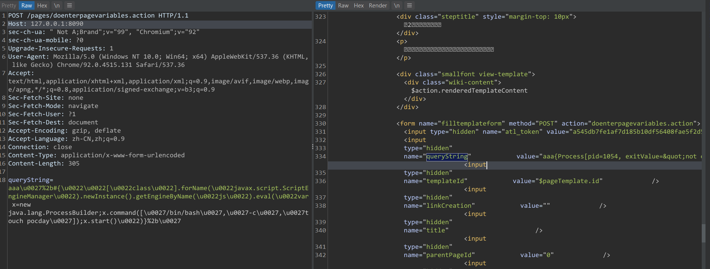
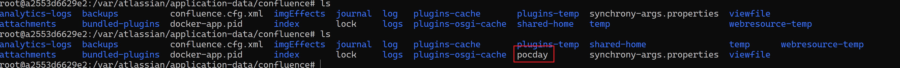

## 补丁
修改相关参数为普通变量.
