- [CVE-2023-22515 Confluence Data Center and Server 访问控制缺陷漏洞](#cve-2023-22515-confluence-data-center-and-server-访问控制缺陷漏洞)
  - [影响版本](#影响版本)
  - [环境搭建](#环境搭建)
  - [原理分析](#原理分析)
    - [XWork  Complex Parameters](#xwork--complex-parameters)
    - [setupComplete](#setupcomplete)
  - [漏洞复现](#漏洞复现)
  - [补丁](#补丁)
  - [参考](#参考)

# CVE-2023-22515 Confluence Data Center and Server 访问控制缺陷漏洞
## 影响版本
```
8.0.0
8.0.1
8.0.2
8.0.3
8.0.4
8.1.0
8.1.1
8.1.3
8.1.4
8.2.0
8.2.1
8.2.2
8.2.3
8.3.0
8.3.1
8.3.2
8.4.0
8.4.1
8.4.2
8.5.0
8.5.1
```
## 环境搭建
`docker run --name="confluence" -e JVM_SUPPORT_RECOMMENDED_ARGS="-Xdebug -Xrunjdwp:transport=dt_socket,server=y,suspend=n,address=*:5005" -d -p 8090:8090 -p 5005:5005 -p 8091:8091 atlassian/confluence-server:8.5.1-ubuntu-jdk11`
## 原理分析
### XWork  Complex Parameters
这个漏洞和Spring Framwork的参数绑定漏洞(CVE-2022-22965)相似，confluence使用的strtus2 XWork也实现了对对象复杂参数的自动设置机制。简单来说对于请求参数中类似于object.filed=value格式的参数Xwork会自动调用getObject().setField("value")方法进行设置。  
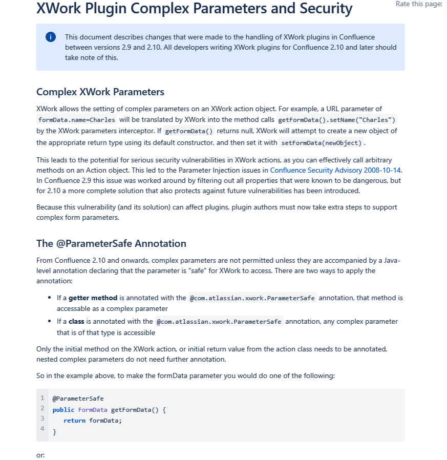  
### setupComplete
和之前的利用思路相似，利用参数绑定机制来访问敏感的Bean进而设置一些可以利用的属性，该而漏洞利用的Bean则是`com.atlassian.config.ApplicationConfig`，从名字可以看到该Bean主要定义应用的一些配置，其中有一个配置为`setupComplete`，并且含有setter方法。  
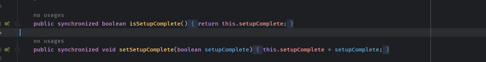  
从名字可以看到该属性定义了Confluence是否安装完成，而该属性的值也决定了安装页面是否可以进行访问，如果安装已经完成，那么该值应该为true，而如果可以参数绑定的方式能够将该值设置为false，那么我们就又可以访问安装页面，而安装页面则可以创建管理员。 

而现在则需要一个入口来访问到该Bean，根据补丁来看，其删除了`server-info.action -> com.atlassian.confluence.core.actions.ServerInfoAction`的映射，而ServerInfoAction是一个实现了`ConfluenceActionSupport`类的子类。  
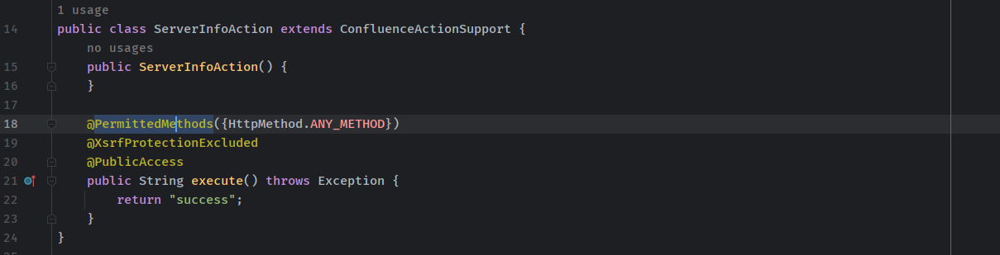  
而在`ConfluenceActionSupport`中有一个getter方法可以获取到`BootstrapStatusProvider`对
象，  
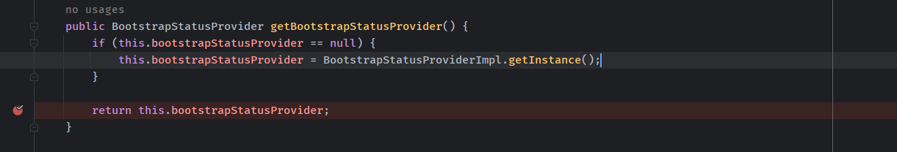
在BootstrapStatusProvider对象中则有一个getter方法可以获取到ApplicationConfigBean。  
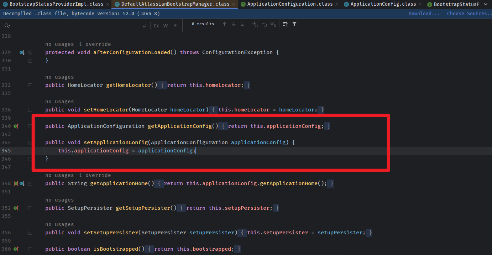
所以最后的利用链路也比较简单，从`ServerInfoAction -> BootstrapStatusProvider Bean -> ApplicationConfig Bean -> setSetupComplete`。
## 漏洞复现
请求`http://192.168.1.104:8090/server-info.action?bootstrapStatusProvider.applicationConfig.setupComplete=false`。  
根据Xwork的参数自动绑定机制，则会依次调用`getBootstrapStatusProvider().getApplicationConfig().setSetupComplete(fasle)`。
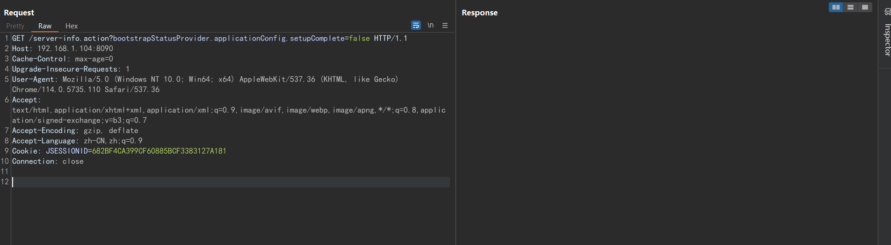  
自动调用getBootstrapStatusProvider()方法。  
  
自动调用getApplicationConfig()方法，其中该方法是通过委托的形式从DefaultAtlassianBootstrapManager对象中获取。  
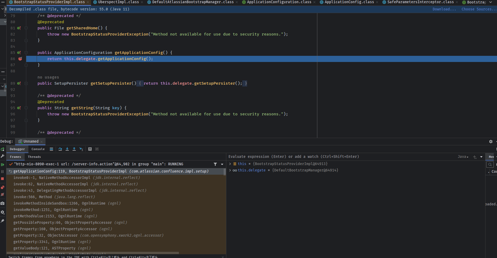  
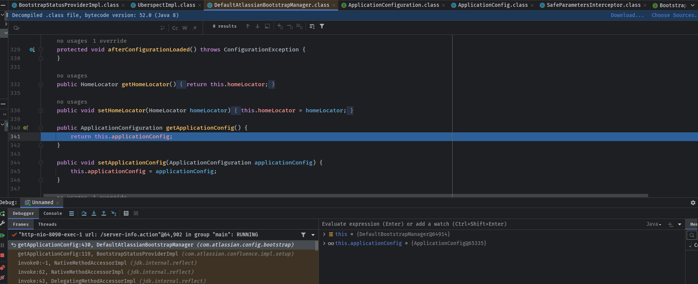  
最后触发ApplicationConfig的setSetupComplete()方法将安装状态重置为Flase。  
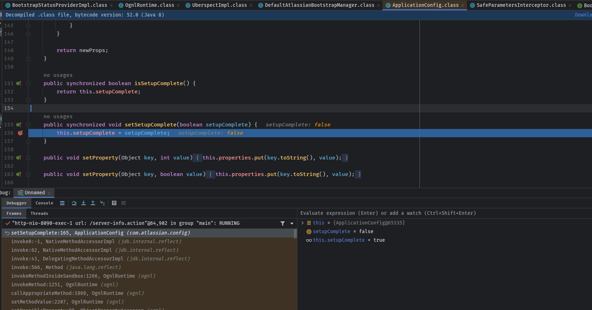  
重置为Flase之后，则可以访问安装过程中的管理员创建页面创建管理员了。  
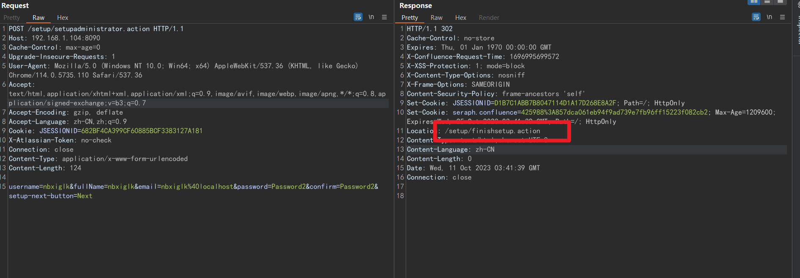  
最后手动访问一下这个/setup/finishsetup.action接口完成安装即可。    
创建账号登录  
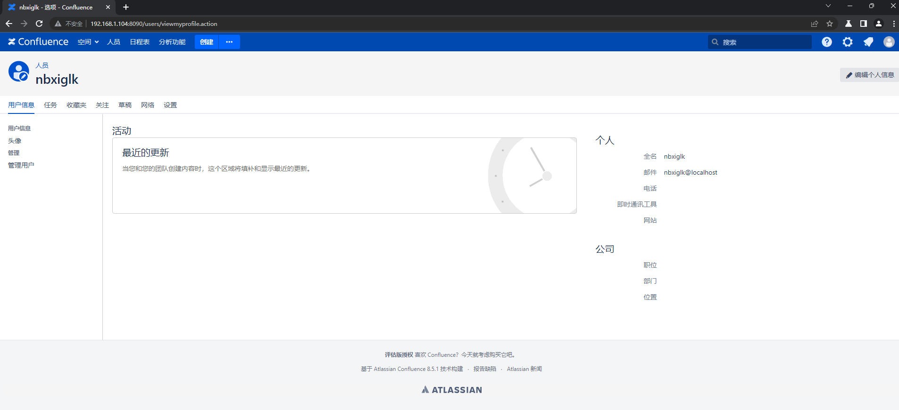  
## 补丁
1. 在SafeParametersInterceptor添加了安全参数校验，在BootstrapStatusProviderImpl，ApplicationConfig中将返回对象设置为只读，不允许修改。
2. 删除了server-info.action路由。
## 参考
https://attackerkb.com/topics/Q5f0ItSzw5/cve-2023-22515/rapid7-analysis   
https://developer.atlassian.com/server/confluence/xwork-plugin-complex-parameters-and-security/
