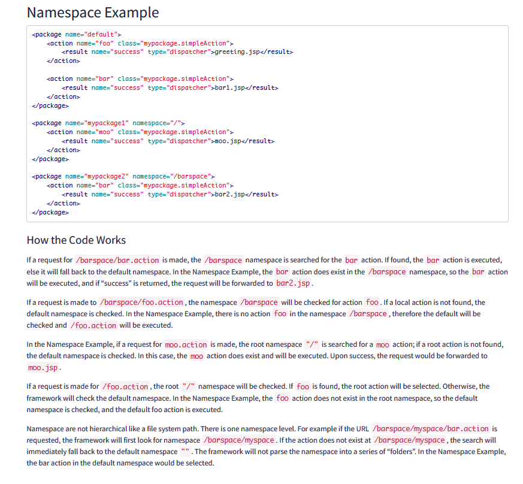
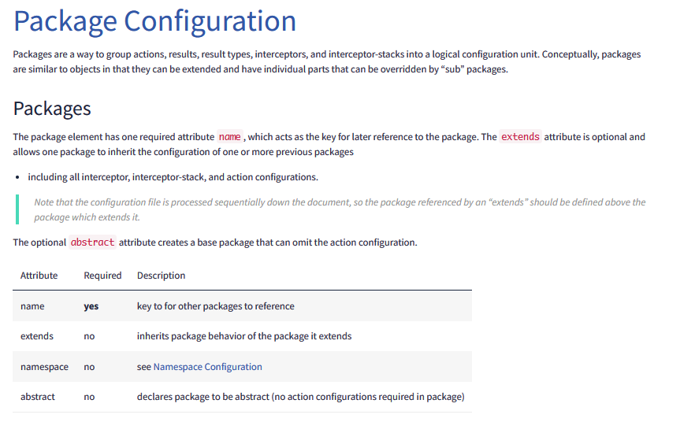
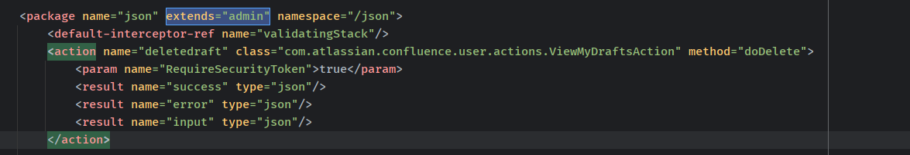
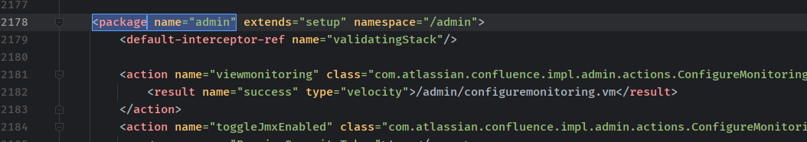
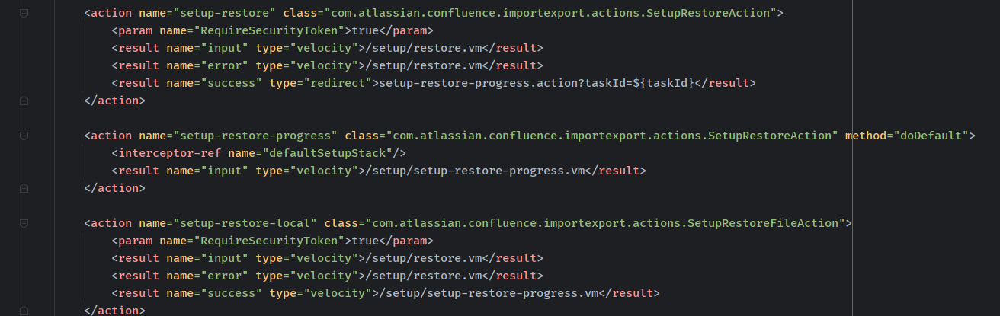

- [CVE-2023-22518 Confluence Data Center and Server 访问控制缺陷漏洞](#cve-2023-22518-confluence-data-center-and-server-访问控制缺陷漏洞)
  - [影响版本](#影响版本)
  - [环境搭建](#环境搭建)
  - [原理分析](#原理分析)
    - [Namespace](#namespace)
    - [extend admin namespace](#extend-admin-namespace)
  - [补丁](#补丁)
  - [参考](#参考)

# CVE-2023-22518 Confluence Data Center and Server 访问控制缺陷漏洞
## 影响版本
```
 7.19.0 <= Atlassian Confluence < 7.19.16  
 8.3.0 <= Atlassian Confluence < 8.3.4  
 8.4.0 <= Atlassian Confluence < 8.4.4  
 8.5.0 <= Atlassian Confluence < 8.5.3  
 8.6.0 <= Atlassian Confluence < 8.6.1 
```
## 环境搭建
`docker run --name="confluence" -e JVM_SUPPORT_RECOMMENDED_ARGS="-Xdebug -Xrunjdwp:transport=dt_socket,server=y,suspend=n,address=*:5005" -d -p 8090:8090 -p 5005:5005 -p 8091:8091 atlassian/confluence-server:8.5.1-ubuntu-jdk11`
## 原理分析
原理很简单，主要是涉及到strtus2的命令空间继承问题，简单记录一下。
###  Namespace 
官方文档：https://struts.apache.org/core-developers/namespace-configuration  

在很多地方都有命名空间的的使用，主要作用就是对某些行为进行逻辑上的划分，用于避免名称操作等因为重复产生的冲突，名称操作等各自都只作用于自己的命名空间内，互不影响，而在struts2中命令空间就是作用于将不同的action进行划分，对一个/space1/invoke.action的请求，strtus2会在space1命令空间下去寻找invoke.action对应的action，如果space1命令空间有，那么执行对应action的代码。
没有，那么就会到default默认命令空间查找对应action进行执行，也就是说在struts2中会对命令空间进行递归查询对应的action，直到default空间。  
  
同时Package 是支持继承的，extends 属性是可选的，允许一个软件包继承一个或多个以前软件包的配置。 

### extend admin namespace 
而从struts.xml中可以发现有一个继承于admin的json package。  

也就是说可以如果请求/json/xxx.action，首先会先从json命名空间中寻找xxxAction，如果没有的话那么就会去admin命名空间寻找，依此类推直到在default命名空间中寻找Action。而admin package也继承于 setup package，也就是现在可以通过json命名空间访问admin和setup空间下的action。 

从公开的poc来看寻找到的利用action是setup命名空间下的setup-restore action，这对应Confluence的备份和还原功能。  
   
即访问/json/setup-restore.action即可访问到SetupRestoreAction。  

利用该action会导致目标数据被清除。
## 补丁
在很多敏感action添加了WebSudo注释，即要求二次验证。
>WebSudo注释 类似于linux系统的sudo，在执行敏感操作前会要求再次输入密码。
## 参考
https://struts.apache.org/core-developers/namespace-configuration