- [CVE-2022-1388 F5 Big-IP 认证绕过](#cve-2022-1388-f5-big-ip-认证绕过)
  - [影响版本](#影响版本)
  - [环境搭建](#环境搭建)
  - [原理分析](#原理分析)
    - [认证流程](#认证流程)
    - [Apache认证](#apache认证)
    - [Jetty认证](#jetty认证)
    - [HTTP hop-by-hop](#http-hop-by-hop)
  - [漏洞复现](#漏洞复现)
  - [补丁](#补丁)
  - [参考](#参考)
# CVE-2022-1388 F5 Big-IP 认证绕过
## 影响版本
BIG-IP-F5 Networks
=16.1.0&&<=16.1.2||>=15.1.0&&<=15.1.5||>=14.1.0&&<=14.1.4||>=13.1.0 &&<=13.1.4||>=12.1.0 &&<=12.1.6||>=11.6.1&&<=11.6.5
## 环境搭建
F5官网申请试用后下载虚拟版本,打开ova导入vmware即可.
## 原理分析
### 认证流程
F5 BigIP的Rest接口是由一个Jeety服务器监听在本地的8100端口进行处理的,当发送到BigIP的http请求会首先由前端的HTTPD Apache进行过滤后转发到后端的Jetty服务器进行处理.
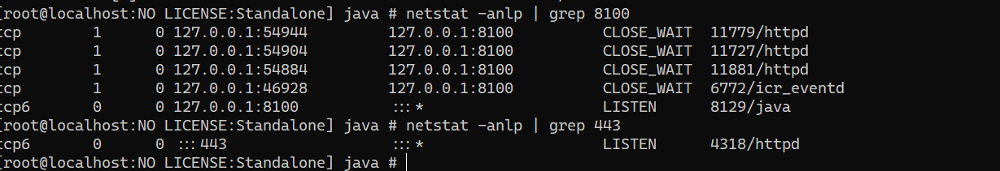
httpd配置文件的转发
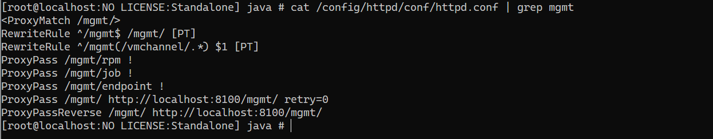  
可以看到当请求/mgmt路径下的请求时都会转发到后端8100端口的/mgmt路径下.  

### Apache认证
在之前的CVE-2021-22986中,Apache验证中时只要Header头中携带了X-F5-Auth-Token字段则会直接将请求进行转发到后端的jetty服务器中,并未检查其是否为空,在CVE-2021-22986的补丁中则是验证了 X-F5-Auth-Token不能为空. 
当不带X-F5-Auth-Token字段时,可以看到是由Apache进行返回认证请求.
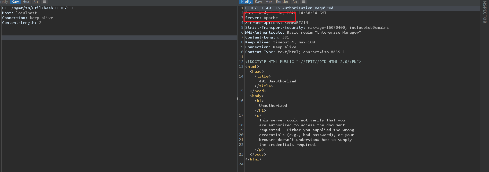  
当携带X-F5-Auth-Token字段且不为空时,可以看到是由后端的Jetty服务器进行处理返回.  
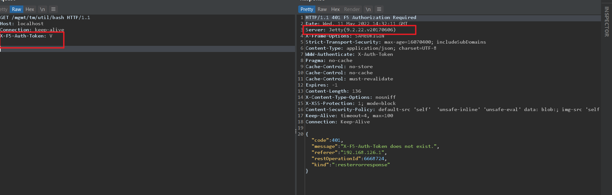  
当携带X-F5-Auth-Token字段且为空时,可以看到经过CVE-2021-22986补丁后Apache并不会转发给Jetty服务器.  
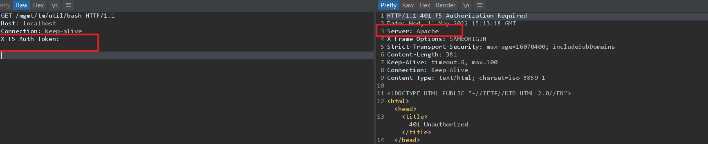
所以现在要携带X-F5-Auth-Token且不为空才能进入Jetty服务器进行二次认证.
### Jetty认证
而在Jetty服务器上认证的处理流程主要位于/usr/share/java/rest/f5.rest.jar中.    
在com\f5\rest\workers\EvaluatePermissions.class#evaluatePermission中,代码如下  
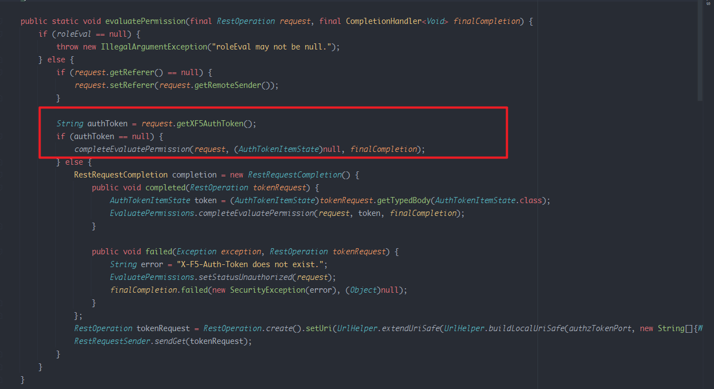  
可以看到其从转发的请求中获取到`XF5AuthToke`n,当`XF5AuthToken`为空时进入`completeEvaluatePermission`函数完成验证.  
而在`completeEvaluatePermission`中因为token为null,所以跳过第一个token时间的验证,进入`request.setBasicAuthFromIdentity();`中.  
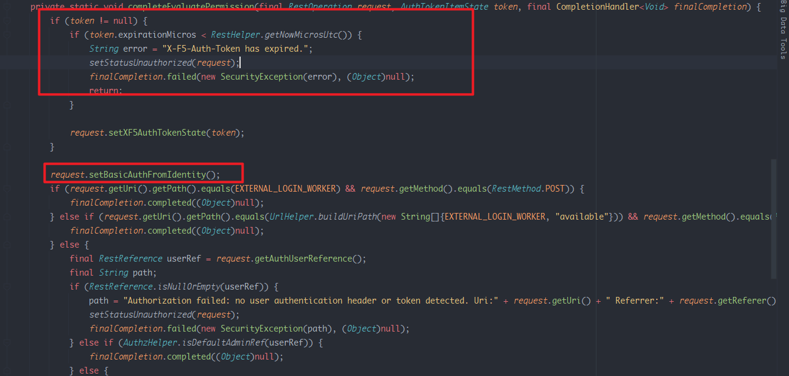  
在`setBasicAuthFromIdentity()`中其使用`getAuthUser`来得到认证信息中的用户名编码后返回.  
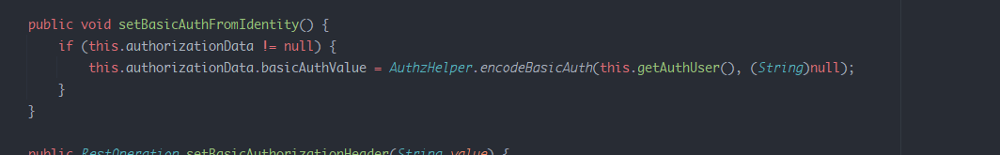  
而认证信息的处理则是来在com\f5\rest\common\RestOperationIdentifier.class中的`setIdentityFromBasicAuth`方法中,其中从Header中取得authHeader然后解码后进行判断,但如果X-Forwarded-Host地址为127.0.0.1或者localhost的话程序在调用`request.setIdentityData`设置认证信息时只校验了用户名,并没有检查密码,然后将解码的用户名填入了认证信息中.  
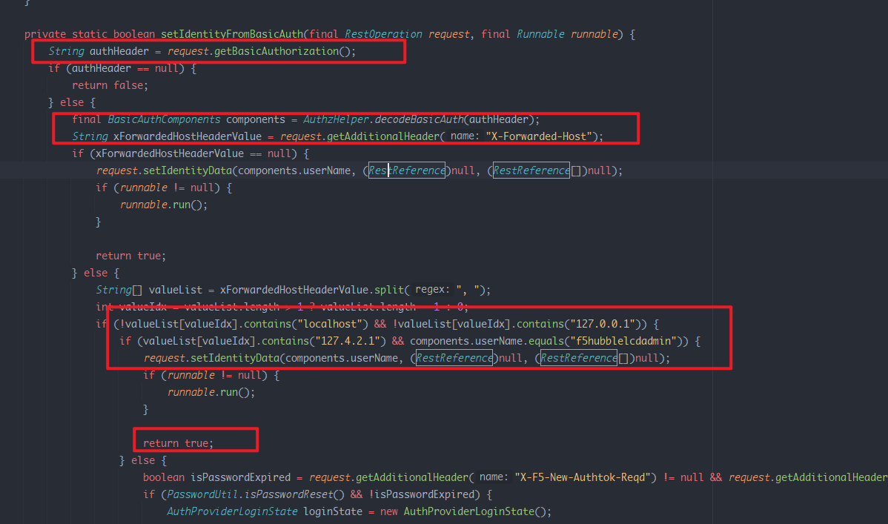  

回到了`completeEvaluatePermission`中只要uri不等于`EXTERNAL_LOGIN_WORKER`常量值则直接进入后面的else判断  
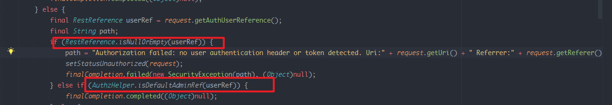  
在其中通过`final RestReference userRef = request.getAuthUserReference();`获取到认证用户的引用如果不为空的则判断是否为DefaultAdminRef,如果是的话则认证成功,而F5默认的用户是admin,也就是说只要我们传入的用户名为admin即可完成认证.  
### HTTP hop-by-hop
通过两个认证可以发现,在Apache认证中需要X-F5-Auth-Token不为空才会进入Jetty认证,而在Jetty认证中要X-F5-Auth-Token为空才能绕过认证.  
而在HTTP协议中hop-by-hop请求则可以造成这种场景发生.  
hop-by-hop请求表示当前代理服务器需要处理Header中指定的内容,然后这些内容并不会被转发而是会被代理服务器删除.而在HTTP/1.1协议中Keep-Alive, Transfer-Encoding, TE, Connection, Trailer, Upgrade, Proxy-Authorization,Proxy-Authenticate为默认的hop-by-hop Header.    
举例说明:  
```
Connection: close, X-Foo, X-Bar
X-Foo: a
X-Bar: b
```
这指示代理服务器需要自己处理X-Foo, X-Bar Header,而不是进行转发给后端,所以代理服务器在处理完后会将这些Header自动删除.  
结合上面两个认证流程可以发现如下请求可以满足两个认证绕过的场景.    
```
Host: localhost
Connection: keep-alive, X-F5-Auth-Token
Authorization: Basic YWRtaW46
X-F5-Auth-Token: V
```
首先在X-F5-Auth-Token不为空,Apache将其直接转发到后端Jetty服务器,同时因我们指定了 X-F5-Auth-Token为hop-by-hop头,导致Apache在转发时会自动将 X-F5-Auth-Toke Header删除,到Jetty服务器时X-F5-Auth-Toke的值则为空,满足了第二个验证绕过的要求.
## 漏洞复现
其中F5的mgmt/tm/util/bash接口为自带的执行命令的接口,绕过验证后则可以直接访问执行命令.  
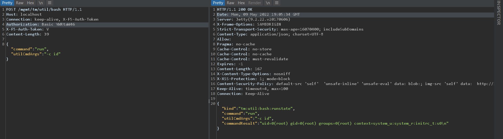
## 补丁
将Connection:keep-alive和Connection:close的请求头清除并且验证了X-F5-Auth-Token是否合法.
## 参考
https://www.horizon3.ai/f5-icontrol-rest-endpoint-authentication-bypass-technical-deep-dive/