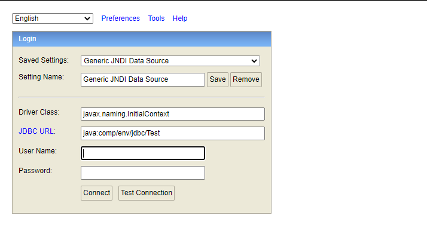
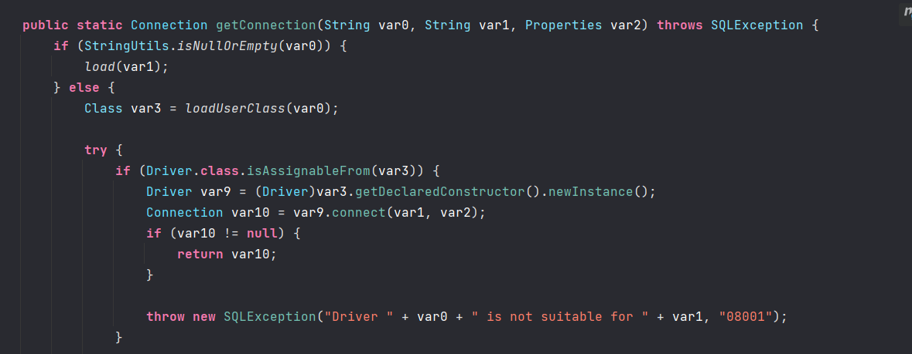
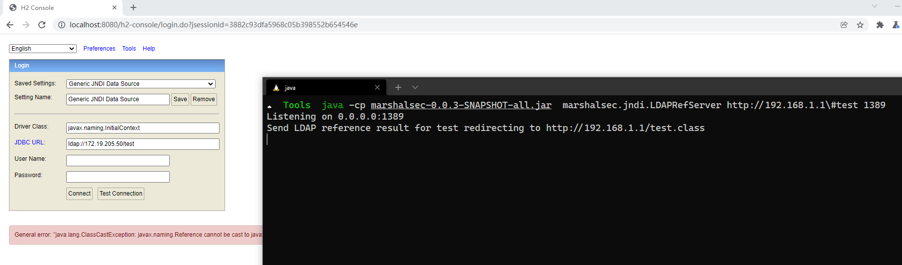

- [CVE-2021-42392 H2 console JNDI注入](#cve-2021-42392-h2-console-jndi注入)
  - [影响版本](#影响版本)
  - [原理分析](#原理分析)
  - [复现](#复现)
  - [修复方式](#修复方式)
# CVE-2021-42392 H2 console JNDI注入
## 影响版本
 1.1.100 <= Version<= 2.0.204 
## 原理分析
h2console在其登录页面支持从用户传入Driver和url参数进行JDBC连接,造成JNDI注入。 

h2数据库默认情况下控制台不可远程访问,只能本地localhost访问,但第三方系统在集成h2数据库时可能会手动开放h2控制台的访问权限。   

以SpringBoot集成h2数据库为例,添加h2依赖.
```xml
        <dependency>
            <groupId>com.h2database</groupId>
            <artifactId>h2</artifactId>
            <scope>runtime</scope>
            <version>1.4.199</version>
        </dependency>
```
在`application.properties`中开启h2console访问
```xml
spring.h2.console.enabled=true
```

访问控制台界面如下：


在`org\h2\util\JdbcUtils.class`中相关代码如下

## 复现

## 修复方式
从版本2.0.206开始,H2控制台明确禁止尝试为 JNDI 指定 LDAP URL.只能使用本地数据源.