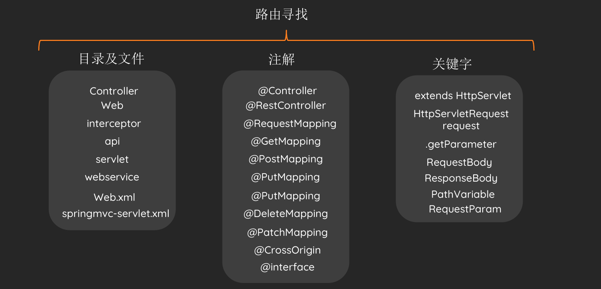
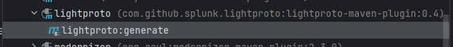

- [Java 代码审计](#java-代码审计)
  - [审计思路](#审计思路)
  - [常见配置文件](#常见配置文件)
    - [\*.tld](#tld)
    - [decorators.xml](#decoratorsxml)
    - [Proto文件](#proto文件)
      - [源码编译](#源码编译)
  - [常见利用类](#常见利用类)
    - [任意类实例化](#任意类实例化)
      - [SpringXmlContext](#springxmlcontext)
      - [scala.tools.nsc.interpreter.shell.ProcessResult](#scalatoolsnscinterpretershellprocessresult)
  - [参考](#参考)
# Java 代码审计
## 审计思路
1. 查看是否使用含有漏洞的组件
* 开源应用可以直接查看依赖配置文件(pom.xml)
* 闭源应用手动查看lib
2. 配置文件审计
* web.xml配置文件，查看特殊servlet
* xxx-config.xxx 配置中固定密钥等
3. 路由寻找
主要有三种方式，第一通过配置文件(web.xml，...)或者目录结构(controller，...)，第二通过注解(@Controller，@xxxMapping，...)，关键字(HttpServlet，RequestBody，...)
  
在Spring中，在`org.springframework.web.servlet.handler.AbstractHandlerMethodMapping#lookupHandlerMethod`下断点，可以获取到定义的所有路由。  
4. 权限校验Bypass。
5. 常规漏洞审计，敏感方法调用。
## 常见配置文件
JAVA项目中常见的配置文件
### *.tld
标签库描述文件，用于存放标签名字和类的映射用的.
标签库：它把类标签和后面的Java类映射起来，它减少了页面的代码，使页面更加的清晰，其实标签最后还是被解释成后台的java代码.
原理是，在用户在jsp页面中使用标签时，系统首先会先到xml文件中的<taglib>标签中的《taglib-uri》和《taglib-location》这两对标签找到相对应的扩展名为tld文件，然后在tld文件中的映射再找到相对应的taglib类。
创建的每个标签都必须在tld文件中声明，如果要在jsp页面用jsp的标签，必先先实现定义标签的类，然后在标签库描述文件（TLD）中将写好的类映射成jsp标签，然后在jsp页面中使用定义好的标签，然后就可以实现动态的jsp信息.
```xml
    <tag>
        <name>soy</name>
        <tag-class>xx.xx.xx.xx</tag-class>
        <body-content>JSP</body-content>
        <!-- <description>Call Soy from JSP</description> -->
        <attribute>
            <name>id</name>
            <required>false</required>
            <rtexprvalue>false</rtexprvalue>
        </attribute>
        <attribute>
            <name>moduleKey</name>
            <required>true</required>
            <rtexprvalue>false</rtexprvalue>
        </attribute>
        <attribute>
            <name>template</name>
            <required>true</required>
            <rtexprvalue>false</rtexprvalue>
        </attribute>
    </tag>
```
### decorators.xml
sitemesh应用Decorator模式的配置文件，使用filter来截取request和response,根据配置文件decorators.xmla来对指定页面进行修改后再返回给客户端.
在web.xml中添加如下filter
```xml
<filter> 
  <filter-name>sitemesh</filter-name> 
     <filter-class>com.opensymphony.module.sitemesh.filter.PageFilter</filter-class> 
  </filter> 
  <filter-mapping> 
     <filter-name>sitemesh</filter-name> 
     <url-pattern>/*</url-pattern> 
  </filter-mapping> 
```
新建decorators.xml如下
```xml
<decorators defaultdir="/decorators"> 
       <decorator name="main" page="main.jsp"> 
           <pattern>*</pattern> 
       </decorator> 
</decorators> 
```
这表示web路径下的所有页面都会被名为main的装饰器进行修改再返回给客户端,而main装饰器的定义则是main.jsp中,参考如下:
```jsp
<%@ page contentType="text/html; charset=GBK"%> 
<%@ taglib uri="http://www.opensymphony.com/sitemesh/decorator" prefix="decorator"%> <html> 
      <head> 
          <title><decorator:title default="装饰器页面..." /></title> 
          <decorator:head /> 
      </head> 
     <body> 
        sitemesh的例子<hr> 
        <decorator:body /> 
        <hr>
    </body> 
</html> 
```
`<decorator:title default="装饰器页面..." />`表示该处用原始响应中的title字段替换,`<decorator:body />`表示该处用原始响应中的body字段替换.
### Proto文件
#### 源码编译
先使用maven插件编译，会在target目录下生成对应的java源码，再将源码移动到对应的包路径下即可。  

  

  
## 常见利用类
### 任意类实例化
#### SpringXmlContext
#### scala.tools.nsc.interpreter.shell.ProcessResult

## 参考
https://www.gxlsystem.com/bianchengyuyan-772060.html  
《Hacking Springs.pdf-panda》