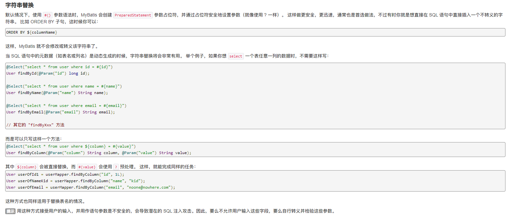
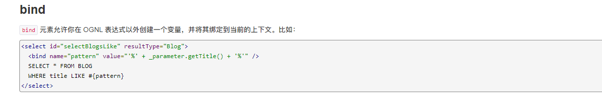

- [JAVA语言基础](#java语言基础)
  - [JAVA类加载](#java类加载)
    - [加载](#加载)
    - [验证](#验证)
    - [准备](#准备)
    - [解析](#解析)
    - [初始化](#初始化)
  - [类加载器](#类加载器)
    - [类的唯一性和类加载器](#类的唯一性和类加载器)
    - [双亲委派模型](#双亲委派模型)
  - [SercurityMannager](#sercuritymannager)
    - [启动SercurityMannager](#启动sercuritymannager)
    - [配置](#配置)
  - [反序列化](#反序列化)
    - [前置知识](#前置知识)
    - [JEP290](#jep290)
  - [反射](#反射)
    - [Class类](#class类)
    - [描述方法Method](#描述方法method)
    - [描述字段Field](#描述字段field)
    - [修改字段值](#修改字段值)
    - [描述构造器Constructor](#描述构造器constructor)
    - [描述注解Annotation](#描述注解annotation)
  - [Javassist](#javassist)
  - [JAVA代理机制](#java代理机制)
    - [动态代理类](#动态代理类)
    - [调用处理器(InvocationHanlder)](#调用处理器invocationhanlder)
    - [创建代理对象](#创建代理对象)
    - [EventHanlder](#eventhanlder)
  - [注解](#注解)
    - [内置注解](#内置注解)
    - [元注解](#元注解)
    - [自定义注解](#自定义注解)
    - [使用场景](#使用场景)
  - [接口](#接口)
    - [static](#static)
- [JAVA开发知识](#java开发知识)
  - [JDBC](#jdbc)
    - [Hibernate安全](#hibernate安全)
      - [Native SQL查询](#native-sql查询)
    - [Mybatis安全](#mybatis安全)
      - [字符串替换](#字符串替换)
      - [Bind支持OGNL](#bind支持ognl)
      - [动态SQL中的插入脚本语言](#动态sql中的插入脚本语言)
  - [OSGi模型](#osgi模型)
  - [参考](#参考)
# JAVA语言基础
## JAVA类加载
JAVA虚拟机把描述一个类的数据从class文件加载到内存中,对其进行校验,解析,初始化为一个可以被JAVA虚拟机使用的java类型即为类加载过程.

### 加载
1. 通过全限定类名来获取定义此类的二进制字节流。
2. 将这个字节流所代表的静态存储结构转化为方法区的运行时数据结构。
3. 在内存中生成一个代表这个类的 java.lang.Class 对象，作为方法区这个类的各种数据的访问入口。
### 验证
1. 文件格式验证:文件头为0xCAFEBABY,主次版本号是否与虚拟机符合.
2. 元数据校验:主要检测是否符合语言规范.
3. 字节码验证:确定程序执行逻辑正确合法.
4. 符号引用验证:验证是否可以把符号引用转化为直接引用.
   `-Xverify:none`开关可以关闭大部分验证措施来提高加载速度.
### 准备
为类变量分配内存和设置初始值.
### 解析
虚拟机将常量池内的符号引用替换为直接引用的过程。
解析动作主要针对类或接口、字段、类方法、接口方法、方法类型、方法句柄和调用点限定符 7 类符号引用进行。
### 初始化
此阶段是执行 <clinit>() 方法的过程。
<clinit>() 方法是由编译器按语句在源文件中出现的顺序，依次自动收集类中的所有类变量的赋值动作和静态代码块中的语句合并产生的。（不包括构造器中的语句。构造器是初始化对象的，类加载完成后，创建对象时候将调用的 <init>() 方法来初始化对象）
静态语句块中只能访问到定义在静态语句块之前的变量，定义在它之后的变量，在前面的静态语句块可以赋值，但是不能访问.

## 类加载器
把实现类加载阶段中的“通过一个类的全限定名来获取描述此类的二进制字节流”这个动作的代码模块称为"类加载器",将 class 文件二进制数据放入方法区内，然后在堆内（heap）创建一个 java.lang.Class 对象，Class 对象封装了类在方法区内的数据结构，并且向开发者提供了访问方法区内的数据结构的接口.

### 类的唯一性和类加载器

对于任意一个类，都需要由加载它的类加载器和这个类本身一同确立其在Java虚拟机中的唯一性.
即使两个类来源于同一个 Class 文件，被同一个虚拟机加载，只要加载它们的类加载器不同，那这两个类也不相等.
这里所指的“相等”，包括代表类的 Class 对象的 equals() 方法、 isAssignableFrom() 方法、isInstance() 方法的返回结果，也包括使用 instanceof 关键字做对象所属关系判定等情况.

### 双亲委派模型

如果一个类加载器收到了类加载的请求，它首先不会自己去尝试加载这个类，而是把这个请求委派给父类加载器去完成，每一个层次的类加载器都是如此，因此所有的加载请求最终都应该传送到顶层的启动类加载器中，只有当父加载器反馈自己无法完成这个加载请求（它的搜索范围中没有找到所需的类）时，子加载器才会尝试自己去加载。


1. Bootstrap 类加载器
   Bootstrap 类加载器是用 C++ 实现的，是虚拟机自身的一部分，如果获取它的对象，将会返回 null
2. 扩展类加载器和应用类加载器是独立于虚拟机外部，为 Java 语言实现的，均继承自抽象类 java.lang.ClassLoader ，开发者可直接使用这两个类加载器,Application 类加载器对象可以由 ClassLoader.getSystemClassLoader() 方法的返回，所以一般也称它为系统类加载器。它负责加载用户类路径（ClassPath）上所指定的类库，如果应用程序中没有自定义过自己的类加载器，一般情况下这个就是程序中默认的类加载器。

## SercurityMannager

JAVA安全管理器可以对运行的代码进行权限控制,即可以对读写,命令执行等类操作进行配置.

默认配置文件路径: $JAVA_HOME/jre/lib/security/java.policy,即当未指定配置文件时将会使用该配置.

### 启动SercurityMannager

1. 启动程序时通过附加参数启动(指定了配置文件)
   `-Djava.security.manage-Djava.security.policy="E:/java.policy"`
2. 编码方式启动

```java
System.setSecurityManager(new SecurityManager());
```

### 配置

示例配置文件:

```
// Standard extensions get all permissions by default

grant codeBase "file:${{java.ext.dirs}}/*" {
    permission java.security.AllPermission;
};

// default permissions granted to all domains

grant { 
    // Allows any thread to stop itself using the java.lang.Thread.stop()
    // method that takes no argument.
    // Note that this permission is granted by default only to remain
    // backwards compatible.
    // It is strongly recommended that you either remove this permission
    // from this policy file or further restrict it to code sources
    // that you specify, because Thread.stop() is potentially unsafe.
    // See the API specification of java.lang.Thread.stop() for more
        // information.
    permission java.lang.RuntimePermission "stopThread";

    // allows anyone to listen on un-privileged ports
    permission java.net.SocketPermission "localhost:1024-", "listen";

    // "standard" properies that can be read by anyone

    permission java.util.PropertyPermission "java.version", "read";
    permission java.util.PropertyPermission "java.vendor", "read";
    permission java.util.PropertyPermission "java.vendor.url", "read";
    permission java.util.PropertyPermission "java.class.version", "read";
    permission java.util.PropertyPermission "os.name", "read";
    permission java.util.PropertyPermission "os.version", "read";
    permission java.util.PropertyPermission "os.arch", "read";
    permission java.util.PropertyPermission "file.separator", "read";
    permission java.util.PropertyPermission "path.separator", "read";
    permission java.util.PropertyPermission "line.separator", "read";

    permission java.util.PropertyPermission "java.specification.version", "read";
    permission java.util.PropertyPermission "java.specification.vendor", "read";
    permission java.util.PropertyPermission "java.specification.name", "read";

    permission java.util.PropertyPermission "java.vm.specification.version", "read";
    permission java.util.PropertyPermission "java.vm.specification.vendor", "read";
    permission java.util.PropertyPermission "java.vm.specification.name", "read";
    permission java.util.PropertyPermission "java.vm.version", "read";
    permission java.util.PropertyPermission "java.vm.vendor", "read";
    permission java.util.PropertyPermission "java.vm.name", "read";
};
```

directory/ 表示directory目录下的所有.class文件，不包括.jar文件
directory/* 表示directory目录下的所有的.class及.jar文件
directory/- 表示directory目录下的所有的.class及.jar文件，包括子目录

## 反序列化

### 前置知识

* 反序列化的类必须要显示声明**Serializable**接口.
* 反序列化数据的特征:前四个字节为`0xaced(Magic Number)0005(Version).
### JEP290

## 反射

反射可以在程序运行时来动态修改Java代码,在运行状态中，对于任意一个类，都能够知道这个类的所有属性和方法；对于任意一个对象，都能够调用它的任意一个方法和属性，这种动态获取的信息以及动态调用对象的方法的功能称为Java语言的反射机制。

### Class类

Class也是一个类，只是它是一个描述类的类，也可以生成对象.在程序运行时,对于每个类而言，在JRE中有且仅有一个不变的Class类型的对象，而这个Class类型的对象只能由系统建立，封装了当前对象所对应的类的信息，有哪些属性、方法、构造器以及实现了哪些接口等.
获取Class对象的三种方式:

1. 通过类名获取，类名.class。
2. 通过对象获取，对象.getClass()。
3. 通过全类名获取，Class.forName（全类名）。

Class类常用方法:


### 描述方法Method

描述方法主要是4个获取方法（getMethods、getMethod、getDeclaredMethods、getDeclaredMethod）和1个调用方法（invoke）。

* getMethods：获取clazz对应类中的所有方法，不能获取private方法，且获取从父类继承来的所有方法，包括私有父类的私有方法。
* getMethod：获取clazz对应类中指定方法名和参数类型的方法，不能获取private方法，且获取从父类继承来的所有方法，包括私有父类的私有方法。因为存在同方法名不同参数这种情况，所以只有同时指定方法名和参数类型才能唯一确定一个方法。
* getDeclaredMethods：获取所有方法，包括私有方法，所有声明的方法，都可以获取到，且只获取当前类的方法。
* getDeclaredMethod：获取clazz对应类中指定方法名和参数类型的方法，包括私有方法，所有声明的方法，都可以获取到，且只获取当前类的方法。
* invoke：执行方法，第一个参数表示执行哪个对象的方法，剩下的参数是执行方法时需要传入的参数，私有方法的执行必须在调用invoke之前加上一句“method.setAccessible(true);”。

### 描述字段Field

四个获取字段的方法（getFields、getField、getDeclaredFields、getDeclaredField）。

* getFields：获得某个类的所有公共（public）字段，包括父类中的字段。
* getField：获取某个类public成员变量中指定变量名的字段，包括基类。
* getDeclaredFields：获得某个类所有声明的字段，包括public、private和protected，但是不包括父类的声明字段。
* getDeclaredField：获取某个类的所有成员变量指定变量名的字段，不包括基类。

### 修改字段值

如果字段是私有的，那么不管是读值还是写值，都必须先调用setAccessible(true)方法.

### 描述构造器Constructor

getConstructors、getDeclaredConstructors、getConstructor、getDeclaredConstructor。

* getConstructors：获取对应类中public类型的构造函数，且只获取当前类的构造函数。
* getConstructor：获取对应类中public指定参数类型的构造函数，且只获取当前类的构造函数。
* getDeclaredConstructors：获取对应类中所有构造函数，包括私有构造函数，且只获取当前类的构造函数。
* getDeclaredConstructor：获取对应类中指定参数类型的方法，包括私有构造函数，且只获取当前类的方法。

### 描述注解Annotation

描述注解主要用到getAnnotation(Class<A> annotationClass)方法，返回该元素指定类型的注解，否则返回null。

## Javassist

Javassist是一个用来处理Java字节码的类库.

```java
    public static void main(String[] args) throws Exception{
            ClassPool pool = ClassPool.getDefault();
            CtClass cc = pool.makeClass("poctest");
            cc.setSuperclass((pool.get(AbstractTranslet.class.getName())));
            CtConstructor cons = new CtConstructor(new CtClass[]{},cc);
            cons.setBody("{ Runtime.getRuntime().exec(\"calc.exe\");}");
            cc.addConstructor(cons);
            byte[] bytecodes=cc.toBytecode();
```

## JAVA代理机制

### 动态代理类

代理类可以在运行时创建全新的类,能够实现指定的接口,具有以下方法:

* 指定接口所需要的全部方法.
* Object类的全部方法(toString,equals).

### 调用处理器(InvocationHanlder)

调用处理器是实现了`InvocationHandlder`接口的类对象,该接口只有一个`invoke`方法,无论何时调用代理对象的方法,调用处理器的`invoke`方法都会被调用,并向其传递Method对象和原始的调用参数.

```java
Object invoke(Object proxy,Method method,Object[] args)
```

### 创建代理对象

使用`Proxy`类的`newProxyInstance`方法创建代理对象.

```java
public static Object newProxyInstance(ClassLoader loader,Class<?>[] interfaces,InvocationHandler h)
```

Demo:

```java
import java.lang.reflect.InvocationHandler;
import java.lang.reflect.InvocationTargetException;
import java.lang.reflect.Method;
import java.lang.reflect.Proxy;

public class Handler {

    public static void main(String[] args) {
        realperson test = new realperson();
        InvocationHandler handler = new personone(test);
        person person = (person)(Proxy.newProxyInstance(handler.getClass().getClassLoader(),test.getClass().getInterfaces(),handler));
        System.out.println(person.getClass().getName());
        person.execute();
        person.sucess();
        }
    }
    interface person{
        void execute();
        void sucess();
    }
    class realperson implements person{
        public void execute(){
            System.out.println("exec");
        }
        public void sucess()
        {
            System.out.println("sucess");
        }
    }
    class personone implements InvocationHandler {
        private Object person;
        personone(Object person){
            this.person = person;
        }
        public Object invoke(Object object, Method method, Object[] args) throws InvocationTargetException, IllegalAccessException {
                System.out.println("Invoke call");
                method.invoke(person,args);
                return null;
        }
}

```

结果

```
Invoke call 1
exec
Invoke call 2
Invoke call 1
sucess
Invoke call 2
```

### EventHanlder

EventHandler是一个内置的实现了InvocationHandler的动态代理类,EventHanlder能够监控接口中的方法被调用了之后执行EventHanlder中成员的变量和方法.

## 注解

注解即把元数据和程序元素进行关联的机制1,不影响实际代码的逻辑,包含在java.lang.annotation包内.

### 内置注解

* @Deprecated:编译器遇到该注解时会提醒这是一个过时的元素.
* @Override: 提示要复写父类的方法.
* @SuppressWarnings: 阻止警告,即忽略如@Deprecated产生的警告.
* @SafeVarargs: 参数安全类型注解。它的目的是提醒开发者不要用参数做一些不安全的操作，它的存在会阻止编译器产生unchecked这样的警告。
* @FunctionalInterface：函数式接口注解，函数式接口（FunctionalInterface）就是一个具有一个方法的普通接口。

### 元注解

元注解负责注解自定义注解。java.lang.annotation提供了5种元注解，专门注解其他的注解

* @Retention：什么时候使用该注解。
* @Target：注解用于什么地方。
* @Documented：注解是否将包含在JavaDoc中。
* @Inherited：是否允许子类继承该注解。
* @Repeatable：指定注解可重复使用。

### 自定义注解

自定义注解时是有一些规则限制的，具体如下：

* Annotation型定义为@interface，所有的Annotation会自动继承java.lang.Annotation这一接口，并且不能再去继承别的类或是接口。
* 参数成员只能用public或默认（default）这两个访问权修饰。
* 参数成员只能用基本类型byte、short、char、int、long、float、double、boolean八种基本数据类型和String、Enum、Class、annotations等数据类型，以及这一些类型的数组.
* 要获取类方法和字段的注解信息，必须通过Java的反射技术来获取Annotation对象，因为除此之外没有其他获取注解对象的方法。
* 注解也可以没有定义成员。

### 使用场景

1. 使用注解做bean的属性值校验，例如在开发Java服务器端代码时，会要求对外部传来的参数合法性进行验证。hibernate-validator提供了一些常用的参数校验注解。
2. 使用注解做权限控制。例如，shiro框架中有5个权限注解，我们也可以自定义注解进行权限控制.
3. 代替配置文件功能，像Spring基于注解的配置，减少了xml的配置
4. 可以生成文档，像Java代码注释中的@see、@param等。

## 接口
### static
接口中可以定义static方法和default方法,static方法不会被实现类和子类基础,只能通过直接引用接口调用。
```java
public interface sta {
	static void show(){
		System.out.println("interface static method");
	}
}
//
public class test implements sta {

	public static void main(String[] args) {
		test test =new test();
		sta.show();
	}
}
```
# JAVA开发知识
## JDBC
### Hibernate安全
官方文档:https://hibernate.net.cn/column/1.html
#### Native SQL查询
原生SQL查询,通过执行Session.createSQLQuery()获取这个接口.
原生查询支持位置参数和命名参数：
```JAVA
Query query = sess.createSQLQuery("SELECT * FROM CATS WHERE NAME like ?").addEntity(Cat.class);
List pusList = query.setString(0, "Pus%").list();
     
query = sess.createSQLQuery("SELECT * FROM CATS WHERE NAME like :name").addEntity(Cat.class);
List pusList = query.setString("name", "Pus%").list(); 
```
### Mybatis安全
Mybatis文档
https://mybatis.org/mybatis-3/zh/index.html
#### 字符串替换

#### Bind支持OGNL

#### 动态SQL中的插入脚本语言

支持Apache Velocity作为动态语言
http://mybatis.org/velocity-scripting/
## OSGi模型
https://blog.csdn.net/qq_27298687/article/details/73565191
https://www.cnblogs.com/jingmoxukong/p/4546947.html
https://www.jianshu.com/p/5406b2473157
## 参考
https://www.cnblogs.com/czwbig/p/11127222.html
https://www.cnblogs.com/-zhong/p/14961183.html
https://www.cnblogs.com/jingmoxukong/p/4546947.html
<<Spring快速入门>>
