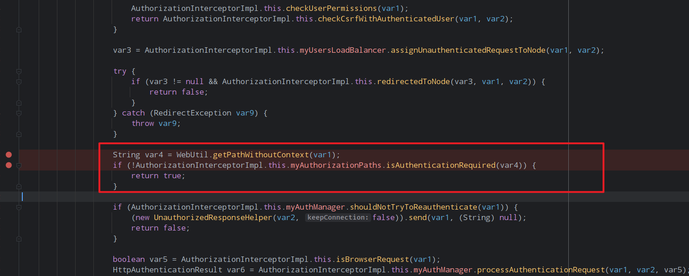
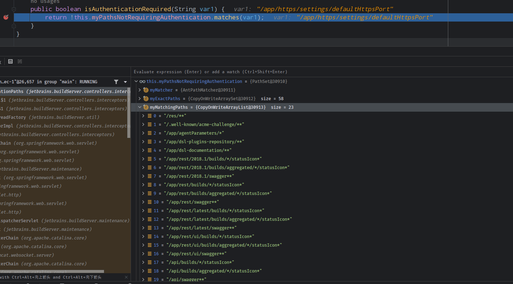
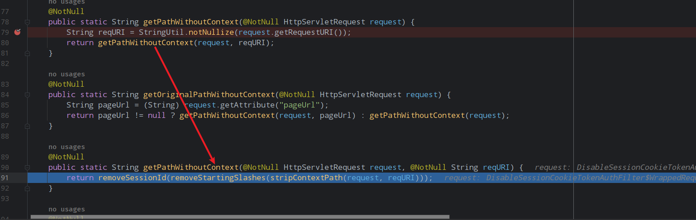
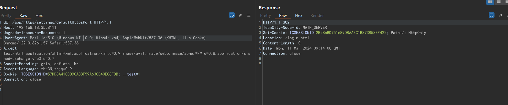
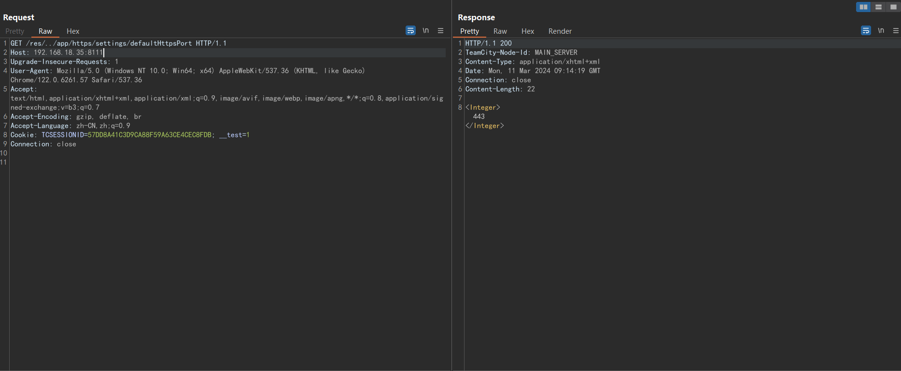
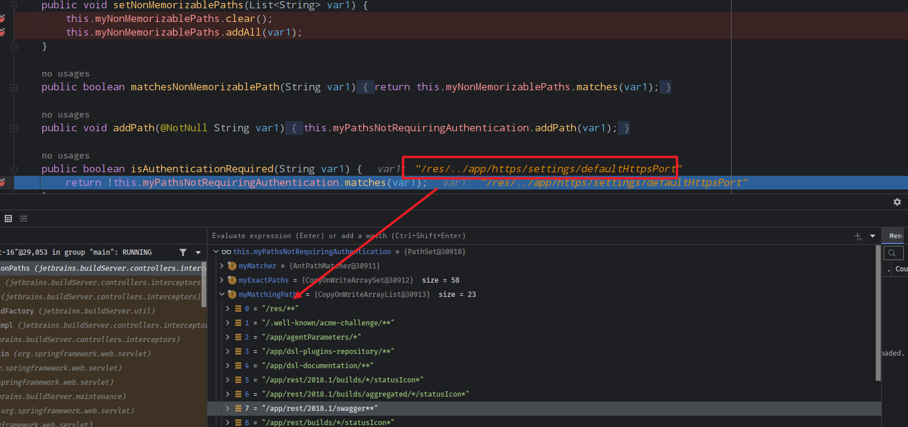

- [JetBrains TeamCity 身份验证绕过漏洞(CVE-2024-27199)](#jetbrains-teamcity-身份验证绕过漏洞cve-2024-27199)
  - [影响版本](#影响版本)
  - [环境搭建](#环境搭建)
  - [漏洞原理](#漏洞原理)
    - [认证逻辑](#认证逻辑)
  - [漏洞补丁](#漏洞补丁)
  - [参考](#参考)

# JetBrains TeamCity 身份验证绕过漏洞(CVE-2024-27199)
## 影响版本
< 2023.11.4
## 环境搭建
https://download-cdn.jetbrains.com.cn/teamcity/TeamCity-2023.11.3.exe  
>DEBUG: 修改bin目录teamcity-server-internal.bat中

## 漏洞原理
### 认证逻辑
JetBrains TeamCity对于判断请求是否需要认证的逻辑实现位于`web-core.jar!\jetbrains\buildServer\controllers\interceptors\AuthorizationInterceptorImpl.class`中,通过拦截器实现,其中主要关注以下两行代码。  
  
这里从请求中获取的请求路径,然后通过`isAuthenticationRequired`方法判断是否是要认证,当方法返回false即判定不需要认证时则直接返回true,不进行后续处理。  
来到isAuthenticationRequired方法中,其判断的逻辑也很简单,应用内置了一份不需要认证的路径白名单,将请求的路径和白名单元素进行匹配来判断是否需要认证。  
  
而关键在于请求路径的获取,请求路径是从`WebUtil.getPathWithoutContext(var1);`方法中取得,来到`getPathWithoutContext`方法,
  
其进行处理的原始URL是通过`request.getRequestURI()`获取,得到的URI是未经归一化处理的原始URI,然后后续对该URI如果设置contextPath的话删除contextPath,删除多余的`/`和sessidId后将URI直接返回,这里可以看到用于判断认证的URI其实是未经安全过滤处理的原始URI,通过在白名单路径后加入`../`即可通过绕过认证校验访问到后端接口。
以访问`/app/https/settings/defaultHttpsPort`接口为例。
  

  

  

但无法访问controller的接口,因为controller里面会找不到对应的ModelView,只能访问jsp文件得到敏感信息和一些servlet接口,在参考文章中是可以利用一个上传https配置的接口可以进行DOS攻击。
## 漏洞补丁
更新后的版本中并没有对漏洞逻辑进行修改,增加了一些黑名单校验的东西(补丁都是混淆的),使用原来的poc会直接返回403 Access denied.
## 参考
https://www.rapid7.com/blog/post/2024/03/04/etr-cve-2024-27198-and-cve-2024-27199-jetbrains-teamcity-multiple-authentication-bypass-vulnerabilities-fixed/