- [CVE-2019-11581 未授权模板注入](#cve-2019-11581-未授权模板注入)
  - [影响版本](#影响版本)
  - [原理分析](#原理分析)
    - [EmailBuilder#withSubject()](#emailbuilderwithsubject)
    - [EmailRenderer#renderEmailSubject](#emailrendererrenderemailsubject)
      - [DefaultVelocityTemplatingEngine#toWriterImpl](#defaultvelocitytemplatingenginetowriterimpl)
      - [DefaultVelocityManager#writeEncodedBodyForContent](#defaultvelocitymanagerwriteencodedbodyforcontent)
      - [VelocityEngine#evaluate](#velocityengineevaluate)
    - [POC](#poc)
      - [未授权RCE](#未授权rce)
      - [管理员登录RCE](#管理员登录rce)
  - [补丁](#补丁)
  - [参考](#参考)
# CVE-2019-11581 未授权模板注入
漏洞原因是由于Jira在发送邮件时使用`velocity`模板引擎对邮件进行渲染时使用了`evaluate`指令来动态解析`Subject`主题属性,而该属性为用户可控输入导致了模板注入.
## 影响版本
4.4.x
5.x.x
6.x.x
7.0.x
7.1.x
7.2.x
7.3.x
7.4.x
7.5.x
7.6.x before 7.6.14 (the fixed version for 7.6.x)
7.7.x
7.8.x
7.9.x
7.10.x
7.11.x
7.12.x
7.13.x before 7.13.5 (the fixed version for 7.13.x)
8.0.x before 8.0.3 (the fixed version for 8.0.x)
8.1.x before 8.1.2 (the fixed version for 8.1.x)
8.2.x before 8.2.3 (the fixed version for 8.2.x)
## 原理分析

### EmailBuilder#withSubject()
Jira通过EmailBuilder来生成邮件,生成代码如下  
```java
EmailBuilder builder = (new EmailBuilder(email, this.getMimeType(), this.getLocale())).withSubject(this.getSubject()).withBodyFromFile(this.getBodyTemplatePath()).addParameters(this.getContextParams());
```
其中`withSubject(this.getSubject())`用来设置邮件主题属性,相关代码如下,将`EmailBuilder`的subjectTemplate属性设置为我们输入的subject字段内容.

```java
    public String getSubject() {
        return this.subject;
    }

    public void setSubject(String subject) {
        this.subject = subject;
    }
    public EmailBuilder withSubject(String subjectTemplate) {
        this.subjectTemplate = TemplateSources.fragment(subjectTemplate);
        return this;
    }
```
### EmailRenderer#renderEmailSubject
Jira生成邮件后,在发送前还会对邮件进行渲染,相关代码在`com/atlassian/jira/mail/builder/EmailRenderer.class`中.
其中有一个`renderEmailSubject`方法用于渲染邮件subject,相关代码如下
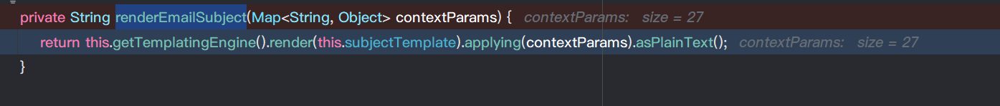
其中调用`getTemplatingEngine()`来获取到默认的`velocity`模板引擎. ,然后调用`render`方法其中传入的`this.subjectTemplate`为主题模板参数,而该值即是上面生成`EmailBuilder`对象时我们可控的`subject`属性,其为一个Fragment对象,`applying`则是将邮件的参数Map赋值给模板的`VelocityContext`,这时其中而在最后的`asPlainText()`一路跟进会来到`DefaultVelocityTemplatingEngine.class`的`asPlainText`中,在其中调用`toWriterImpl`.
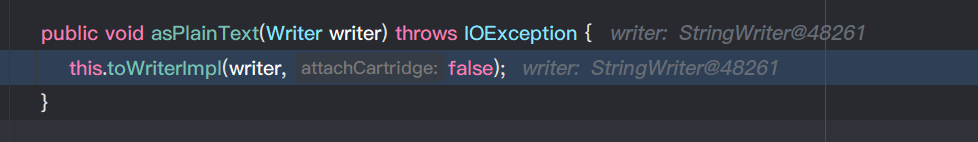
#### DefaultVelocityTemplatingEngine#toWriterImpl
在`toWriteImpl`中有一个判断,根据`this.source`的类型不同进入不同的分支,而此时的`this.source`为`Fragment`类型,则最后会调用`writeEncodedBodyForContent`,并将`this.source`作为第二个参数传入
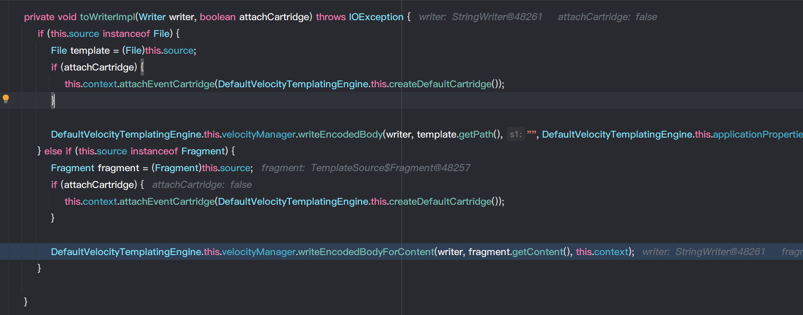
#### DefaultVelocityManager#writeEncodedBodyForContent
在`writeEncodedBodyForContent`中,则会调用`  this.getVe().evaluate(context, writer, "getEncodedBodyFromContent", contentFragment);`,其中`contentFragment`为`EmailBuilder`的`subject`属性.
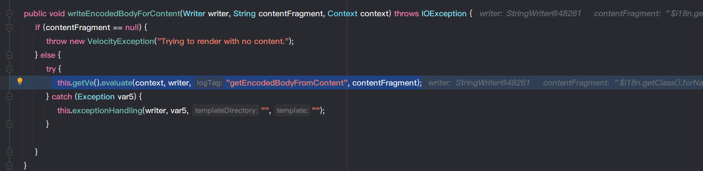
#### VelocityEngine#evaluate
而`Velocity`模板的`evaluate`方法用于动态解析字符串,其最后会生成一个SimpleNode,调用其`render`方法生成AST树,反射执行输入的字符串.
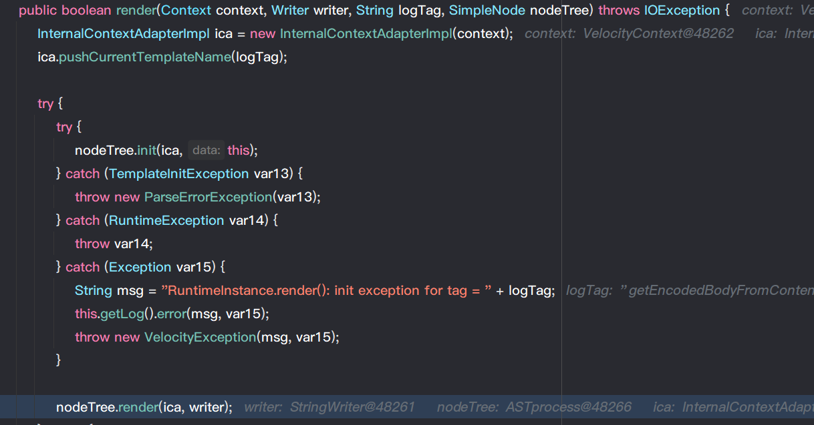


流程调用栈如下:
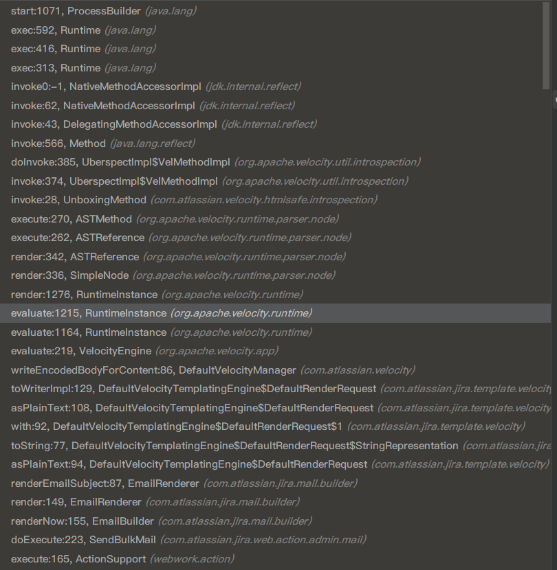
### POC
在Jira中发送邮件一共有两个地方,一个用户联系管理员,另一个是Jira管理员在后台可以向用户发送邮件,其中第一种为未授权即可访问,第二种需要管理员账号密码,同时需要配置SMTP服务器,随便配即可,注入在发送之前就已经发送了,只是未配置SMTP的话无法进入邮件渲染的流程.
#### 未授权RCE
需要管理员开启联系管理员表单功能,有时候会有延迟,因为生成邮件后会先加入队列等待发送,在发送时才会进行渲染触发RCE.
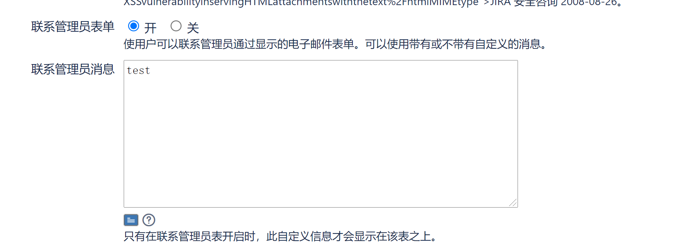
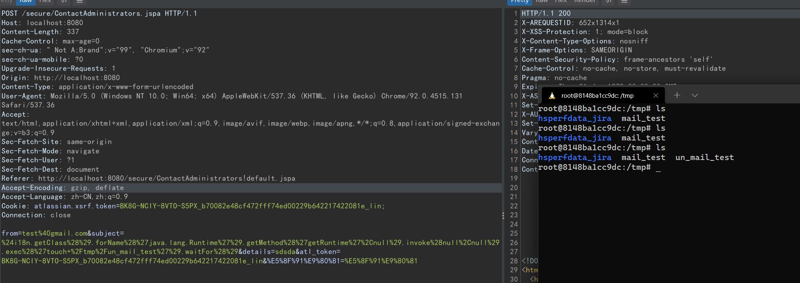
该入口点有前面区别,区别在于生成邮件对象后会先加入一个队列等待发送,然后通过`send`进入`renderEmailSubject`,后续流程一样,调用栈如下:
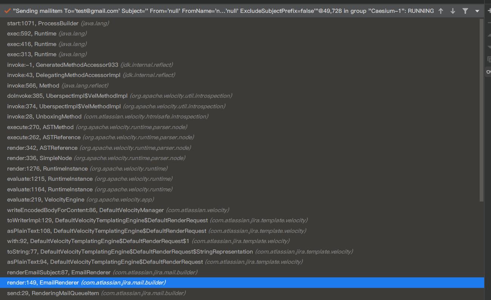
#### 管理员登录RCE
需要管理员账号登录后随便配置一个SMTP服务器后,发送电邮,在主题字段插入payload即可.
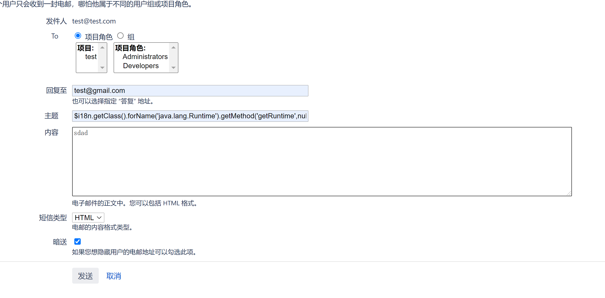
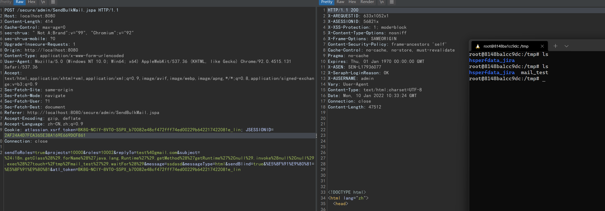
## 补丁
将subjectTemplate设置为硬编码的模板$subject,并没有将用户传入的payload直接传入withSubject方法中,动态解析的参数不再可控.
## 参考
https://paper.seebug.org/982/#_2  
https://caiqiqi.github.io/2019/11/03/Jira%E6%9C%AA%E6%8E%88%E6%9D%83%E6%9C%8D%E5%8A%A1%E7%AB%AF%E6%A8%A1%E6%9D%BF%E6%B3%A8%E5%85%A5%E6%BC%8F%E6%B4%9E-CVE-2019-11581/  
https://mp.weixin.qq.com/s/d2yvSyRZXpZrPcAkMqArsw  
https://github.com/PetrusViet/CVE-2019-11581