- [CVE-2021-39115 模板注入](#cve-2021-39115-模板注入)
  - [影响版本](#影响版本)
  - [原理分析](#原理分析)
    - [Jirautils#loadComponent](#jirautilsloadcomponent)
    - [绕过Jira内置黑名单](#绕过jira内置黑名单)
    - [SpelExpressionParser](#spelexpressionparser)
  - [POC](#poc)
  - [参考](#参考)
# CVE-2021-39115 模板注入
漏洞原因在于新版JIRA提供的自定义邮件模板功能,邮件模板中的代码被`Velocity`模板引擎解析时可以解析Jira的内置`jirautils`标签,而该类中有一个`LoadComponent`方法来自定义加载类,利用该方法来加载Spring框架的SPEL表达式,从而利用SPEL表达式注入造成RCE.

根据官方补丁是将
```
ComponentAccessor.getComponentClassManager() 
ComponentClassManager.newInstance(String className)  
SpelExpressionParser
```
这三个类加入了黑名单,这三个类串起来可以到达最后的SPEL表达式注入,但不知道入口点`ComponentAccessor`怎么获得,但根据[参考](https://github.com/PetrusViet/CVE-2021-39115)也可以其实只需要`Jirautils#loadComponent`就可以直接到达SPEL表达式注入点.  
## 影响版本
Atlassian Jira Service Management Server and Data Center 
* version < 4.13.9
* 4.14.0 ≤ version < 4.18.0

Jira Software
 * version < 8.13.9
 * 8.14.0 ≤ version < 8.18.0
## 原理分析
### Jirautils#loadComponent
前面Jira调用`Velocity`模板引擎前的数据处理流程可参考`CVE-2019-11581`.

Jira在使用`Velocity`模板引擎进行渲染时会将所有标签放入一个`VelocityContext`对象中,其中的`CompositeMap`对象存储了模板中各个标签对应的值.
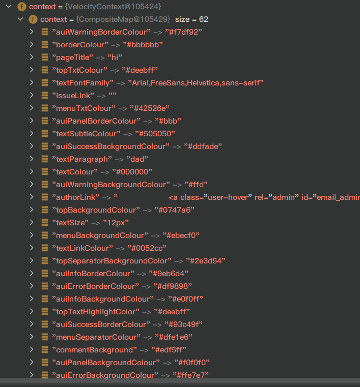  

然后再生成一个Nodetree调用`Velocity`模板引擎`render()`渲染模板.
而在`CompositeMap`中有一个解析的标签为`Jirautils`,其相关类代码位于`com/atlassian/jira/util/JiraUtils.class`中.
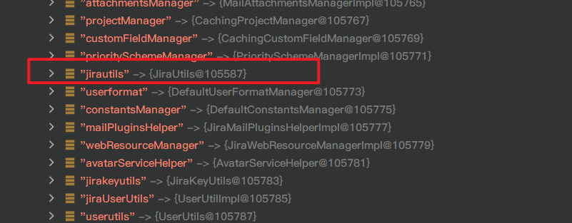
其中有一个方法为`loadComponent`如下  

根据官方文档,该方法可以加载和构造一个类.
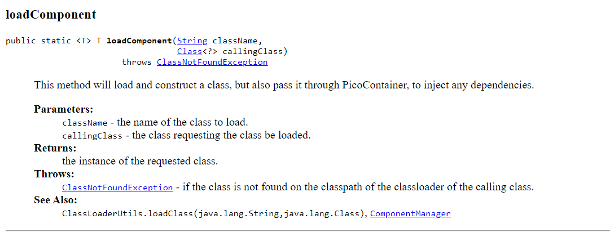
也就是说现在可以加载任意类.
### 绕过Jira内置黑名单
但Jira其实内置了一个包名和类名黑名单,位于`velocity.properties`中,如下
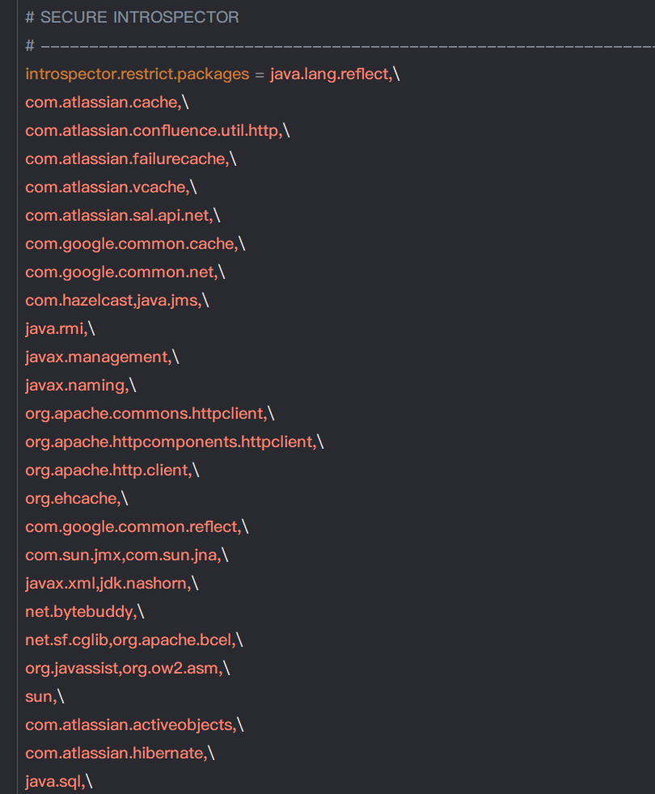  


所以其实需要找到一个在黑名单之外可利用的类.
### SpelExpressionParser
在Jira的依赖包中引入了`spring-expression-5.1.18.RELEASE.jar`,也就是Spring框架的SPEL支持,而SPEL表达式注入相关的类并未在黑名单中,所以可以利用`loadComponent`方法来加载一个`SpelExpressionParser`类,再利用其`parseRaw().getValue()`方法进行SPEL注入RCE.
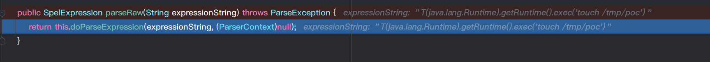
## POC
在后台邮件模板处下载一份邮件模板,修改`email\html\includes\header.vm`模板,因为这个是邮件头的模板,发送邮件时都会加载此模板.

根据`Velocity`模板官方文档,相关语法说明如下:

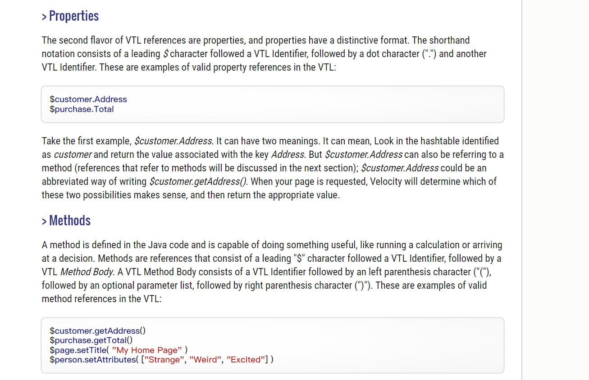
通过`#set`指令设置新建SPEL表达式对象,然后调用其parseRaw().getValue()即可.  

最后payload如下:
```
#set($SpelExpressionParser = $jirautils.loadComponent('org.springframework.expression.spel.standard.SpelExpressionParser',$i18n.getClass()))
$SpelExpressionParser.parseRaw("T(java.lang.Runtime).getRuntime().exec('touch /tmp/poc')").getValue()
```
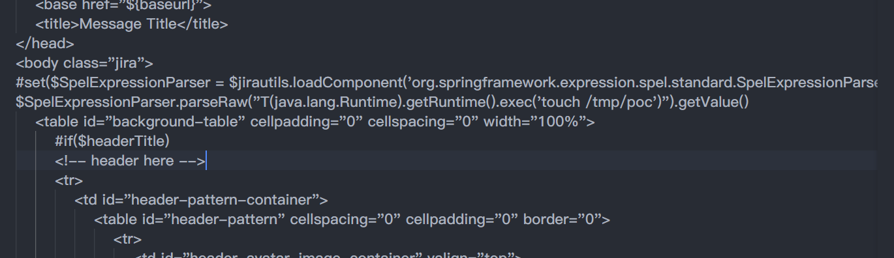

然后再打包为zip后上传覆盖原模版.
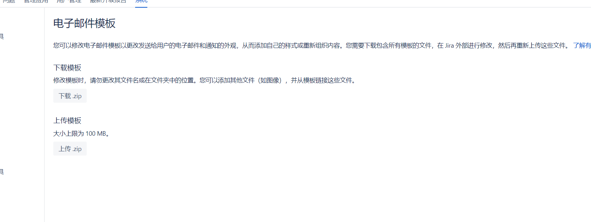
测试发送邮件
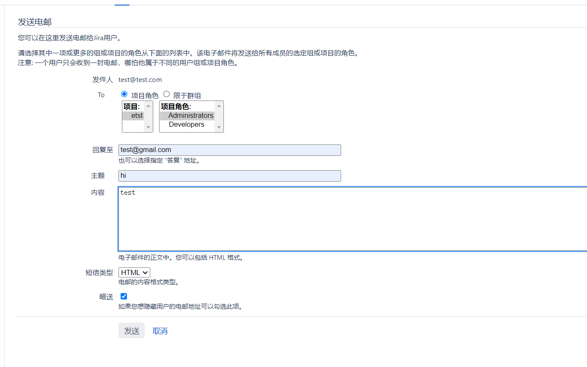

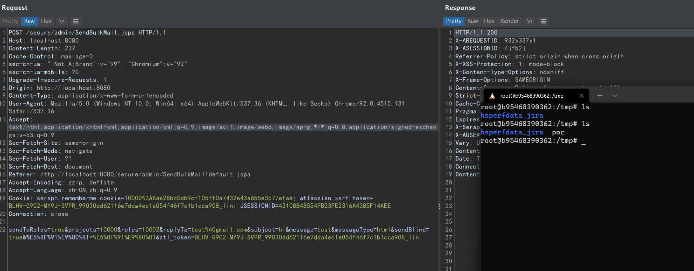

调用栈如下:
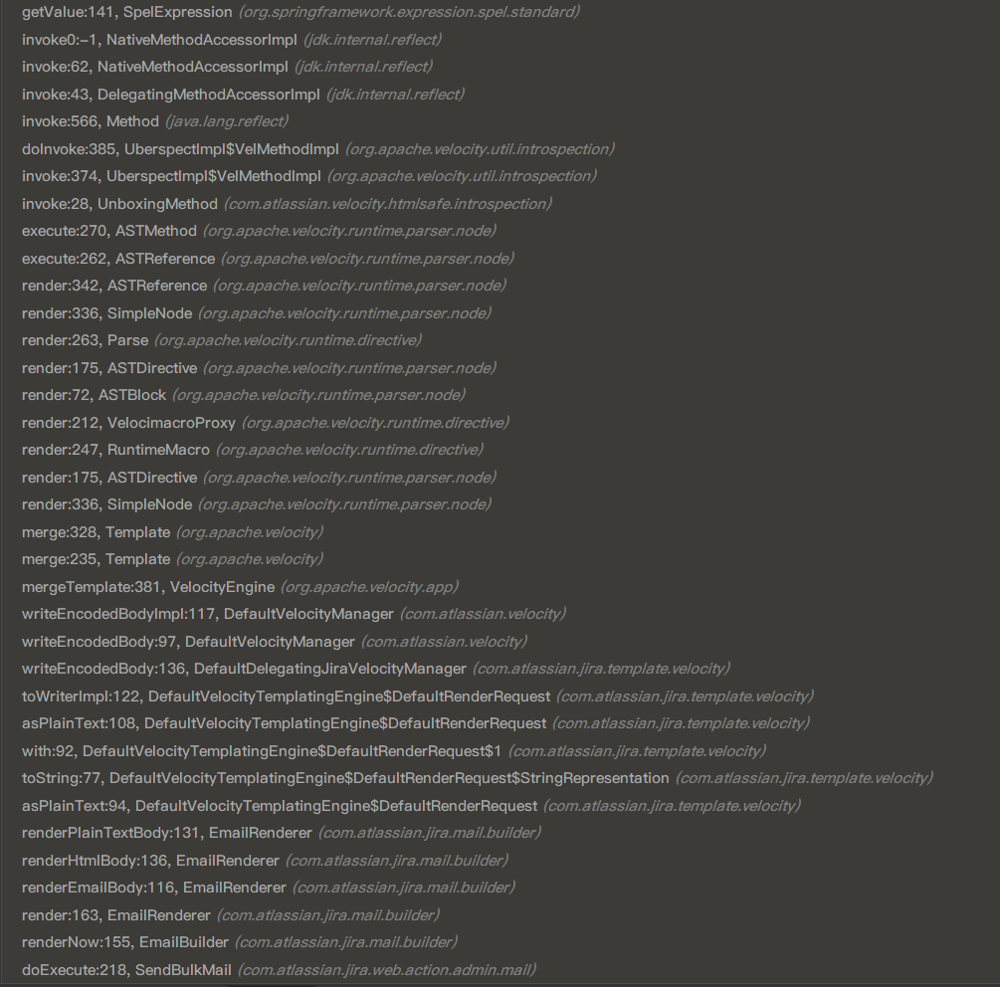
## 参考
https://github.com/PetrusViet/CVE-2021-39115  
https://jira.atlassian.com/browse/JSDSERVER-8665  
https://velocity.apache.org/engine/devel/user-guide.html

