- [CVE-2022-0540 Authentication bypass in Seraph](#cve-2022-0540-authentication-bypass-in-seraph)
  - [影响版本](#影响版本)
  - [环境搭建](#环境搭建)
  - [原理分析](#原理分析)
    - [Seraph](#seraph)
      - [JiraPathService](#jirapathservice)
      - [WebWorkService](#webworkservice)
      - [JiraSeraphSecurityService](#jiraseraphsecurityservice)
    - [webwork dispatcher](#webwork-dispatcher)
    - [Bypass Serpah](#bypass-serpah)
    - [LookupAliasActionFactoryProxy](#lookupaliasactionfactoryproxy)
    - [Bypass LookupAliasActionFactoryProxy](#bypass-lookupaliasactionfactoryproxy)
  - [漏洞复现](#漏洞复现)
  - [参考](#参考)
# CVE-2022-0540 Authentication bypass in Seraph

## 影响版本
```
All versions before 8.13.18
8.14.x
8.15.x
8.16.x
8.17.x
8.18.x
8.19.x
8.20.x before 8.20.6
8.21.x
```
## 环境搭建
`docker run --name="jira" -d -e JVM_SUPPORT_RECOMMENDED_ARGS="-Xdebug -Xrunjdwp:transport=dt_socket,server=y,suspend=n,address=*:5005" -p 8080:8080 -p 5005:5005 atlassian/jira-software:8.13.17-ubuntu-jdk11`
## 原理分析
### Seraph
首先在jira中的整个请求的处理流程如下  
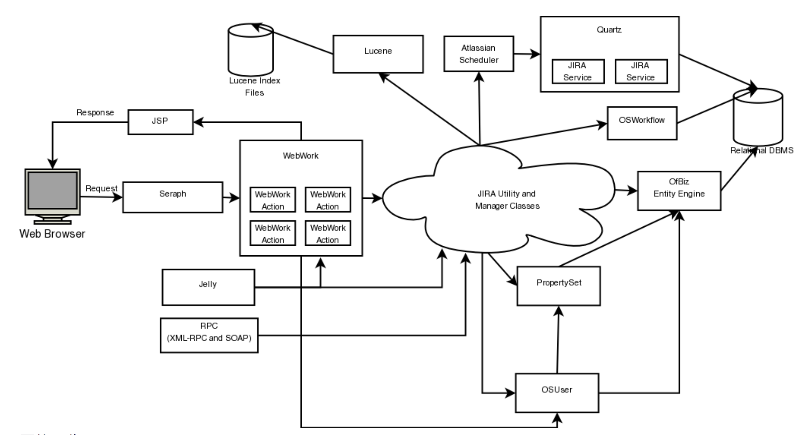  
可以看到当请求到达时首先进行的就是Seraph模块进行处理.  
而在官方文档可以看到Seraph模板几乎负责了所有的认证操作. 
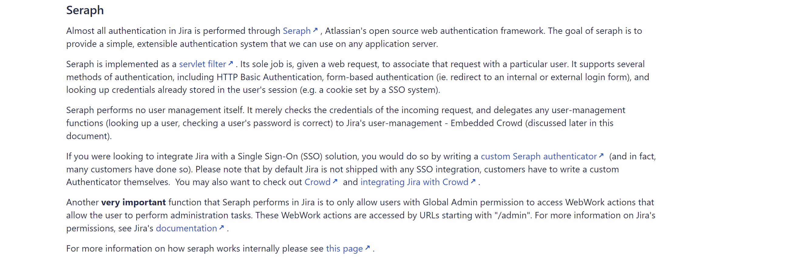  
从Seraph文档(https://docs.atlassian.com/atlassian-seraph/2.6.1-m1/services.html)中可以看到`Seraph`自带了两种安全服务分别为`Path Service`和`WebWork Service`.   
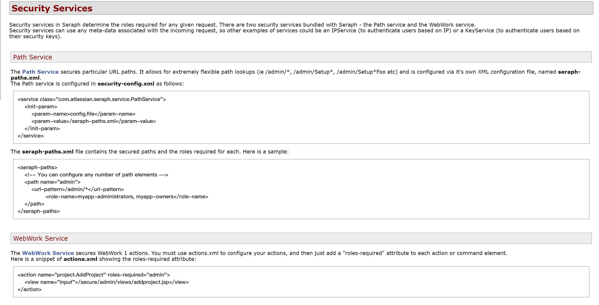   

从文档可以得到两者的区别  

`Path Service`:根据请求路径不同来决定请求该路径所需要的权限类型.  
`WebWork Service`:根据actions.xml配置文件中每个action的roles-required属性决定请求该action所需要的权限类型.  
在Jira中Seraph模块进行过滤的地方位于`WEB-INF/classes/com/atlassian/jira/security/JiraSecurityFilter.class#doFilter`中,其调用父类的doFilter方法.  
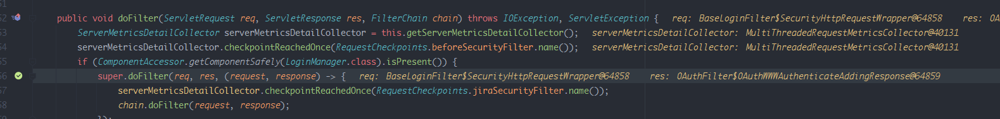  
来到其父类`com/atlassian/seraph/filter/SecurityFilter.class`中代码如下  
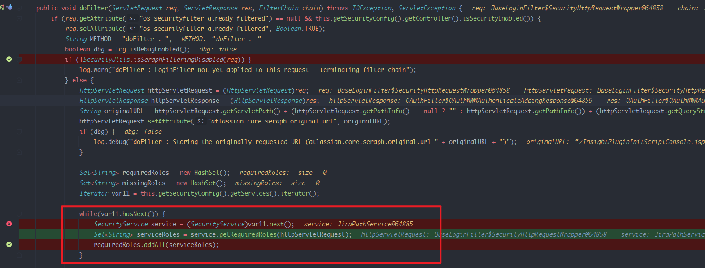  
其从配置中得到所有的Service类型.  
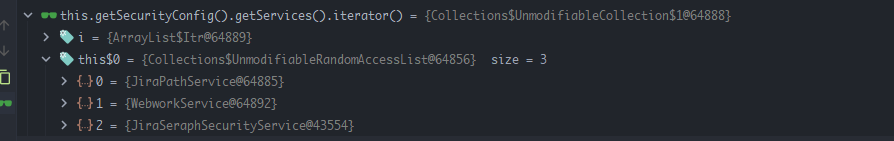  
可以看到在jira中还添加了一个Service类型为JiraSeraphSecurityService的服务,该Service主要用于处理请求Jira插件时的所需要的权限类型.
然后循环调用对应Service的`getRequiredRoles()`方法来得到需要的权限类型.
#### JiraPathService
在`JiraPathService#getRequiredRoles()`可以看到其通过`getServletPath()`得到请求的路径后判断是否以`/secure/admin/`开头,如果是则需要`ADMIN`权限.  
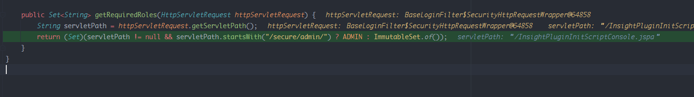
#### WebWorkService
在`WebWorkService#getRequiredRoles()`可以看到其通过`getRequestURI()`来获取到请求的URI然后在actionMapper中寻找对应的action类和从roleMap中来得到该action需要权限返回,如果没有找到对应的action则返回一个空的Set.
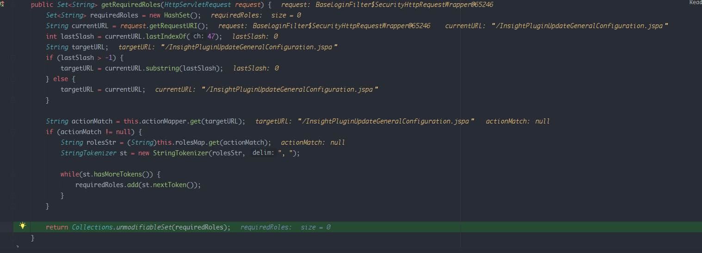
#### JiraSeraphSecurityService
在`JiraSeraphSecurityService`中首先会调用`loginManager.getRequiredRoles`.  
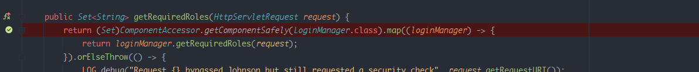  
最后会来到`WEB-INF/classes/com/atlassian/jira/security/auth/AuthorisationManagerImpl.class#getRequiredRoles()`中.
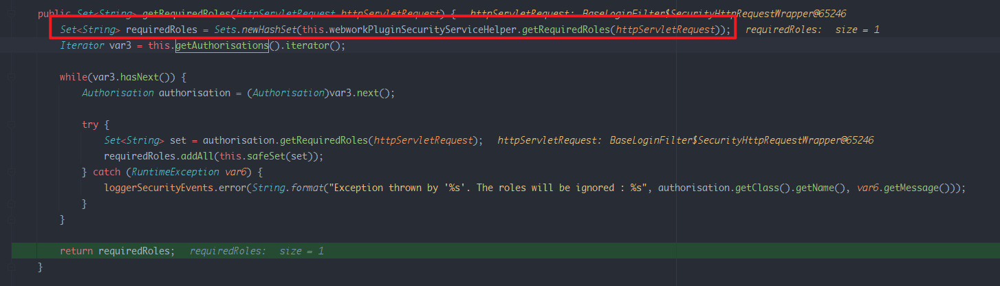  
其调用的`WebworkPluginSecurityServiceHelper.class#getRequiredRoles()`代码和WebWorkService是一致的.  
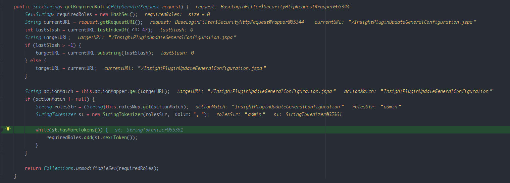
只是`WebWorkService`的权限Map是从aciton.xml中获得,而`WebworkPluginSecurityServiceHelper`的权限map是从插件的 `atlassian-plugin.xml`中获得.
### webwork dispatcher
经过验证后,在Jira中使用了Webwork1框架继续进行aciton的处理.  
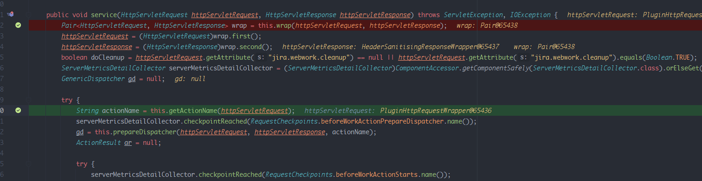  
可以看到在其Service方法中请求的actionName是通过对应的getActionName获取的.  
而在getActionName中其通过`getServletPath()`获取到请求路径然后取得最后`/`和`.jspa`之间的值为actionName返回.  
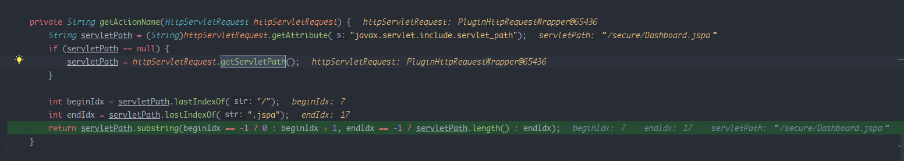  
当请求路径为`/secure/Dashboard.jspa`时返回的action则是`Dashboard`.  
然后调用对应action的doExecute方法.  
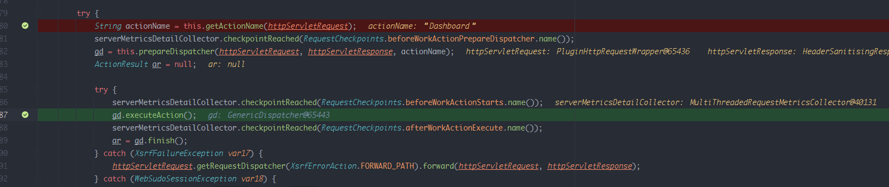
### Bypass Serpah
可以看到在Seraph的`JiraSeraphSecurityService`和`WebWorkService`中对请求路径的获取调用的是`getRequestURI()`,而在`webwork dispatcher`中使用的是`getServletPath()`.  
差异参考如下:  
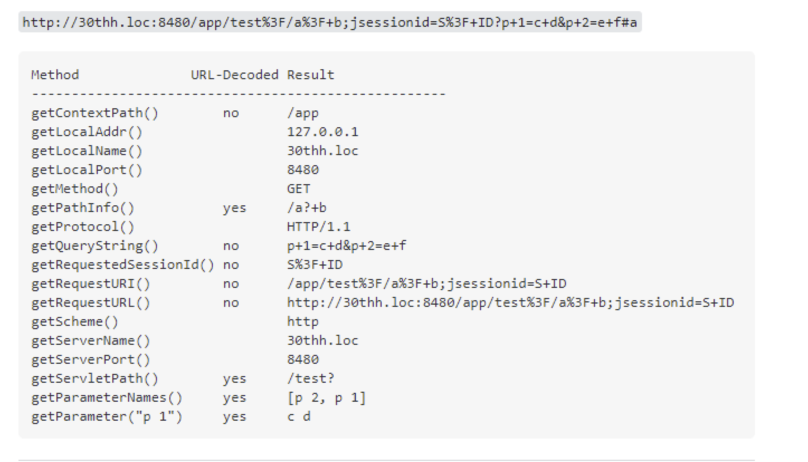  
`getRequestURI()`会将请求参数包含在内,而`getServletPath()`则不会.也就是说如果请求/a.jspa;sss,前一个得到的是`/a.jspa;sss`,而后一个得到的是`/a.jspa`.  
这就导致在Serpah中获取所需要角色权限时只要在请求路径后加上一个`;`,那么Serpah就会在权限map中找不到对应的action,导致返回一个空的权限Set,让程序认为请求不需要认证,但在webwork dispatcher中却可以正确得到对应的action进行调用.
### LookupAliasActionFactoryProxy
在dispatcher初始化对应的action时会调用`ActionFactory`来得到该action的实现类.
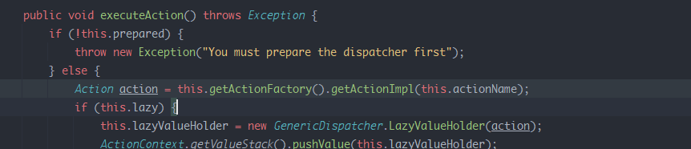  
流程如下
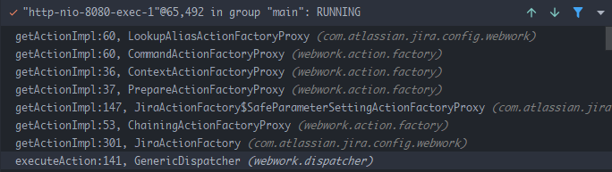  
在最后的`LookupAliasActionFactoryProxy#getActionImpl`中又对请求的action作了一次校验.  
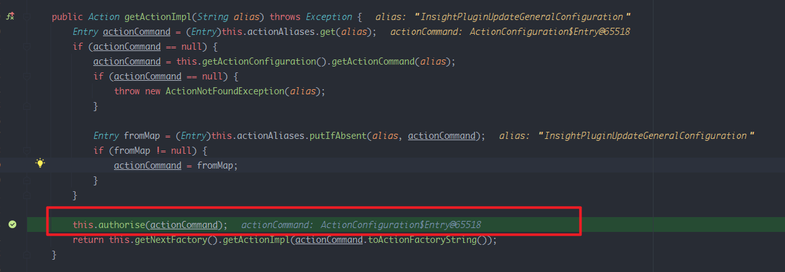  
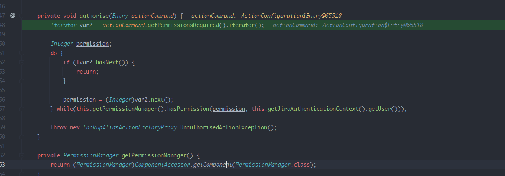  
而`getPermissionsRequired()`方法的定义位于`WEB-INF/classes/com/atlassian/jira/config/webwork/actions/ActionConfiguration.class`中.  
  
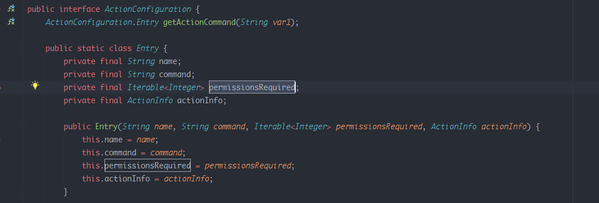  
可以看到返回的是对应action对象的permissionsRequired属性也就是在配置文件中的`roles-required`属性.
### Bypass LookupAliasActionFactoryProxy
但从官方文档中可以得到其实action的`roles-required`属性可以定义在其父WebWork元素或者子action元素中.  
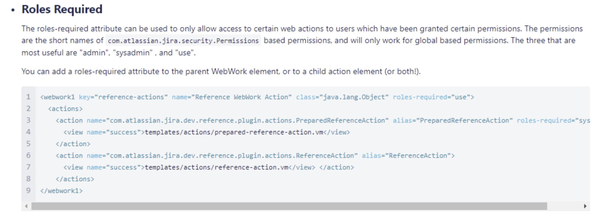  
这会导致该action对象本身的permissionsRequired属性为空,从而导致`authorise#getPermissionsRequired`获取需要的权限为空,导致该处校验被绕过.
## 漏洞复现
寻找action定义时其`roles-required`属性在其父WebWork元素或者子action元素中的action即可.   

以`Insight`插件为例.(测试版本为8.9.5,最新版插件也作了修复)  
`/InsightPluginInitScriptConsole.jspa`
  
`/InsightPluginInitScriptConsole.jspa;`
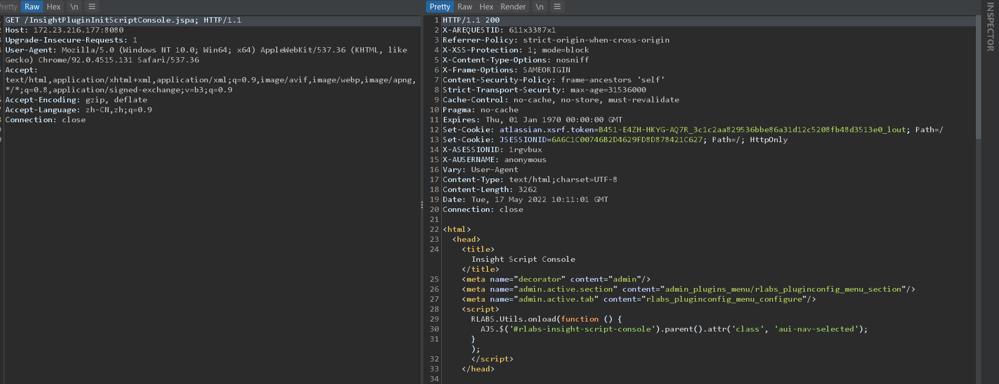
## 参考
https://blog.viettelcybersecurity.com/cve-2022-0540-authentication-bypass-in-seraph/
