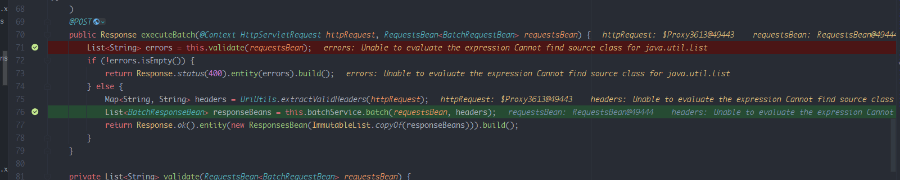
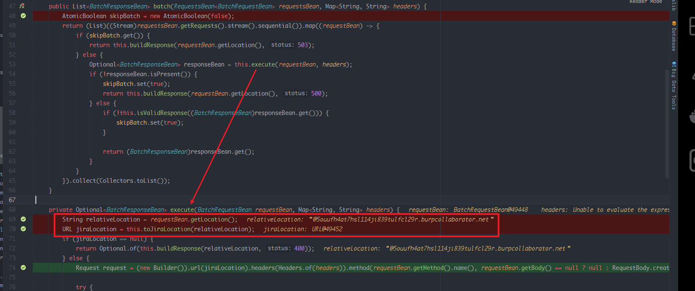
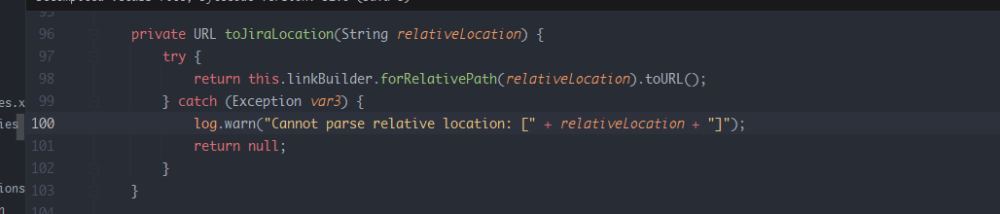
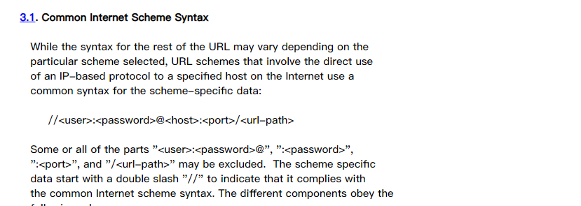
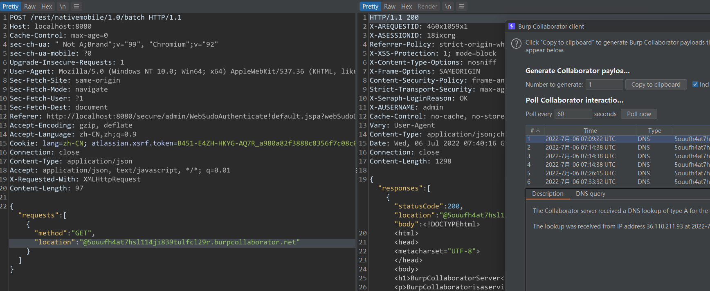

- [CVE-2022-26135 Jira Server SSRF](#cve-2022-26135-jira-server-ssrf)
  - [影响版本](#影响版本)
  - [环境搭建](#环境搭建)
  - [原理分析](#原理分析)
    - [BatchResource](#batchresource)
    - [URL RFC](#url-rfc)
  - [漏洞复现](#漏洞复现)
  - [参考](#参考)
# CVE-2022-26135 Jira Server SSRF
## 影响版本
```
Jira Core Server, Jira Software Server, and Jira Software Data Center:

Versions after 8.0 and before 8.13.22
8.14.x
8.15.x
8.16.x
8.17.x
8.18.x
8.19.x
8.20.x before 8.20.10
8.21.x
8.22.x before 8.22.4
Jira Service Management Server and Data Center:

Versions after 4.0 and before 4.13.22
4.14.x
4.15.x
4.16.x
4.17.x
4.18.x
4.19.x
4.20.x before 4.20.10
4.21.x
4.22.x before 4.22.4
```
## 环境搭建
 `run --name="jira" -d -e JVM_SUPPORT_RECOMMENDED_ARGS="-Xdebug -Xrunjdwp:transport=dt_socket,server=y,suspend=n,address=*:5005" -p 8080:8080 -p 5005:5005 atlassian/jira-software:8.13.17-ubuntu-jdk11`
## 原理分析
### BatchResource
漏洞来自一个Jira自带的插件Mobile Plugin,在该插件中有一个BatchResource批量处理资源的类.,其中会将requestBean传入BatchService类进行处理.  
  
而requestBean对象则是一个从JSON请求中自动装填的POJO对象.  
 
来到BatchService的实现类BatchServiceImpl中,调用execute对requestBean进行处理,其中取得我们json传入的loaction字段内容传入toJiraLocation()生成基于jira服务器地址的URL对象.
  
可以看到其只是简单的将服务器地址和传入的loaction进行了拼接得到了要请求的URL类似于http://hostname:8080/@location.  
  
  
### URL RFC
然而根据URL RFC,官方标准如下.  
  
导致hostname:8080这部分会被当做user和password字段而@后面的地址则才会被当作真正请求的服务器,从而导致了可以通过Location字段注入任意地址进行SSRF.  
## 漏洞复现  

## 参考  
https://blog.assetnote.io/2022/06/26/exploiting-ssrf-in-jira/