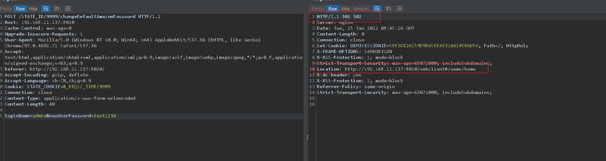

- [CVE-2021-44515 认证绕过](#cve-2021-44515-认证绕过)
  - [影响版本](#影响版本)
  - [原理分析](#原理分析)
    - [StateFilter](#statefilter)
    - [processState](#processstate)
  - [复现](#复现)
  - [RCE](#rce)
    - [RCE复现](#rce复现)
  - [参考链接](#参考链接)
# CVE-2021-44515 认证绕过
## 影响版本
Enterprise builds 10.1.2127.17 and earlier   
Enterprise builds 10.1.2128.0 through 10.1.2137.2  
MSP builds 10.1.2127.17 and earlier  
MSP builds 10.1.2128.0 through 10.1.2137.2  
## 原理分析
该漏洞源于`StateFilter`过滤器在处理请求时满足某些条件时会对请求进行转发，而该转发可以跳过认证Filter导致可以通过构造特殊的ULR和cookie值来绕过认证模块访问任意的Serverlet，而其中有一个`ChangeAmazonPasswordServlet`可以直接修改管理员密码,导致修改管理员密码后在后台可以通过SystemManager功能来对管理的机器执行系统命令。
### StateFilter 
在web.xml中配置如下,对应的Servlet为`com.adventnet.client.view.web.StateFilter`。
```xml
<filter>
<filter-name>StateFilter</filter-name>
<filter-class>com.adventnet.client.view.web.StateFilter</filter-class>
</filter>
<filter-mapping>
<filter-name>StateFilter</filter-name>
<url-pattern>/STATE_ID/*</url-pattern>
</filter-mapping>
```
`doFilter`代码如下:
```java
    public void doFilter(ServletRequest request, ServletResponse response, FilterChain chain) throws IOException, ServletException {
        try {
            Long startTime = new Long(System.currentTimeMillis());
            request.setAttribute("TIME_TO_LOAD_START_TIME", startTime);
            logger.log(Level.FINEST, "doFilter called for {0} ", ((HttpServletRequest)request).getRequestURI());
            StateParserGenerator.processState((HttpServletRequest)request, (HttpServletResponse)response);
            String forwardPath = ((HttpServletRequest)request).getRequestURI();
            if (WebClientUtil.isRestful((HttpServletRequest)request) && forwardPath.indexOf("STATE_ID") == -1) {
                chain.doFilter(request, response);
            } else {
                String path = this.getForwardPath((HttpServletRequest)request);
                RequestDispatcher rd = request.getRequestDispatcher(path);
                rd.forward(request, response);
            }
```
其中主要逻辑判断若请求不是Rest请求且请求URI中含有`STATE_ID`的话则会生成一个`RequestDispatcher`调用其forward方法对请求进行转发。
### processState
而在进行转发之前还调用了`StateParserGenerator.processState((HttpServletRequest)request, (HttpServletResponse)response);`,其中对请求的URI和Cookie的内容进行了一些处理,其中有几个地方若不符合要求会抛出异常导致中断,相关代码如下.
```java
                    if (cookieName.startsWith("_")) {
                        cookiesList[i].setPath(contextPath);
                        response.addCookie(cookiesList[i]);
                    } else if (cookieName.startsWith("STATE_COOKIE")) {
                        set.add(cookiesList[i]);
                    //
                    //
                    if (set.size() == 0) {//为了这里不报错,需要执行set.add,也就是上面的COOKIE键名要以STATE_COOKIE开头
                    request.setAttribute("STATE_MAP", NULLOBJ);
                    if (!WebClientUtil.isRestful(request)) {
                        throw new ClientException(ClientErrorCodes.STATE_COOKIE_NOT_PASSED, (Throwable)null);
                    }
                    Map state = parseState(cookieValue.toString());
                    //
                    //
                    StateAPI.prevStateDataRef.set(state != null ? state : NULLOBJ);
                    if (state != null) {
                        if (!WebClientUtil.isRestful(request)) {
                            long urlTime = getTimeFromUrl(request.getRequestURI());
                            long reqTime = Long.parseLong((String)StateAPI.getRequestState("_TIME"));
                            ((Map)state.get("_REQS")).put("_ISBROWSERREFRESH", String.valueOf(urlTime != reqTime && !StateAPI.isSubRequest(request)));
                        }
                    //
                    //
                    
```
主要有几个点
* set不能为空。
* state不能为空,且要满足一些格式。
* urlTime和reqTime保持一致

最后根据各要求构造的cookie值为`STATE_COOKIE=&_REQS/_TIME/9999`
,uri为`/STATE_ID/9999/`后跟访问的serverlet路径,两个`9999`可以为其他数字保持一致即可。
## 复现


## RCE
主要是在`ChangeDefaultAmazonPasswordServlet`该Serverlet中其修改AmazonPassword密码时同时修改了管理员密码,相关代码如下。
```java
    protected void doPost(HttpServletRequest request, HttpServletResponse response) throws ServletException, IOException {
        String loginName = request.getParameter("loginName");

        try {
            String newUserPassword = request.getParameter("newUserPassword");
            SYMClientUtil.changeDefaultAwsPassword(loginName, newUserPassword);
    //
    //

      public static void changeDefaultAwsPassword(String loginName, String newPasswd) throws Exception {
        try {
            String serviceName = getServiceName(loginName);
            DMUserHandler.addOrUpdateAPIKeyForLoginId(DMUserHandler.getLoginIdForUser(loginName));
            AuthUtil.changePassword(loginName, serviceName, newPasswd);
    //
    //

```
而其中在`changeDefaultAwsPassword`中的
```
 AuthUtil.changePassword(loginName, serviceName, newPasswd);
```
当传入LoginName为管理员用户时则会修改管理员用户的密码。
同时注意密码还有一个安全策略需要大于5位数。
### RCE复现
1. 修改管理员密码

2. 登录后可以在管理的机器中直接执行命令


## 参考链接
https://www.cvedetails.com/cve-details.php?t=1&cve_id=CVE-2021-44515  
https://manageengine.com/products/desktop-central/cve-2021-44515-authentication-bypass-filter-configuration.html  
https://srcincite.io/blog/2022/01/20/zohowned-a-critical-authentication-bypass-on-zoho-manageengine-desktop-central.html


