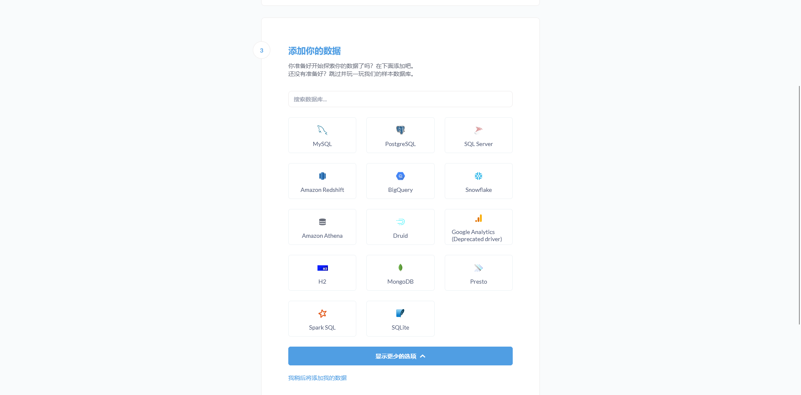
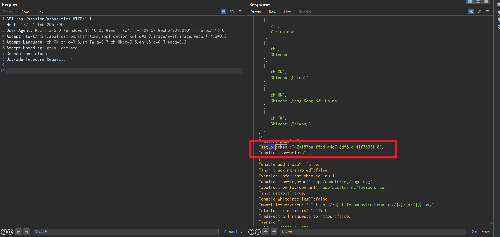
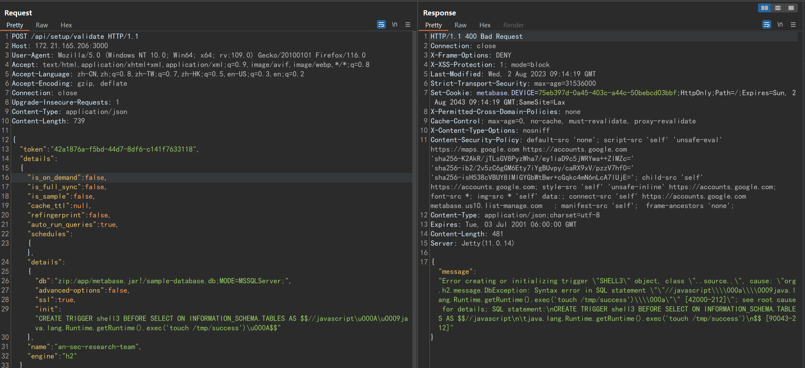
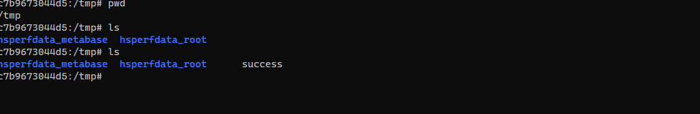

- [CVE-2023-38646 MetaBase远程代码执行漏洞](#cve-2023-38646-metabase远程代码执行漏洞)
  - [影响版本](#影响版本)
  - [环境搭建](#环境搭建)
  - [原理分析](#原理分析)
    - [JDBC Validate](#jdbc-validate)
  - [漏洞复现](#漏洞复现)
  - [补丁](#补丁)
  - [参考](#参考)

# CVE-2023-38646 MetaBase远程代码执行漏洞
## 影响版本
Metabase open source < 0.46.6.1  
Metabase Enterprise < 1.46.6.1 
## 环境搭建
```yaml
version: '2'
services:
  web:
    image: vulhub/metabase:0.46.6
    ports:
      - "3000:3000"
```
## 原理分析
Clojure代码不熟,只从逻辑层面分析,不作代码具体分析,漏洞原理也比较简单.
###  JDBC Validate
许多应用在安装时来配置数据库并支持在配置了之后进行连接测试,通常来说连接测试应该和安装都是一次性的,即安装了之后不能再次进行安装.  
  
同样在MetaBase连接测试时也有一个token检测,这个token是在安装的时候生成的,只有使用这个Token才能进行连接测试,而安装完成后该Token应该是一次性的应该被删除,但在一次commit中对此进行了修改,导致Token没有被删除,并且可以未授权通过`/api/session/properties`接口进行获取.  
https://github.com/metabase/metabase/commit/0526d88f997d0f26304cdbb6313996df463ad13f#diff-44990eafd7da3ac7942a9f232b56ec045c558fdc3c414a2439e42b5668eced32L141     
这就导致可以通过该Token直接调用数据库连接测试,这就相当于暴露了一个完全的JDBC攻击面.
## 漏洞复现
获取setup-token:    
  
数据库连接测试,以h2数据库为例.    
    
  
MateBase在之前对H2 JDBC攻击做了防护,会对连接字符串的init属性进行过滤,但有很多绕过方式,这也导致了后面的CVE-2023-37470,官方直接删除了对H2数据库的支持.  
## 补丁
在CVE-2023-37470中,官方直接删除了对H2数据库的支持
## 参考  
https://blog.assetnote.io/2023/07/22/pre-auth-rce-metabase/   
https://blog.calif.io/p/reproducing-cve-2023-38646-metabase  
https://github.com/vulhub/vulhub/blob/master/metabase/CVE-2023-38646/README.zh-cn.md   
https://mp.weixin.qq.com/s/MgfIyq0OJwnKOUF2kBB7TA