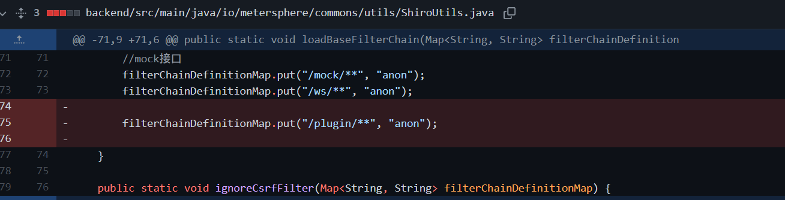
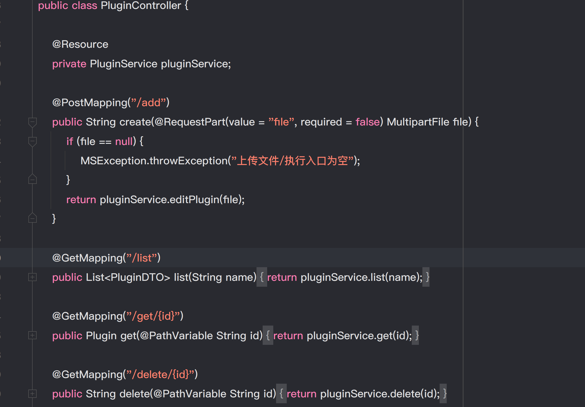
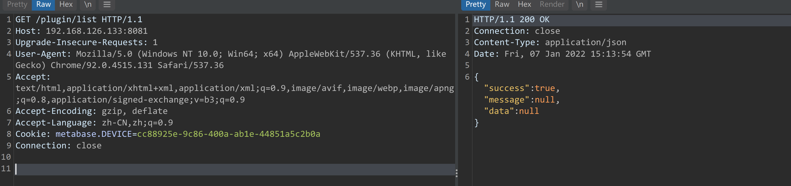
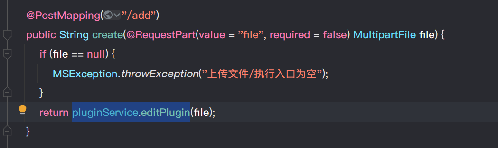
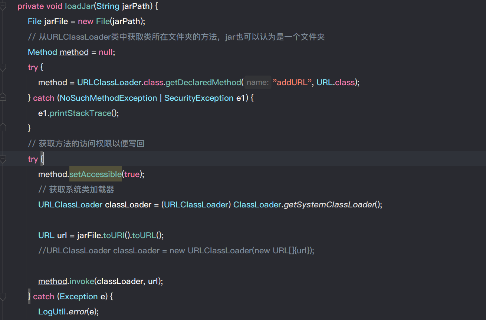
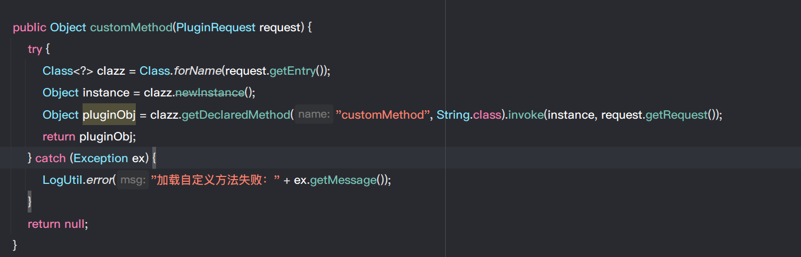

- [Metersphere 远程代码执行](#metersphere-远程代码执行)
  - [影响版本](#影响版本)
  - [原理分析](#原理分析)
    - [RCE分析](#rce分析)
      - [add api->Upload jar](#add-api-upload-jar)
      - [CuscustomMethod](#cuscustommethod)
      - [RCE](#rce)
# Metersphere 远程代码执行
## 影响版本
Version <= 1.16.3
## 原理分析  

补丁中可以看到删除了Shiro框架中`/plugin/`路由,而该路由使用的是`anon`. 
Shiro认证模式如下:
```
anon：无需认证即可访问。
authc：需要认证才可访问。
user：点击“记住我”功能可访问。
```  
即该接口存在未授权访问.   

而Plugin Controller中提供的接口如下.


尝试访问list.

### RCE分析
在/plugin/路由下有两个接口为`add`和`customMethod`.
#### add api->Upload jar
在`add`接口中,其接受一个上传文件然后交给`pluginService.editPlugin`进行处理.

而在`pluginService.editPlugin`中,生成文件名后又将该文件传入了`pluginService.getMethod`中.

在`getMethod`中调用了`loadJar()`,从方法名可以看出是用来加载Jar,而其中的jar文件正是我们上传的文件.


最后在loadJar中直接将Jar加载进内存中.

#### CuscustomMethod
在`customMethod`接口中则是直接从POST数据中获取到类名后直接使用`Class.forName`进行加载,然后反射得到其`customMethod`方法进行反射调用.

而其中`PluginRequest`如下,也就是`Class.forName`的参数为请求中`entry`的值
```java
public class PluginRequest {
    private String entry;
    private String request;
}
```
#### RCE
RCE思路:
1. 利用ADD接口上传Jar包,将含有恶意`customMethod`方法的恶意类加载进内存.
2. 利用`customMethod`接口调用恶意类RCE.


