- [CVE-2023-25826 OpenTsdb 命令注入漏洞](#cve-2023-25826-opentsdb-命令注入漏洞)
  - [影响版本](#影响版本)
  - [环境搭建](#环境搭建)
  - [漏洞原理](#漏洞原理)
    - [Gnuplot](#gnuplot)
    - [GraphHandler](#graphhandler)
  - [漏洞复现](#漏洞复现)
  - [补丁](#补丁)

# CVE-2023-25826 OpenTsdb 命令注入漏洞
## 影响版本
Version <=2.4.1
## 环境搭建
`docker run -dp 4242:4242 petergrace/opentsdb-docker`  
该docker的最新版本是2.4.0
## 漏洞原理
OpenTsdb使用Gnuplot进行绘图,而Gnuplot支持执行系统命令,OpenTsdb在设置相关Gnuplot的参数时可以通过http请求将恶意的系统命令参数注入其调用Gnuplot时的参数中,导致系统命令注入漏洞.
### Gnuplot
OpenTsdb作为Hbase的分布式的，可伸缩的时间序列数据库,其有一个web界面做数据查询,其中还可以根据查询条件生成对应的图形,其中生成图像调用的是`gnuplot`程序.而Gnuplot是一个命令行驱动的交互式函数绘图工具,用于Linux、OSX、MSWin、VMS和许多其他平台.  
同时Gnuplot执行可以通过参数来执行系统命令.    

官方文档:http://gnuplot.info/docs_5.2/Gnuplot_5.2.pdf  

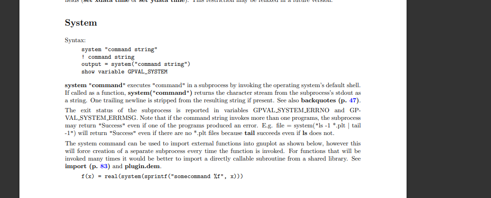  

语法为 `system "cmd"` 或者 ! `cmd`
### GraphHandler
查看其处理调用`gnuplot`程序生成图像的过程,位于`src/tsd/GraphHandler.java`中.  
在其`doGraph`方法中调用`setPlotParams`来设置调用`gnuplot`程序的参数,将其保存到改plot对象.  
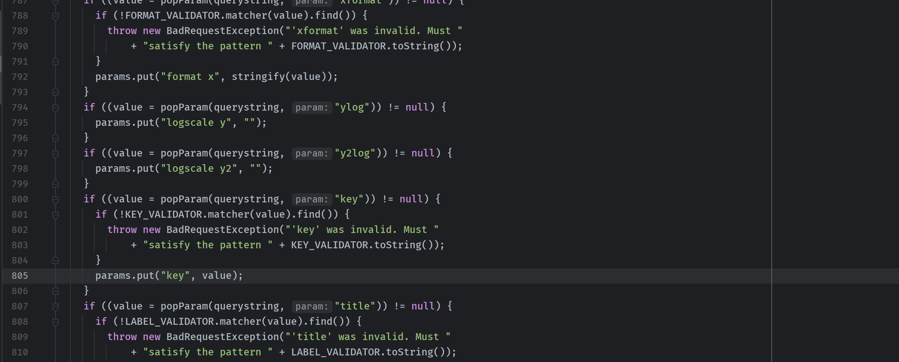  
可以看到在从query中获取参数时保存前会有两个处理,首先是`popParam`方法,其中对常见的命令注入字符进行了过滤.  
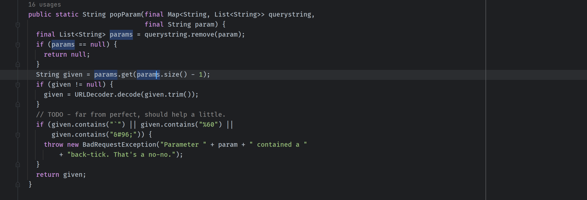  
然后会对不同参数使用正则来对参数值的格式进行校验.  
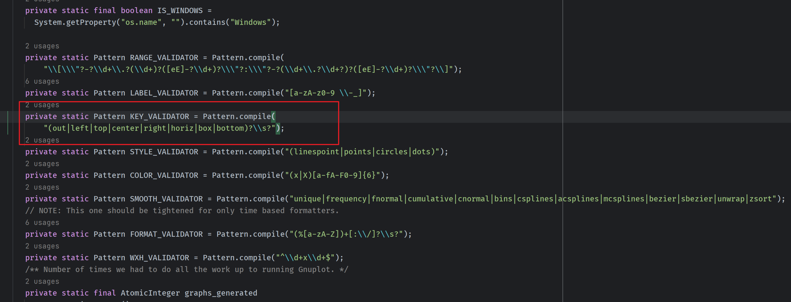  
从定义的正则可以看到只有key的正则校验是注入字符的,其它参数的正则校验都比较严格.  
后续调用`runGnuplot`调用Gnuplot,其中调用`dumpToFiles`来将参数写入到文件当中.  
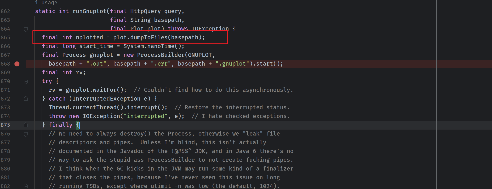  
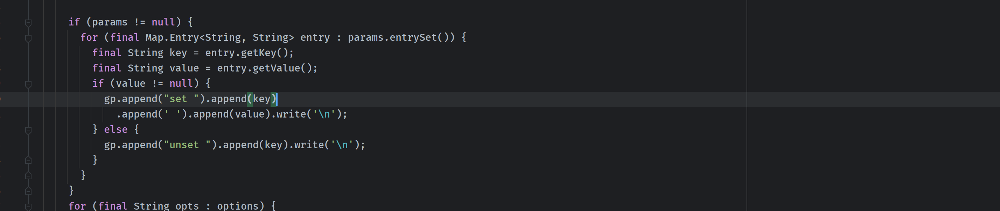  
这也是我们通过key参数注入额外参数的地方,通过在参数脚本中注入system或!来触发系统命令.  
## 漏洞复现
首先需要创建一个metric.  
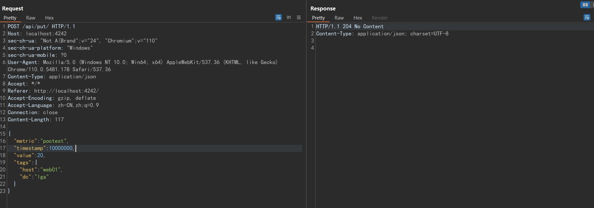  
使用system执行系统命令.
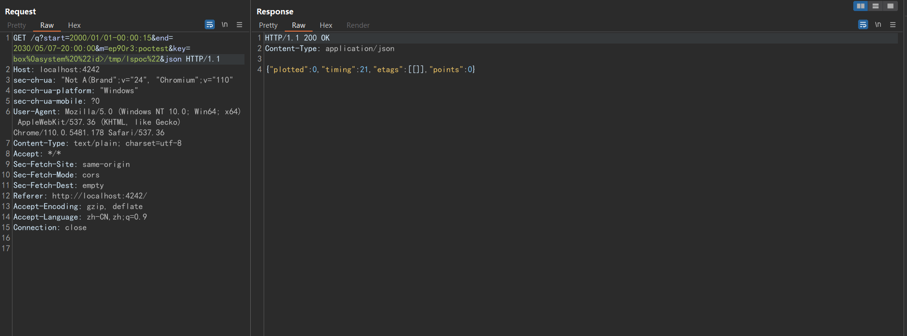  

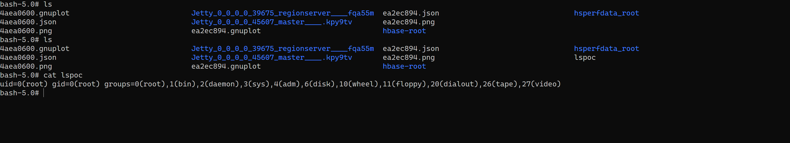  
可以查看生成的对应gnuplot文件中我们注入的恶意参数.  
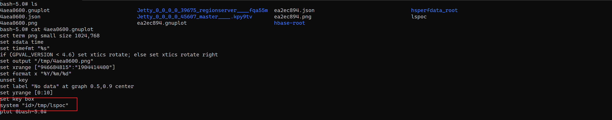
## 补丁  
对参数值又添加了一个检验.
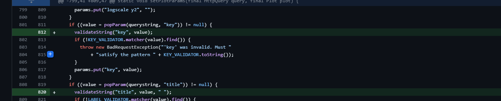  
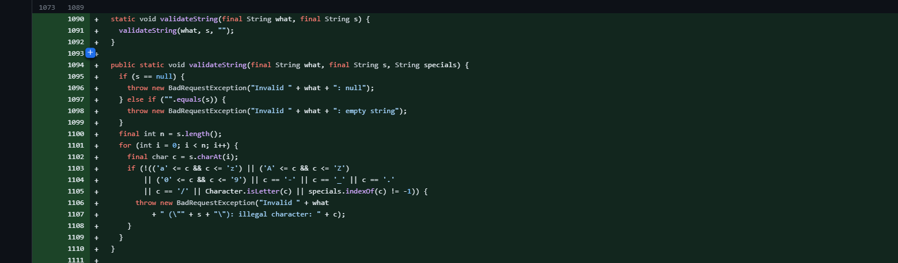